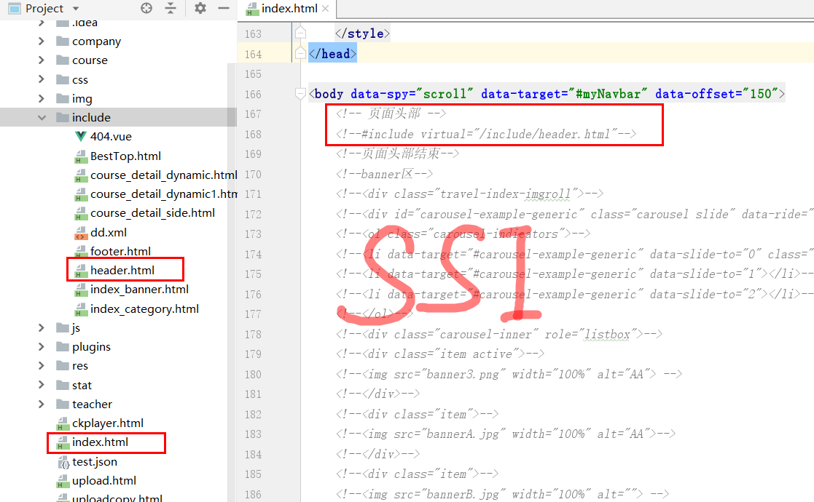

# 搭建环境 CMS服务端开发

## 一、项目概述-功能构架-项目背景

学成在线借鉴了MOOC（大型开放式网络课程，即MOOC（massive open online courses））的设计思想，是一
个提供IT职业课程在线学习的平台，它为即将和已经加入IT领域的技术人才提供在线学习服务，用户通过在线学
习、在线练习、在线考试等学习内容，最终掌握所学的IT技能，并能在工作中熟练应用。

## 二、项目概述-功能构架-功能模块和项目原型 


## 三、项目概述-技术架构


## 四、项目概述-技术栈和开发步骤


## 五、CMS需求分析-什么是CMS


1、CMS是什么 ？
CMS （Content Management System）即内容管理系统，不同的项目对CMS的定位不同，比如：一个在线教育网
站，有些公司认为CMS系统是对所有的课程资源进行管理，而在早期网站刚开始盛行时很多公司的业务是网站制
作，当时对CMS的定位是创建网站，即对网站的页面、图片等静态资源进行管理。
2、CMS有哪些类型？
上边也谈到每个公司对每个项目的CMS定位不同，CMS基本上分为：针对后台数据内容的管理、针对前端页面的
管理、针对样式风格的管理等 。比如：一个给企业做网站的公司，其CMS系统主要是网站页面管理及样式风格的管理。

3、本项目CMS的定位是什么？
**本项目作为一个大型的在线教育平台，对CMS系统的定位是对各各网站（子站点）页面的管理，主要管理由于运营**
**需要而经常变动的页面，从而实现根据运营需要快速进行页面开发、上线的需求**。

## 六、CMS需求分析-静态门户工程搭建 

配置`nginx.cnf`


配置hosts文件:


演示:


**不知道chrome为什么不行，暂时还没有找到原因**。

## 七、CMS需求分析-SSI服务端包含技术

**SSI** : 全称Server Side Include，中文名，服务器端包含.

ssi包含类似于jsp页面中的incluce指令，ssi是在web服务端将include指定 的页面包含在网页中，渲染html网页响
应给客户端 。nginx、apache等多数web容器都支持SSI指令。


SSI包含技术




## 八、CMS需求分析-CMS页面管理需求


1、这些页面的管理流程是什么？

1）创建站点：
一个网站有很多子站点，比如：学成在线有主门户、学习中心、问答系统等子站点。具体的哪个页面是归属于具体
的站点，所以要管理页面，先要管理页面所属的站点。
2）创建模板：

页面如何创建呢？比如电商网站的商品详情页面，每个页面的内容布局、板式是相同的，不同的只是内容，这个页
面的布局、板式就是页面模板，模板+数据就组成一个完整的页面，最终要创建一个页面文件需要先定义此页面的
模板，最终拿到页面的数据再结合模板就拼装成一个完整的页面。

3）创建页面：
创建页面是指填写页面的基本信息，如：页面的名称、页面的url地址等。
4）页面预览：
页面预览是页面发布前的一项工作，页面预览使用静态化技术根据页面模板和数据生成页面内容，并通过浏览器预
览页面。页面发布前进行页面预览的目是为了保证页面发布后的正确性。
5）页面发布：
使用计算机技术将页面发送到页面所在站点的服务器，页面发布成功就可以通过浏览器来访问了。

2、**本项目要实现什么样的功能**？
1）页面管理
管理员在后台添加、修改、删除页面信息
2）页面预览
管理员通过页面预览功能预览页面发布后的效果。
3）页面发布
管理员通过页面发布功能将页面发布到远程门户服务器。
页面发布成功，用户即可在浏览器浏览到最新发布的页面，整个页面添加、发布的过程由于软件自动执行，无需人
工登录服务器操作。

## 九、CMS服务端工程搭建-开发工具配置


## 十、CMS服务端工程搭建-导入基础工程


导入后common项目报错

更改pom.xml文件中的依赖即可


 工程结构


## 十一、MongoDb入门-安装Mongodb数据库

新建`mongo.conf`文件:

```properties
#数据库路径
dbpath=D:\Program Files\MongoDB\Server\3.4\data
#日志输出文件路径
logpath=D:\Program Files\MongoDB\Server\3.4\logs\mongo.log
#错误日志采用追加模式
logappend=true
#启用日志文件，默认启用
journal=true
#这个选项可以过滤掉一些无用的日志信息，若需要调试使用请设置为false
quiet=true
#端口号 默认为27017
port=27017
```

服务安装。

(注意命令是`mongod`不是`mongo`)


启动测试，在浏览器输入`localhost:27017`看到下面的界面就说明启动成功:


## 十二、MongoDb入门-基础概念

mongodb没有事务

Redis有事务


## 十三、MongoDb入门-数据库和集合


## 十四、MongoDb入门-文档


## 十五、MongoDb入门-用户


## 十六、CMS服务端工程搭建-导入CMS数据库


## 十七、页面查询接口定义-定义模型-需求分析和模型类


数据库集合之间的关系。


模型类

由于这些都是提供好的, 我们需要仔细观察这些类,并记下来所在的工程以及包


## 十八、页面查询接口定义-定义接口


## 十九、页面查询服务端开发-创建CMS服务工程-CMS工程结构 

创建`xc-service-manage-cms`工程


版本号小技巧

依赖的本项目中的其它模块时,一般不写版本号,而是采用`${project.versoin}`来进行引用,

同学们思考下有什么好处呢?


添加配置,启动类


我这里没有配置密码

```yaml
server:
  port: 31001
spring:
  application:
    name: xc-service-manage-cms
  data:
    mongodb:
      uri: mongodb://localhost:27017
      database: xc_cms
```

启动类代码:

```java
@SpringBootApplication
@EntityScan("com.xuecheng.framework.domain.cms")  // 扫描实体类 (其他服务的)
@ComponentScan(basePackages={"com.xuecheng.api"})  // 扫描接口
@ComponentScan(basePackages={"com.xuecheng.manage_cms"})//扫描本项目下的所有类 (一定要加这个，不知道为什么？)
public class ManageCmsApplication {

    public static void main(String[] args) {
        SpringApplication.run(ManageCmsApplication.class, args);
    }
}

```


## 二十、页面查询服务端开发-创建CMS服务工程-测试Controller

为什么要将接口单独定义，并且单独出来一个API工程呢？

因为目前我们的Controller是用SpringMVC写的，哪天我们要换了，只需要换技术即可，不需要换接口的代码。

```java
/**
 * 测试Page查询
 */
@RestController
@RequestMapping("/cms/page")
public class CmsPageController implements CmsPageControllerApi {

    // 暂时定义静态数据
    @Override
    @GetMapping("/list/{page}/{size}")
    public QueryResponseResult findList(@PathVariable("page") int page, @PathVariable("size") int size, QueryPageRequest queryPageRequest) {
        //暂时采用测试数据，测试接口是否可以正常运行
        QueryResult queryResult = new QueryResult();
        //静态数据列表
        List list = new ArrayList();

        CmsPage cmsPage = new CmsPage();
        cmsPage.setPageName("测试页面");

        list.add(cmsPage);

        queryResult.setList(list);
        queryResult.setTotal(1);

        QueryResponseResult queryResponseResult = new
                QueryResponseResult(CommonCode.SUCCESS, queryResult);

        return queryResponseResult;
    }
}

```

显示: 


多说一句: 定义接口的好处:

* 加入有一天不用`SpringMVC`开发了，我们的接口也不用变；
* 使用一个`api`的微服务的好处，不会将接口分散到各个微服务中；

## 二十一、页面查询服务端开发-Dao-分页查询测试

一开始我mongodb数据库里面的`cms_page`数据库写成了`cms_page(1)`，结果找很久没有找到错误。


查询结果:


## 二十二、页面查询服务端开发-Dao-基础方法测试

修改

```java
//修改
@Test
public void testUpdate() {
    Optional<CmsPage> optional = cmsPageRepository.findById("5b17a34211fe5e2ee8c116c9");
    if(optional.isPresent()){ // 注意和if（null != ）差不多，只是标准化了一下
        CmsPage cmsPage = optional.get();
        cmsPage.setPageName("测试页面01");
        cmsPageRepository.save(cmsPage);
    }
}
```

`SpringData`方法命名规则

```java
/**
 * 测试自定义方法
 */
@Test
public void testFindByPageName() {
    CmsPage cmsPage = cmsPageRepository.findByPageName("测试页面");
    System.out.println(cmsPage);
}
```

## 二十三、页面查询服务端开发-Service及Controller

`PageService.java`

```java
@Service
public class PageService {

    @Autowired
    private CmsPageRepository cmsPageRepository;

    /**
     * 页面列表分页查询
     *
     * @param page             当前页码,页码从1开始
     * @param size             页面显示条数
     * @param queryPageRequest 查询条件(暂时没有用到查询条件
     * @return 页面列表
     */
    public QueryResponseResult findList(int page, int size, QueryPageRequest queryPageRequest) {

        if (page <= 0) {
            page = 1;
        }
        page = page - 1;  //为了适应mongodb的接口将页码减1

        if (size <= 0) {
            size = 10;
        }
        //分页对象
        Pageable pageable =  PageRequest.of(page, size);
        //分页查询
        Page<CmsPage> all = cmsPageRepository.findAll(pageable);

        QueryResult<CmsPage> cmsPageQueryResult = new QueryResult<>();
        cmsPageQueryResult.setList(all.getContent());
        cmsPageQueryResult.setTotal(all.getTotalElements());
        //返回结果
        return new QueryResponseResult(CommonCode.SUCCESS, cmsPageQueryResult);
    }

}
```

`CmsPageController.java`

```java
@RestController
@RequestMapping("/cms/page")
public class CmsPageController implements CmsPageControllerApi {

    @Autowired
    private PageService pageService;

    @Override
    @GetMapping("/list/{page}/{size}")
    public QueryResponseResult findList(@PathVariable("page") int page,
                                        @PathVariable("size") int size,
                                        QueryPageRequest queryPageRequest) {
        return pageService.findList(page, size, queryPageRequest);
    }
}

```


## 二十四、页面查询服务端开发-接口开发规范

**Api请求及响应规范**

为了严格按照接口进行开发，提高效率，对请求及响应格式进行规范化。
1、get 请求时，采用`key/value`格式请求，SpringMVC可采用基本类型的变量接收，也可以采用对象接收。
2、Post请求时，可以提交form表单数据（`application/x-www-form-urlencoded`）和Json数据（`Content-
Type=application/json`），文件等多部件类型（`multipart/form-data`）三种数据格式，SpringMVC接收Json数据
使用@RequestBody注解解析请求的json数据。
4、响应结果统一信息为：是否成功、操作代码、提示信息及自定义数据。
5、响应结果统一格式为json。

**Api定义约束**

Api定义使用SpringMVC来完成，由于此接口后期将作为微服务远程调用使用，在定义接口时有如下限制：

 1、`@PathVariable` 统一指定参数名称(路径参数`/list/1/2`)，如：`@PathVariable("id")`

 2、`@RequestParam`统一指定参数名称(请求参数`list/1?id=1&name=zz`)，如：`@RequestParam（"id"）`

## 二十五、页面查询接口测试-Swagger

**Swagger介绍**

相信各位在公司写API文档数量应该不少，当然如果你还处在自己一个人开发前后台的年代，当我没说，如今为了前后台更好的对接，还是为了以后交接方便，都有要求写API文档。

**手写Api文档的几个痛点：**

```
1. 文档需要更新的时候，需要再次发送一份给前端，也就是文档更新交流不及时。
2. 接口返回结果不明确
3. 不能直接在线测试接口，通常需要使用工具，比如postman
4. 接口文档太多，不好管理
```

Swagger也就是为了解决这个问题，当然也不能说Swagger就一定是完美的，当然也有缺点，最明显的就是代码移入性比较强。

```
@Api：修饰整个类，描述Controller的作用 
@ApiOperation：描述一个类的一个方法，或者说一个接口
@ApiParam：单个参数描述 
@ApiModel：用对象来接收参数 
@ApiModelProperty：用对象接收参数时，描述对象的一个字段 
@ApiResponse：HTTP响应其中1个描述 
@ApiResponses：HTTP响应整体描述 
@ApiIgnore：使用该注解忽略这个API 
@ApiError ：发生错误返回的信息 
@ApiImplicitParam：一个请求参数
@ApiImplicitParams：多个请求参数
@ApiImplicitParam属性：
```


浏览:


观察`Swagger2Configuration`

`Swagger2Configuration.java`已经默认提供好了,观察下即可.

配置接口信息

```java
/**
 * Cms页面查询接口 API定义
 */
@Api(value = "cms页面管理接口", tags = "cms页面管理接口，提供页面的增、删、改、查")
public interface CmsPageControllerApi {
    /**
     * 使用分页查询
     * @param page 当前页面
     * @param size 每页显示数目
     * @param queryPageRequest
     * @return QueryResponseResult(返回类型)
     */
    @ApiOperation("分页查询页面列表")
    @ApiImplicitParams({
            @ApiImplicitParam(name = "page", value = "页码", required = true, paramType = "path", dataType = "int"),
            @ApiImplicitParam(name = "size", value = "每页记录数", required = true, paramType = "path", dataType = "int")
    })
    QueryResponseResult findList(int page, int size,
                                 QueryPageRequest queryPageRequest);
}
```


测试:

访问: <http://localhost:31001/swagger-ui.html>


## 二十六、页面查询接口测试-Postman

