# CMS前端开发

## 一、vuejs研究-vuejs介绍

### 1、Vue.js的使用

1）在html页面使用script引入`vue.js`的库即可使用。

2）使用`Npm( Node Package Manager)`管理依赖，使用webpack打包工具对vue.js应用打包。
​	大型应用推荐此方案。
3）Vue-CLI脚手架
​	使用vue.js官方提供的CLI脚手架很方便去创建vue.js工程雏形。

### 2、vue.js有哪些功能？

**1）声明式渲染**
​	Vue.js 的核心是一个允许采用简洁的模板语法来声明式地将数据渲染进 DOM 的系统。
​	比如：使用vue.js的插值表达式放在Dom的任意地方， 差值表达式的值将被渲染在Dom中。
**2）条件与循环**
​	dom中可以使用vue.js提供的v-if、v-for等标签，方便对数据进行判断、循环。
**3）双向数据绑定**
​	Vue 提供v-model 指令，它可以轻松实现Dom元素和数据对象之间双向绑定，即修改Dom元素中的值自动修		改绑定的数据对象，修改数据对象的值自动修改Dom元素中的值。
**4）处理用户输入**
​	为了让用户和你的应用进行交互，我们可以用 v-on 指令添加一个事件监听器，通过它调用在 Vue 实例中定义的方法
**5）组件化应用构建**
​	vue.js可以定义一个一个的组件，在vue页面中引用组件，这个功能非常适合构建大型应用。

## 二、vuejs研究-vuejs基础-MVVM模式

vue.js是一个MVVM的框架，理解MVVM有利于学习vue.js。

**MVVM拆分解释为**：

* Model:负责数据存储
* View:负责页面展示
* View Model:负责业务逻辑处理（比如Ajax请求等），对数据进行加工后交给视图展示


MVVM要解决的问题是将业务逻辑代码与视图代码进行完全分离，使各自的职责更加清晰，后期代码维护更加简单

用图解的形式分析Ajax请求回来数据后直接操作Dom来达到视图的更新的缺点，以及使用MVVM模式是如何来解决这个缺点的Vue中的 MVVM

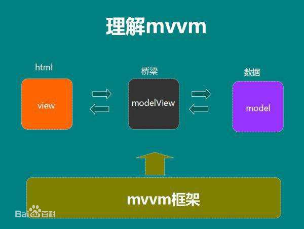


## 三、vuejs研究-vuejs基础-入门程序

编写流程:

代码编写步骤：

* 1、定义html，引入vue.js；
* 2、定义app div，此区域作为vue的接管区域；
* 3、定义vue实例，接管app区域；
* 4、定义model（数据对象）；
* 5、VM完成在app中展示数据；

vue入门程序

```html
<!DOCTYPE html>
<html lang="en">
<head>
    <meta charset="UTF-8">
    <title>vue.js入门程序</title>
    <script src="vue.min.js"></script>
</head>
<body>

<div id="app">
    <!--在Vue接管区域中使用Vue的系统指令呈现数据这些指令就相当于是MVVM中的View这个角色-->
    {{name}}
</div>

</body>

<script>
    // 实例化Vue对象
    //vm :叫做MVVM中的 View Model
    var VM = new Vue({
        el:"#app",//表示当前vue对象接管app的div区域
        data:{
            name:'湖南长沙'// 相当于是MVVM中的Model这个角色
        }
    });
</script>

</html>
```

## 四、vuejs研究-vuejs基础-v-model指令

 `v-model`指令的使用。

```html
<body>
<!-- 实现model的双向动态转换 -->
<div id="app">
    {{name}} :

    <input type="text" v-model="num1">+
    <input type="text" v-model="num2">=
    {{Number.parseInt(num1)+Number.parseInt(num2)}}
    <button>计算</button>
</div>
</body>

<script type="text/javascript"></script>
<script>
    // 实例化Vue对象
    //vm :叫做MVVM中的 View Model
    var VM = new Vue({
        el:"#app",//表示当前vue对象接管app的div区域
        data:{
            name:'计算器',// 相当于是MVVM中的Model这个角色
            num1: 0,
            num2: 1
        }
    });
</script>
</html>
```

## 五、vuejs研究-vuejs基础-v-text指令

主要是解决闪烁的问题。

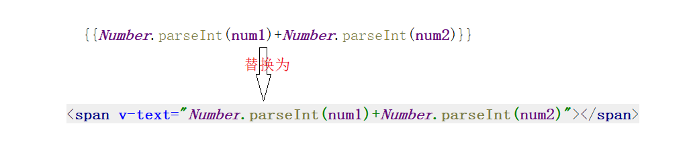

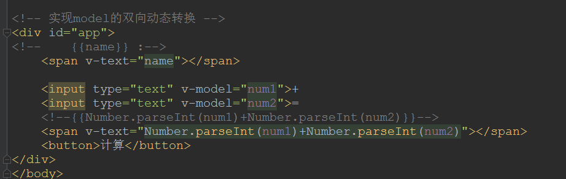

## 六、vuejs研究-vuejs基础-v-on指令

单击计算按钮的时候，实现计算结果。

```html
<body>

<!--使用v-on指令-->
<div id="app">
    {{name}} :
    <input type="text" v-model="num1">+
    <input type="text" v-model="num2">=
    <span v-text="result"></span>
<!--    <button @click="change">计算</button>-->
    <button v-on:click="change">计算</button>
</div>
</body>

<script type="text/javascript"></script>
<script>
    // 实例化Vue对象
    //vm :叫做MVVM中的 View Model
    var VM = new Vue({
        el:"#app",//表示当前vue对象接管app的div区域
        data:{
            name:'计算器',// 相当于是MVVM中的Model这个角色
            num1: 0,
            num2: 0,
            result:0
        },
        methods:{
            change : function () {
                this.result = Number.parseInt(this.num1)+Number.parseInt(this.num2)
            }
        }
    });
</script>
</html>
```

## 七、vuejs研究-vuejs基础-v-bind指令

`v-bind`

1、作用：

* v‐bind可以将数据对象绑定在dom的任意属性中。
* v‐bind可以给dom对象绑定一个或多个特性，例如动态绑定style和class

2、举例：
``

`<div v‐bind:style="{ fon  tSize: size + 'px' }"></div>`

3、缩写形式

``

`<div :style="{ fontSize: size + 'px' }"></div>`


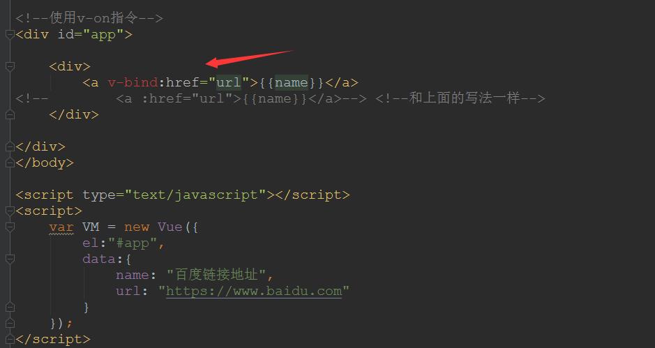

演示结果: 

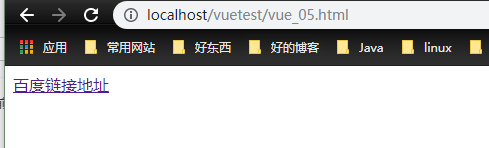

代码:

```html
<body>
<!--使用v-on指令-->
<div id="app">

    <div>
        <a v-bind:href="url">{{name}}</a>
<!--        <a :href="url">{{name}}</a>--> <!--和上面的写法一样-->
    </div>

</div>
</body>

<script type="text/javascript"></script>
<script>
    var VM = new Vue({
        el:"#app",
        data:{
            name: "百度链接地址",
            url: "https://www.baidu.com"
        }
    });
</script>
```

## 八、vuejs研究-vuejs基础-v-if和v-for指令

```html
<body>
<div id="app">

    <!--遍历普通数组-->
    <ul>
        <!--只显示偶数行, item和index不是固定化-->
        <li v-for="(item,index) in list" :key="index" v-if="index % 2==0">
            {{index}}-{{item}}
        </li>
    </ul>

    <!--遍历json对象-->
    <hr/>

    <ul>
        <li v-for="(value,key) in user">{{key}}-{{value}}</li>
    </ul>
    <ul>
        <li v-for="(value, key, index) in user">
            {{index}}-{{key}}-{{value}}
        </li>
    </ul>

    <hr/>

    <!--遍历更加复杂的对象-->
    <ul>
        <li v-for="(item,index) in userlist" :key="item.user.uname">

            <div v-if="item.user.uname=='zxzxin'" style="background: chartreuse"><!--名称为zxzxin的
                加背景色-->
                {{index}}-{{item.user.uname}}-{{item.user.age}}
            </div>
            <div v-else=""> <!--否则就不加上背景色-->
                {{index}}-{{item.user.uname}}-{{item.user.age}}
            </div>

        </li>
    </ul>

    <hr/>

    <ul>
        <li v-for="obj in userlist">
            {{obj}}
        </li>
    </ul>

    <hr/>

</div>
<script>
    // 实例化Vue对象
    //vm :叫做MVVM中的 View Model
    var VM = new Vue({
        el: "#app",//表示当前vue对象接管app的div区域
        data: {
            list: [1, 2, 3, 6, 7],
            user: {uname: 'zhangsan', age: 10},
            userlist: [
                {user: {uname: 'zxzxin', age: 10}},
                {user: {uname: 'lisi', age: 14}} //changed
            ]
        }
    });
</script>
</body>
```

演示结果:

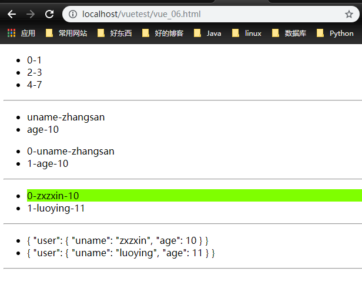

几个指令总结: 

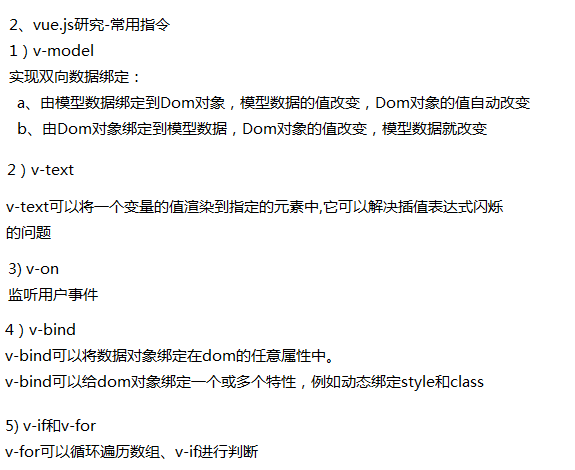

## 九、webpack研究-webpack介绍

https://www.webpackjs.com/

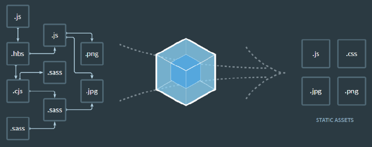

Webpack的工作方式是：把你的项目当做一个整体，通过一个给定的主文件（如：index.js），Webpack将从这个文件开始找到你的项目的所有依赖文件，使用loaders处理它们，最后打包为一个（或多个）浏览器可识别的JavaScript文件。

本质上，*webpack* 是一个现代 JavaScript 应用程序的**静态模块打包器**(module bundler) 。当 webpack 处理应用程序时，它会递归地构建一个依赖关系图(dependency graph)，其中包含应用程序需要的每个模块，然后将所有这些模块打包成一个或多个 *bundle*。

**从图中我们可以看出，Webpack 可以将js、css、png等多种静态资源进行打包，使用webpack有什么好处呢**？

```
1、模块化开发
程序员在开发时可以分模块创建不同的js、 css等小文件方便开发，最后使用webpack将这些小文件打包成一个文
件，减少了http的请求次数。
webpack可以实现按需打包，为了避免出现打包文件过大可以打包成多个文件。

2、 编译typescript、ES6等高级js语法
随着前端技术的强大，开发中可以使用javascript的很多高级版本，比如：typescript、ES6等，方便开发，
webpack可以将打包文件转换成浏览器可识别的js语法。

3、CSS预编译
webpack允许在开发中使用Sass 和 Less等原生CSS的扩展技术，通过sass-loader、less-loader将Sass 和 Less的
语法编译成浏览器可识别的css语法。
```


**webpack的缺点**：

1、配置有些繁琐
2、文档不丰富


## 十、webpack研究-安装nodejs


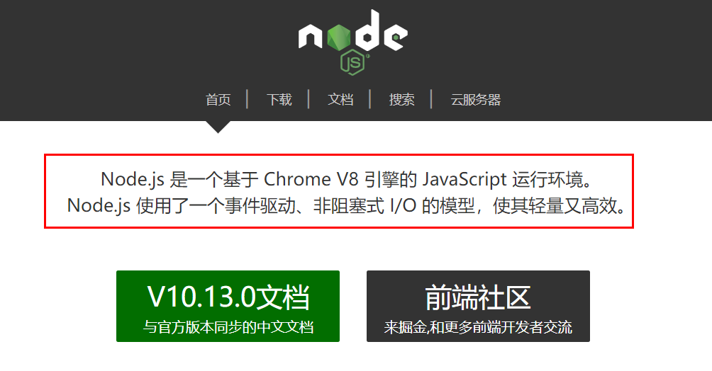

安装后查看安装状态

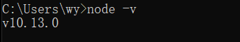

后面在新的windows下装的版本(和教程一致)

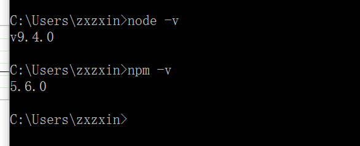

## 十一、webpack研究-npm和cnpm安装配置

​	NPM（node package manager）是 node.js 的包管理和分发工具。它类似于Java的Maven。它可以让 javascript 开发者能够更加轻松的共享代码和共用代码片段，并且通过 npm 管理你分享的代码也很方便快捷和简单。

​	nodejs安装完毕后自带了npm。


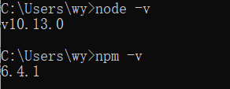

npm设置目录

```
npm config set prefix "D:\Program Files\nodejs\npm_modules"
npm config set cache "D:\Program Files\nodejs\npm_cache"
```

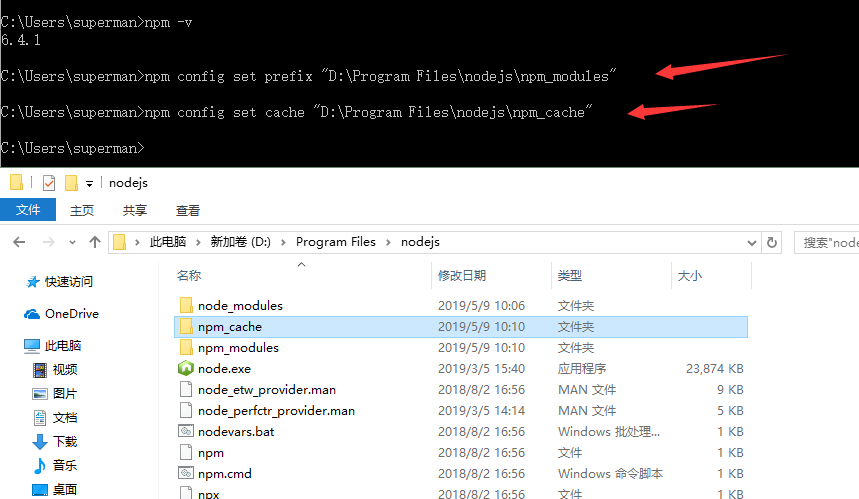

新版：

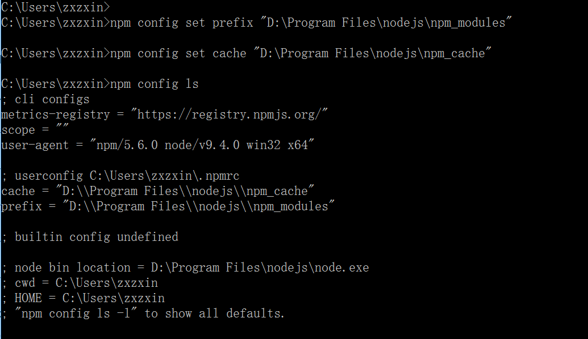

`cnpm` (国内的镜像)安装:

```
npm install -g cnpm --registry=https://registry.npm.taobao.org
```


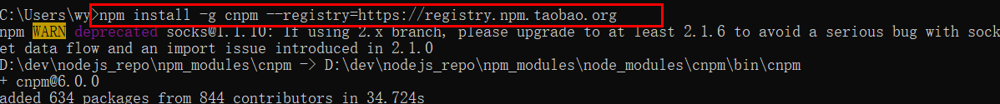

安装之后，配置下环境变量

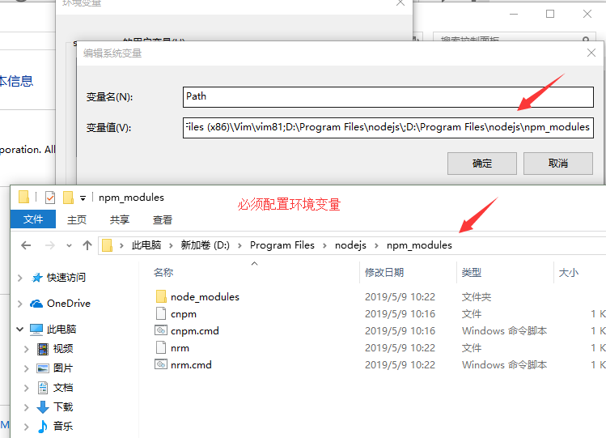

可以用nrm切换镜像，如果没有可以用`cnpm install -g nrm`安装。

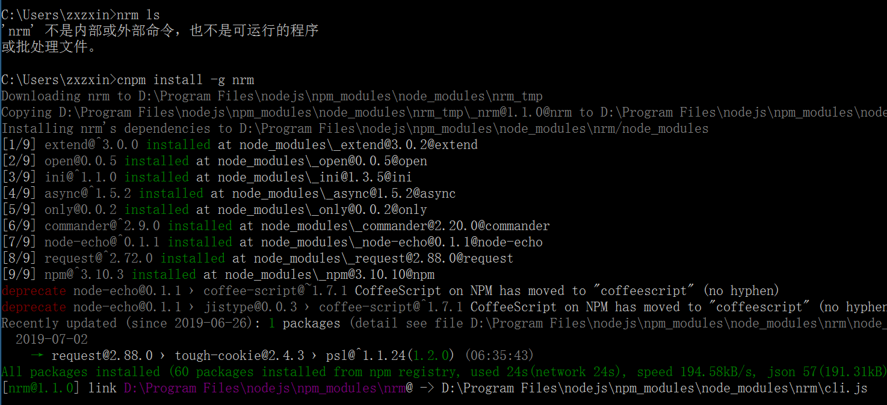


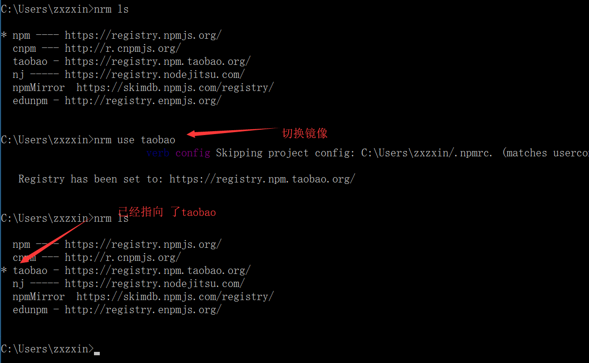

## 十二、webpack研究-webpack安装

本教程使用webpack3.6.0，安装webpack3.6.0：

```
进入webpacktest测试目录，运行：cnpm install --save-dev webpack@3.6.0
全局安装：npm install webpack@3.6.0 -g或 cnpm install webpack@3.6.0 -g
```

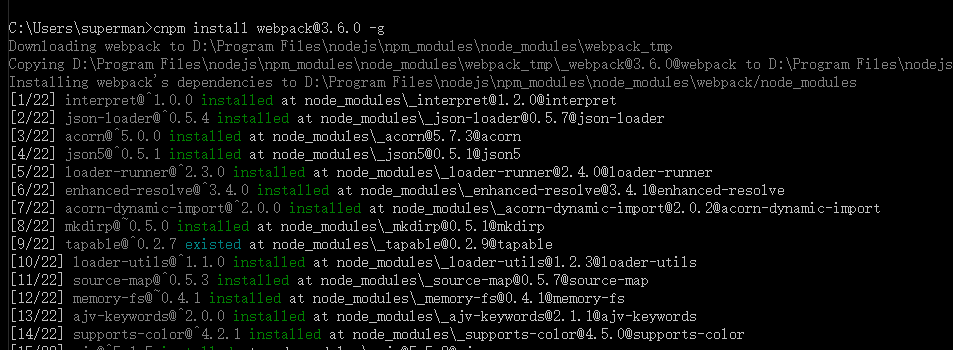

安装成功:

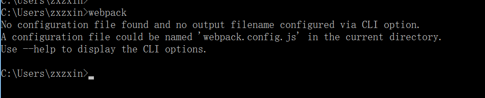

## 十三、webpack研究-webpack入门程序

过程:

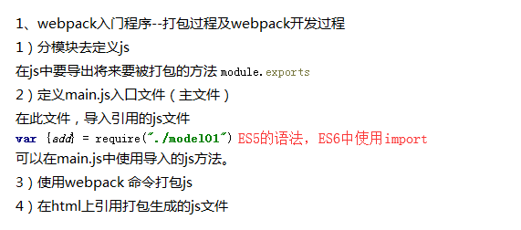

### 1、编写模块js (model01.js)

```js
// 定义add函数
function add(x, y) {
    return x + y
}
function mul(x, y) {
    return x * y
}

// 导出add方法(必须)
module.exports.add = add;
// module.exports ={add,mul};//如果有多个方法这样导出
// module.exports.mul = mul
```

### 2、入口JS文件 (main.js)

```js
// 入口文件，导入model01.js

// 引入model01.js
var {add} = require('./model01.js');
// 引入Vue.js
var Vue = require('./vue.min');

var VM = new Vue({
    el:"#app",//表示当前vue对象接管app的div区域
    data:{
        name:'计算',// 相当于是MVVM中的Model这个角色
        num1:0,
        num2:0,
        result:0
    },
    methods:{
        change:function(){
            //这里使用了导入的model01.js文件中的add方法
            this.result = add(Number.parseInt(this.num1),Number.parseInt(this.num2))
        }
    }
});
```


### 3、webpack编译

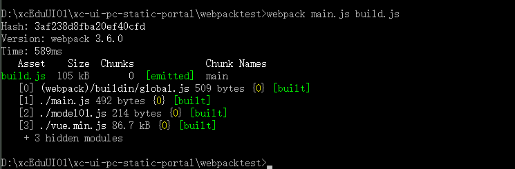

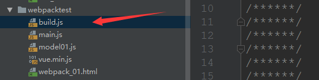

### 4、在页面中引用上一步编译好的js文件（webpack_01.html）

```html
<!DOCTYPE html>
<html lang="en">
<head>
    <meta charset="UTF-8">
    <title>v-model指令</title>
    <script src="vue.min.js"></script>
</head>
<body>

<div id="app">
    {{name}} :
    <input type="text" v-model="num1">+
    <input type="text" v-model="num2">=
    <span v-text="result"></span>
    <button v-on:click="change">计算</button>
</div>
</body>

<!--啥都不用写，引入打包的文件即可-->
<script src="build.js"></script>

</html>
```

演示:

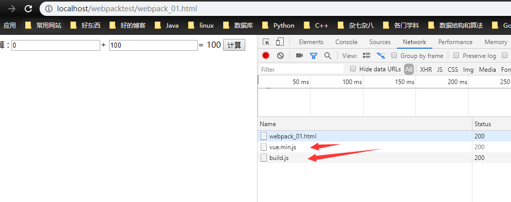

## 十四、webpack研究-webpack-dev-server

webpack-dev-server开发服务器，它的功能可以实现热加载 并且**自动刷新**浏览器。
创建一个新的程序目录，这里我们创建webpacktest02目录，将webpack入门程序的代码拷贝进来，并在目录下创
建src目录、dist目录。
将`main.js`和`model01.js`拷贝到src目录。

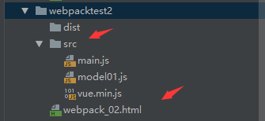

### 1、安装webpack-dev-server

```
使用 webpack-dev-server需要安装webpack、 webpack-dev-server和 html-webpack-plugin三个包。
cnpm install webpack@3.6.0 webpack-dev-server@2.9.1 html-webpack-plugin@2.30.1 --save-dev
安装完成，会发现程序目录出现一个package.json文件，此文件中记录了程序的依赖。
```

注意要进入到`.../webpacktest2`这个目录。

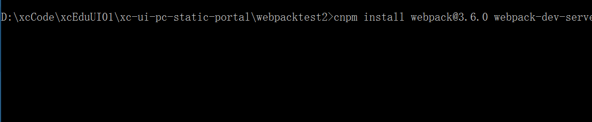


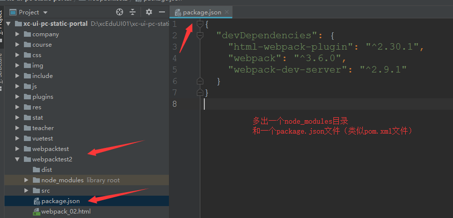

这里我直接拷贝资料中的`node_modules`即可。

### 2、修改package.json

--inline：自动刷新
--hot：热加载
--port：指定端口
--open：自动在默认浏览器打开
--host：可以指定服务器的 ip，不指定则为127.0.0.1，如果对外发布则填写公网ip地址

devDependencies：开发人员在开发过程中所需要的依赖。
`scripts`：可执行的命令

```js
{
  "scripts": {
    "dev": "webpack-dev-server --inline --hot --open --port 5008"
  },
  "devDependencies": {
    "html-webpack-plugin": "^2.30.1",
    "webpack": "^3.6.0",
    "webpack-dev-server": "^2.9.1"
  }
}
```

### 3、webpack_01.html

```html
<!DOCTYPE html>
<html lang="en">
<head>
    <meta charset="UTF-8">
    <title>Title</title>
</head>
<body>
    <div id="app">
        <!--{{name}}解决闪烁问题使用v-text-->
        <a :href="url"><span v-text="name"></span></a>
        <input type="text" v-model="num1">+
        <input type="text" v-model="num2">=
        <span v-text="result"></span>
        <button @click="change">计算</button>
    </div>
</body>
</html>
```

### 4、webpack.config.js

```js
var htmlwp = require('html-webpack-plugin');
module.exports = {
    entry: './src/main.js', //指定打包的入口文件
    output: {
        path: __dirname + '/dist', // 注意：__dirname表示webpack.config.js所在目录的绝对路径
        filename: 'build.js' //输出文件
    },
    plugins: [
        new htmlwp({
            title: '首页', //生成的页面标题<head><title>首页</title></head>
            filename: 'index.html', //webpack-dev-server在内存中生成的文件名称，自动将build注入到这个页面底部，才能实现自动刷新功能
            template: 'webpack_02.html' //根据index1.html这个模板来生成(这个文件请程序员自己生成)
        })
    ]
}
```

### 5、运行项目

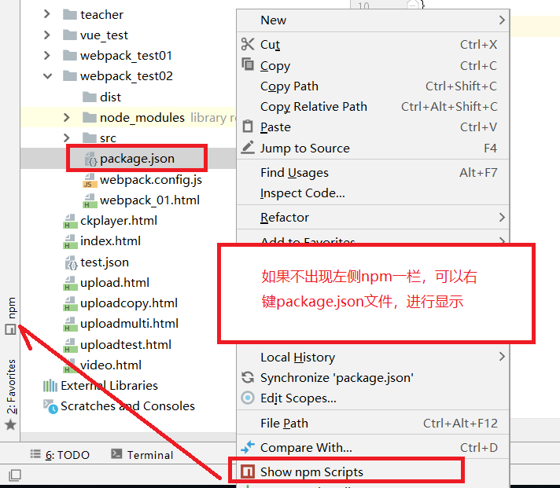


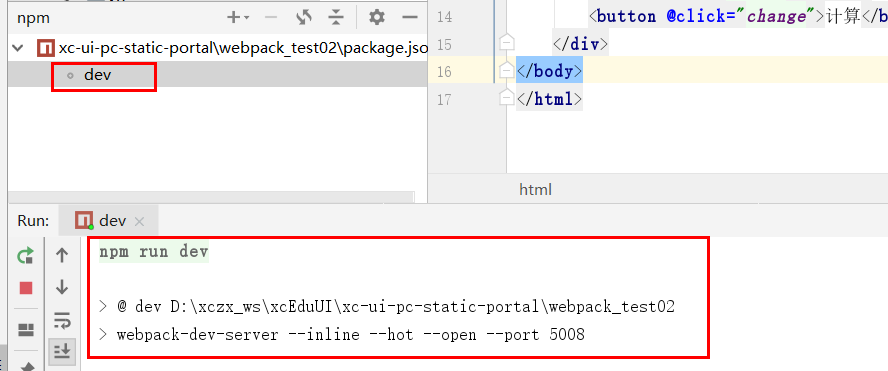


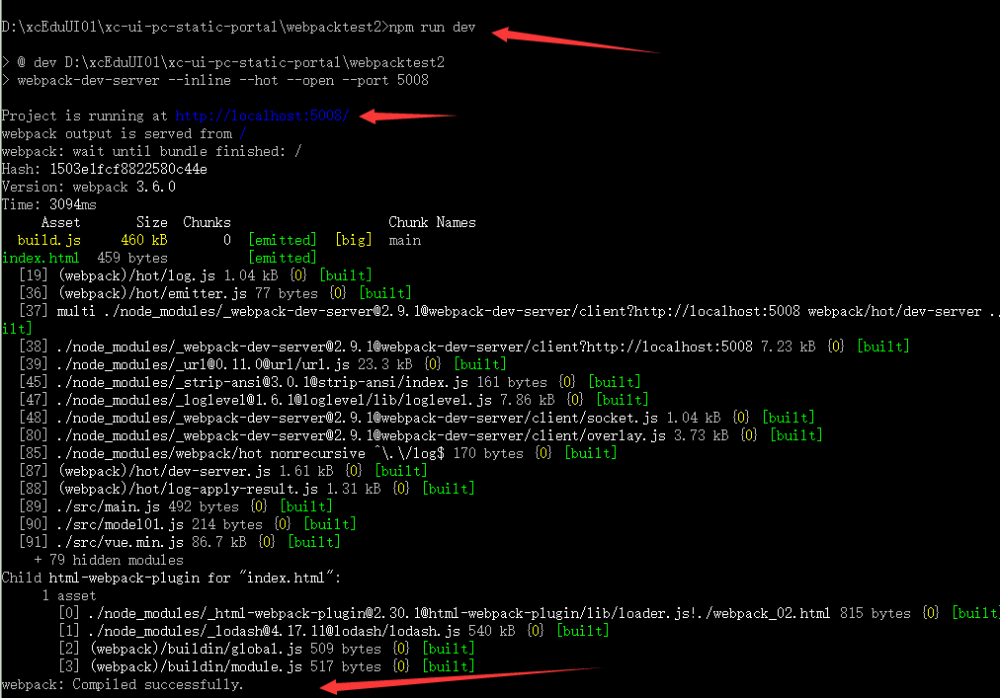

注意在浏览器显示的端口也是随机的。

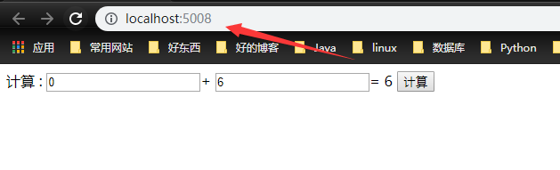

总结过程:

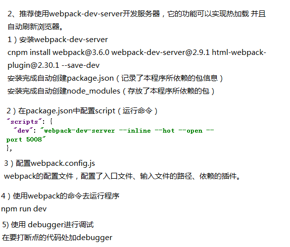

配置webstrom自动运行`npm run dev`的方法:

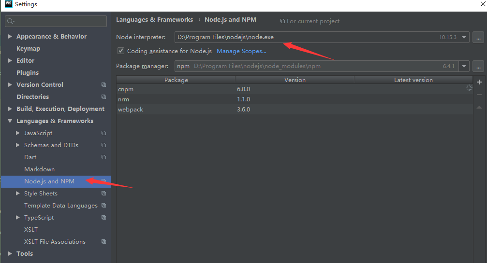

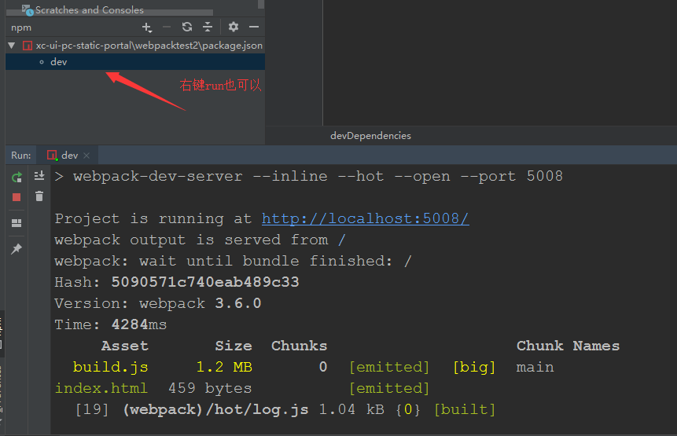

## 十五、webpack研究-webpack-dev-server-程序调试


### 1、修改webpack.config.js

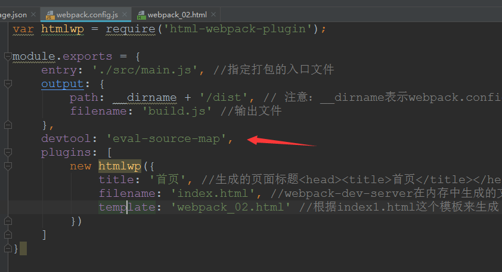

### 2、在要调试的地方加debugger

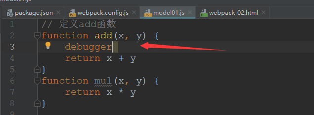

演示:

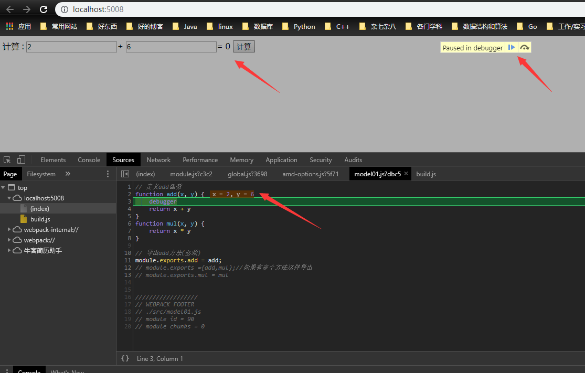

## 十六、CMS前端工程创建-导入系统管理前端工程

从资料中解压`xc-ui-pc-sysmanage`之后，用webstorm打开即可。

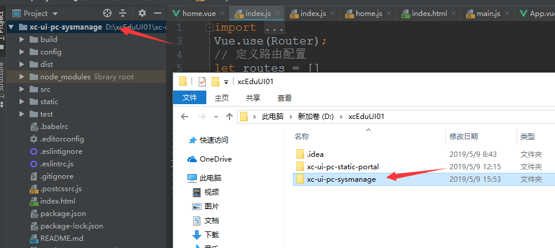


### 1、导入项目xc-ui-pc-sysmanage后，如果运行报以下错误


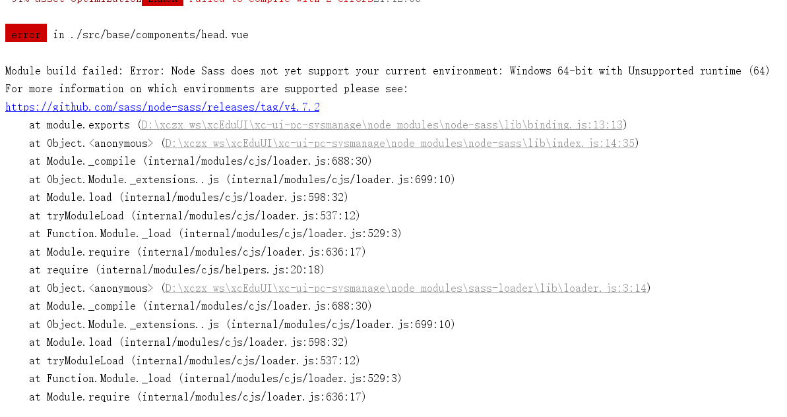

### 2、解决办法

1. 先卸载掉node-sass

```
npm uninstall --save node-sass
```

2. 重新安装node-sass

```
npm install --save node-sass
```

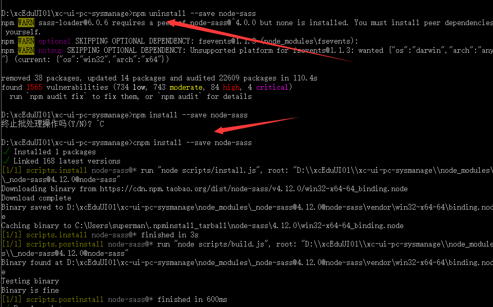

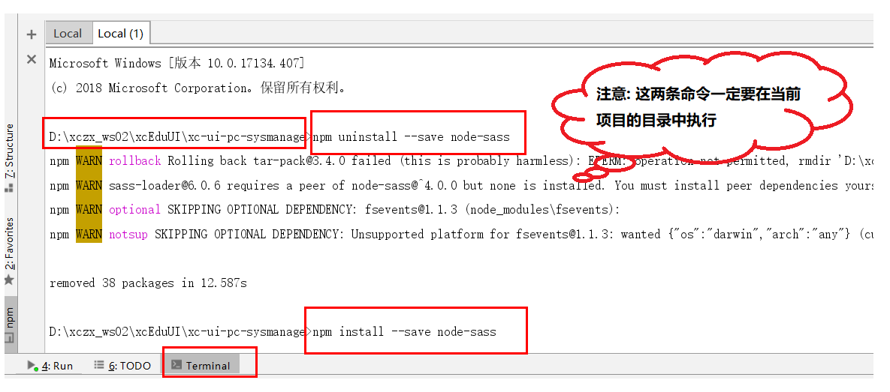

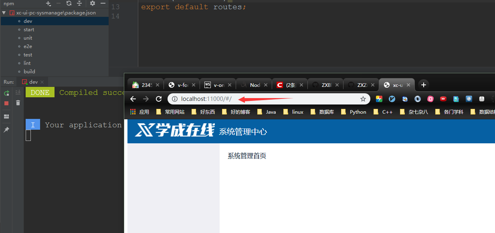


后来重新的(用cnpm):

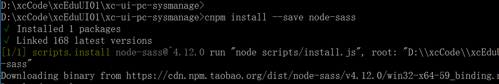

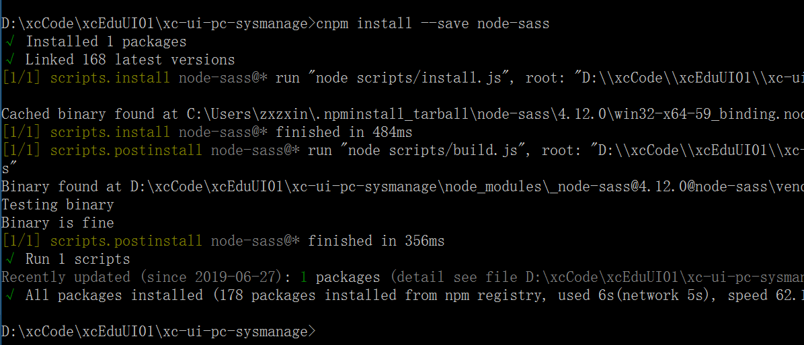

### 3、目录结构

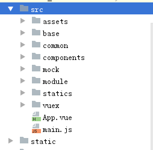

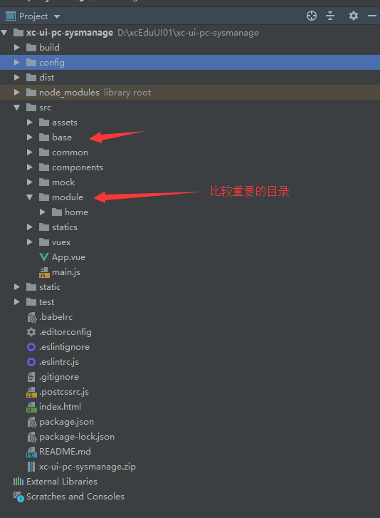

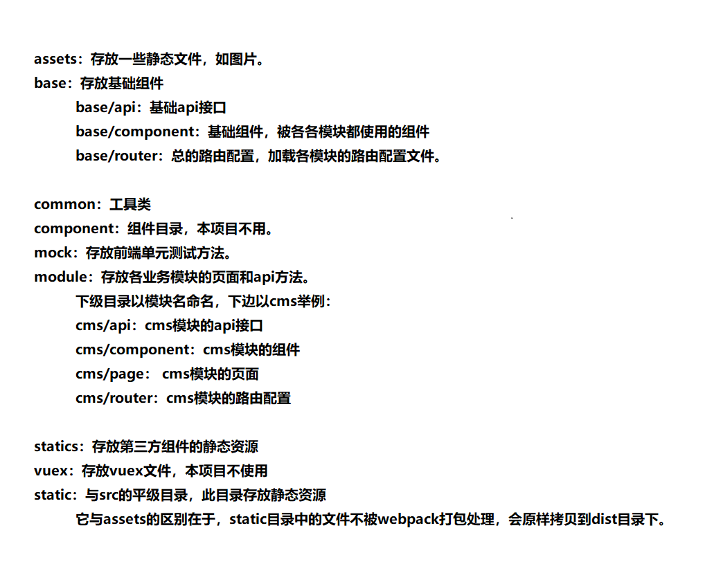

## 十七、CMS前端工程创建-单页面应用介绍

单页面应用的优缺点：

**优点**：

* 1、用户操作体验好，用户不用刷新页面，整个交互过程都是通过Ajax来操作。
* 2、适合前后端分离开发，服务端提供http接口，前端请求http接口获取数据，使用JS进行客户端渲染。

**缺点**：

*  1、首页加载慢
  单页面应用会将js、 css打包成一个文件，在加载页面显示的时候加载打包文件，如果打包文件较大或者网速慢则用户体验不好。
* 2、SEO不友好
   SEO（Search Engine Optimization）为搜索引擎优化。它是一种利用搜索引擎的搜索规则来提高网站在搜索引擎排名的方法。目前各家搜索引擎对JS支持不好，所以使用单页面应用将大大减少搜索引擎对网站的收录。

**总结**：本项目的门户、课程介绍不采用单页面应用架构去开发，对于需要用户登录的管理系统采用单页面开发。

## 十八、CMS前端页面查询开发-页面原型-创建页面和定义路由

### 1、最终效果

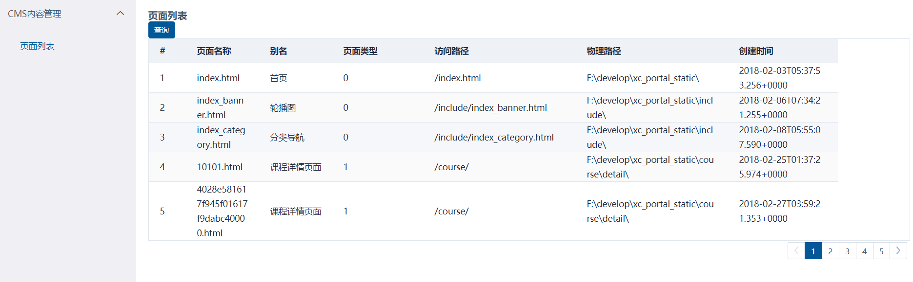

### 2、在model目录创建 cms模块的目录结构

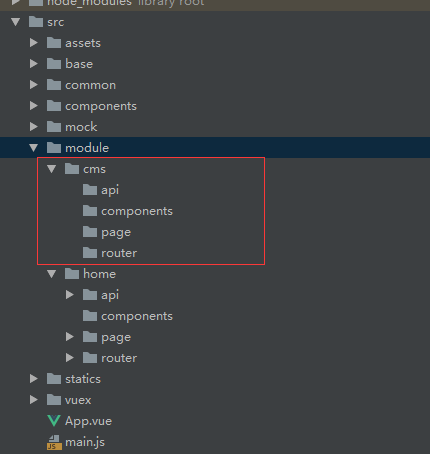

### 3、在page目录新建page_list.vue，扩展名为.vue

.vue文件的结构如下：

```html
<template>
<!‐‐编写页面静态部分，即view部分‐‐>
测试页面显示...
</template>
<script>
/*编写页面静态部分，即model及vm部分。*/
</script>
<style>
/*编写页面样式，不是必须*/
</style>
```

在页面的template中填写 “测试页面显示...”。

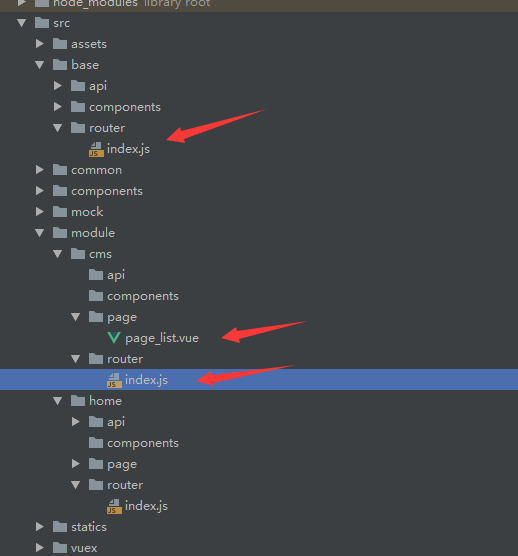

**注意：template内容必须有一个根元素，否则vue会报错，这里我们在template标签内定义一个div**。

```html
<template>
  <!--编写页面静态部分，即view部分，注意这里必须要加上一个div根元素 -->
  <div>
  测试页面显示...
  </div>
</template>

<script>
  /*编写页面静态部分，即model及vm部分。*/
</script>
<style>
  /*编写页面样式，不是必须*/
</style>

```

在`/module/cms/router/index.js`:

```js
import Home from '@/module/home/page/home.vue';
import page_list from '@/module/cms/page/page_list.vue';
export default [{
  path: '/',
  component: Home,
  name: 'CMS',//菜单名称
  hidden: false,
  children:[
    {path:'/cms/page/list',name:'页面列表',component: page_list,hidden:false}
  ]
}
]

```

`base/router/index.js`:

```js
import Vue from 'vue';
import Router from 'vue-router';
Vue.use(Router);
// 定义路由配置
let routes = []
let concat = (router) => {
  routes = routes.concat(router)
}
// // 导入路由规则
import HomeRouter from '@/module/home/router'
import CmsRouter from '@/module/cms/router'

// 合并路由规则
concat(HomeRouter)
concat(CmsRouter)
export default routes;

```

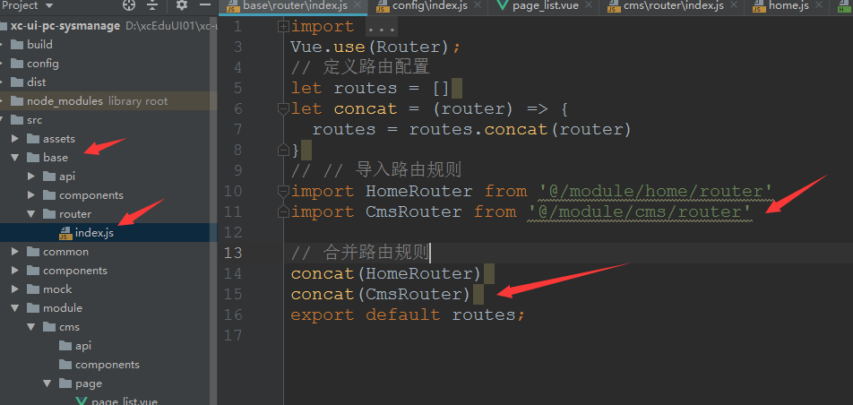

### 4、页面路由

参考`home/router/index.js`设置 cms下的index.js

**问题:** 

```
import Home from '@/module/home/page/home.vue';
```

@符号代表什么意思?

最终结果:

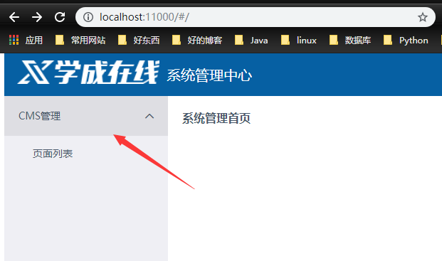

## 十九、CMS前端页面查询开发-页面原型-Table组件测试

<https://element.eleme.cn/#/zh-CN/component/table>

`page_list.vue`

```vue
<template>
  <div>
    <el-button type="primary" size="small">主要按钮</el-button>
    <el-table
      :data="tableData"
      stripe
      style="width: 100%">
      <el-table-column
        prop="date"
        label="日期"
        width="180">
      </el-table-column>
      <el-table-column
        prop="name"
        label="姓名"
        width="180">
      </el-table-column>
      <el-table-column
        prop="address"
        label="地址">
      </el-table-column>
    </el-table>
  </div>
</template>

<script>
  export default {
    data() {
      return {
        tableData: [{
          date: '2016-05-02',
          name: '王小虎',
          address: '上海市普陀区金沙江路 1518 弄'
        }, {
          date: '2016-05-04',
          name: '王小虎',
          address: '上海市普陀区金沙江路 1517 弄'
        }, {
          date: '2016-05-01',
          name: '王小虎',
          address: '上海市普陀区金沙江路 1519 弄'
        }, {
          date: '2016-05-03',
          name: '王小虎',
          address: '上海市普陀区金沙江路 1516 弄'
        }]
      }
    }
  }
</script>
```

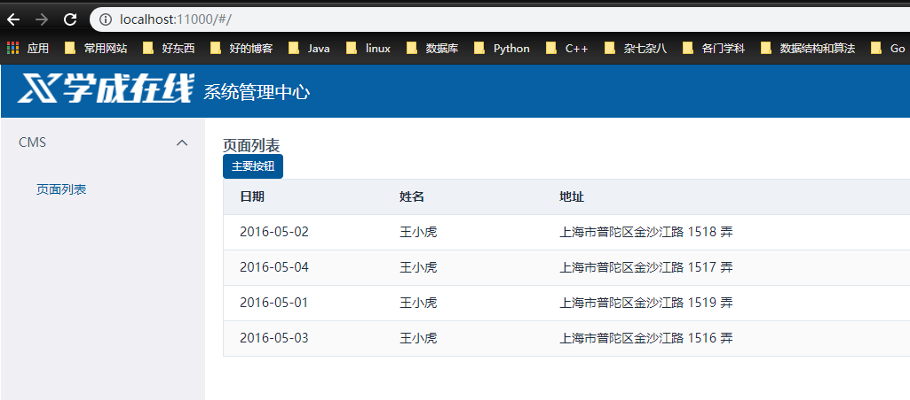

## 二十、CMS前端页面查询开发-页面原型-页面内容完善


```vue
<template>
  <div>
    <el-button type="primary" v-on:click="query" size="small">查询</el-button>
    <el-table
    :data="list"
    stripe
    style="width: 100%">

      <el-table-column type="index" width="60">
      </el-table-column>
      <el-table-column prop="pageName" label="页面名称" width="120">
      </el-table-column>
      <el-table-column prop="pageAliase" label="别名" width="120">
      </el-table-column>
      <el-table-column prop="pageType" label="页面类型" width="150">
      </el-table-column>
      <el-table-column prop="pageWebPath" label="访问路径" width="250">
      </el-table-column>
      <el-table-column prop="pagePhysicalPath" label="物理路径" width="250">
      </el-table-column>
      <el-table-column prop="pageCreateTime" label="创建时间" width="180" >
      </el-table-column>

    </el-table>

    <el-pagination
      layout="prev, pager, next"
      :page-size="this.params.size"
      @current-change="changePage"
      :total="total"
      :current-page="this.params.page"
      style="float:right;">
    </el-pagination>

  </div>
</template>
<script>
  export default {
    data() {
      return {
        list: [],
        total: 50,
        params: {
          page: 2,//页码
          size: 10//每页显示个数
        }
      }
    },
    methods: {
      //分页查询
      changePage: function () {
        this.query()
      },
      //查询
      query: function () {
        alert("查询")
      }
    }
  }
</script>

```

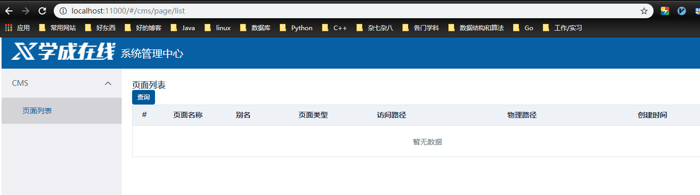

## 二十一、CMS前端页面查询开发-Api调用

### 1、cms.js

```js
import http from './../../../base/api/public'

/**
 * 页面查询
 */
export const page_list = (page,size,params) => {
  return http.requestQuickGet('http://localhost:31001/cms/page/list/'+page+'/'+size)
}

```

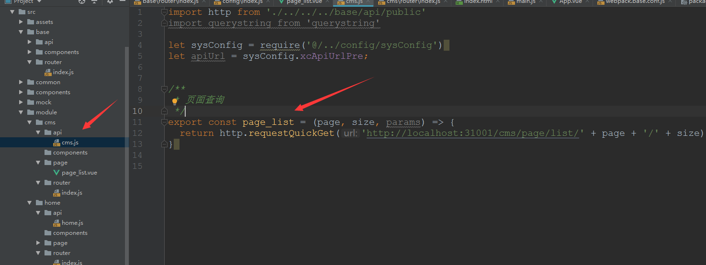

### 2、page_list.vue

```js
<script>
  // 导入js
  import * as cmsApi from '../api/cms'

  export default {
    data() {
      return {
        list: [],
        total: 50,
        params: {
          page: 1,//页码
          size: 10//每页显示个数
        }
      }
    },
    methods: {
      //分页查询
      changePage: function () {
        this.query()
      },
      //查询
      query: function () {
        cmsApi.page_list(this.params.page,this.params.size).then((res)=>{
          // 将res结果数据赋值给数据模型对象
          this.list = res.queryResult.list;
          this.total = res.queryResult.total;
        })
      }
    }
  }
</script>
```


## 二十二、CMS前端页面查询开发-Api调用-跨域解决


### 1、测试，出现跨域错误

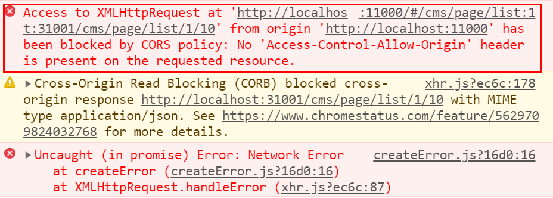


**原因：浏览器的同源策略不允许跨域访问，所谓同源策略是指协议、域名、端口相同**。

解决：采用proxyTable解决。

前端Ajax到后端是会有跨域的

但是服务端之间交互没有跨域

### 2、proxyTable是什么？

vue-cli提供的解决vue开发环境下跨域问题的方法，proxyTable的底层使用了http-proxymiddleware（
https://github.com/chimurai/http-proxy-middleware），它是http代理中间件，它依赖node.js，
基本原理是用服务端代理解决浏览器跨域：

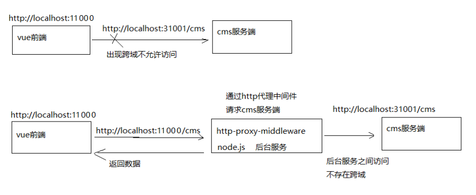

cms跨域解决原理：

1、访问页面http://localhost:11000/
2、页面请求http://localhost:11000/cms
由于url由http://localhost:31001/cms...改为“http://localhost:11000/cms."，所以不存在跨域
3、通过proxyTable由node服务器代理请求 http://localhost:31001/cms.
服务端不存在跨域问题

### 3、跨域处理

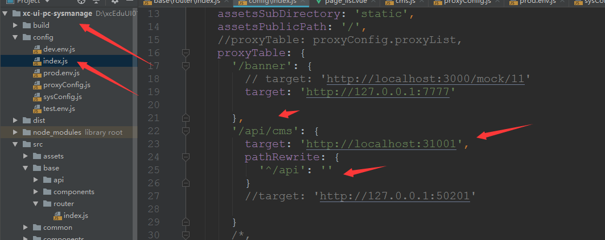

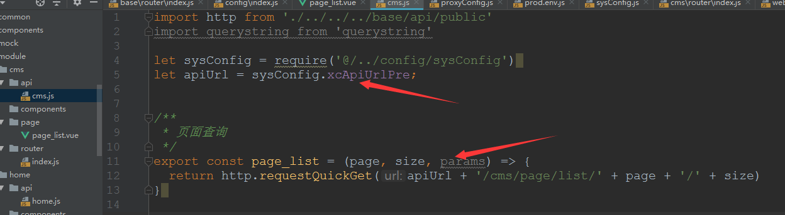

### 4、测试结果

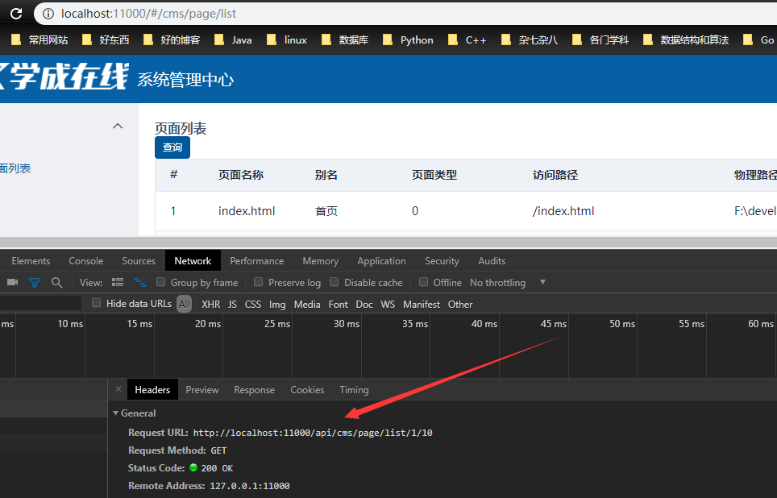

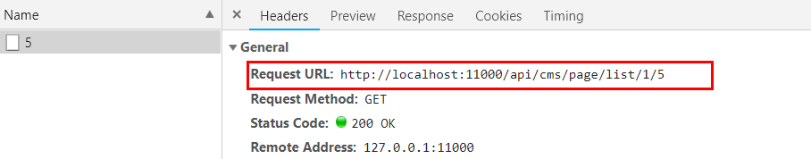

## 二十三、CMS前端页面查询开发-分页查询实现

```js
//分页查询，接收page页码
changePage(page){
    this.params.page = page;
    this.query()
}
```

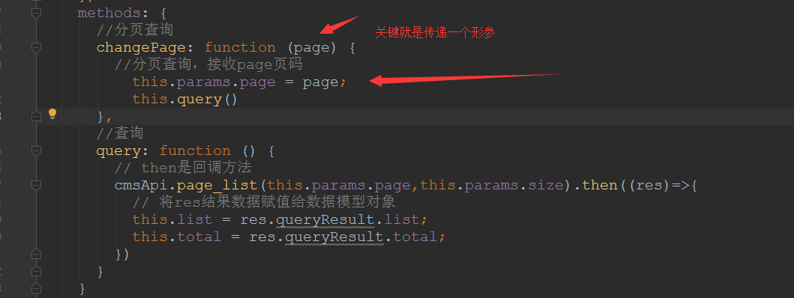

## 二十四、CMS前端页面查询开发-使用钩子方法实现立即查询

目前实现的功能是进入页面点击查询按钮向服务端表求查询，实际的需求是进入页面立即查询。
如何实现？
​	

这要用到vue的钩子函数，每个 Vue 实例在被创建时都要经过一系列的初始化过程——例如，需要设置数据监听、编译模板、将实例挂载到 DOM 并在数据变化时更新 DOM 等。同时在这个过程中也会运行一些叫做生命周期钩子的函数，这给了用户在不同阶段添加自己的代码的机会。

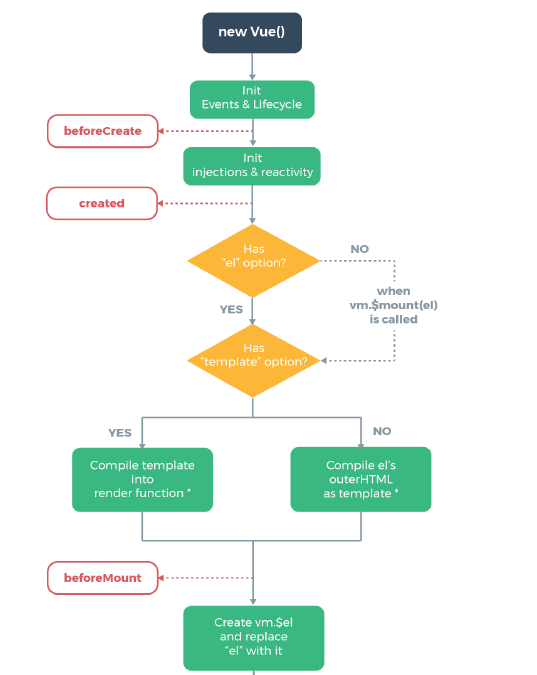

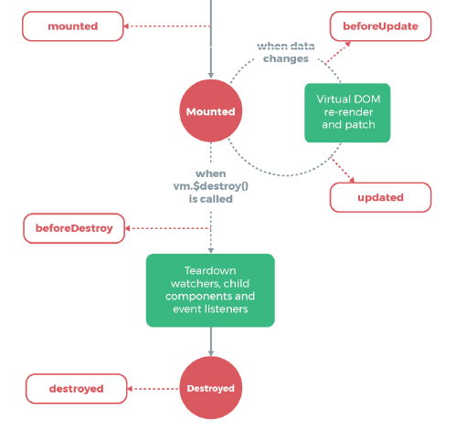

通常使用最多的是created和mounted两个钩子：
created：vue实例已创建但是DOM元素还没有渲染生成。
mounted：DOM元素渲染生成完成后调用。

```js
mounted() {
    //默认查询页面
    this.query()
}
```

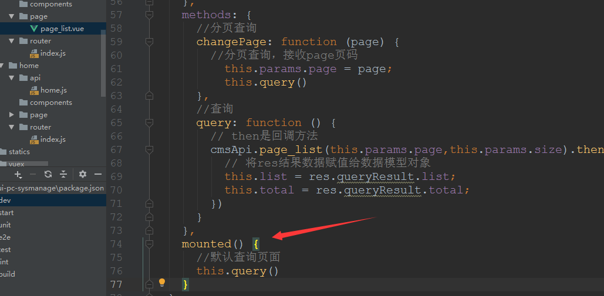

## 二十五、前后端请求响应流程小结

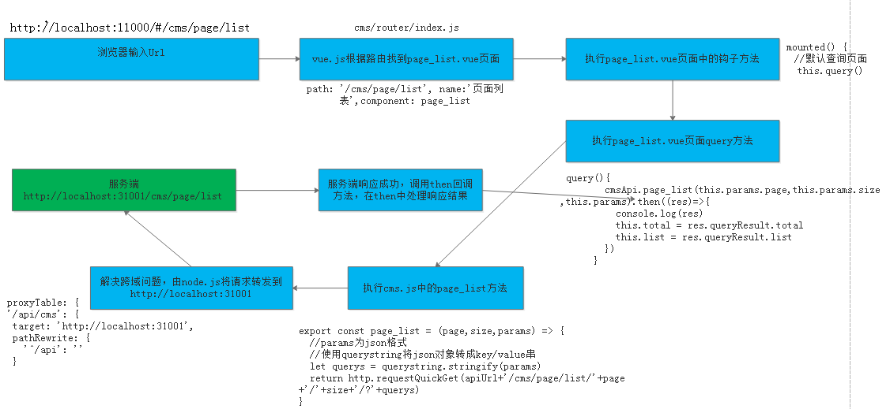


