# CMS页面管理开发

## 一、自定义查询页面-服务端-Dao

在页面输入查询条件，查询符合条件的页面信息。
查询条件如下：

站点Id：精确匹配
模板Id：精确匹配
页面别名：模糊匹配

```java
// 根据自定义条件查询
@Test
public void testFindAllByExample() {

    //条件匹配器
    //        ExampleMatcher exampleMatcher = ExampleMatcher.matching();
    //        exampleMatcher = exampleMatcher.withMatcher("pageAliase",ExampleMatcher.
    //                GenericPropertyMatchers.contains());
    // 上面的简写的方式
    ExampleMatcher exampleMatcher = ExampleMatcher.matching()
        .withMatcher("pageAliase",ExampleMatcher.GenericPropertyMatchers.contains());

    //页面别名模糊查询，需要自定义字符串的匹配器实现模糊查询
    //ExampleMatcher.GenericPropertyMatchers.contains() 包含
    //ExampleMatcher.GenericPropertyMatchers.startsWith()//开头匹配
    //条件值
    CmsPage cmsPage = new CmsPage();
    //站点ID
    cmsPage.setSiteId("5a751fab6abb5044e0d19ea1");

    cmsPage.setPageAliase("课程");
    //创建条件实例
    Example<CmsPage> example = Example.of(cmsPage, exampleMatcher);

    Pageable pageable = PageRequest.of(0, 10);
    Page<CmsPage> all = cmsPageRepository.findAll(example, pageable);
    System.out.println(all);
}
```

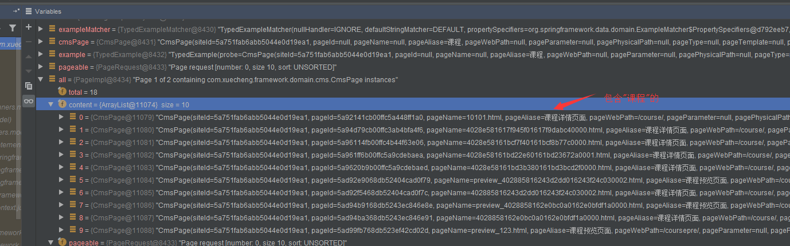

### 1、重点理解ExampleMatcher

**1）、需要考虑的因素**

​    查询条件的表示，有两部分，**一是条件值，二是查询方式**。条件值用实体对象（如Customer对象）来存储，相对简单，当页面传入过滤条件值时，存入相对应的属性中，没入传入时，属性保持默认值。查询方式是用匹配器ExampleMatcher来表示，情况相对复杂些，需要考虑的因素有：

* Null值的处理。当某个条件值为Null,是应当忽略这个过滤条件呢，还是应当去匹配数据库表中该字段值是Null的记录？
* 基本类型的处理。如客户Customer对象中的年龄age是int型的，当页面不传入条件值时，它默认是0，是有值的，那是否参与查询呢？
* 忽略某些属性值。一个实体对象，有许多个属性，是否每个属性都参与过滤？是否可以忽略某些属性？
* 不同的过滤方式。同样是作为String值，可能“姓名”希望精确匹配，“地址”希望模糊匹配，如何做到？
* 大小写匹配。字符串匹配时，有时可能希望忽略大小写，有时则不忽略，如何做到？

**2)、五个配置项**

​    围绕上面一系列情况，ExampleMatcher中定义了5项配置来解决这些问题。 

```java
public class ExampleMatcher {
    NullHandler nullHandler; //Null值处理方式
    StringMatcher defaultStringMatcher; //默认字符串匹配方式
    boolean defaultIgnoreCase; //默认大小写忽略方式
    PropertySpecifiers propertySpecifiers; //各属性特定查询方式
    Set<String> ignoredPaths; //忽略属性列表
    ......
}
```

（1）**nullHandler**：Null值处理方式，枚举类型，有2个可选值，INCLUDE（包括）,IGNORE（忽略）。标识作为条件的实体对象中，一个属性值（条件值）为Null是，是否参与过滤。当该选项值是INCLUDE时，表示仍参与过滤，会匹配数据库表中该字段值是Null的记录；若为IGNORE值，表示不参与过滤。

（2）**defaultStringMatcher**：默认字符串匹配方式，枚举类型，有6个可选值，DEFAULT（默认，效果同EXACT）,EXACT（相等）,STARTING（开始匹配）,ENDING（结束匹配）,CONTAINING（包含，模糊匹配）,REGEX（正则表达式）。该配置对所有字符串属性过滤有效，除非该属性在 propertySpecifiers中单独定义自己的匹配方式。

（3）**defaultIgnoreCase**：默认大小写忽略方式，布尔型，当值为false时，即不忽略，大小不相等。该配置对所有字符串属性过滤有效，除非该属性在propertySpecifiers 中单独定义自己的忽略大小写方式。

（4）**propertySpecifiers**：各属性特定查询方式，描述了各个属性单独定义的查询方式，每个查询方式中包含4个元素：属性名、字符串匹配方式、大小写忽略方式、属性转换器。如果属性未单独定义查询方式，或单独查询方式中，某个元素未定义（如：字符串匹配方式），则采用 ExampleMatcher 中定义的默认值，即上面介绍的 defaultStringMatcher 和 defaultIgnoreCase 的值。

（5）**ignoredPaths**：忽略属性列表，忽略的属性不参与查询过滤。

**实例代码**

```java
//创建匹配器，即如何使用查询条件
ExampleMatcher matcher = ExampleMatcher.matching() //构建对象
    .withStringMatcher(StringMatcher.CONTAINING) //改变默认字符串匹配方式：模糊查询
    .withIgnoreCase(true) //改变默认大小写忽略方式：忽略大小写
    .withMatcher("address", GenericPropertyMatchers.startsWith()) //地址采用“开始匹配”的方式查询
    .withIgnorePaths("focus");  //忽略属性
```

### 2、GenericPropertyMathers工具类方法

```java
public static class GenericPropertyMatchers {
    public GenericPropertyMatchers() {
    }

    public static ExampleMatcher.GenericPropertyMatcher ignoreCase() {
        return (new ExampleMatcher.GenericPropertyMatcher()).ignoreCase();
    }

    public static ExampleMatcher.GenericPropertyMatcher caseSensitive() {
        return (new ExampleMatcher.GenericPropertyMatcher()).caseSensitive();
    }

    public static ExampleMatcher.GenericPropertyMatcher contains() {
        return (new ExampleMatcher.GenericPropertyMatcher()).contains();
    }

    public static ExampleMatcher.GenericPropertyMatcher endsWith() {
        return (new ExampleMatcher.GenericPropertyMatcher()).endsWith();
    }

    public static ExampleMatcher.GenericPropertyMatcher startsWith() {
        return (new ExampleMatcher.GenericPropertyMatcher()).startsWith();
    }

    public static ExampleMatcher.GenericPropertyMatcher exact() {
        return (new ExampleMatcher.GenericPropertyMatcher()).exact();
    }

    public static ExampleMatcher.GenericPropertyMatcher storeDefaultMatching() {
        return (new ExampleMatcher.GenericPropertyMatcher()).storeDefaultMatching();
    }

    public static ExampleMatcher.GenericPropertyMatcher regex() {
        return (new ExampleMatcher.GenericPropertyMatcher()).regex();
    }
}
```

## 二、自定义查询页面-服务端-接口开发

### 1、修改PageService.java

```java
public QueryResponseResult findList(int page, int size, QueryPageRequest queryPageRequest) {
    if(queryPageRequest == null ){
        queryPageRequest = new QueryPageRequest();
    }
    CmsPage cmsPage = new CmsPage();

    //站点ID
    if (StringUtils.isNotEmpty(queryPageRequest.getSiteId())) {
        cmsPage.setSiteId(queryPageRequest.getSiteId());
    }
    //模板ID
    if (StringUtils.isNotEmpty(queryPageRequest.getTemplateId())) {
        cmsPage.setTemplateId(queryPageRequest.getTemplateId());
    }
    //页面别名
    if (StringUtils.isNotEmpty(queryPageRequest.getPageAliase())) {
        cmsPage.setPageAliase(queryPageRequest.getPageAliase());
    }

    //页面名称模糊查询，需要自定义字符串的匹配器实现模糊查询
    ExampleMatcher exampleMatcher = ExampleMatcher.matching()
        .withMatcher("pageAliase",ExampleMatcher.GenericPropertyMatchers.contains());

    Example<CmsPage> example = Example.of(cmsPage, exampleMatcher);

    if (page <= 0) {
        page = 1;
    }
    page = page - 1;  //为了适应mongodb的接口将页码减1

    if (size <= 0) {
        size = 10;
    }
    //分页对象
    Pageable pageable =  PageRequest.of(page, size);
    //分页查询
    Page<CmsPage> all = cmsPageRepository.findAll(example, pageable);

    QueryResult<CmsPage> cmsPageQueryResult = new QueryResult<>();
    cmsPageQueryResult.setList(all.getContent());
    cmsPageQueryResult.setTotal(all.getTotalElements());
    //返回结果
    return new QueryResponseResult(CommonCode.SUCCESS, cmsPageQueryResult);
}
```

使用swagger测试:

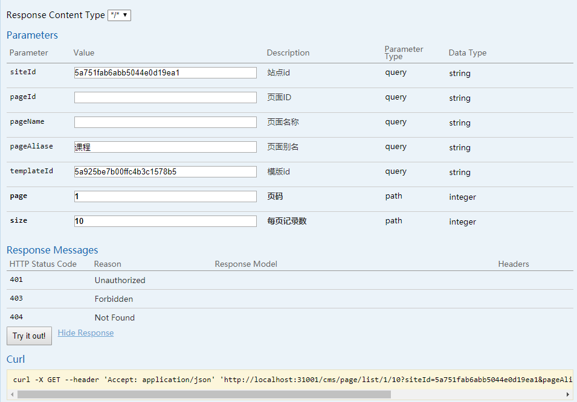

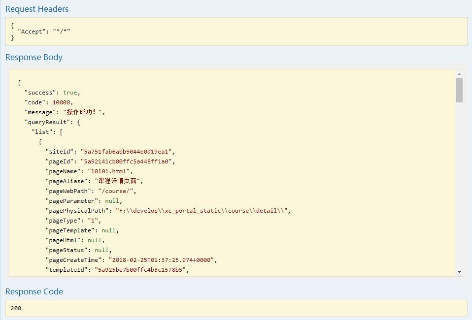


## 三、自定义查询页面-前端

### 1、最后的效果图

可以根据站点或别名进行查询

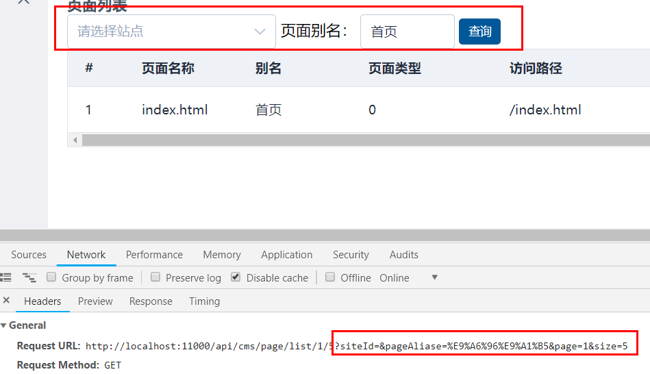


### 2、整体代码

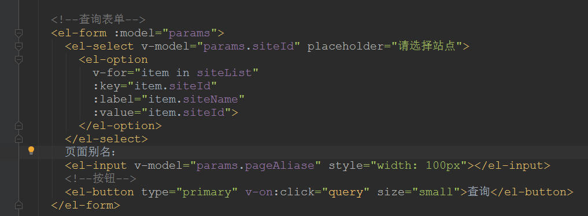

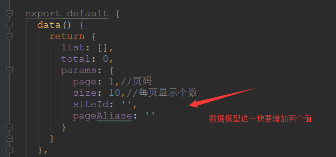

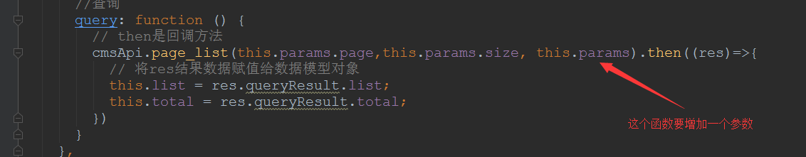

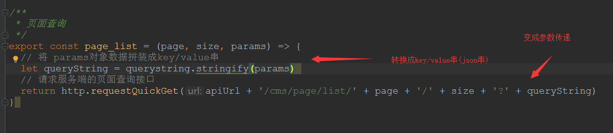

### 3、page_list.vue

```vue
<template>
  <div>

    <!--查询表单-->
    <el-form :model="params">
      <el-select v-model="params.siteId" placeholder="请选择站点">
        <el-option
          v-for="item in siteList"
          :key="item.siteId"
          :label="item.siteName"
          :value="item.siteId">
        </el-option>
      </el-select>
      页面别名：
      <el-input v-model="params.pageAliase" style="width: 100px"></el-input>
      <!--按钮-->
      <el-button type="primary" v-on:click="query" size="small">查询</el-button>
    </el-form>

    <!--表格-->
    <el-table
      :data="list"
      stripe
      style="width: 100%">

      <el-table-column type="index" width="60">
      </el-table-column>
      <el-table-column prop="pageName" label="页面名称" width="120">
      </el-table-column>
      <el-table-column prop="pageAliase" label="别名" width="120">
      </el-table-column>
      <el-table-column prop="pageType" label="页面类型" width="150">
      </el-table-column>
      <el-table-column prop="pageWebPath" label="访问路径" width="250">
      </el-table-column>
      <el-table-column prop="pagePhysicalPath" label="物理路径" width="250">
      </el-table-column>
      <el-table-column prop="pageCreateTime" label="创建时间" width="180" >
      </el-table-column>

    </el-table>

    <!--分页-->

    <el-pagination
      layout="prev, pager, next"
      :page-size="this.params.size"
      @current-change="changePage"
      :total="total"
      :current-page="this.params.page"
      style="float:right;">
    </el-pagination>

  </div>
</template>
<script>
  // 导入js
  import * as cmsApi from '../api/cms'

  export default {
    data() {
      return {
        list: [],
        total: 0,
        params: {
          page: 1,//页码
          size: 10,//每页显示个数
          siteId: '',
          pageAliase: ''
        }
      }
    },
    methods: {
      //分页查询
      changePage: function (page) {
        //分页查询，接收page页码
          this.params.page = page;
          this.query()
      },
      //查询
      query: function () {
        // then是回调方法
        cmsApi.page_list(this.params.page,this.params.size, this.params).then((res)=>{
          // 将res结果数据赋值给数据模型对象
          this.list = res.queryResult.list;
          this.total = res.queryResult.total;
        })
      }
    },
    mounted() {
      //默认查询页面
      this.query()

      //初始化站点列表(本来是要查询的，但是这里为了演示就不查询了)
      this.siteList = [
        {
          siteId:'5a751fab6abb5044e0d19ea1',
          siteName:'门户主站'
        },
        {
          siteId:'102',
          siteName:'测试站'
        }
      ]
    }
  }
</script>

```

### 4、cms.js

```js
import http from './../../../base/api/public'
import querystring from 'querystring'

let sysConfig = require('@/../config/sysConfig')
let apiUrl = sysConfig.xcApiUrlPre;


/**
 * 页面查询
 */
export const page_list = (page, size, params) => {
  // 将 params对象数据拼装成key/value串
  let queryString = querystring.stringify(params)
  // 请求服务端的页面查询接口
  return http.requestQuickGet(apiUrl + '/cms/page/list/' + page + '/' + size + '?' + queryString)
}
```

## 四、新增页面-服务端-接口开发

### 1、需求分析

1. 根据(页面名称、站点Id、页面webpath)3列作为联合主键 判断一个页面的唯一性

2. 如果页面不存在,完成新增

3. 请求方式为POST

4. 以CmsPage对象作为参数


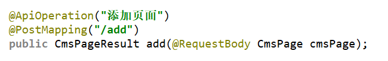

### 2、查看CmsPageResult.java

```java
@Data
public class CmsPageResult extends ResponseResult {
    CmsPage cmsPage;
    public CmsPageResult(ResultCode resultCode,CmsPage cmsPage) {
        super(resultCode);
        this.cmsPage = cmsPage;
    }
}
```

### 3、CmsPageControllerApi.java

```java
@ApiOperation("添加页面")
public CmsPageResult add(CmsPage cmsPage);
```

### 4、设置唯一索引

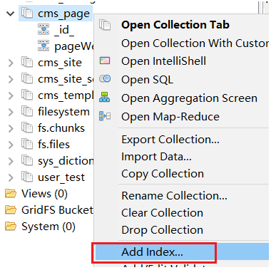

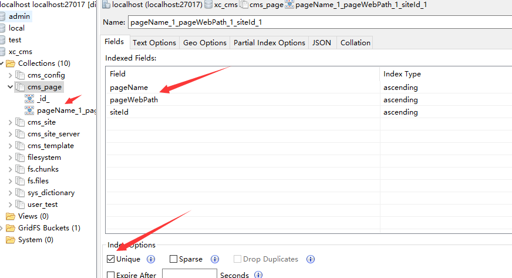

### 5、PageService.java

```java
/**
* 添加页面
* 1. 根据(页面名称、站点Id、页面webpath)3列作为联合主键进行查询页面是否存在，
* 2. 如果存在，返回失败
* 3. 如果不存在，返回成功
* @param cmsPage
* @return
*/
public CmsPageResult add(CmsPage cmsPage){
    //校验页面是否存在，根据页面名称、站点Id、页面webpath查询
    CmsPage cmsPage1 = cmsPageRepository.findByPageNameAndSiteIdAndPageWebPath(
    cmsPage.getPageName(), cmsPage.getSiteId(), cmsPage.getPageWebPath());
    if(cmsPage1==null){
        cmsPage.setPageId(null);//添加页面主键由spring data 自动生成
        cmsPageRepository.save(cmsPage);
        //返回结果
        CmsPageResult cmsPageResult = new CmsPageResult(CommonCode.SUCCESS,cmsPage);
        return cmsPageResult;
    }
    return new CmsPageResult(CommonCode.FAIL,null);
}
```

### 6、CmsPageRepository.java

```java
/**
* 根据页面名称、站点id、页面访问路径查询
* @param pageName          页面名称
* @param siteId            站点id
* @param pageWebPath       页面访问路径
* @return
*/
CmsPage findByPageNameAndSiteIdAndPageWebPath(String pageName, String siteId, String pageWebPath);
```

### 7、CmsPageController.java

```java
@Override
@PostMapping("/add")
public CmsPageResult add(@RequestBody CmsPage cmsPage) {
	return pageService.add(cmsPage);
}
```

## 五、新增页面-服务端-接口测试

测试数据：

```json
{
  "dataUrl": "string",
  "htmlFileId": "string",
  "pageAliase": "test003",
  "pageCreateTime": "2019-05-14T02:57:12.499Z",
  "pageHtml": "string",
  "pageId": "string",
  "pageName": "test003",
  "pageParameter": "string",
  "pageParams": [
    {
      "pageParamName": "string",
      "pageParamValue": "string"
    }
  ],
  "pagePhysicalPath": "string",
  "pageStatus": "string",
  "pageTemplate": "string",
  "pageType": "string",
  "pageWebPath": "string",
  "siteId": "string",
  "templateId": "string"
}
```

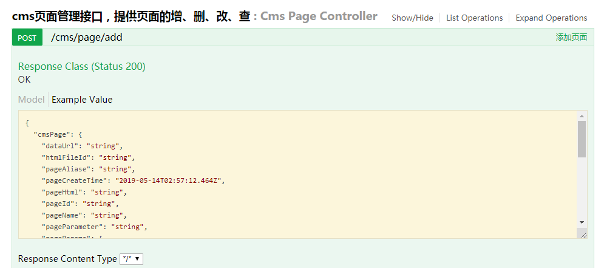

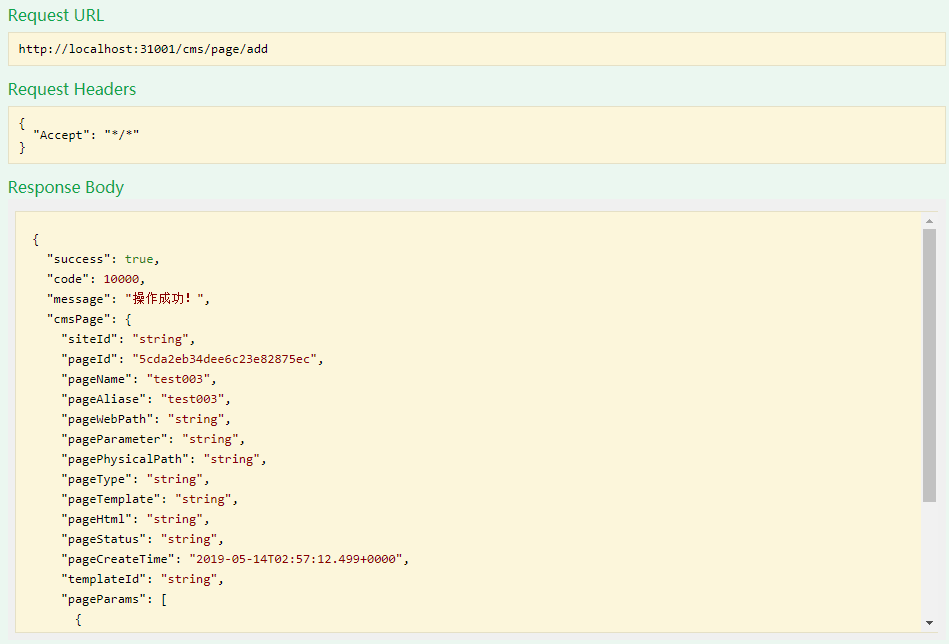

## 六、新增页面-前端-新增页面

### 1、效果图

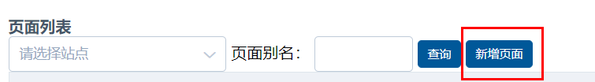


### 2、修改路由--- index.js

添加`page_add.vue`的路由，由于该地址不需要显示到侧边菜单，所以hidden设置为false

```js
import Home from '@/module/home/page/home.vue'; // @代表src目录
import page_list from '@/module/cms/page/page_list.vue'; // @代表src目录
import page_add from '@/module/cms/page/page_add.vue'; // @代表src目录
export default [{
    path: '/',
    component: Home,
    name: 'CMS', // 菜单名称
    hidden: false,
  children:[
    {path:'/cms/page/list',name:'页面列表',component: page_list,hidden:false},
    {path:'/cms/page/add',name:'新增页面',component: page_add,hidden:true}
  ]
  }
]

```

### 3、page_add.vue

页面基本框架:

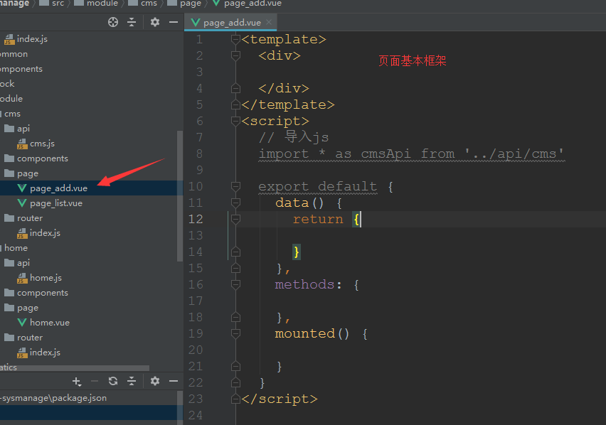

```java
<template>
  <div>
    <el-form :model="pageForm" label-width="80px">
      <el-form-item label="所属站点" prop="siteId">
        <el-select v-model="pageForm.siteId" placeholder="请选择站点">
          <el-option
            v-for="item in siteList"
            :key="item.siteId"
            :label="item.siteName"
            :value="item.siteId">
          </el-option>
        </el-select>
      </el-form-item>
      <el-form-item label="选择模版" prop="templateId">
        <el-select v-model="pageForm.templateId" placeholder="请选择">
          <el-option
            v-for="item in templateList"
            :key="item.templateId"
            :label="item.templateName"
            :value="item.templateId">
          </el-option>
        </el-select>
      </el-form-item>
      <el-form-item label="页面名称" prop="pageName">
        <el-input v-model="pageForm.pageName" auto-complete="off"></el-input>
      </el-form-item>
      <el-form-item label="别名" prop="pageAliase">
        <el-input v-model="pageForm.pageAliase" auto-complete="off"></el-input>
      </el-form-item>
      <el-form-item label="访问路径" prop="pageWebPath">
        <el-input v-model="pageForm.pageWebPath" auto-complete="off"></el-input>
      </el-form-item>
      <el-form-item label="物理路径" prop="pagePhysicalPath">
        <el-input v-model="pageForm.pagePhysicalPath" auto-complete="off"></el-input>
      </el-form-item>
      <el-form-item label="类型">
        <el-radio-group v-model="pageForm.pageType">
          <el-radio class="radio" label="0">静态</el-radio>
          <el-radio class="radio" label="1">动态</el-radio>
        </el-radio-group>
      </el-form-item>
      <el-form-item label="创建时间">
        <el-date-picker type="datetime" placeholder="创建时间" v-model="pageForm.pageCreateTime">
        </el-date-picker>
      </el-form-item>
    </el-form>
    <div slot="footer" class="dialog-footer">
      <el-button type="primary" @click="addSubmit">提交</el-button>
    </div>
  </div>
</template>
<script>

  import * as cmsApi from '../api/cms'
  export default {
    data() {
      return {
        siteList: [], //站点列表
        templateList: [],//模版列表
        //新增界面数据
        pageForm: {
          siteId: '',
          templateId: '',
          pageName: '',
          pageAliase: '',
          pageWebPath: '',
          pageParameter: '',
          pagePhysicalPath: '',
          pageType: '',
          pageCreateTime: new Date()
        }
      }
    },
    methods: {
      addSubmit() {
        alert("提交")
      }
    },
    created:function () {

      //初始化站点列表
      this.siteList = [
        {
          siteId:'5a751fab6abb5044e0d19ea1',
          siteName:'门户主站'
        },
        {
          siteId:'102',
          siteName:'测试站'
        }
      ]

      //模板列表
      this.templateList = [
        {
          templateId:'5a962b52b00ffc514038faf7',
          templateName:'首页'
        },
        {
          templateId:'5a962bf8b00ffc514038fafa',
          templateName:'轮播图'
        }
      ]
    }
  }
</script>

```

### 4、page_list.vue

给`page_list`页面添加【新增页面】的按钮

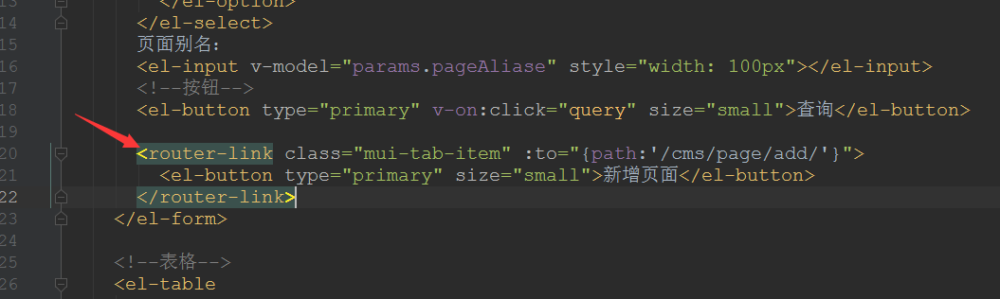

```vue
<router-link class="mui-tab-item" :to="{path:'/cms/page/add/'}">
    <el-button type="primary" size="small">新增页面</el-button>
</router-link>
```

## 七、新增页面-前端-页面完善

### 1、添加返回按钮

```html
<el-button type="primary" @click="go_back">返回</el-button>
```

```js
go_back(){
    // this.$router : 取得当前路由
    this.$router.push({
        path: '/cms/page/list'
    })
}
```

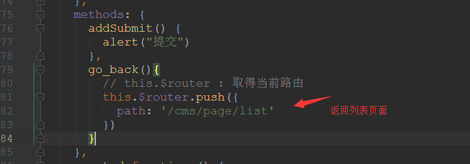

### 2、返回时携带页码

1、跳转到新增页面时,传递参数过去

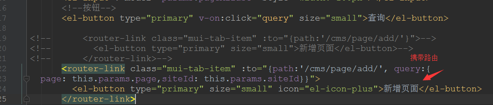

```vue
<router-link class="mui-tab-item" :to="{path:'/cms/page/add/', query:{
  page: this.params.page,siteId: this.params.siteId}}">
  <el-button type="primary" size="small" icon="el-icon-plus">新增页面</el-button>
</router-link>
```

**$router**为VueRouter实例，想要导航到不同URL，则使用`$router.push`方法

**$route**为当前router跳转对象里面可以获取name、path、query、params等

a、通过在路由上添加`key/value`串使用`this.$route.query`来取参数，例如：`/router1?id=123 ,/router1?id=456`
可以通过`this.$route.query.id`获取参数id的值。
b、通过将参数作为路由一部分进行传参数使用`this.$route.params`来获取，例如：定义的路由为`/router1/:id` ，请求/router1/123时可以通过`this.$route.params.id`来获取，此种情况用`this.$route.query.i`d是拿不到的。


2、返回时,携带传递过来的参数回去

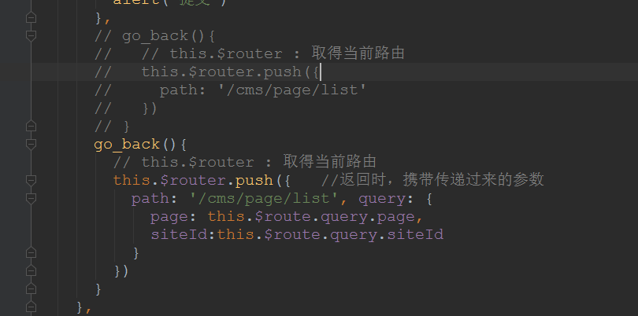

```js
go_back(){
    // this.$router : 取得当前路由
    this.$router.push({
        path: '/cms/page/list', query: {
            page: this.$route.query.page,
            siteId:this.$route.query.siteId
        }
    })
}
```

3、page_list.vue中添加钩子方法,首先读取地址栏的页码和siteid,进行查询

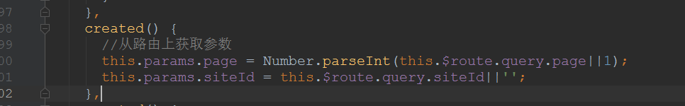 

```js
created() {
  //从路由上获取参数
  this.params.page = Number.parseInt(this.$route.query.page||1);
  this.params.siteId = this.$route.query.siteId||'';
}
```

### 3、表单校验

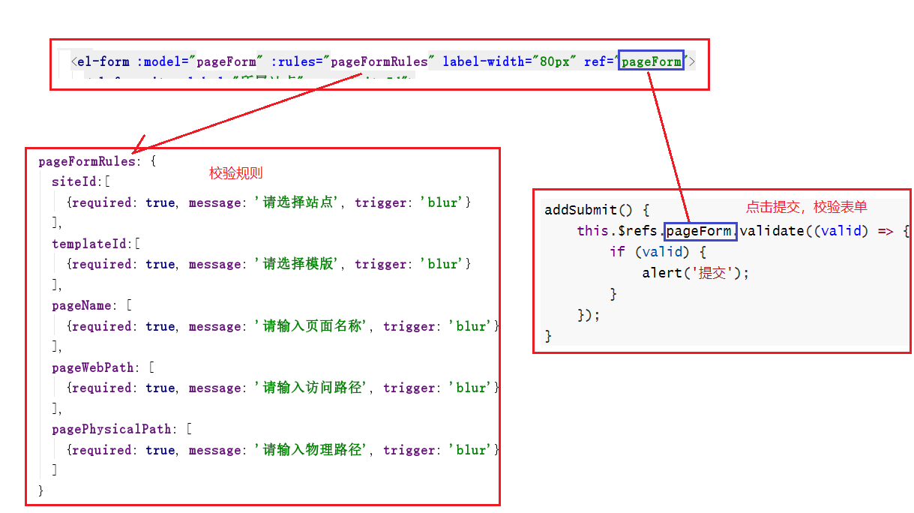

1、指定要校验的表单

`:rules` 指定校验规则

```vue
<el‐form :model="pageForm" :rules="pageFormRules" label‐width="80px" ref="pageForm">
```

2、下面这段是校验规则(在data下面)

```js
pageFormRules: {
  siteId:[
    {required: true, message: '请选择站点', trigger: 'blur'}
  ],
  templateId:[
    {required: true, message: '请选择模版', trigger: 'blur'}
  ],
  pageName: [
    {required: true, message: '请输入页面名称', trigger: 'blur'}
  ],
  pageWebPath: [
    {required: true, message: '请输入访问路径', trigger: 'blur'}
  ],
  pagePhysicalPath: [
    {required: true, message: '请输入物理路径', trigger: 'blur'}
  ]
}
```

3、点击提交按钮时，校验表单

`this.$refs.**pageForm** ： pageForm`为要校验的表单

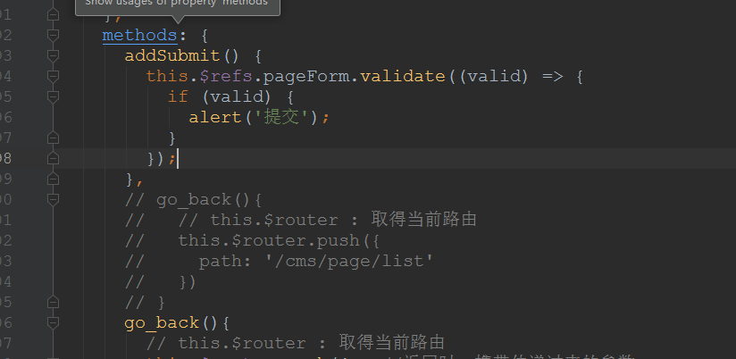

```js
addSubmit() {
    this.$refs.pageForm.validate((valid) => {
        if (valid) {
            alert('提交');
        }
    });
}
```

## 八、新增页面-前端-Api调用

现在页面准备好了，我们该完成提交按钮进行后台的保存了。

### 1、在cms.js中添加保存的方法

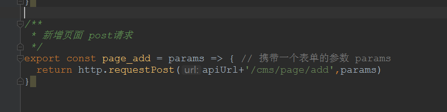

```js
/**
 * 新增页面
 */
export const page_add = params => {
  return http.requestPost(apiUrl+'/cms/page/add',params)
}
```

### 2、page.add.vue

```js
addSubmit() {
    this.$refs.pageForm.validate((valid) => {
        if (valid) {
            this.$confirm('确认提交吗？', '提示', {}).then(() => {
                cmsApi.page_add(this.pageForm).then((res) => {
                    console.log(res);
                    if(res.success){
                        // 提示信息
                        this.$message({message: '提交成功',type: 'success'});
                        // 重置表单
                        this.$refs['pageForm'].resetFields();
                    }else{
                        this.$message.error('提交失败');
                    }
                });
            });
        }
    });
}
```

测试:

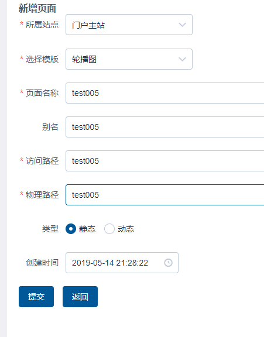

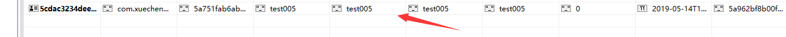

## 九、修改页面-服务端-接口开发

### 1、修改页面用户操作流程

1、用户进入修改页面，在页面上显示了修改页面的信息
2、用户修改页面的内容，点击“提交”，提示“修改成功”或“修改失败”

### 2、CmsPageControllerApi.java

```java
/**
 * 通过ID查询页面
 * @param id
 * @return
 */
@ApiOperation("通过ID查询页面")
public CmsPage findById(String id);

/**
 * 修改页面
 * @param id
 * @param cmsPage
 * @return
 */
@ApiOperation("修改页面")
public CmsPageResult edit(String id,CmsPage cmsPage);
```

### 3、PageService.java

```java
/**
* 根据id查询页面
* @param id
* @return
*/
public CmsPage getById(String id) {
    Optional<CmsPage> optional = cmsPageRepository.findById(id);
    if (optional.isPresent()) {
        return optional.get();
    }
    return null;  //返回空

}

/**
     * 更新页面信息
     * @param id
     * @param cmsPage
     * @return
     */
public CmsPageResult update(String id, CmsPage cmsPage) {
    //根据id查询页面信息
    CmsPage one = this.getById(id);
    if (one != null) {
        //更新模板id
        one.setTemplateId(cmsPage.getTemplateId());
        //更新所属站点
        one.setSiteId(cmsPage.getSiteId());
        //更新页面别名
        one.setPageAliase(cmsPage.getPageAliase());
        //更新页面名称
        one.setPageName(cmsPage.getPageName());
        //更新访问路径
        one.setPageWebPath(cmsPage.getPageWebPath());
        //更新物理路径
        one.setPagePhysicalPath(cmsPage.getPagePhysicalPath());
        //执行更新
        cmsPageRepository.save(one);
        //返回成功
        return new CmsPageResult(CommonCode.SUCCESS, one);
    }
    //返回失败
    return new CmsPageResult(CommonCode.FAIL, null);
}
```

### 4、CmsPageController.java

```java
@Override
@GetMapping("/get/{id}")
public CmsPage findById(@PathVariable("id") String id) {
	return pageService.getById(id);
}


@Override
@PutMapping("/edit/{id}")//这里使用put方法，http 方法中put表示更新
public CmsPageResult edit(@PathVariable("id") String id, @RequestBody CmsPage cmsPage) {
	return pageService.update(id,cmsPage);
}
```

## 十、修改页面-前端-修改页面

### 1、page_edit.vue

```vue
<template>
  <div>
    <el-form   :model="pageForm" label-width="80px" :rules="pageFormRules" ref="pageForm" >
      <el-form-item label="所属站点" prop="siteId">
        <el-select v-model="pageForm.siteId" placeholder="请选择站点">
          <el-option
            v-for="item in siteList"
            :key="item.siteId"
            :label="item.siteName"
            :value="item.siteId">
          </el-option>
        </el-select>
      </el-form-item>
      <el-form-item label="选择模版" prop="templateId">
        <el-select v-model="pageForm.templateId" placeholder="请选择">
          <el-option
            v-for="item in templateList"
            :key="item.templateId"
            :label="item.templateName"
            :value="item.templateId">
          </el-option>
        </el-select>
      </el-form-item>
      <el-form-item label="页面名称" prop="pageName">
        <el-input v-model="pageForm.pageName" auto-complete="off" ></el-input>
      </el-form-item>

      <el-form-item label="别名" prop="pageAliase">
        <el-input v-model="pageForm.pageAliase" auto-complete="off" ></el-input>
      </el-form-item>
      <el-form-item label="访问路径" prop="pageWebPath">
        <el-input v-model="pageForm.pageWebPath" auto-complete="off" ></el-input>
      </el-form-item>

      <el-form-item label="物理路径" prop="pagePhysicalPath">
        <el-input v-model="pageForm.pagePhysicalPath" auto-complete="off" ></el-input>
      </el-form-item>
      <el-form-item label="数据Url" prop="dataUrl">
        <el-input v-model="pageForm.dataUrl" auto-complete="off" ></el-input>
      </el-form-item>
      <el-form-item label="类型">
        <el-radio-group v-model="pageForm.pageType">
          <el-radio class="radio" label="0">静态</el-radio>
          <el-radio class="radio" label="1">动态</el-radio>
        </el-radio-group>
      </el-form-item>
      <el-form-item label="创建时间">
        <el-date-picker type="datetime" placeholder="创建时间" v-model="pageForm.pageCreateTime"></el-date-picker>
      </el-form-item>

    </el-form>
    <div slot="footer" class="dialog-footer">
      <el-button @click="go_back">返回</el-button>
      <el-button type="primary" @click.native="editSubmit" :loading="addLoading">提交</el-button>
    </div>
  </div>
</template>
<script>
  import * as cmsApi from '../api/cms'
  export default{
    data(){
      return {
        //页面id
        pageId:'',
        //模版列表
        templateList:[],
        addLoading: false,//加载效果标记
        //新增界面数据
        pageForm: {
          siteId:'',
          templateId:'',
          pageName: '',
          pageAliase: '',
          pageWebPath: '',
          dataUrl:'',
          pageParameter:'',
          pagePhysicalPath:'',
          pageType:'',
          pageCreateTime: new Date()
        },
        pageFormRules: {
          siteId:[
            {required: true, message: '请选择站点', trigger: 'blur'}
          ],
          templateId:[
            {required: true, message: '请选择模版', trigger: 'blur'}
          ],
          pageName: [
            {required: true, message: '请输入页面名称', trigger: 'blur'}
          ],
          pageWebPath: [
            {required: true, message: '请输入访问路径', trigger: 'blur'}
          ],
          pagePhysicalPath: [
            {required: true, message: '请输入物理路径', trigger: 'blur'}
          ]
        },
        siteList:[]
      }
    },
    methods:{
      go_back(){
        this.$router.push({
          path: '/cms/page/list', query: {
            page: this.$route.query.page,
            siteId:this.$route.query.siteId
          }
        })
      },
      editSubmit(){
        this.$refs.pageForm.validate((valid) => {//表单校验
          if (valid) {//表单校验通过
            this.$confirm('确认提交吗？', '提示', {}).then(() => {
              this.addLoading = true;
              //修改提交请求服务端的接口
              cmsApi.page_edit(this.pageId,this.pageForm).then((res) => {
                console.log(res);
                if(res.success){
                  this.addLoading = false;
                  this.$message({
                    message: '提交成功',
                    type: 'success'
                  });
                  //返回
                  this.go_back();

                }else{
                  this.addLoading = false;
                  this.$message.error('提交失败');
                }
              });
            });
          }
        });
      }

    },
    created: function () {
      // 注意：this.$route.params.pageId
      // 从url中提取出pageId，这次的url是rest风格的，提取时使用params，而不是query
      this.pageId=this.$route.params.pageId;
      //根据主键查询页面信息
      cmsApi.page_get(this.pageId).then((res) => {
        console.log(res);
        if(res){
          this.pageForm = res;
        }
      });
    },
    mounted:function(){

      //初始化站点列表
      this.siteList = [
        {
          siteId:'5a751fab6abb5044e0d19ea1',
          siteName:'门户主站'
        },
        {
          siteId:'102',
          siteName:'测试站'
        }
      ]
      //模板列表
      this.templateList = [
        {
          templateId:'5a962b52b00ffc514038faf7',
          templateName:'首页'
        },
        {
          templateId:'5a962bf8b00ffc514038fafa',
          templateName:'轮播图'
        }
      ]
    }
  }
</script>
<style>

</style>
```

**参数提取[重点]** （之前是`?`后面接的参数，现在是`url`地址后面的一部分，所以要使用`params`）

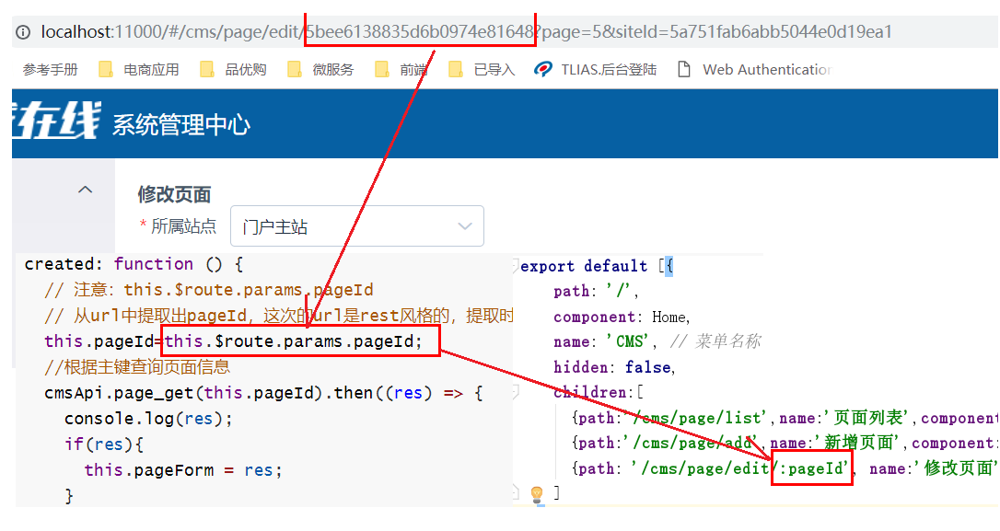

### 2、index.js

```js
import Home from '@/module/home/page/home.vue'; // @代表src目录
import page_list from '@/module/cms/page/page_list.vue'; // @代表src目录
import page_add from '@/module/cms/page/page_add.vue'; // @代表src目录
import page_edit from '@/module/cms/page/page_edit.vue';

export default [{
    path: '/',
    component: Home,
    name: 'CMS', // 菜单名称
    hidden: false,
    children:[
      {path:'/cms/page/list',name:'页面列表',component: page_list,hidden:false},
      {path:'/cms/page/add',name:'新增页面',component: page_add,hidden:true},
      {path: '/cms/page/edit/:pageId', name:'修改页面',component: page_edit,hidden:true}
    ]
  }
]

```

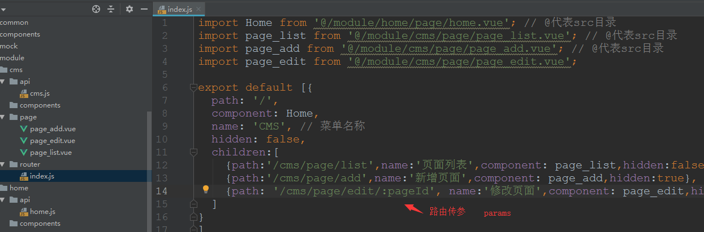

### 3、page_list.vue

添加**编辑按钮**进行页面跳转

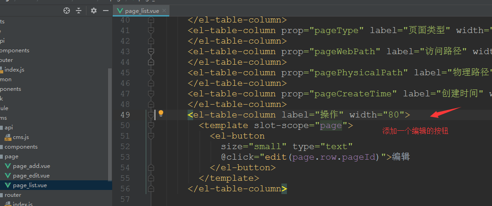

```vue
<el-table-column label="操作" width="80">
    <template slot-scope="page">
		<el-button
           size="small" type="text"
           @click="edit(page.row.pageId)">编辑
        </el-button>
    </template>
</el-table-column>
```

添加编辑按钮的点击方法

```js
//修改
edit:function (pageId) {
  this.$router.push({ path: '/cms/page/edit/'+pageId,query:{
      page: this.params.page,
      siteId: this.params.siteId}
  })
}
```

页面效果：

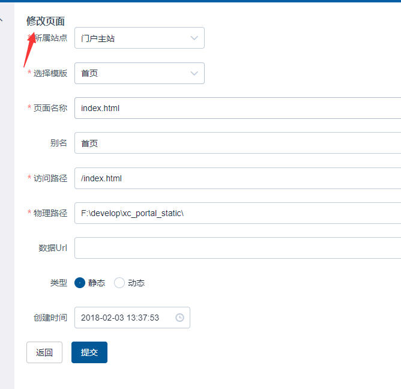

### 4、cms.js

需要添加的两个方法:

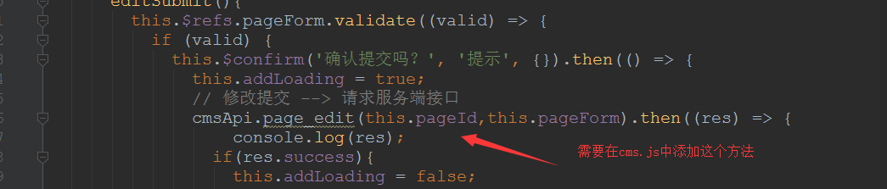

注意到那个`$route.params.pageId`，用的是`params`

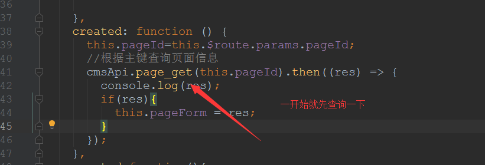

添加如下:

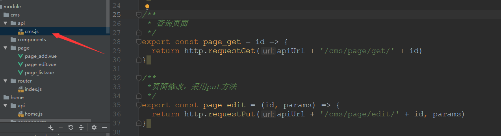

代码:

```js
/**
 * 查询页面
 */
export const page_get = id => {
  return http.requestGet(apiUrl+'/cms/page/get/'+id)
}

/*页面修改，采用put方法*/
export const page_edit = (id,params) => {
  return http.requestPut(apiUrl+'/cms/page/edit/'+id,params)
}
```

## 十一、修改页面-前端-Api调用

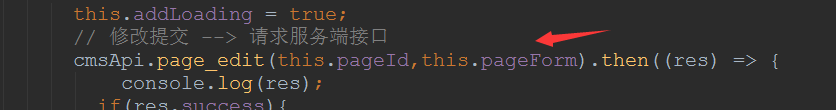

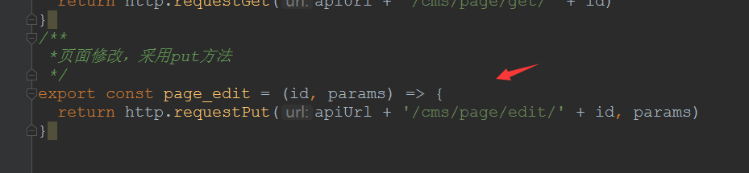

演示，将之前的`test005`改为`test006`:

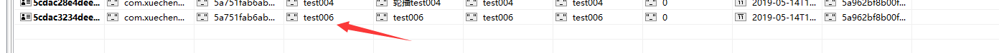

## 十二、删除页面-服务端-接口开发

### 1、用户操作流程

1、用户进入用户列表，点击“删除”
2、执行删除操作，提示“删除成功”或“删除失败”

### 2、PageService.java

```java
/**
 * 删除操作
 * @param id
 * @return
 */
public ResponseResult delete(String id) {

    CmsPage one = this.getById(id);

    if(one!=null){
        //删除页面
        cmsPageRepository.deleteById(id);
        return new ResponseResult(CommonCode.SUCCESS);
    }

    return new ResponseResult(CommonCode.FAIL);
}
```

### 3、CmsPageControllerApi.java

```java
@ApiOperation("通过ID删除页面")
public ResponseResult delete(String id);
```

### 4、CmsPageController.java

```java
@Override
@DeleteMapping("/del/{id}")
public ResponseResult delete(@PathVariable("id") String id) {
    return pageService.delete(id);
}
```

## 十三、删除页面-前端-Api调用

### 1、添加删除按钮

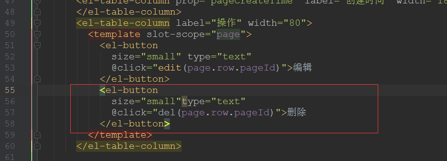

```html
<el-table-column label="操作" width="100">
    <template slot-scope="page">
        <el-button
            size="small" type="text"
            @click="edit(page.row.pageId)">编辑
        </el-button>

        <el-button
            size="small"type="text"
            @click="del(page.row.pageId)">删除
        </el-button>
    </template>
</el-table-column>
```

### 2、cms.java

```js
/*页面删除*/
export const page_del = (id) => {
  return http.requestDelete(apiUrl+'/cms/page/del/'+id)
}
```

### 3、执行删除动作

```js
//删除
del:function (pageId) {
    this.$confirm('确认删除此页面吗?', '提示', {}).then(() => {
        cmsApi.page_del(pageId).then((res)=>{
            if(res.success){
                this.$message.success('删除成功!');
                //删除之后重新查询页面
                this.query()
            }else{
                this.$message.error('删除失败!');
            }
        })
    })
}
```

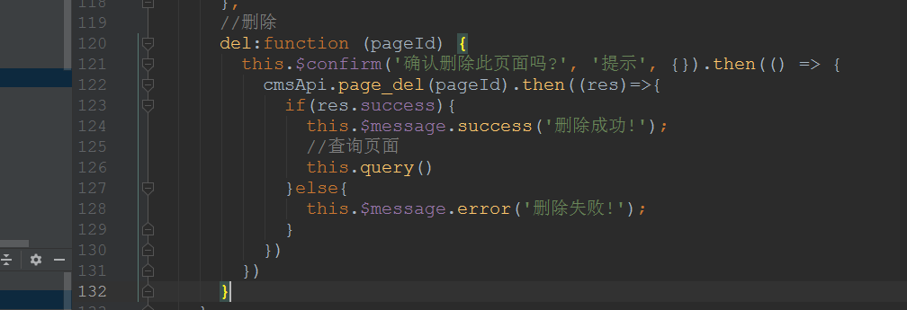

## 十四、异常处理-异常处理的问题分析

参考文档:

https://blog.csdn.net/kinginblue/article/details/70186586

自定义异常:

1

 10001 非法参数

  10002 参数缺失

2

 2001  数据库异常

2003  网络异常

### 1、从添加页面的service方法中找问题：

```java
//添加页面
public CmsPageResult add(CmsPage cmsPage){
	//校验页面是否存在，根据页面名称、站点Id、页面webpath查询
	CmsPage cmsPage1 = cmsPageRepository.findByPageNameAndSiteIdAndPageWebPath(cmsPage.getPageName(), cmsPage.getSiteId(), cmsPage.getPageWebPath());
    
    if(cmsPage1==null){
        cmsPage.setPageId(null);//添加页面主键由spring data 自动生成
        cmsPageRepository.save(cmsPage);
        //返回结果
        CmsPageResult cmsPageResult = new CmsPageResult(CommonCode.SUCCESS,cmsPage);
        return cmsPageResult;
    }
    return new CmsPageResult(CommonCode.FAIL,null);
}
```

### 2、问题：

1、上边的代码只要操作不成功仅向用户返回“错误代码：11111，失败信息：操作失败”，无法区别具体的错误信息。
2、service方法在执行过程出现异常在哪捕获？在service中需要都加try/catch，如果在controller也需要添加try/catch，代码冗余严重且不易维护。

### 3、解决方案：

1、在Service方法中的编码顺序是先校验判断，有问题则抛出具体的异常信息，最后执行具体的业务操作，返回成
功信息。
2、在**统一异常处理类**中去捕获异常，无需controller捕获异常，向用户返回统一规范的响应信息。

```java
//添加页面
public CmsPageResult add(CmsPage cmsPage){
    //校验cmsPage是否为空
    if(cmsPage == null){
    	//抛出异常，非法请求
    	//...
    }
    //根据页面名称查询（页面名称已在mongodb创建了唯一索引）
    CmsPage cmsPage1 =
    cmsPageRepository.findByPageNameAndSiteIdAndPageWebPath(cmsPage.getPageName(),
    cmsPage.getSiteId(), cmsPage.getPageWebPath());
    
    //校验页面是否存在，已存在则抛出异常
    if(cmsPage1 !=null){
    	//抛出异常，已存在相同的页面名称
    	//...
    }
    
    cmsPage.setPageId(null);//添加页面主键由spring data 自动生成
    CmsPage save = cmsPageRepository.save(cmsPage);
    //返回结果
    CmsPageResult cmsPageResult = new CmsPageResult(CommonCode.SUCCESS,save);
    return cmsPageResult;
}
```

## 十五、异常处理-异常处理流程

### 1、系统对异常的处理使用统一的异常处理流程

1、自定义异常类型。
2、自定义错误代码及错误信息。
3、对于可预知的异常由程序员在代码中主动抛出，由SpringMVC统一捕获。
可预知异常是程序员在代码中手动抛出本系统定义的特定异常类型，由于是程序员抛出的异常，通常异常信息比较
齐全，程序员在抛出时会指定错误代码及错误信息，获取异常信息也比较方便。
4、对于不可预知的异常（运行时异常）由SpringMVC统一捕获Exception类型的异常。
不可预知异常通常是由于系统出现bug、或一些不要抗拒的错误（比如网络中断、服务器宕机等），异常类型为
RuntimeException类型（运行时异常）。
5、可预知的异常及不可预知的运行时异常最终会采用统一的信息格式（错误代码+错误信息）来表示，最终也会随请求响应给客户端。

### 2、异常抛出及处理流程


1、在controller、service、dao中程序员抛出自定义异常；springMVC框架抛出框架异常类型
2、统一由异常捕获类捕获异常，并进行处理
3、捕获到自定义异常则直接取出错误代码及错误信息，响应给用户。
4、捕获到非自定义异常类型首先从Map中找该异常类型是否对应具体的错误代码，如果有则取出错误代码和错误
信息并响应给用户，如果从Map中找不到异常类型所对应的错误代码则统一为99999错误代码并响应给用户。
5、将错误代码及错误信息以Json格式响应给用户。


## 十六、异常处理-可预知异常处理-自定义异常类型和抛出类

### 1、CustomException.java

```java
/**
 * 自定义异常类
 */
public class CustomException extends RuntimeException {

    private ResultCode resultCode;

    public CustomException(ResultCode resultCode) {
        //异常信息为错误代码+异常信息
        super("错误代码：" + resultCode.code() + "错误信息：" + resultCode.message());
        this.resultCode = resultCode;
    }

    public ResultCode getResultCode() {
        return this.resultCode;
    }
}
```

### 2、ExceptionCast.java

```java
public class ExceptionCast {

    //使用此静态方法抛出自定义异常
    public static void cast(ResultCode resultCode){
        throw new CustomException(resultCode);
    }
}
```

### 3、ExceptionCatch.java

```java
/**
 * 统一异常捕获类
 *
 * 在spring 3.2中，新增了@ControllerAdvice 注解，
 * 可以用于定义@ExceptionHandler、@InitBinder、@ModelAttribute，并应用到所有@RequestMapping中。
 */
@ControllerAdvice // 控制器增强
public class ExceptionCatch {

    private static final Logger LOGGER = LoggerFactory.getLogger(ExceptionCatch.class);

    //捕获 CustomException异常
    @ExceptionHandler(CustomException.class)
    @ResponseBody //将异常转换成json
    public ResponseResult customException(CustomException e) {
        // 记录日志
        LOGGER.error("catch exception : {} exception: ",e.getMessage(), e);
        ResultCode resultCode = e.getResultCode();
        ResponseResult responseResult = new ResponseResult(resultCode);
        return responseResult;
    }
}
```


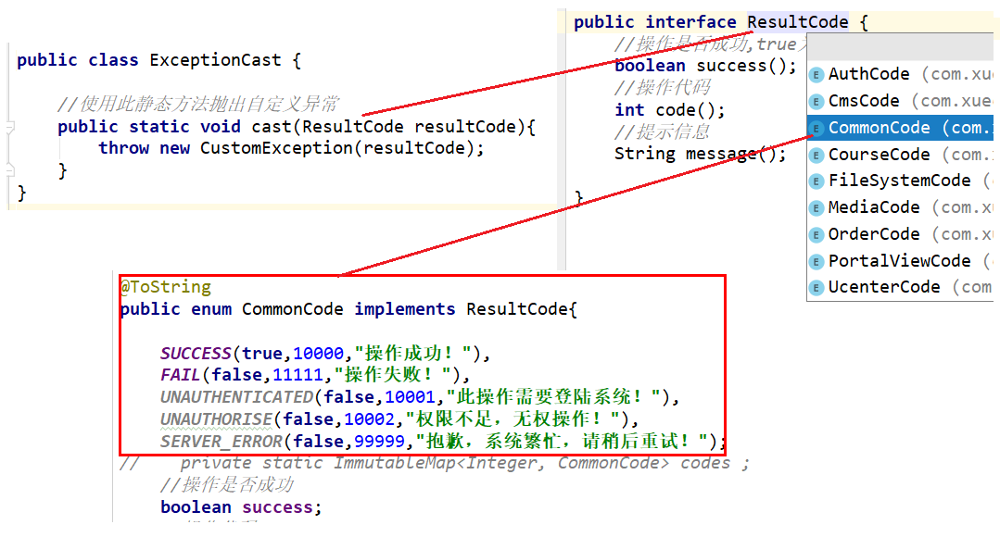


## 十七、异常处理-可预知异常处理-异常处理测试

### 1、PageService.java

在add()的代码中加入异常处理：

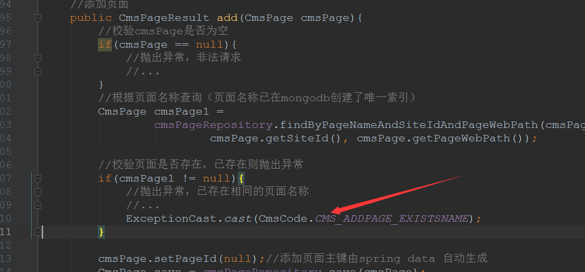

```java
//校验cmsPage是否为空
if(cmsPage1 != null){
	//抛出异常，非法请求
	ExceptionCast.cast(CmsCode.CMS_ADDPAGE_EXISTSNAME);
}
```

### 2、CmsCode.java

这个类是在原有的工程中存在的。

```java
@ToString
public enum CmsCode implements ResultCode {
    CMS_ADDPAGE_EXISTSNAME(false,24001,"页面名称已存在！"),
    CMS_GENERATEHTML_DATAURLISNULL(false,24002,"从页面信息中找不到获取数据的url！"),
    CMS_GENERATEHTML_DATAISNULL(false,24003,"根据页面的数据url获取不到数据！"),
    CMS_GENERATEHTML_TEMPLATEISNULL(false,24004,"页面模板为空！"),
    CMS_GENERATEHTML_HTMLISNULL(false,24005,"生成的静态html为空！"),
    CMS_GENERATEHTML_SAVEHTMLERROR(false,24005,"保存静态html出错！"),
    CMS_COURSE_PERVIEWISNULL(false,24007,"预览页面为空！");
    //操作代码
    boolean success;
    //操作代码
    int code;
    //提示信息
    String message;
    private CmsCode(boolean success, int code, String message){
        this.success = success;
        this.code = code;
        this.message = message;
    }

    @Override
    public boolean success() {
        return success;
    }

    @Override
    public int code() {
        return code;
    }

    @Override
    public String message() {
        return message;
    }
}
```

### 3、ManageCmsApplication.java

在核心启动类上加入包扫描，去扫描common项目的包

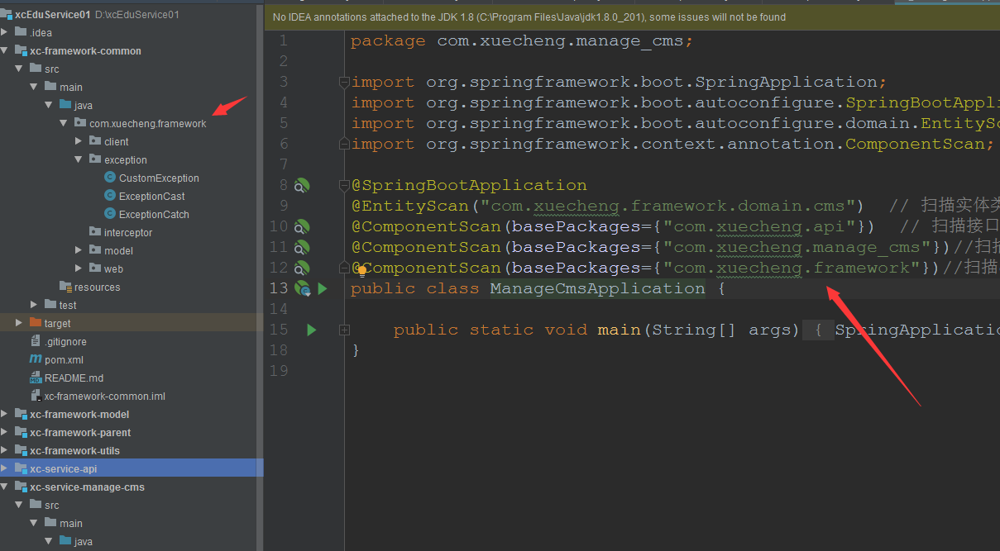

```java
@SpringBootApplication
@EntityScan("com.xuecheng.framework.domain.cms")//扫描实体类
@ComponentScan(basePackages={"com.xuecheng.api"})//扫描接口
@ComponentScan(basePackages={"com.xuecheng.framework"})//扫描common包下的类
@ComponentScan(basePackages={"com.xuecheng.manage_cms"})//扫描本项目下的所有类
public class ManageCmsApplication {
    public static void main(String[] args) {
        SpringApplication.run(ManageCmsApplication.class,args);
    }
}
```

### 4、前端修改

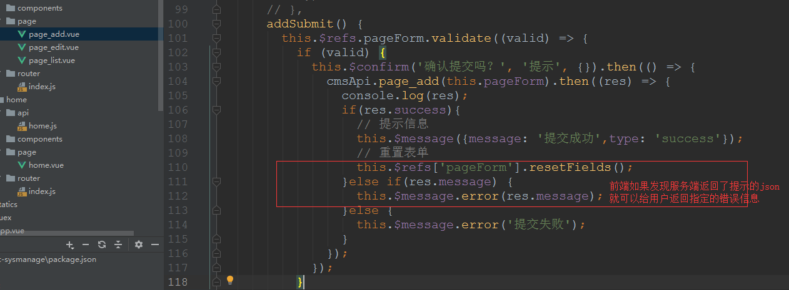

### 5、测试

当出现重复页面的时候,无法进行保存,错误提示也是我们自己定义的了.(**我添加了两次test007**)

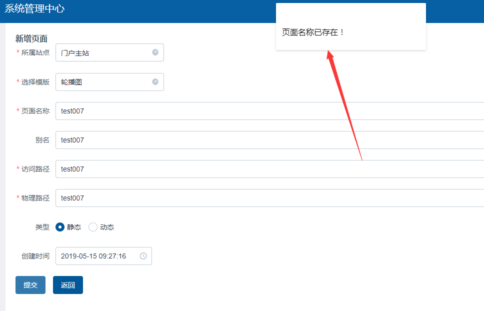

## 十八、异常处理-不可预知异常处理

### 1、ExceptionCatch.java

```java
//使用EXCEPTIONS存放异常类型和错误代码的映射，ImmutableMap的特点的一旦创建不可改变，并且线程安全
private static ImmutableMap<Class<? extends Throwable>,ResultCode> EXCEPTIONS;

//使用builder来构建一个异常类型和错误代码的异常
protected static ImmutableMap.Builder<Class<? extends Throwable>,ResultCode> builder = ImmutableMap.builder();

static{
    //在这里加入一些基础的异常类型判断
    builder.put(HttpMessageNotReadableException.class,CommonCode.INVALID_PARAM);
}

//捕获Exception异常
@ResponseBody
@ExceptionHandler(Exception.class)
public ResponseResult exception(Exception e) {
    LOGGER.error("catch exception : {} \r\n exception: ",e.getMessage(), e);
    if(EXCEPTIONS == null) {
        EXCEPTIONS = builder.build(); // EXCEPTIONS构建完毕
    }
    // 从EXCEPTIONS中寻找异常类型对应的错误代码，如果找到了将错误代码响应给用户，如果找不到就返回给用户9999
    final ResultCode resultCode = EXCEPTIONS.get(e.getClass());

    if (resultCode != null) {
        return new ResponseResult(resultCode);
    } else {
        return new ResponseResult(CommonCode.SERVER_ERROR);
    }
}		
```

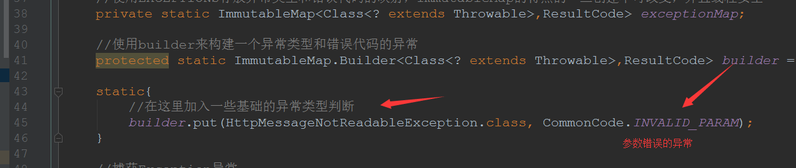

### 2、CommonCode.java

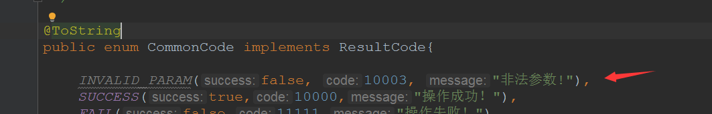

```java
@ToString
public enum CommonCode implements ResultCode{

    INVALID_PARAM(false,10003,"非法参数！"),
}
```

### 3、测试效果

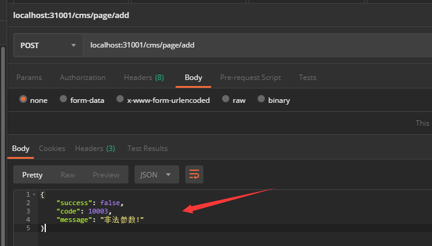


