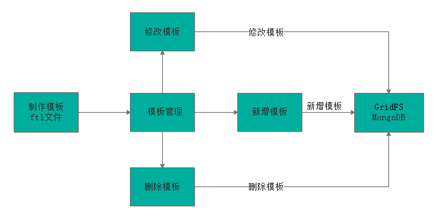

# 页面静态化

## 一、页面静态化需求分析 

1、为什么要进行页面管理？
本项目cms系统的功能就是根据运营需要，对门户等子系统的部分页面进行管理，从而实现快速根据用户需求修改
页面内容并上线的需求。

2、如何修改页面的内容？
在开发中修改页面内容是需要人工编写html及JS文件，CMS系统是通过程序自动化的对页面内容进行修改，通过
页面静态化技术生成html页面。

3、如何对页面进行静态化？
一个页面等于模板加数据，在添加页面的时候我们选择了页面的模板。
**页面静态化就是将页面模板和数据通过技术手段将二者合二为一，生成一个html网页文件**(自动生成)。

4、页面静态化及页面发布流程图如下：


业务流程如下：

1、获取模型数据
2、制作模板
3、对页面进行静态化
4、将静态化生成的html页面存放文件系统中
5、将存放在文件系统的html文件发布到服务器


## 二、freemarker介绍

​	FreeMarker是一款模板引擎： 即一种基于模板和要改变的数据，	并用来生成输出文本（HTML网页、电子邮件、配置文件、源代码等）的通用工具。	它不是面向最终用户的，而是一个Java类库，是一款程序员可以嵌入他们所开发产品的组件。
​	FreeMarker是免费的，基于Apache许可证2.0版本发布。其模板编写为FreeMarker Template  Language（FTL），属于简单、专用的语言。需要准备数据在真实编程语言中来显示，比如数据库查询和业务运算，之后模板显示已经准备好的数据。在模板中，主要用于如何展现数据，	而在模板之外注意于要展示什么数据 [1]  。


Thymeleaf

如果是freemaker或者jsp,一旦加入了表达式,就无法双击预览效果

Thymeleaf会保留插值表达式和原始的测试数据,那么双击可以直接预览曾经美工提供给大家的效果

```html
<html>
	${msg}
	<table>
		<tr>
		</tr>
	</table>
</html>
```

## 三、freemarker测试环境搭建

### 1、项目结构


pom.xml

```xml
<?xml version="1.0" encoding="UTF-8"?>
<project xmlns="http://maven.apache.org/POM/4.0.0"
         xmlns:xsi="http://www.w3.org/2001/XMLSchema-instance"
         xsi:schemaLocation="http://maven.apache.org/POM/4.0.0 http://maven.apache.org/xsd/maven-4.0.0.xsd">

    <parent>
        <artifactId>xc-framework-parent</artifactId>
        <groupId>com.xuecheng</groupId>
        <version>1.0-SNAPSHOT</version>
        <relativePath>../xc-framework-parent/pom.xml</relativePath>
    </parent>
    <modelVersion>4.0.0</modelVersion>

    <artifactId>test-freemarker</artifactId>


    <dependencies>
        <dependency>
            <groupId>org.springframework.boot</groupId>
            <artifactId>spring-boot-starter-web</artifactId>
        </dependency>
        <dependency>
            <groupId>org.springframework.boot</groupId>
            <artifactId>spring-boot-starter-freemarker</artifactId>
        </dependency>
        <dependency>
            <groupId>org.projectlombok</groupId>
            <artifactId>lombok</artifactId>
        </dependency>
        <dependency>
            <groupId>com.squareup.okhttp3</groupId>
            <artifactId>okhttp</artifactId>
        </dependency>
        <dependency>
            <groupId>org.apache.commons</groupId>
            <artifactId>commons-io</artifactId>
        </dependency>
        <dependency>
            <groupId>org.springframework.boot</groupId>
            <artifactId>spring-boot-starter-test</artifactId>
        </dependency>

    </dependencies>
</project>
```

### 2、application.yml

配置端口和缓存关闭

```yaml
server:
  port: 8088 #服务端口

spring:
  application:
    name: test‐freemarker #指定服务名
  freemarker:
    cache: false #关闭模板缓存，方便测试
    settings:
      template_update_delay: 0 #检查模板更新延迟时间，设置为0表示立即检查，如果时间大于0会有缓存不方便进行模板测试
```

### 3、FreemarkerTestApplication.java

```java
package com.xuecheng.test.freemarker;

@SpringBootApplication
public class FreemarkerTestApplication {
    public static void main(String[] args) {
        SpringApplication.run(FreemarkerTestApplication.class,args);
    }
    //远程调用
    @Bean
    public RestTemplate restTemplate() {
        return new RestTemplate(new OkHttp3ClientHttpRequestFactory());
    }
}
```

### 4、Student.java

```java
package com.xuecheng.test.freemarker.model;

@Data
@ToString
public class Student {
    private String name;//姓名
    private int age;//年龄
    private Date birthday;//生日
    private Float money;//钱包
    private List<Student> friends;//朋友列表
    private Student bestFriend;//最好的朋友
}
```

### 5、test1.ftl

编写freemarker模板引擎。

```html
<!DOCTYPE html>
<html>
<head>
    <meta charset="utf‐8">
    <title>Hello World!</title>
</head>
<body>
    Hello ${name}!
</body>
</html>
```

### 6、FreemarkerController.java

```java
@RequestMapping("/freemarker")
@Controller
public class FreemarkerController {

    @Autowired
    RestTemplate restTemplate;

    @RequestMapping("/test1")
    public String freemarker(Map<String, Object> map) {
        map.put("name", "zxzxin鑫");
        //返回模板文件名称   返回freemarker模板的位置，基于resources/templates
        return "test1"; // 试图，默认去templates/name.ftl下面找
    }
}
```

### 7、测试效果


## 四、freemarker基础-基础语法种类

1、注释，即<#‐‐和‐‐>，介于其之间的内容会被freemarker忽略
2、插值（Interpolation）：即`${..}`部分,freemarker会用真实的值代替`${..}`
3、FTL指令：和HTML标记类似，名字前加#予以区分，Freemarker会解析标签中的表达式或逻辑。
4、文本，仅文本信息，这些不是freemarker的注释、插值、FTL指令的内容会被freemarker忽略解析，直接输出内容

## 五、freemarker基础-List指令

```java
@RequestMapping("/freemarker")
@Controller
public class FreemarkerController {
    @Autowired
    RestTemplate restTemplate;

    @RequestMapping("/test1")
    public String freemarker(Map<String, Object> map){
        map.put("name","黑马程序员");

        Student stu1 = new Student();
        stu1.setName("小明");
        stu1.setAge(18);
        stu1.setMoney(1000.86f);
        stu1.setBirthday(new Date());
        Student stu2 = new Student();
        stu2.setName("小红");
        stu2.setMoney(200.1f);
        stu2.setAge(19);
        // stu2.setBirthday(new Date());
        // 朋友列表
        List<Student> friends = new ArrayList<>();
        friends.add(stu1);
        // 给stu2设置朋友列表
        stu2.setFriends(friends);
        // 给stu2设置最好的朋友
        stu2.setBestFriend(stu1);

        List<Student> stus = new ArrayList<>();
        stus.add(stu1);
        stus.add(stu2);
        //向数据模型放数据
        map.put("stus",stus);
        //准备map数据
        HashMap<String,Student> stuMap = new HashMap<>();
        stuMap.put("stu1",stu1);
        stuMap.put("stu2",stu2);
        //向数据模型放数据
        map.put("stu1",stu1);
        //向数据模型放数据
        map.put("stuMap",stuMap);
        //返回模板文件名称
        return "test1";
    }
}
```


```html
遍历数据模型中的list学生信息

<table border="1">
    <tr>
        <td>序号</td>
        <td>姓名</td>
        <td>年龄</td>
        <td>钱包</td>
    </tr>


    <#list stus as stu>
        <tr>
            <td>${stu_index + 1}</td>
            <td>${stu.name}</td>
            <td>${stu.age}</td>
            <td>${stu.money}</td>
        </tr>
        </#list>
</table>
```

`_index`：得到循环的下标，使用方法是在stu后边加`"_index"`，它的值是从0开始

## 六、freemarker基础-遍历map数据

```html
<!--遍历Map信息-->
遍历map信息：
<hr/>
输出stu1的学生信息(数组形式)：<br/>
姓名：${stuMap['stu1'].name}<br/>
年龄：${stuMap['stu1'].age}<br/>

<hr/>
输出stu1的学生信息(对象形式)：<br/>
姓名：${stuMap.stu1.name}<br/>
年龄：${stuMap.stu1.age}<br/>

<hr/>

遍历输出两个学生信息：<br/>
<table border="1">
    <tr>
        <td>序号</td>
        <td>姓名</td>
        <td>年龄</td>
        <td>钱包</td>
    </tr>
    <#list stuMap?keys as k> <!--里面包含了stu1和stu2-->
        <tr>
            <td>${k_index + 1}</td>
            <td>${stuMap[k].name}</td>
            <td>${stuMap[k].age}</td>
            <td>${stuMap[k].money}</td>
        </tr>
    </#list>
</table>
```

测试:


## 七、freemarker基础-if指令


```html
<#list stus as stu>
    <tr>
        <td>${stu_index + 1}</td>
        <td <#if stu.name =='小明'>style="background:red;"</#if>>${stu.name}</td>
    	<td>${stu.age}</td>
    	<td <#if (stu.money>300) >style="background:red;"</#if>>${stu.money}</td>
    </tr>
</#list>
```


## 八、freemarker基础-空值处理

判断某变量是否存在使用 `“??”` 用法为:`variable??`,如果该变量存在,返回true,否则返回false

```html
<#if stus??>
    <#list stus as stu>
        <tr>
            <td>${stu_index + 1}</td>
            <td <#if stu.name =='小明'>style="background:red;"</#if>>${stu.name}</td>
			<td>${stu.age}</td>
			<td <#if (stu.money>300) >style="background:red;"</#if>>${stu.money}				</td>
		</tr>
	</#list>
</#if>
```

2、缺失变量默认值使用 “!” 使用!要以指定一个默认值，当变量为空时显示默认值。
例： `${name!''}`表示如果name为空显示空字符串。
如果是嵌套对象则建议使用（）括起来。  

例： `${(stu.bestFriend.name)!''}`表示，如果stu或bestFriend或name为空默认显示空字符串。

```html
${(stu.bestFriend.name)!'我是空值'}<br/>
${(stu.bestFriend.name)!''}
${(stu.bestFriend.name)!}
```


## 九、freemarker基础-内建函数

内建函数语法格式： 变量+?+函数名称
1、和到某个集合的大小
${集合名?size}
2、日期格式化

3、内建函数c
map.put("point", 102920122); 
point是数字型，使用${point}会显示这个数字的值，不并每三位使用逗号分隔。
如果不想显示为每三位分隔的数字，可以使用c函数将数字型转成字符串输出
${point?c}
4、将json字符串转成对象

一个例子：
其中用到了 assign标签，assign的作用是定义一个变量。

```html
<#assign text="{'bank':'工商银行','account':'10101920201920212'}" />
<#assign data=text?eval />
开户行：${data.bank} 账号：${data.account}
```

## 十、freemarker静态化测试-基于模板文件静态化

```java
@SpringBootTest
@RunWith(SpringRunner.class)
public class GenerateHtmlTest {

    //基于模板生成静态化文件
    @Test
    public void testGenerateHtml() throws IOException, TemplateException {
        //创建配置类
        Configuration configuration = new Configuration(Configuration.getVersion());

        //设置模板路径
        String classpath = this.getClass().getResource("/").getPath();
        configuration.setDirectoryForTemplateLoading(new File(classpath + "/templates/"));
        //设置字符集
        configuration.setDefaultEncoding("utf-8");
        //加载模板
        Template template = configuration.getTemplate("test1.ftl");
        //数据模型
//        Map<String, Object> map = new HashMap<>();
//        map.put("name", "zxzxin鑫");
        Map map = getMap();
        //静态化
        String content = FreeMarkerTemplateUtils.processTemplateIntoString(template, map);
        //静态化内容
        System.out.println(content);
        InputStream inputStream = IOUtils.toInputStream(content);
        //输出文件
        FileOutputStream fileOutputStream = new FileOutputStream(new File("D:/test1.html"));

        int copy = IOUtils.copy(inputStream, fileOutputStream);
    }


    // 数据模型
    public Map getMap(){
        Map map = new HashMap<>();
        map.put("name", "zxzxin鑫");


        Student stu1 = new Student();
        stu1.setName("小明");
        stu1.setAge(18);
        stu1.setMoney(1000.86f);
        stu1.setBirthday(new Date());

        Student stu2 = new Student();
        stu2.setName("小红");
        stu2.setMoney(200.1f);
        stu2.setAge(19);

        List<Student> stus = new ArrayList<>();
        stus.add(stu1);
        stus.add(stu2);
        //向数据模型放数据
        map.put("stus", stus);

        // stu2.setBirthday(new Date());
        // 朋友列表
        List<Student> friends = new ArrayList<>();
        friends.add(stu1);

        // 给stu2设置朋友列表
        stu2.setFriends(friends);
        // 给stu2设置最好的朋友
        stu2.setBestFriend(stu1);

        //准备map数据
        HashMap<String, Student> stuMap = new HashMap<>();
        stuMap.put("stu1", stu1);
        stuMap.put("stu2", stu2);

        //向数据模型放数据
        map.put("stu1", stu1);
        //向数据模型放数据
        map.put("stuMap", stuMap);

        return map;
    }
}
```

注意这里测试下的`resources`也要在`test/java`下


## 十一、freemarker静态化测试-基于模板字符串静态化

上面是通过具体的一个文件，下面是通过一个字符串来生成。

```java
//基于模板字符串生成静态化文件
@Test
public void testGenerateHtmlByString() throws IOException, TemplateException {
    //创建配置类
    Configuration configuration=new Configuration(Configuration.getVersion());
    //模板内容，这里测试时使用简单的字符串作为模板
    String templateString="" +
    "<html>\n" +
    " <head></head>\n" +
    " <body>\n" +
    " 名称：${name}\n" +
    " </body>\n" +
    "</html>";
    //模板加载器
    StringTemplateLoader stringTemplateLoader = new StringTemplateLoader();
    stringTemplateLoader.putTemplate("template",templateString);
    configuration.setTemplateLoader(stringTemplateLoader);
    //得到模板
    Template template = configuration.getTemplate("template","utf-8");
    //数据模型
    Map<String,Object> map = new HashMap<>();
    map.put("name","zxzxin鑫");
    //静态化
    String content = FreeMarkerTemplateUtils.processTemplateIntoString(template, map);
    //静态化内容
    System.out.println(content);
    InputStream inputStream = IOUtils.toInputStream(content);
    //输出文件
    FileOutputStream fileOutputStream = new FileOutputStream(new File("d:/test1.html"));
    IOUtils.copy(inputStream, fileOutputStream);
}
```

## 十二、页面静态化-页面静态化流程

通过对FreeMarker的研究我们得出：

​	模板+数据模型=输出，

页面静态化需要准备数据模型和模板，先知道数据模型的结构才可以编写模板，因为在模板中要引用数据模型中的数据，本节将系统讲解CMS页面数据模型获取、模板管理及静态化的过程。

下边讨论一个问题：如何获取页面的数据模型？

CMS管理了各种页面，CMS对页面进行静态化时需要数据模型，但是CMS并不知道每个页面的数据模型的具体内容，它只管执行静态化程序便可对页面进行静态化，所以CMS静态化程序需要通过一种通用的方法来获取数据模型。
在编辑页面信息时指定一个DataUrl，此DataUrl便是获取数据模型的Url，它基于Http方式，CMS对页面进行静态化时会从页面信息中读取DataUrl，通过Http远程调用的方法请求DataUrl获取数据模型。
管理员怎么知道DataUrl的内容呢？
举例说明：
此页面是轮播图页面，它的DataUrl由开发轮播图管理的程序员提供。
此页面是精品课程推荐页面，它的DataUrl由精品课程推荐的程序员提供。
此页面是课程详情页面，它的DataUrl由课程管理的程序员提供。

**页面静态化流程如下图**：
1、静态化程序首先读取页面获取DataUrl。
2、静态化程序远程请求DataUrl得到数据模型。
3、获取页面模板。
4、执行页面静态化。


## 十三、页面静态化-数据模型-轮播图DataUrl接口


### 1、根据mongodb中的数据我们可以分析出

1.  cms_config中的每条记录都是一类相关的配置

2. cms_config中的model是一个集合，里边包含了key、name、value等字段

3. 通过此信息推导出POJO，当然下面2个PO类已经提供好了

4. 接下来开发步骤为：

   开发API接口

   开发Dao

   开发Service

   开发Controller

### 2、CmsConfigModel.java

```java
@Data
@ToString
public class CmsConfigModel {
    private String key;
    private String name;
    private String url;
    private Map mapValue;
    private String value;
}
```

### 3、CmsConfig.java

```java
@Data
@ToString
@Document(collection = "cms_config")
public class CmsConfig {

    @Id
    private String id;
    private String name;
    private List<CmsConfigModel> model;

}
```


### 4、CmsConfigControllerApi.java

```java
@Api(value = "cms配置管理接口", tags = "cms配置管理接口，提供数据模型的管理、查询接口")
public interface CmsConfigControllerApi {

    @ApiOperation("根据id查询CMS配置信息")
    CmsConfig getModel(String id);
}

```

### 5、CmsConfigRepository.java

```java
public interface CmsConfigRepository extends MongoRepository<CmsConfig,String> {
}
```

### 6、CmsConfigService.java

```java
@Service
public class CmsConfigService {
    @Autowired
    CmsConfigRepository cmsConfigRepository;
    //根据id查询配置管理信息
    public CmsConfig getConfigById(String id){
        Optional<CmsConfig> optional = cmsConfigRepository.findById(id);
        if(optional.isPresent()){
            CmsConfig cmsConfig = optional.get();
            return cmsConfig;
        }
        return null;
    }
}
```

### 7、CmsConfigController.java

```java
@RestController
@RequestMapping("/cms/config")
public class CmsConfigController implements CmsConfigControllerApi {

    @Autowired
    CmsConfigService cmsConfigService;

    /**
     * 根据cms_config中的id获取CmsConfig信息
     * @param id    
     * @return
     */
    @Override
    @GetMapping("/getmodel/{id}")
    public CmsConfig getModel(@PathVariable("id") String id) {
        return cmsConfigService.getConfigById(id);
    }
}
```

### 8、测试我们写好的接口

标红的url正式我们提供的获取轮播图数据的接口地址


## 十四、页面静态化-数据模型-远程请求接口

SpringMVC提供 RestTemplate请求http接口，RestTemplate的底层可以使用第三方的http客户端工具实现http 的请求，常用的http客户端工具有Apache HttpClient、OkHttpClient等，本项目使用OkHttpClient完成http请求，原因也是因为它的性能比较出众。

### 1、添加依赖

```xml
<dependency>
    <groupId>com.squareup.okhttp3</groupId>
    <artifactId>okhttp</artifactId>
</dependency>
```

### 2、配置RestTemplate

在SpringBoot启动类中配置 RestTemplate

```java
@SpringBootApplication
@EntityScan("com.xuecheng.framework.domain.cms")//扫描实体类
@ComponentScan(basePackages={"com.xuecheng.api"})//扫描接口
@ComponentScan(basePackages={"com.xuecheng.framework"})//扫描common包下的类
@ComponentScan(basePackages={"com.xuecheng.manage_cms"})//扫描本项目下的所有类
public class ManageCmsApplication {
    public static void main(String[] args) {
        SpringApplication.run(ManageCmsApplication.class,args);
    }
    
    @Bean
    public RestTemplate restTemplate() {
        return new RestTemplate(new OkHttp3ClientHttpRequestFactory());
    }
}
```

### 3、测试RestTemplate

根据url获取数据，并转为map格式。

```java
@SpringBootTest
@RunWith(SpringRunner.class)
public class RestTemplateTest {

    @Autowired
    RestTemplate restTemplate;

    @Test
    public void testRestTemplate(){
        ResponseEntity<Map> forEntity = restTemplate.getForEntity("http://localhost:31001/cms/config/getmodel/5a791725dd573c3574ee333f", Map.class);
        Map body = forEntity.getBody();
        System.out.println(body);
    }

}
```


## 十五、页面静态化-模板管理-模板管理业务流程



1、要增加新模板首先需要制作模板，模板的内容就是Freemarker ftl模板内容。
2、通过模板管理模块功能新增模板、修改模板、删除模板。
3、模板信息存储在MongoDB数据库，**其中模板信息存储在cms_template集合中，模板文件存储在GridFS文件系**
**统中**。

cms_template集合：
下边是一个模板的例子：

```json
{
    "_id" : ObjectId("5a962b52b00ffc514038faf7"),
    "_class" : "com.xuecheng.framework.domain.cms.CmsTemplate",
    "siteId" : "5a751fab6abb5044e0d19ea1",
    "templateName" : "首页",
    "templateParameter" : "",
    "templateFileId" : "5a962b52b00ffc514038faf5"
}
```

上边模板信息中templateFileId是模板文件的ID，此ID对应GridFS文件系统中文件ID。

## 十六、页面静态化-模板管理-模板制作

在 `index_banner.html`中加上 一些域名，然后启动nginx访问一下。


下面开始造模板，直接拷贝前端门户工程`xc-ui-pc-static-portal`下`include/index_banner.html`拷贝到`testfreemarker`工程下的`templates`目录下。

### 1、index_banner.ftl

```html
<!DOCTYPE html>
<html lang="en">
<head>
    <meta charset="UTF-8">
    <title>Title</title>
    <link rel="stylesheet" href="http://www.xuecheng.com/plugins/normalize-css/normalize.css" />
    <link rel="stylesheet" href="http://www.xuecheng.com/plugins/bootstrap/dist/css/bootstrap.css" />
    <link rel="stylesheet" href="http://www.xuecheng.com/css/page-learing-index.css" />
    <link rel="stylesheet" href="http://www.xuecheng.com/css/page-header.css" />
</head>
<body>
<div class="banner-roll">
    <div class="banner-item">
        <#if model??>
            <#list model as item>
                <div class="item" style="background-image: url(${item.value});"></div>
            </#list>
        </#if>
    </div>
    <div class="indicators"></div>
</div>
<script type="text/javascript" src="http://www.xuecheng.com/plugins/jquery/dist/jquery.js"></script>
<script type="text/javascript" src="http://www.xuecheng.com/plugins/bootstrap/dist/js/bootstrap.js"></script>
<script type="text/javascript">
    var tg = $('.banner-item .item');
    var num = 0;
    for (i = 0; i < tg.length; i++) {
        $('.indicators').append('<span></span>');
        $('.indicators').find('span').eq(num).addClass('active');
    }

    function roll() {
        tg.eq(num).animate({
            'opacity': '1',
            'z-index': num
        }, 1000).siblings().animate({
            'opacity': '0',
            'z-index': 0
        }, 1000);
        $('.indicators').find('span').eq(num).addClass('active').siblings().removeClass('active');
        if (num >= tg.length - 1) {
            num = 0;
        } else {
            num++;
        }
    }
    $('.indicators').find('span').click(function() {
        num = $(this).index();
        roll();
    });
    var timer = setInterval(roll, 3000);
    $('.banner-item').mouseover(function() {
        clearInterval(timer)
    });
    $('.banner-item').mouseout(function() {
        timer = setInterval(roll, 3000)
    });
</script>
</body>
</html>
```


### 3、FreemarkerController.java

增加一个测试轮播图的方法:

```java

@RequestMapping("/freemarker")
@Controller
public class FreemarkerController {
    @Autowired
    RestTemplate restTemplate;

    @RequestMapping("/banner")
    public String index_banner(Map<String, Object> map){
        String dataUrl = "http://localhost:31001/cms/config/getmodel/5a791725dd573c3574ee333f";
        ResponseEntity<Map> forEntity = restTemplate.getForEntity(dataUrl, Map.class);
        Map body = forEntity.getBody();
        map.putAll(body);
        return "index_banner";
    }
}

```

注意数据库的数据要修改正确:


## 十七、页面静态化-模板管理-GridFS研究-存文件

### 1、GridFS简介

GridFS是MongoDB提供的用于持久化存储文件的模块，CMS使用MongoDB存储数据，使用GridFS可以快速集成
开发。
它的工作原理是：
在GridFS存储文件是将文件分块存储，文件会按照256KB的大小分割成多个块进行存储，GridFS使用两个集合
（collection）存储文件，一个集合是chunks, 用于存储文件的二进制数据；一个集合是files，用于存储文件的元数据信息（文件名称、块大小、上传时间等信息）。
从GridFS中读取文件要对文件的各各块进行组装、合并。
详细参考：https://docs.mongodb.com/manual/core/gridfs/

### 2、GridFSTest.java

```java
@SpringBootTest
@RunWith(SpringRunner.class)
public class GridFsTest {

    @Autowired
    GridFsTemplate gridFsTemplate;

    //存文件
    @Test
    public void testSaveFile() throws FileNotFoundException {
        //要存储的文件
        File file = new File("D:/xcEduService01/test-freemarker/src/main/resources/templates/index_banner.ftl");
        //定义输入流
        FileInputStream inputStream = new FileInputStream(file);
        //向GridFS存储文件
        ObjectId objectId = gridFsTemplate.store(inputStream, "轮播图测试文件01", "");
        //得到文件ID
        String fileId = objectId.toString();
        System.out.println(file);
    }
}

```


## 十八、页面静态化-模板管理-GridFS研究-取文件

取文件需要一个`GridFSBucket`配置。

### 1、MongoConfig.java

```java
package com.xuecheng.manage_cms.config;


@Configuration
public class MongoConfig {

    // org.springframework.beans.factory.annotation.Value;
    @Value("${spring.data.mongodb.database}")
    String db;

    @Bean
    public GridFSBucket getGridFSBucket(MongoClient mongoClient){
        MongoDatabase database = mongoClient.getDatabase(db);
        GridFSBucket bucket = GridFSBuckets.create(database);
        return bucket;
    }
}


```

### 2、GridFSTest.java

```java
@SpringBootTest
@RunWith(SpringRunner.class)
public class GridFsTest {

    @Autowired
    GridFsTemplate gridFsTemplate;

    @Autowired
    GridFSBucket gridFSBucket;

    @Test
    public void queryFile() throws IOException {
        String fileId = "5cdd19e04dee6c24740c820c";//上面我们save产生的_id
        //根据id查询文件
        GridFSFile gridFSFile = gridFsTemplate.findOne(Query.query(Criteria.where("_id").is(fileId)));
        //打开下载流对象
        GridFSDownloadStream gridFSDownloadStream = gridFSBucket.openDownloadStream(gridFSFile.getObjectId());
        //创建gridFsResource，用于获取流对象
        GridFsResource gridFsResource = new GridFsResource(gridFSFile, gridFSDownloadStream);
        //获取流中的数据
        String s = IOUtils.toString(gridFsResource.getInputStream(), "UTF-8");
        System.out.println(s);
    }


    //删除文件
    @Test
    public void testDelFile() throws IOException {
        //根据文件id删除fs.files和fs.chunks中的记录
        gridFsTemplate.delete(Query.query(Criteria.where("_id").is("5b32480ed3a022164c4d2f92")));
    }
}

```

测试:`queryFile`输出：


## 十九、页面静态化-模板管理-模板存储

手工添加模板内容。


手动把下面信息存储到cms_template中，注意修改templateFileId的值为上节存入到gridfs中的文件id

```json
{ 
    "_class" : "com.xuecheng.framework.domain.cms.CmsTemplate", 
    "siteId" : "5a751fab6abb5044e0d19ea1", 
    "templateName" : "轮播图test005", 
    "templateParameter" : "", 
    "templateFileId" : "修改为保存到fs.files的_id"
}
```

## 二十、页面静态化-静态化测试-填写页面DataUrl

在`PageService`中添加一句新的代码。


## 二十一、页面静态化-静态化测试-静态化程序编写

### 1、CmsCode.java

添加一个枚举，下面会用到。

```java
CMS_PAGE_NOTEXISTS(false,24006,"页面不存在！"),
```


### 2、CmsTemplateRepository.java

```java
package com.xuecheng.manage_cms.dao;

public interface CmsTemplateRepository extends MongoRepository<CmsTemplate,String> {
}

```

### 3、PageService.java

比较长，步骤:

 页面静态化
*   1、获取页面模型数据
*   2、获取页面模板
*   3、执行静态化

```java
package com.xuecheng.manage_cms.service;

@Service
public class PageService {


    @Autowired
    CmsPageRepository cmsPageRepository;

    @Autowired
    CmsConfigRepository cmsConfigRepository;

    @Autowired
    RestTemplate restTemplate;

    @Autowired
    CmsTemplateRepository cmsTemplateRepository;

    @Autowired
    GridFsTemplate gridFsTemplate;

    @Autowired
    GridFSBucket gridFSBucket;

       /**
     *  页面静态化
     *     1、获取页面模型数据
     *     2、获取页面模板
     *     3、执行静态化
     */
    public String getPageHtml(String pageId) {
        //1. 获取页面模型数据
        Map model = this.getModelByPageId(pageId);
        if (model == null) {
            //获取页面模型数据为空
            ExceptionCast.cast(CmsCode.CMS_GENERATEHTML_DATAISNULL);
        }
        //2. 获取页面模板
        String templateContent = getTemplateByPageId(pageId);
        if (StringUtils.isEmpty(templateContent)) {
            //页面模板为空
            ExceptionCast.cast(CmsCode.CMS_GENERATEHTML_TEMPLATEISNULL);
        }
        //3. 执行静态化, 需要传入页面模型数据和模板
        String html = generateHtml(templateContent, model);
        if (StringUtils.isEmpty(html)) {
            ExceptionCast.cast(CmsCode.CMS_GENERATEHTML_HTMLISNULL);
        }
        return html;
    }

    //1、获取页面模型数据
    public Map getModelByPageId(String pageId) {
        //查询页面信息
        CmsPage cmsPage = this.getById(pageId);
        if (cmsPage == null) {
            //页面不存在
            ExceptionCast.cast(CmsCode.CMS_PAGE_NOTEXISTS);
        }
        //取出dataUrl
        String dataUrl = cmsPage.getDataUrl();
        if (StringUtils.isEmpty(dataUrl)) {
            ExceptionCast.cast(CmsCode.CMS_GENERATEHTML_DATAURLISNULL);
        }
        // 远程调用  这个就是testfreemarker下测试 banner使用那个数据dataUrl的时候
        ResponseEntity<Map> forEntity = restTemplate.getForEntity(dataUrl, Map.class);
        Map body = forEntity.getBody();
        return body;
    }

    //2、获取页面模板
    public String getTemplateByPageId(String pageId) {
        //查询页面信息
        CmsPage cmsPage = this.getById(pageId);
        if (cmsPage == null) {
            //页面不存在
            ExceptionCast.cast(CmsCode.CMS_PAGE_NOTEXISTS);
        }
        //页面模板
        String templateId = cmsPage.getTemplateId();
        if (StringUtils.isEmpty(templateId)) {
            //页面模板为空
            ExceptionCast.cast(CmsCode.CMS_GENERATEHTML_TEMPLATEISNULL);
        }
        Optional<CmsTemplate> optional = cmsTemplateRepository.findById(templateId);
        if (optional.isPresent()) {
            CmsTemplate cmsTemplate = optional.get();
            //模板文件id
            String templateFileId = cmsTemplate.getTemplateFileId();
            //从GridFS中取出模板文件内容
            GridFSFile gridFSFile =
                    gridFsTemplate.findOne(Query.query(Criteria.where("_id").is(templateFileId)));
            //打开下载流对象
            GridFSDownloadStream gridFSDownloadStream =
                    gridFSBucket.openDownloadStream(gridFSFile.getObjectId());
            //创建GridFsResource
            GridFsResource gridFsResource = new GridFsResource(gridFSFile, gridFSDownloadStream);
            try {
                String content = IOUtils.toString(gridFsResource.getInputStream(), "utf-8");
                return content;
            } catch (IOException e) {
                e.printStackTrace();
            }
        }
        return null;
    }

    //3、页面静态化
    public String generateHtml(String template, Map model) {
        try {
            //生成配置类
            Configuration configuration = new Configuration(Configuration.getVersion());
            //模板加载器
            StringTemplateLoader stringTemplateLoader = new StringTemplateLoader();
            stringTemplateLoader.putTemplate("template", template);
            //配置模板加载器
            configuration.setTemplateLoader(stringTemplateLoader);
            //获取模板
            Template template1 = configuration.getTemplate("template");
            String html = FreeMarkerTemplateUtils.processTemplateIntoString(template1, model);
            return html;
        } catch (Exception e) {
            e.printStackTrace();
        }
        return null;
    }
}

```

## 二十二、页面静态化-静态化测试-静态化程序测试

```java
@SpringBootTest
@RunWith(SpringRunner.class)
public class PageServiceTest {

    @Autowired
    PageService pageService;

    @Test
    public void testGetPageHtml(){

        // 5cdac28e4dee6c23e82875ed
//        String pageHtml = pageService.getPageHtml("5bf02330e6562553c8888950");

        String pageHtml = pageService.getPageHtml("5cdac28e4dee6c23e82875ed");

        System.out.println(pageHtml);
    }
}
```

前端配置: `cms_template`的id以及和`fs.file`的id(对应`cms_template`的`templateFileId`):


测试传入`cms_page`里面的`pageId`


## 二十三、页面预览-页面预览开发

页面在发布前增加页面预览的步骤，方便用户检查页面内容是否正确。页面预览的流程如下：


1、用户进入cms前端，点击“页面预览”在浏览器请求cms页面预览链接。
2、cms根据页面id查询DataUrl并远程请求DataUrl获取数据模型。
3、cms根据页面id查询页面模板内容
4、cms执行页面静态化。

5、cms将静态化内容响应给浏览器。

6、在浏览器展示页面内容，实现页面预览的功能。

一个`freemarkder`的缓存配置：


### 1、CmsPagePreviewController.java

```java
@Controller
public class CmsPagePreviewController extends BaseController {
    
    @Autowired
    PageService pageService;

    /**
     * 接收到页面id
     * @param pageId
     */
    @RequestMapping(value="/cms/preview/{pageId}",method = RequestMethod.GET)
    public void preview(@PathVariable("pageId")String pageId){
        String pageHtml = pageService.getPageHtml(pageId);
        if(StringUtils.isNotEmpty(pageHtml)){
            try {
                ServletOutputStream outputStream = response.getOutputStream();
                outputStream.write(pageHtml.getBytes("utf-8"));
            } catch (IOException e) {
                e.printStackTrace();
            }
        }
    }
}
```

http://localhost:31001/cms/preview/5cdac28e4dee6c23e82875ed


## 二十四、页面预览-页面预览测试

### 1、配置Nginx

```json
#cms页面预览
upstream cms_server_pool{
    server 127.0.0.1:31001 weight=10;
}
server{
    listen       80;
    server_name  www.xuecheng.com;
    ssi on;
    ssi_silent_errors on;
    location / {
    alias   D:/xcEduUI01/xc-ui-pc-static-portal/;
    index  index.html;
}

#页面预览
location /cms/preview/ {
    proxy_pass http://cms_server_pool/cms/preview/;
}
}

```


通过域名访问: http://www.xuecheng.com/cms/preview/5cdac28e4dee6c23e82875ed


### 2、page_list.vue添加页面预览按钮


```html
<el-button @click="preview(page.row.pageId)" type="text" size="small">页面预览</el-button>
```

### 3、添加预览点击事件


```js
//页面预览
preview:function (pageId){
    window.open("http://www.xuecheng.com/cms/preview/"+pageId)
}
```

### 4、效果


