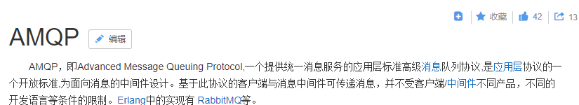
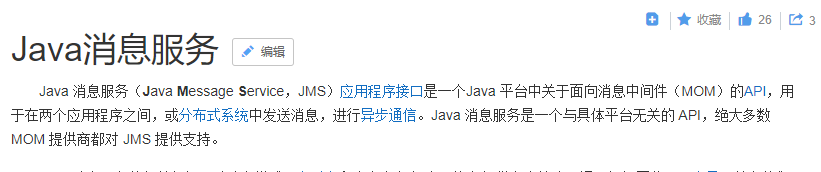

# 消息中间件RabbitMQ

## 一、页面发布-需求分析


业务流程如下：
1、管理员进入管理界面点击“页面发布”，前端请求cms页面发布接口。
2、cms页面发布接口执行页面静态化，并将静态化页面(html文件)存储至GridFS中。
3、静态化成功后，向消息队列发送页面发布的消息。
页面发布的最终目标是将页面发布到服务器。
通过消息队列将页面发布的消息发送给各各服务器。
3、消息队列负责将消息发送给各各服务器上部署的Cms Client(Cms客户端)。
在服务器上部署Cms Client(Cms客户端)，客户端接收消息队列的通知。
4、每个接收到页面发布消息的Cms Client从GridFS获取Html页面文件，并将Html文件存储在本地服务器。
CmsClient根据页面发布消息的内容请求GridFS获取页面文件，存储在本地服务器。

## 二、RabbitMQ研究-RabbitMQ介绍

MQ全称为Message Queue，即消息队列， RabbitMQ是由erlang语言开发，基于AMQP（Advanced Message
Queue 高级消息队列协议）协议实现的消息队列，它是一种应用程序之间的通信方法，消息队列在分布式系统开
发中应用非常广泛。RabbitMQ官方地址：http://www.rabbitmq.com/

### 1、开发中消息队列通常有如下应用场景

1、任务异步处理。
将不需要同步处理的并且耗时长的操作由消息队列通知消息接收方进行异步处理。提高了应用程序的响应时间。
2、应用程序解耦合
MQ相当于一个中介，生产方通过MQ与消费方交互，它将应用程序进行解耦合。

### 2、市场上还有哪些消息队列？

ActiveMQ，RabbitMQ，ZeroMQ，Kafka，MetaMQ，RocketMQ、Redis。

### 3、为什么使用RabbitMQ呢？

1、使得简单，功能强大。
2、基于AMQP协议。
3、社区活跃，文档完善。
4、高并发性能好，这主要得益于Erlang语言。
5、Spring Boot默认已集成RabbitMQ

### 4、AMQP是什么 ？



总结：AMQP是一套公开的消息队列协议，最早在2003年被提出，它旨在从协议层定义消息通信数据的标准格式，为的就是解决MQ市场上协议不统一的问题。RabbitMQ就是遵循AMQP标准协议开发的MQ服务。
官方：http://www.amqp.org/

### 5、JMS是什么 ？



总结：
JMS是java提供的一套消息服务API标准，其目的是为所有的java应用程序提供统一的消息通信的标准，类似java的
jdbc，只要遵循jms标准的应用程序之间都可以进行消息通信。它和AMQP有什么 不同，jms是java语言专属的消
息服务标准，它是在api层定义标准，并且只能用于java应用；而AMQP是在协议层定义的标准，是跨语言的 。

## 三、RabbitMQ研究-工作原理


组成部分说明如下：
Broker：消息队列服务进程，此进程包括两个部分：Exchange和Queue。

Exchange：消息队列交换机，按一定的规则将消息路由转发到某个队列，对消息进行过虑。

Queue：消息队列，存储消息的队列，消息到达队列并转发给指定的消费方。

Producer：消息生产者，即生产方客户端，生产方客户端将消息发送到MQ。

Consumer：消息消费者，即消费方客户端，接收MQ转发的消息。

**消息发布接收流程**：

-----发送消息-----

1、**生产者和Broker建立TCP连接**。
2、生产者和Broker建立通道。
3、**生产者通过通道消息发送给Broker，由Exchange将消息进行转发**。
4、Exchange将消息转发到指定的Queue（队列）

----接收消息-----

1、消费者和Broker建立TCP连接
2、消费者和Broker建立通道
3、消费者监听指定的Queue（队列）
4、当有消息到达Queue时Broker默认将消息推送给消费者。
5、消费者接收到消息。

## 四、RabbitMQ研究-安装RabbitMQ

### 1、安装erlang

注意对应的版本


### 2、配置环境变量


### 3、启动rabbitmq管理界面


启动管理页面的插件:


### 4、重启RabbitMQ服务


### 5、登陆

http://localhost:15672/


## 五、RabbitMQ研究-入门程序-生产者


建立两个测试RabbitMQ的两个测试工程: `test-rabbitmq-producer`和`test-rabbitmq-consumer`。


这里导入包的时候有有版本问题，将`xc-framework-parent`的`SpringCloud`的版本更改即可:


顺便将那个`feign`过时的`pom`更新:


测试程序:

```java
// 生产者
public class Producer01 {

    private static final String QUEUE = "helloworld";

    public static void main(String[] args) {

        ConnectionFactory connectionFactory = new ConnectionFactory();
        connectionFactory.setHost("127.0.0.1");
        connectionFactory.setPort(5672);//端口
        connectionFactory.setUsername("guest");
        connectionFactory.setPassword("guest");
        //设置虚拟机，一个mq服务可以设置多个虚拟机，每个虚拟机就相当于一个独立的mq
        connectionFactory.setVirtualHost("/");

        Connection connection = null;
        Channel channel = null;
        try {
            //建立新连接
            connection = connectionFactory.newConnection();
            //创建会话通道,生产者和mq服务所有通信都在channel通道中完成
            channel = connection.createChannel();
            //声明队列: 如果队列在mq 中没有则要创建
            //参数：String queue, boolean durable, boolean exclusive, boolean autoDelete, Map<String, Object> arguments
            /**
             * 参数明细
             *   1、queue 队列名称
             *   2、durable 是否持久化，如果持久化，mq重启后队列还在
             *   3、exclusive 是否独占连接，队列只允许在该连接中访问，如果connection连接关闭队列则自动删除,如果将此参数设置true可用于临时队列的创建
             *   4、autoDelete 自动删除，队列不再使用时是否自动删除此队列，如果将此参数和exclusive参数设置为true就可以实现临时队列（队列不用了就自动删除）
             *   5、arguments 参数，可以设置一个队列的扩展参数，比如：可设置存活时间
             */
            channel.queueDeclare(QUEUE, true, false, false, null);
            //发送消息
            //参数：String exchange, String routingKey, BasicProperties props, byte[] body
            /**
             * 参数明细：
             *   1、exchange，交换机，如果不指定将使用mq的默认交换机（设置为""）
             *   2、routingKey，路由key，交换机根据路由key来将消息转发到指定的队列，如果使用默认交换机，routingKey设置为队列的名称
             *   3、props，消息的属性
             *   4、body，消息内容
             */
            //消息内容
            String message = "hello world zxzxin鑫";
            channel.basicPublish("", QUEUE, null, message.getBytes());
            System.out.println("send to mq " + message);
        } catch (Exception e) {
            e.printStackTrace();
        } finally {
            //关闭连接
            //先关闭通道
            try {
                channel.close();
            } catch (IOException | TimeoutException e) {
                e.printStackTrace();
            }
            try {
                connection.close();
            } catch (IOException e) {
                e.printStackTrace();
            }
        }
    }
}
```


## 六、RabbitMQ研究-入门程序-消费者


```java
package com.xuecheng.test.rabbitmq;

import com.rabbitmq.client.*;

import java.io.IOException;
import java.util.concurrent.TimeoutException;

/**
 * 入门程序消费者
 * @author Administrator
 * @version 1.0
 * @create 2018-06-17 9:25
 **/
public class Consumer01 {

    //队列
    private static final String QUEUE = "helloworld";

    public static void main(String[] args) throws IOException, TimeoutException {
        //通过连接工厂创建新的连接和mq建立连接
        ConnectionFactory connectionFactory = new ConnectionFactory();
        connectionFactory.setHost("127.0.0.1");
        connectionFactory.setPort(5672);//端口
        connectionFactory.setUsername("guest");
        connectionFactory.setPassword("guest");
        //设置虚拟机，一个mq服务可以设置多个虚拟机，每个虚拟机就相当于一个独立的mq
        connectionFactory.setVirtualHost("/");

        //建立新连接
        Connection connection = connectionFactory.newConnection();
        //创建会话通道,生产者和mq服务所有通信都在channel通道中完成
        Channel channel = connection.createChannel();

        //监听队列
        //声明队列，如果队列在mq 中没有则要创建
        //参数：String queue, boolean durable, boolean exclusive, boolean autoDelete, Map<String, Object> arguments
        /**
         * 参数明细
         * 1、queue 队列名称
         * 2、durable 是否持久化，如果持久化，mq重启后队列还在
         * 3、exclusive 是否独占连接，队列只允许在该连接中访问，如果connection连接关闭队列则自动删除,如果将此参数设置true可用于临时队列的创建
         * 4、autoDelete 自动删除，队列不再使用时是否自动删除此队列，如果将此参数和exclusive参数设置为true就可以实现临时队列（队列不用了就自动删除）
         * 5、arguments 参数，可以设置一个队列的扩展参数，比如：可设置存活时间
         */
        channel.queueDeclare(QUEUE,true,false,false,null);

        //实现消费方法
        DefaultConsumer defaultConsumer = new DefaultConsumer(channel){

            /**
             * 当接收到消息后此方法将被调用
             * @param consumerTag  消费者标签，用来标识消费者的，在监听队列时设置channel.basicConsume
             * @param envelope 信封，通过envelope
             * @param properties 消息属性
             * @param body 消息内容
             * @throws IOException
             */
            @Override
            public void handleDelivery(String consumerTag, Envelope envelope, AMQP.BasicProperties properties, byte[] body) throws IOException {
                //交换机
                String exchange = envelope.getExchange();
                //消息id，mq在channel中用来标识消息的id，可用于确认消息已接收
                long deliveryTag = envelope.getDeliveryTag();
                //消息内容
                String message= new String(body,"utf-8");
                System.out.println("receive message:"+message);
            }
        };

        //监听队列
        //参数：String queue, boolean autoAck, Consumer callback
        /**
         * 参数明细：
         * 1、queue 队列名称
         * 2、autoAck 自动回复，当消费者接收到消息后要告诉mq消息已接收，如果将此参数设置为tru表示会自动回复mq，如果设置为false要通过编程实现回复
         * 3、callback，消费方法，当消费者接收到消息要执行的方法
         */
        channel.basicConsume(QUEUE,true,defaultConsumer);

    }
}

```


测试

启动Consumer01，程序不会自动结束，此时运行Producer01就会发送消息，Consumer01就会直接接收到消息。


Mq中不会显示待发消息了


## 七、RabbitMQ研究-工作模式-工作队列模式

RabbitMQ有以下几种工作模式 ：
1、Work queues
2、Publish/Subscribe
3、Routing
4、Topics
5、Header
6、RPC

### 1、Work queues


启动多个Consumer，会轮询接收消息（不会重复消费，每个消息只会给一个消费者）。

测试只需要启动多个`Consumer`程序即可。

## 八、RabbitMQ研究-工作模式-发布订阅模式-生产者


**发布订阅模式**：

1、每个消费者监听自己的队列。
2、生产者将消息发给broker，由交换机将消息转发到绑定此交换机的每个队列，每个绑定交换机的队列都将接收
到消息

案例：
用户通知，当用户充值成功或转账完成系统通知用户，通知方式有短信、邮件多种方法 。

生产者代码:

```java
public class Producer02_publish {

    private static final String QUEUE_INFORM_EMAIL = "queue_inform_email";
    private static final String QUEUE_INFORM_SMS = "queue_inform_sms";
    private static final String EXCHANGE_FANOUT_INFORM = "inform_exchange_fanout";

    public static void main(String[] args) {
        Connection connection = null;
        Channel channel = null;
        try {
            //创建一个与MQ的连接
            ConnectionFactory factory = new ConnectionFactory();
            factory.setHost("127.0.0.1");
            factory.setPort(5672);
            factory.setUsername("guest");
            factory.setPassword("guest");
            factory.setVirtualHost("/");//rabbitmq默认虚拟机名称为“/”，虚拟机相当于一个独立的mq服务器
            //创建一个连接
            connection = factory.newConnection();
            //创建与交换机的通道，每个通道代表一个会话
            channel = connection.createChannel();

            //声明交换机 String exchange, BuiltinExchangeType type
            /**
             * 参数明细
             * 1、交换机名称
             * 2、交换机类型，
             *      fanout(对应的工作模式就是"发布订阅")、
             *      topic(对应的是topic工作模式)、
             *      direct(对应的routing工作模式)、
             *      headers(对应的headers工作模式)
             */
            channel.exchangeDeclare(EXCHANGE_FANOUT_INFORM, BuiltinExchangeType.FANOUT);
            //声明队列
            // (String queue, boolean durable, boolean exclusive, boolean autoDelete, Map<String,Object > arguments)
            /**
             * 参数明细：
             * 1、队列名称
             * 2、是否持久化
             * 3、是否独占此队列
             * 4、队列不用是否自动删除
             * 5、参数
             */
            channel.queueDeclare(QUEUE_INFORM_EMAIL, true, false, false, null);
            channel.queueDeclare(QUEUE_INFORM_SMS, true, false, false, null);
            //交换机和队列绑定String queue, String exchange, String routingKey
            /**
             * 参数明细
             *  1、队列名称
             *  2、交换机名称
             *  3、路由key (在发布订阅模式中设置为空串"" (后面的模式会用到))
             */
            channel.queueBind(QUEUE_INFORM_EMAIL, EXCHANGE_FANOUT_INFORM, "");
            channel.queueBind(QUEUE_INFORM_SMS, EXCHANGE_FANOUT_INFORM, "");
            //发送消息 (可以发送多个)
            for (int i = 0; i < 10; i++) {
                String message = "inform to user " + i;
                //向交换机发送消息 String exchange, String routingKey, BasicProperties props,byte[] body
                /**
                 * 参数明细
                 * 1、交换机名称，不指令使用默认交换机名称 Default Exchange
                 * 2、routingKey（路由key），根据key名称将消息转发到具体的队列，这里填写队列名称表示消
                 息将发到此队列
                 * 3、消息属性
                 * 4、消息内容
                 */
                channel.basicPublish(EXCHANGE_FANOUT_INFORM, "", null, message.getBytes());
                System.out.println("Send Message is:'" + message + "'");
            }
        } catch (IOException | TimeoutException e) {
            e.printStackTrace();
        } finally {
            if (channel != null) {
                try {
                    channel.close();
                } catch (IOException | TimeoutException e) {
                    e.printStackTrace();
                }
            }
            if (connection != null) {
                try {
                    connection.close();
                } catch (IOException e) {
                    e.printStackTrace();
                }
            }
        }
    }
}
```


## 九、RabbitMQ研究-工作模式-发布订阅模式-消费者

两个消费者:`Consumer02_subscribe_email`和`Comsumer02_subscribe_sms`:

```java
/**
 * 发布/订阅 模式下的邮件消费者
 */
public class Consumer02_subscribe_email {

    //队列名称
    private static final String QUEUE_INFORM_EMAIL = "queue_inform_email";
    private static final String EXCHANGE_FANOUT_INFORM = "inform_exchange_fanout";

    public static void main(String[] args) throws IOException, TimeoutException {
        //创建一个与MQ的连接
        ConnectionFactory factory = new ConnectionFactory();
        factory.setHost("127.0.0.1");
        factory.setPort(5672);
        factory.setUsername("guest");
        factory.setPassword("guest");
        factory.setVirtualHost("/");//rabbitmq默认虚拟机名称为“/”，虚拟机相当于一个独立的mq服务器
        //创建一个连接
        Connection connection = factory.newConnection();
        //创建与交换机的通道，每个通道代表一个会话
        Channel channel = connection.createChannel();
        //声明交换机 String exchange, BuiltinExchangeType type
        /**
         * 参数明细
         * 1、交换机名称
         * 2、交换机类型，fanout、topic、direct、headers
         */
        channel.exchangeDeclare(EXCHANGE_FANOUT_INFORM, BuiltinExchangeType.FANOUT);
        //声明队列
        // channel.queueDeclare(String queue, boolean durable, boolean exclusive, booleanautoDelete, Map < String, Object > arguments)
        /**
         * 参数明细：
         * 1、队列名称
         * 2、是否持久化
         * 3、是否独占此队列
         * 4、队列不用是否自动删除
         * 5、参数
         */
        channel.queueDeclare(QUEUE_INFORM_EMAIL, true, false, false, null);
        //交换机和队列绑定String queue, String exchange, String routingKey
        /**
         * 参数明细
         * 1、队列名称
         * 2、交换机名称
         * 3、路由key
         */
        channel.queueBind(QUEUE_INFORM_EMAIL, EXCHANGE_FANOUT_INFORM, "");
        //定义消费方法
        DefaultConsumer defaultConsumer = new DefaultConsumer(channel) {
            @Override
            public void handleDelivery(String consumerTag, Envelope envelope,
                                       AMQP.BasicProperties properties, byte[] body) throws IOException {
                long deliveryTag = envelope.getDeliveryTag();
                String exchange = envelope.getExchange();
                //消息内容
                String message = new String(body, "utf-8");
                System.out.println(message);
            }
        };
        /**
         * 监听队列String queue, boolean autoAck,Consumer callback
         * 参数明细
         * 1、队列名称
         * 2、是否自动回复，设置为true为表示消息接收到自动向mq回复接收到了，mq接收到回复会删除消息，设置
         为false则需要手动回复
         * 3、消费消息的方法，消费者接收到消息后调用此方法
         */
        channel.basicConsume(QUEUE_INFORM_EMAIL, true, defaultConsumer);
    }
}

```

```java
/**
 * 发布/订阅 模式下的手机短信消费者
 * 下面去掉了注释
 */
public class Consumer02_subscribe_sms {

    //改变一下队列即可
    private static final String QUEUE_INFORM_SMS = "queue_inform_sms";

    private static final String EXCHANGE_FANOUT_INFORM = "inform_exchange_fanout";

    public static void main(String[] args) throws IOException, TimeoutException {
        //创建一个与MQ的连接
        ConnectionFactory factory = new ConnectionFactory();
        factory.setHost("127.0.0.1");
        factory.setPort(5672);
        factory.setUsername("guest");
        factory.setPassword("guest");
        factory.setVirtualHost("/");//rabbitmq默认虚拟机名称为“/”，虚拟机相当于一个独立的mq服务器
        //创建一个连接
        Connection connection = factory.newConnection();
        Channel channel = connection.createChannel();
        channel.exchangeDeclare(EXCHANGE_FANOUT_INFORM, BuiltinExchangeType.FANOUT);
        channel.queueDeclare(QUEUE_INFORM_SMS, true, false, false, null);
        channel.queueBind(QUEUE_INFORM_SMS, EXCHANGE_FANOUT_INFORM, "");
        //定义消费方法
        DefaultConsumer defaultConsumer = new DefaultConsumer(channel) {
            @Override
            public void handleDelivery(String consumerTag, Envelope envelope,
                                       AMQP.BasicProperties properties, byte[] body) throws IOException {
                long deliveryTag = envelope.getDeliveryTag();
                String exchange = envelope.getExchange();
                //消息内容
                String message = new String(body, "utf-8");
                System.out.println(message);
            }
        };
        channel.basicConsume(QUEUE_INFORM_SMS, true, defaultConsumer);
    }
}

```

运行生产者，查看管理页面:


## 十、RabbitMQ研究-工作模式-路由工作模式介绍


路由模式：
1、**每个消费者监听自己的队列，并且设置routingkey**(error、info、warning)。
2、生产者将消息发给交换机，由交换机根据routingkey来转发消息到指定的队列。

Exhange可以绑定多个routingKey。

案例: 

`Producer.java`


```java

public class Producer03_routing {

    //队列名称
    private static final String QUEUE_INFORM_EMAIL = "route_queue_inform_email";
    private static final String QUEUE_INFORM_SMS = "route_queue_inform_sms";
    private static final String EXCHANGE_ROUTING_INFORM = "exchange_routing_inform";
    private static final String ROUTINGKEY_EMAIL = "key_email";
    private static final String ROUTINGKEY_SMS = "key_sms";

    public static void main(String[] args) {
        Connection connection = null;
        Channel channel = null;
        try {
            //创建一个与MQ的连接
            ConnectionFactory factory = new ConnectionFactory();
            factory.setHost("127.0.0.1");
            factory.setPort(5672);
            factory.setUsername("guest");
            factory.setPassword("guest");
            factory.setVirtualHost("/");//rabbitmq默认虚拟机名称为“/”，虚拟机相当于一个独立的mq服务器
            //创建一个连接
            connection = factory.newConnection();
            //创建与交换机的通道，每个通道代表一个会话
            channel = connection.createChannel();
            //声明交换机 String exchange, BuiltinExchangeType type
            /**
             * 参数明细
             * 1、交换机名称
             * 2、交换机类型，fanout、topic、direct、headers
             */
            channel.exchangeDeclare(EXCHANGE_ROUTING_INFORM, BuiltinExchangeType.DIRECT);
            //声明队列
            // channel.queueDeclare(String queue, boolean durable, boolean exclusive, booleanautoDelete, Map<String, Object> arguments)
            /**
             * 参数明细：
             * 1、队列名称
             * 2、是否持久化
             * 3、是否独占此队列
             * 4、队列不用是否自动删除
             * 5、参数
             */
            channel.queueDeclare(QUEUE_INFORM_EMAIL, true, false, false, null);
            channel.queueDeclare(QUEUE_INFORM_SMS, true, false, false, null);
            //交换机和队列绑定String queue, String exchange, String routingKey
            /**
             * 参数明细
             * 1、队列名称
             * 2、交换机名称
             * 3、路由key
             */
            channel.queueBind(QUEUE_INFORM_EMAIL, EXCHANGE_ROUTING_INFORM, ROUTINGKEY_EMAIL);
            channel.queueBind(QUEUE_INFORM_SMS, EXCHANGE_ROUTING_INFORM, ROUTINGKEY_SMS);
            //发送邮件消息
            for (int i = 0; i < 10; i++) {
                String message = "email inform to user" + i;
                //向交换机发送消息 String exchange, String routingKey, BasicProperties props,byte[] body
                /**
                 * 参数明细
                 * 1、交换机名称，不指令使用默认交换机名称 Default Exchange
                 * 2、routingKey（路由key），根据key名称将消息转发到具体的队列，这里填写队列名称表示消
                 息将发到此队列
                 * 3、消息属性
                 * 4、消息内容
                 */
                channel.basicPublish(EXCHANGE_ROUTING_INFORM, ROUTINGKEY_EMAIL, null, message.getBytes());
                System.out.println("Send Message is:'" + message + "'");
            }
            //发送短信消息
            for (int i = 0; i < 10; i++) {
                String message = "sms inform to user" + i;
                //向交换机发送消息 String exchange, String routingKey, BasicProperties props, byte[] body
                channel.basicPublish(EXCHANGE_ROUTING_INFORM, ROUTINGKEY_SMS, null,
                        message.getBytes());
                System.out.println("Send Message is:'" + message + "'");
            }
        } catch (IOException | TimeoutException e) {
            e.printStackTrace();
        } finally {
            if (channel != null) {
                try {
                    channel.close();
                } catch (IOException | TimeoutException e) {
                    e.printStackTrace();
                }
            }
            if (connection != null) {
                try {
                    connection.close();
                } catch (IOException e) {
                    e.printStackTrace();
                }
            }
        }
    }
}
```


## 十一、RabbitMQ研究-工作模式-路由工作模式测试

```java
public class Consumer03_routing_email {

    //队列名称
    private static final String QUEUE_INFORM_EMAIL = "route_queue_inform_email";
    private static final String EXCHANGE_ROUTING_INFORM = "exchange_routing_inform";
    private static final String ROUTINGKEY_EMAIL = "key_email";


    public static void main(String[] args) throws IOException, TimeoutException {
        //创建一个与MQ的连接
        ConnectionFactory factory = new ConnectionFactory();
        factory.setHost("127.0.0.1");
        factory.setPort(5672);
        factory.setUsername("guest");
        factory.setPassword("guest");
        factory.setVirtualHost("/");//rabbitmq默认虚拟机名称为“/”，虚拟机相当于一个独立的mq服务器
        //创建一个连接
        Connection connection = factory.newConnection();
        Channel channel = connection.createChannel();
        channel.exchangeDeclare(EXCHANGE_ROUTING_INFORM, BuiltinExchangeType.DIRECT);
        channel.queueDeclare(QUEUE_INFORM_EMAIL, true, false, false, null);
        channel.queueBind(QUEUE_INFORM_EMAIL, EXCHANGE_ROUTING_INFORM, ROUTINGKEY_EMAIL);
        //定义消费方法
        DefaultConsumer defaultConsumer = new DefaultConsumer(channel) {
            @Override
            public void handleDelivery(String consumerTag, Envelope envelope,
                                       AMQP.BasicProperties properties, byte[] body) throws IOException {
                long deliveryTag = envelope.getDeliveryTag();
                String exchange = envelope.getExchange();
                //消息内容
                String message = new String(body, "utf-8");
                System.out.println(message);
            }
        };
        channel.basicConsume(QUEUE_INFORM_EMAIL, true, defaultConsumer);
    }
}

```

```java
public class Consumer03_routing_sms {

    //队列名称
    private static final String QUEUE_INFORM_SMS = "route_queue_inform_sms";
    private static final String EXCHANGE_ROUTING_INFORM = "exchange_routing_inform";
    private static final String ROUTINGKEY_SMS = "key_sms";


    public static void main(String[] args) throws IOException, TimeoutException {
        //创建一个与MQ的连接
        ConnectionFactory factory = new ConnectionFactory();
        factory.setHost("127.0.0.1");
        factory.setPort(5672);
        factory.setUsername("guest");
        factory.setPassword("guest");
        factory.setVirtualHost("/");//rabbitmq默认虚拟机名称为“/”，虚拟机相当于一个独立的mq服务器
        //创建一个连接
        Connection connection = factory.newConnection();
        Channel channel = connection.createChannel();
        channel.exchangeDeclare(EXCHANGE_ROUTING_INFORM, BuiltinExchangeType.DIRECT);
        channel.queueDeclare(QUEUE_INFORM_SMS, true, false, false, null);
        channel.queueBind(QUEUE_INFORM_SMS, EXCHANGE_ROUTING_INFORM, ROUTINGKEY_SMS);
        //定义消费方法
        DefaultConsumer defaultConsumer = new DefaultConsumer(channel) {
            @Override
            public void handleDelivery(String consumerTag, Envelope envelope,
                                       AMQP.BasicProperties properties, byte[] body) throws IOException {
                long deliveryTag = envelope.getDeliveryTag();
                String exchange = envelope.getExchange();
                //消息内容
                String message = new String(body, "utf-8");
                System.out.println(message);
            }
        };
        channel.basicConsume(QUEUE_INFORM_SMS, true, defaultConsumer);
    }
}

```


运行消费者:


## 十二、RabbitMQ研究-工作模式-通配符工作模式测试

**和routing工作模式类似，只是加上了通配符**。


路由模式：
1、每个消费者监听自己的队列，并且设置带统配符的routingkey。
2、生产者将消息发给broker，由交换机根据routingkey来转发消息到指定的队列。

## 十三、RabbitMQ研究-工作模式-header和rpc工作模式

header模式与routing不同的地方在于，**header模式取消routingkey**，使用header中的 key/value（键值对）匹配
队列。
案例：
根据用户的通知设置去通知用户，设置接收Email的用户只接收Email，设置接收sms的用户只接收sms，设置两种
通知类型都接收的则两种通知都有效。


RPC

即客户端远程调用服务端的方法 ，使用MQ可以实现RPC的异步调用，基于Direct交换机实现，流程如下：


1、客户端即是生产者就是消费者，向RPC请求队列发送RPC调用消息，同时监听RPC响应队列。
2、服务端监听RPC请求队列的消息，收到消息后执行服务端的方法，得到方法返回的结果
3、服务端将RPC方法 的结果发送到RPC响应队列
4、客户端（RPC调用方）监听RPC响应队列，接收到RPC调用结果。

## 十四、RabbitMQ研究-与springboot整合-搭建环境

```xml
<!--rabbitMQ和SpringBoot整合的包-->
<dependency>
    <groupId>org.springframework.boot</groupId>
    <artifactId>spring-boot-starter-amqp</artifactId>
</dependency>
```

`application.yml`:

```yml
server:
  port: 44000
spring:
  application:
    name: test‐rabbitmq‐producer
  rabbitmq:
    host: 127.0.0.1
    port: 5672
    username: guest
    password: guest
    virtualHost: /
```

## 十五、RabbitMQ研究-与springboot整合-声明交换机和队列

```java
@Configuration
public class RabbitmqConfig {

    public static final String QUEUE_INFORM_EMAIL = "topic_queue_inform_email";
    public static final String QUEUE_INFORM_SMS = "topic_queue_inform_sms";
    public static final String EXCHANGE_TOPICS_INFORM = "exchange_topics_inform";
    public static final String ROUTINGKEY_EMAIL = "inform.#.email.#";
    public static final String ROUTINGKEY_SMS = "inform.#.sms.#";

    //声明交换机
    @Bean(EXCHANGE_TOPICS_INFORM) // 指明bean的名称
    public Exchange exchange() {
        //durable(true) 持久化，mq重启之后交换机还在
        return ExchangeBuilder.topicExchange(EXCHANGE_TOPICS_INFORM).durable(true).build();
    }

    //声明QUEUE_INFORM_EMAIL队列
    @Bean(QUEUE_INFORM_EMAIL)
    public Queue email_queue() {
        return new Queue(QUEUE_INFORM_EMAIL);
    }

    //声明QUEUE_INFORM_SMS队列
    @Bean(QUEUE_INFORM_SMS)
    public Queue sms_queue() {
        return new Queue(QUEUE_INFORM_SMS);
    }

    //ROUTINGKEY_EMAIL队列绑定交换机，指定routingKey
    @Bean
    public Binding email_binding_queue(@Qualifier(QUEUE_INFORM_EMAIL) Queue queue,
                                       @Qualifier(EXCHANGE_TOPICS_INFORM) Exchange exchange) {
        return BindingBuilder.bind(queue).to(exchange).with(ROUTINGKEY_EMAIL).noargs();
    }

    //ROUTINGKEY_SMS队列绑定交换机，指定routingKey
    @Bean
    public Binding sms_binding_queue(@Qualifier(QUEUE_INFORM_SMS) Queue queue,
                                     @Qualifier(EXCHANGE_TOPICS_INFORM) Exchange exchange) {
        return BindingBuilder.bind(queue).to(exchange).with(ROUTINGKEY_SMS).noargs();
    }
}
```


## 十六、RabbitMQ研究-与springboot整合-生产者代码

```java
@SpringBootTest
@RunWith(SpringRunner.class)
public class Producer05_topic_springboot {

    @Autowired
    RabbitTemplate rabbitTemplate;

    @Test
    public void testSendEmail() {
        /**
         * 参数
         * 1、 交换机名称
         * 2、 routingKey
         * 3、 消息内容
         */
        String msg = "send email message to user";
        rabbitTemplate.convertAndSend(RabbitmqConfig.EXCHANGE_TOPICS_INFORM,
                "inform.email", msg); //通配符模式
    }
}

```

启动生产者:


## 十七、RabbitMQ研究-与springboot整合-消费者代码 

```java
@Component
public class ReceiveHandler {

    @RabbitListener(queues = {RabbitmqConfig.QUEUE_INFORM_EMAIL})
    public void send_email(String msg, Message message, Channel channel) {
        System.out.println("receive message is:" + msg);
    }
}

```

注意在消费方这边也需要有`RabbitConfig`的配置:


启动消费方:

