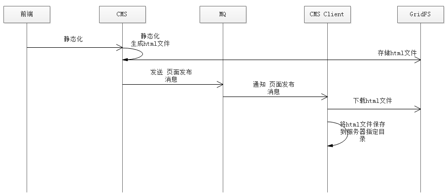
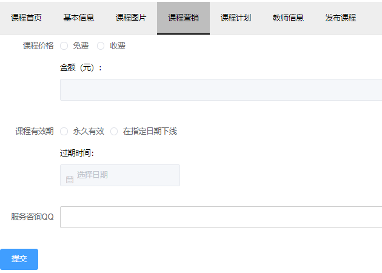
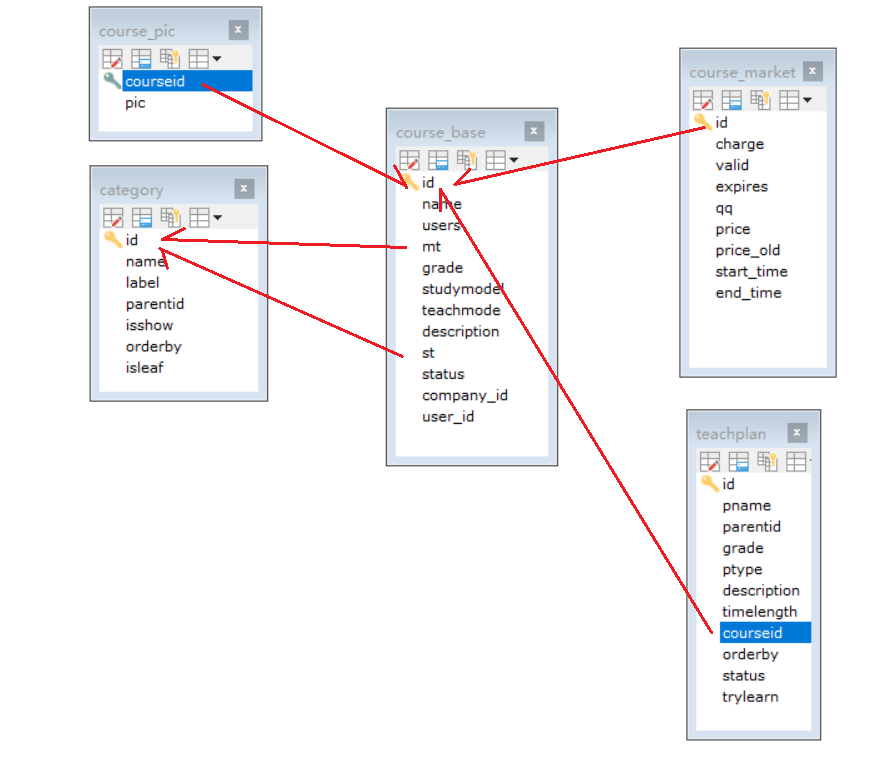

# 页面发布 课程管理

## 一、页面发布-技术方案分析


技术方案说明：
1、平台包括多个站点，页面归属不同的站点。
2、发布一个页面应将该页面发布到所属站点的服务器上。
3、每个站点服务部署cms client程序，并与交换机绑定，绑定时指定站点Id为routingKey。
指定站点id为routingKey就可以实现cms client只能接收到所属站点的页面发布消息。
4、页面发布程序向MQ发布消息时指定页面所属站点Id为routingKey，将该页面发布到它所在服务器上的cms
client。
路由模式分析如下：
发布一个页面，需发布到该页面所属的每个站点服务器，其它站点服务器不发布。
比如：发布一个门户的页面，需要发布到每个门户服务器上，而用户中心服务器则不需要发布。
所以本项目采用routing模式，**用站点id作为routingKey**，这样就可以匹配页面只发布到所属的站点服务器上。

页面发布流程图如下：



1、前端请求cms执行页面发布。
2、cms执行静态化程序生成html文件。
3、cms将html文件存储到GridFS中。
4、cms向MQ发送页面发布消息
5、MQ将页面发布消息通知给Cms Client
6、Cms Client从GridFS中下载html文件
7、Cms Client将html保存到所在服务器指定目录

## 二、页面发布-消费方Cms Client-搭建工程

功能分析：
**创建Cms Client工程作为页面发布消费方，将Cms Client部署在多个服务器上，它负责接收到页面发布 的消息后从GridFS中下载文件在本地保存**。

需求如下：
1、将cms Client部署在服务器，配置队列名称和站点ID。
2、cms Client连接RabbitMQ并监听各自的“页面发布队列”
3、cms Client接收页面发布队列的消息
4、根据消息中的页面id从mongodb数据库下载页面到本地

调用dao查询页面信息，获取到页面的物理路径，调用dao查询站点信息，得到站点的物理路径
页面物理路径=站点物理路径+页面物理路径+页面名称。
从GridFS查询静态文件内容，将静态文件内容保存到页面物理路径下。


基本依赖:

```xml
<?xml version="1.0" encoding="UTF-8"?>
<project xmlns="http://maven.apache.org/POM/4.0.0"
         xmlns:xsi="http://www.w3.org/2001/XMLSchema-instance"
         xsi:schemaLocation="http://maven.apache.org/POM/4.0.0 http://maven.apache.org/xsd/maven-4.0.0.xsd">
    <parent>
        <artifactId>xc-framework-parent</artifactId>
        <groupId>com.xuecheng</groupId>
        <version>1.0-SNAPSHOT</version>
        <relativePath>../xc-framework-parent/pom.xml</relativePath>
    </parent>
    <modelVersion>4.0.0</modelVersion>

    <artifactId>xc-service-manage-cms-client</artifactId>

    <dependencies>
        <dependency>
            <groupId>com.xuecheng</groupId>
            <artifactId>xc-framework-model</artifactId>
            <version>1.0-SNAPSHOT</version>
        </dependency>
        <dependency>
            <groupId>org.springframework.boot</groupId>
            <artifactId>spring-boot-starter-test</artifactId>
            <scope>test</scope>
        </dependency>
        <dependency>
            <groupId>org.springframework.boot</groupId>
            <artifactId>spring-boot-starter-amqp</artifactId>
        </dependency>
        <dependency>
            <groupId>org.springframework.boot</groupId>
            <artifactId>spring-boot-starter-data-mongodb</artifactId>
        </dependency>
        <dependency>
            <groupId>org.apache.commons</groupId>
            <artifactId>commons-io</artifactId>
        </dependency>
        <dependency>
            <groupId>com.alibaba</groupId>
            <artifactId>fastjson</artifactId>
        </dependency>
    </dependencies>

</project>
```

`application.yml`:

```yaml
server:
  port: 31000
spring:
  application:
    name: xc-service-manage-cms-client
  data:
    mongodb:
      uri: mongodb://localhost:27017/xc_cms
      database: xc_cms
  rabbitmq:
    host: 127.0.0.1
    port: 5672
    username: guest
    password: guest
    virtualHost: /
xuecheng:
  mq:
    #cms客户端监控的队列名称（不同的客户端监控的队列不能重复）
    queue: queue_cms_postpage_01
    routingKey: 5a751fab6abb5044e0d19ea1	#此routingKey为门户站点ID
```


添加消息队列的绑定:

消息队列设置如下：

1、创建`“ex_cms_postpage”`交换机；
2、每个Cms Client创建一个队列(id不同)与交换机绑定；
3、每个Cms Client程序配置队列名称和`routingKey`，将**站点ID**作为`routingKey`。

```java
@Configuration
public class RabbitmqConfig {

    //队列bean的名称
    public static final String QUEUE_CMS_POSTPAGE = "queue_cms_postpage";
    //交换机的名称
    public static final String EX_ROUTING_CMS_POSTPAGE="ex_routing_cms_postpage";

    // 都是从配置文件读取
    @Value("${xuecheng.mq.queue}")
    public  String queue_cms_postpage_name; //队列的名称

    @Value("${xuecheng.mq.routingKey}")   //routingKey 即站点Id
    public  String routingKey;

    /**
     * 交换机配置使用direct类型
     * @return the exchange
     */
    @Bean(EX_ROUTING_CMS_POSTPAGE)
    public Exchange EXCHANGE_TOPICS_INFORM() {
        return ExchangeBuilder.directExchange(EX_ROUTING_CMS_POSTPAGE).durable(true).build();
    }

    //声明队列
    @Bean(QUEUE_CMS_POSTPAGE)
    public Queue QUEUE_CMS_POSTPAGE() {
        Queue queue = new Queue(queue_cms_postpage_name);
        return queue;
    }

    /**
     * 绑定队列到交换机
     * @param queue    the queue
     * @param exchange the exchange
     * @return the binding
     */
    @Bean
    public Binding BINDING_QUEUE_INFORM_SMS(@Qualifier(QUEUE_CMS_POSTPAGE) Queue queue,
                                            @Qualifier(EX_ROUTING_CMS_POSTPAGE) Exchange exchange) {
        return BindingBuilder.bind(queue).to(exchange).with(routingKey).noargs();
    }
}
```

## 三、页面发布-消费方Cms Client-消费方法-service

消息内容采用`json`格式存储数据，如下：
页面id：发布页面的id

```json
{
	"pageId":""
}
```

定义两个需要查询的`Dao`:

```java
public interface CmsPageRepository extends MongoRepository<CmsPage, String> {

}
```

```java
public interface CmsSiteRepository extends MongoRepository<CmsSite, String> {

}
```


然后就是最关键的`Service`中的方法，也就是从`GridFS`中下载`html`文件放到服务器中的方法:

```java
@Service
@Slf4j
public class PageService {

    @Autowired
    CmsPageRepository cmsPageRepository;

    @Autowired
    CmsSiteRepository cmsSiteRepository;

    // 从GridFs中取内容
    @Autowired
    GridFsTemplate gridFsTemplate;

    @Autowired
    GridFSBucket gridFSBucket;

    //接受MQ消息之后要调用这个方法，然后把文件从GridFS中下载下来，然后保存到服务器
    public void savePageToServerPath(String pageId) {
        // 根据pageId查询CmsPage
        CmsPage cmsPage = this.findCmsPageById(pageId);

        //得到html的文件id，从cmsPage中获取htmlFileId内容
        String htmlFileId = cmsPage.getHtmlFileId();

        // 从GridFs中查询html文件
        InputStream inputStream = this.getFileById(htmlFileId);
        if (inputStream == null) {
            log.error("getFileById InputStream is null, htmlFileId:{}", htmlFileId);
            return;
        }
        // 得到站点Id
        String siteId = cmsPage.getSiteId();
        // 得到站点的信息　
        CmsSite cmsSite = this.findCmsSiteById(siteId);
        // 得到站点的物理路径
        String sitePhysicalPath = cmsSite.getSitePhysicalPath();

        //页面物理路径
        String pagePath = sitePhysicalPath + cmsPage.getPagePhysicalPath() + cmsPage.getPageName();

        // 将 html文件保存在服务器物理路径上
        FileOutputStream fileOutputStream = null;
        try {
            fileOutputStream = new FileOutputStream(new File(pagePath));
            IOUtils.copy(inputStream, fileOutputStream);
        }catch (Exception e){
            e.printStackTrace();
        }finally {
            try {
                inputStream.close();
            } catch (IOException e) {
                e.printStackTrace();
            }
            try {
                fileOutputStream.close();
            } catch (IOException e) {
                e.printStackTrace();
            }
        }
    }

    public CmsPage findCmsPageById(String pageId) {
        Optional<CmsPage> optional = cmsPageRepository.findById(pageId);
        if (optional.isPresent()) {
            return optional.get();
        }
        return null;
    }

    //根据htmlFileId从GridFs中查询文件的内容
    public InputStream getFileById(String fileId) {
        // 文件对象
        GridFSFile gridFSFile = gridFsTemplate.findOne(Query.query(Criteria.where("_id").is(fileId)));
        // 打开一个下载流
        GridFSDownloadStream gridFSDownloadStream = gridFSBucket.openDownloadStream(gridFSFile.getObjectId());
        // 定义一个GridFsResources
        GridFsResource gridFsResource = new GridFsResource(gridFSFile, gridFSDownloadStream);
        try {
            return gridFsResource.getInputStream();
        } catch (IOException e) {
            e.printStackTrace();
        }
        return null;
    }

    public CmsSite findCmsSiteById(String siteId) {
        Optional<CmsSite> optional = cmsSiteRepository.findById(siteId);
        if (optional.isPresent()) {
            return optional.get();
        }
        return null;
    }
}

```

这里面还是要用到一个`GridFs`中的那个`GridFSBucket`的配置:

```java
@Configuration
public class MongoConfig {

    // org.springframework.beans.factory.annotation.Value;
    @Value("${spring.data.mongodb.database}") // 配置文件中的
    String db;

    @Bean
    public GridFSBucket getGridFSBucket(MongoClient mongoClient){
        MongoDatabase database = mongoClient.getDatabase(db);
        GridFSBucket bucket = GridFSBuckets.create(database);
        return bucket;
    }
}
```

## 四、页面发布-消费方Cms Client-消费方法-监听队列

在cms client工程的mq包下创建ConsumerPostPage类，ConsumerPostPage作为发布页面的消费客户端，监听
页面发布队列的消息，收到消息后从mongodb下载文件，保存在本地。

```java
/**
 * 消息监听
 */
@Slf4j
public class ConsumerPostPage {

    @Autowired
    CmsPageRepository cmsPageRepository;

    @Autowired
    PageService pageService;

    @RabbitListener(queues = {"${xuecheng.mq.queue}"})
    public void postPage(String msg) {
        //解析消息 (msg中的json消息)
        Map map = JSON.parseObject(msg, Map.class);
        log.info("receive cms post page:{}", msg);
        //取出页面id
        String pageId = (String) map.get("pageId");
        //判断一下 查询页面信息
        Optional<CmsPage> optional = cmsPageRepository.findById(pageId);
        if (!optional.isPresent()) {
            log.error("receive cms post page,cmsPage is null:{}", msg);
            return;
        }
        //将页面保存到服务器物理路径
        pageService.savePageToServerPath(pageId);
    }
}

```

**这里遇到一个很头痛的问题**，就是启动项目一直报错，找了很久才发现是`xc-framework-parent`项目里面的`SpringCloud`版本问题。


启动后查看RabbitMQ的消息:


## 五、页面发布-生产方cms-发送页面发布消息

管理员通过 cms系统发布“页面发布”的消费，cms系统作为页面发布的生产方。
需求如下：
1、管理员进入管理界面点击“页面发布”，前端请求cms页面发布接口。
2、cms页面发布接口执行页面静态化，并将静态化页面存储至GridFS中。
3、静态化成功后，向消息队列发送页面发布的消息。
1） 获取页面的信息及页面所属站点ID。
2） 设置消息内容为页面ID。（采用json格式，方便日后扩展）
3） 发送消息给ex_cms_postpage交换机，并将站点ID作为routingKey。

先在`xc-service-manage-cms`中配置`application.yml`（配置RabbitMQ(这边是消息生产方)）


**RabbitMQConfig配置**

由于cms作为页面发布方要面对很多不同站点的服务器，面对很多页面发布队列，所以这里不再配置队列，只需要
配置交换机即可。
在cms工程只配置交换机名称即可。

```java
// 注意在生产方这边，只需要创建交换机即可，不需要创建队列
@Configuration
public class RabbitmqConfig {
    //交换机的名称
    public static final String EX_ROUTING_CMS_POSTPAGE="ex_routing_cms_postpage";
    /**
    * 交换机配置使用direct类型
    * @return the exchange
    */
    @Bean(EX_ROUTING_CMS_POSTPAGE)
    public Exchange EXCHANGE_TOPICS_INFORM() {
        return ExchangeBuilder.directExchange(EX_ROUTING_CMS_POSTPAGE).durable(true).build();
    }
}
```

在api工程定义页面发布接口：

```java
@ApiOperation("发布页面")
ResponseResult post(String pageId);
```

在PageService中定义页面发布方法，代码如下：

```java
// 页面发布
public ResponseResult post(String pageId){
    // 执行页面静态化
    String pageHtml = this.getPageHtml(pageId);
    // 将页面静态化文件存储到GridFs中
    if(StringUtils.isEmpty(pageHtml)){
        ExceptionCast.cast(CmsCode.CMS_GENERATEHTML_HTMLISNULL);
    }
    //保存静态化文件
    CmsPage cmsPage = saveHtml(pageId, pageHtml);
    // 向MQ发消息
    sendPostPage(pageId);
    return new ResponseResult(CommonCode.SUCCESS);
}

//保存html到GridFs
// 1、将html文件内容保存到GridFs中
// 2、将html文件id更新到cmsPage中
private CmsPage saveHtml(String pageId, String htmlContent){
    //先得到页面信息
    CmsPage cmsPage = this.getById(pageId);
    if(cmsPage == null){
        ExceptionCast.cast(CommonCode.INVALID_PARAM);
    }

    //        CmsPage cmsPage = optional.get();
    //        //存储之前先删除
    //        String htmlFileId = cmsPage.getHtmlFileId();
    //        if(StringUtils.isNotEmpty(htmlFileId)){
    //            gridFsTemplate.delete(Query.query(Criteria.where("_id").is(htmlFileId)));
    //        }

    ObjectId objectId = null;
    try {
        //将htmlContent内容转成输入流
        InputStream inputStream = IOUtils.toInputStream(htmlContent, "utf-8");
        //将html文件内容保存到GridFS
        objectId = gridFsTemplate.store(inputStream, cmsPage.getPageName());
    } catch (IOException e) {
        e.printStackTrace();
    }
    //文件id
    String fileId = objectId.toString();
    //将文件id(htmlId)存储到cmspage中
    cmsPage.setHtmlFileId(fileId);
    cmsPageRepository.save(cmsPage);
    return cmsPage;
}

// 发送MQ消息
private void sendPostPage(String pageId){
    CmsPage cmsPage = this.getById(pageId);
    if(cmsPage == null){
        ExceptionCast.cast(CmsCode.CMS_PAGE_NOTEXISTS);
    }
    Map<String, String> msgMap = new HashMap<>();
    msgMap.put("pageId", pageId);
    // 消息内容
    String msg = JSON.toJSONString(msgMap);
    // 获取站点id作为routingKey
    String siteId = cmsPage.getSiteId();
    // 发消息
    this.rabbitTemplate.convertAndSend(RabbitmqConfig.EX_ROUTING_CMS_POSTPAGE,
                                       siteId, msg);
}

```

编写对应的`Controller`:

```java
@Override
@PostMapping("/postPage/{pageId}")
public ResponseResult post(@PathVariable("pageId") String pageId) {
    return pageService.post(pageId);
}
```

## 六、页面发布-生产方cms-发送页面发布消息测试

测试结果，可以发现测试完在对应目录生成了`test004`(pageName叫`test004`)的文件。


**注意注意，这里重新测试的时候好像发现了一个问题，就是我的队列的routingKey好像填错了**


填第一个 门户主站 就可以了。

## 七、页面发布-前后端发布页面测试

### 1、修改`page_list.vue`，添加发布按钮


### 2、添加页面发布事件


### 3、cms.js前端添加api调用服务端方法


### 4、测试


## 八、页面发布-业务完善的思考

1、如果发布到服务器的页面内容不正确怎么办？
2、一个页面需要发布很多服务器，点击“发布”后如何知道详细的发布结果？
3、一个页面发布到多个服务器，其中有一个服务器发布失败时怎么办？

## 九、课程管理-需求分析(全新模块-核心模块)

在线教育平台的课程信息相当于电商平台的商品。课程管理是后台管理功能中最重要的模块。本项目为教学机构提
供课程管理功能，教学机构可以添加属于自己的课程，供学生在线学习。

课程管理包括如下功能需求：
1、分类管理
2、新增课程
3、修改课程
4、预览课程
5、发布课程

用户的操作流程如下：

1、进入我的课程 (这个是教师看到的教程)


2、点击“添加课程”，进入添加课程界面


3、输入课程基本信息，点击提交

4、课程基本信息提交成功，自动进入“管理课程”界面，点击“管理课程”也可以进入“管理课程”界面


5、编辑图片

上传课程图片。


6、编辑课程营销信息
营销信息主要是设置课程的收费方式及价格。



7、编辑课程计划(重要)


添加课程计划（教学计划）：


## 十、课程管理-教学方法说明


## 十一、课程管理-开发环境搭建

导入sql


数据表介绍

课程信息内容繁多，将课程信息分类保存在如下表中：





导入基本的工程:


在导入前端工程的时候，又报错，此时还是和之前导入一样，要执行那两个命令:


课程管理服务使用MySQL数据库存储课程信息，持久层技术如下：

1、spring data jpa：用于表的基本CRUD。
2、mybatis：用于复杂的查询操作。
3、druid：使用阿里巴巴提供的spring boot 整合druid包druid-spring-boot-starter管理连接池。


**后面新增(搬家)!!!!!**，这里必须要先改一下，不然输入`localhost:12000`会跳转到`ucenter`认证（这是后面的内容）


后面认证记得改回来。

emmm，后面没有显示出来一些东西，还是认证的问题。


## 十二、课程计划查询-需求分析 

什么是课程计划？
课程计划定义了课程的章节内容，学生通过课程计划进行在线学习，下图中右侧显示的就是课程计划。
课程计划包括两级，第一级是课程的大章节、第二级是大章节下属的小章节，每个小章节通常是一段视频，学生点
击小章节在线学习。
教学管理人员对课程计划如何管理？
功能包括：添加课程计划、删除课程计划、修改课程计划等。


## 十三、课程计划查询-页面原型说明

Webstorm配置JSX。


那个关于html中配置解析`*.vue`的我暂时先没有配置。

## 十四、课程计划查询-Api接口定义

### 1、观察数据表 teachplan

一定要对表和表中的列深入了解，能说出来每个表，每个列的含义。


### 2、模型类Teachplan.java

该类已经提供了，但是我们可以手动把各字段的注释加上，以增加对表的记忆。

```java
@Data
@ToString
@Entity
@Table(name="teachplan")
@GenericGenerator(name = "jpa-uuid", strategy = "uuid")
public class Teachplan implements Serializable {
    private static final long serialVersionUID = -916357110051689485L;
    @Id
    @GeneratedValue(generator = "jpa-uuid")
    @Column(length = 32)
    private String id;
    private String pname;
    private String parentid;
    private String grade;
    private String ptype;
    private String description;
    private String courseid;
    private String status;
    private Integer orderby;
    private Double timelength;
    private String trylearn;
}
```

### 3、根据需求设计组合实体类

前端页面需要树型结构的数据来展示Tree组件，如下：

```json
[{
    id: 1,
    label: '一级 1',
    children: [{
        id: 4,
        label: '二级 1‐1'
    }]
}]
```

**根据该json格式的要求，我们可以得出我们要组合的类型**

具体的组合类，我们也提供好了，`TeachplanNode.java`

**!!!!!!!注意注意，这个类是继承了Teachplan的，也就是说父类的属性它都有**

```java
package com.xuecheng.framework.domain.course.ext;

@Data
@ToString
public class TeachplanNode extends Teachplan {

    List<TeachplanNode> children;

}
```

### 4、根据课程id查询课程的计划接口

在api工程创建course包，创建CourseControllerApi接口类并定义接口方法

```java
@Api(value = "课程管理接口", tags = "课程管理接口，提供课程的增、删、改、查")
public interface CourseControllerApi {

    @ApiOperation("课程计划查询")
    TeachplanNode findTeachplanList(String courseId);

}

```

## 十五、课程计划查询-sql语句

### 1、Sql语句

```mysql
SELECT
	a.id one_id,
	a.pname one_pname,
	b.id two_id,
	b.pname two_pname,
	c.id three_id,
	c.pname three_pname 
FROM
	teachplan a
	LEFT JOIN teachplan b ON a.id = b.parentid
	LEFT JOIN teachplan c ON b.id = c.parentid 
WHERE
	a.parentid = '0' 
	AND a.courseid = '4028e581617f945f01617f9dabc40000' 
ORDER BY
	a.orderby,
	b.orderby,
	c.orderby
```

### 2、查询结果


## 十六、课程计划查询-接口实现

### 1、TeachplanMapper.java

```java
@Mapper
public interface TeachplanMapper {
    public TeachplanNode selectList(String courseId);
}
```

### 2、TeachplanMapper.xml

```xml
<?xml version="1.0" encoding="UTF-8" ?>
<!DOCTYPE mapper PUBLIC "-//mybatis.org//DTD Mapper 3.0//EN" "http://mybatis.org/dtd/mybatis-3-mapper.dtd" >

<!--TeachplanMapper.java的路径-->
<mapper namespace="com.xuecheng.manage_course.dao.TeachplanMapper">

    <resultMap type="com.xuecheng.framework.domain.course.ext.TeachplanNode" id="teachplanMap">
        <id property="id" column="one_id"/>
        <result property="pname" column="one_name"/>
        <!--collection是一对多的标签-->
        <collection property="children" ofType="com.xuecheng.framework.domain.course.ext.TeachplanNode">
            <id property="id" column="two_id"/>
            <result property="pname" column="two_name"/>
            <collection property="children" ofType="com.xuecheng.framework.domain.course.ext.TeachplanNode">
                <id property="id" column="three_id"/>
                <result property="pname" column="three_name"/>
            </collection>
        </collection>
    </resultMap>

    <select id="selectList" resultMap="teachplanMap" parameterType="java.lang.String">
        SELECT
        a.id one_id,
        a.pname one_name,
        b.id two_id,
        b.pname two_name,
        c.id three_id,
        c.pname three_name
        FROM
        teachplan a LEFT JOIN teachplan b
        ON
        a.id = b.parentid
        LEFT JOIN
        teachplan c
        ON
        b.id = c.parentid
        WHERE
        a.parentid = '0'
        <if test="_parameter!=null and _parameter!=''">
            and a.courseid=#{courseId}
        </if>
        ORDER BY
        a.orderby,
        b.orderby,
        c.orderby
    </select>

</mapper>
```

### 3、测试

```java
@Autowired
TeachplanMapper teachplanMapper;

@Test
public void testFindTeachplan(){
	TeachplanNode teachplanNode = teachplanMapper.selectList("4028e581617f945f01617f9dabc40000");
	System.out.println(teachplanNode);
}
```

测试:注意是按照调试的方式来测试的:


### 4、完善service和controller

```java
@Service
public class CourseService {

    @Autowired
    TeachplanMapper teachplanMapper;

    //查询课程计划
    public TeachplanNode findTeachplanList(String courseId) {
        TeachplanNode teachplanNode = teachplanMapper.selectList(courseId);
        return teachplanNode;
    }
}
```

```java
@RestController
@RequestMapping("/course")
public class CourseController implements CourseControllerApi {

    @Autowired
    CourseService courseService;

    //查询课程计划
    @Override
    @GetMapping("/teachplan/list/{courseId}")
    public TeachplanNode findTeachplanList(String courseId) {
        return courseService.findTeachplanList(courseId);
    }

}
```

测试:


## 十七、课程计划查询-前端页面调试


放开之前注释的部分:


## 十八、课程计划添加-需求分析

1、进入课程计划页面，点击“添加课程计划”
2、打开添加课程计划页面，输入课程计划信息


上级结点说明：
**不选择上级结点表示当前添加的课程计划的父节点为该课程的根节点**(一级节点)。
**当添加该课程时，在课程计划中还没有节点的时候，要自动添加课程的根结点**。

3、点击提交。

## 十九、课程计划添加-接口开发

前端:


API

```java
@ApiOperation("添加课程计划")
ResponseResult addTeachplan(Teachplan teachplan);
```

Controller

```java

//添加课程计划
@Override
@PostMapping("/teachplan/add")
public ResponseResult addTeachplan(@RequestBody Teachplan teachplan) { // 添加 questBody
    return courseService.addTeachplan(teachplan);
}
```

Service的两个方法:

```java
@Service
public class CourseService {

    @Autowired
    TeachplanMapper teachplanMapper;

    @Autowired
    TeachplanRepository teachplanRepository;

    @Autowired
    CourseBaseRepository courseBaseRepository;

    //查询课程计划
    public TeachplanNode findTeachplanList(String courseId) {
        TeachplanNode teachplanNode = teachplanMapper.selectList(courseId);
        return teachplanNode;
    }

    // 添加课程计划，主要是处理parentId
    public ResponseResult addTeachplan(Teachplan teachplan) {
        //校验课程id和课程计划名称
        if(teachplan == null ||
                StringUtils.isEmpty(teachplan.getCourseid()) ||
                StringUtils.isEmpty(teachplan.getPname())){
            ExceptionCast.cast(CommonCode.INVALID_PARAM);
        }
        //取出课程id
        String courseid = teachplan.getCourseid();
        //取出父结点id
        String parentid = teachplan.getParentid();
        if(StringUtils.isEmpty(parentid)){
            //如果父结点为空则获取根结点
            parentid= getTeachplanRoot(courseid);
        }
        //取出父结点信息
        Optional<Teachplan> teachplanOptional = teachplanRepository.findById(parentid);
        if(!teachplanOptional.isPresent()){
            ExceptionCast.cast(CommonCode.INVALID_PARAM);
        }
        //父结点
        Teachplan teachplanParent = teachplanOptional.get();
        //父结点级别
        String parentGrade = teachplanParent.getGrade();
        //设置父结点
        teachplan.setParentid(parentid);
        teachplan.setStatus("0");//未发布
        //子结点的级别，根据父结点来判断
        if(parentGrade.equals("1")){
            teachplan.setGrade("2");
        }else if(parentGrade.equals("2")) {
            teachplan.setGrade("3");
        }
        //设置课程id
        teachplan.setCourseid(teachplanParent.getCourseid());
        teachplanRepository.save(teachplan);
        return new ResponseResult(CommonCode.SUCCESS);
    }

    //获取课程根结点，如果没有则添加根结点
    private String getTeachplanRoot(String courseId) {
        //校验课程id
        Optional<CourseBase> optional = courseBaseRepository.findById(courseId);
        if (!optional.isPresent()) {
            return null;
        }
        CourseBase courseBase = optional.get();
        //取出课程计划根结点
        List<Teachplan> teachplanList = teachplanRepository.findByCourseidAndParentid(courseId,
                "0");
        if (teachplanList == null || teachplanList.size() == 0) {
            //新增一个根结点
            Teachplan teachplanRoot = new Teachplan();
            teachplanRoot.setCourseid(courseId);
            teachplanRoot.setPname(courseBase.getName());
            teachplanRoot.setParentid("0");
            teachplanRoot.setGrade("1");//1级
            teachplanRoot.setStatus("0");//未发布
            teachplanRepository.save(teachplanRoot);
            return teachplanRoot.getId();
        }
        Teachplan teachplan = teachplanList.get(0);
        return teachplan.getId();
    }
}
```

中间用到了一个dao:

```java
public interface TeachplanRepository extends JpaRepository<Teachplan, String> {
    //定义方法根据课程id和父结点id查询出结点列表，可以使用此方法实现查询根结点
     List<Teachplan> findByCourseidAndParentid(String courseId, String parentId);
}
```


## 二十、课程计划添加-前端页面调试


