# 课程管理实战

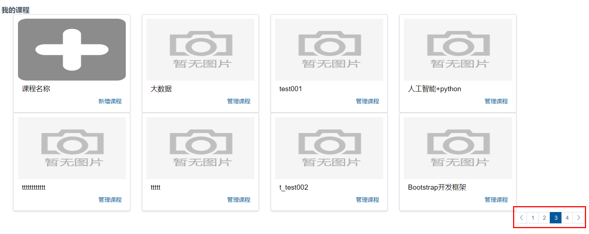

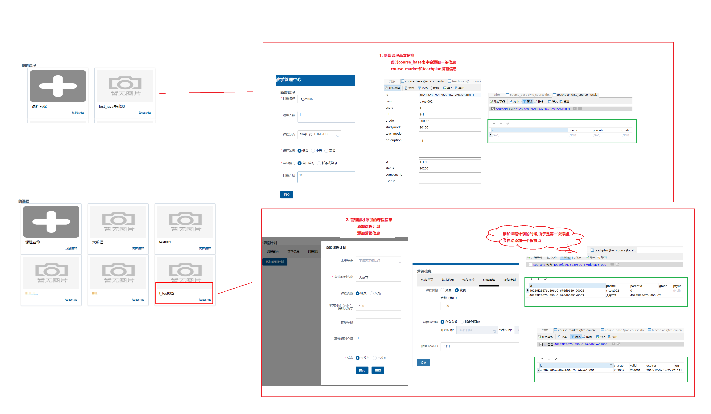

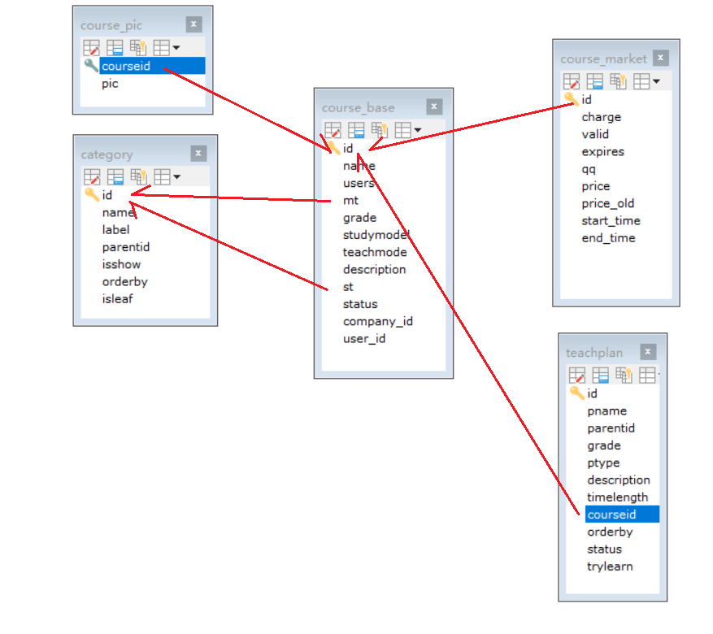

## 一、我的课程-需求分析与PageHelper技术

课程添加完成后可通过我的课程进入课程修改页面，此页面显示我的课程列表，如下图所示，可分页查询。

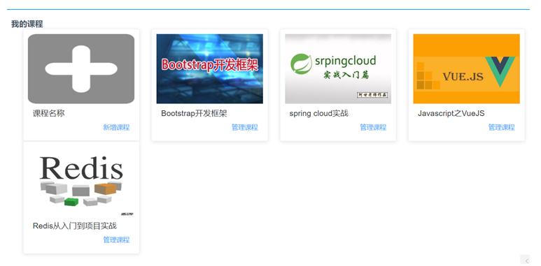

上边的查询要实现分页、会存在多表关联查询，所以建议使用mybatis实现我的课程查询。

**PageHelper**

```xml
<!--mybatis的分页插件-->
<dependency>
    <groupId>com.github.pagehelper</groupId>
    <artifactId>pagehelper-spring-boot-starter</artifactId>
    <version>1.2.4</version>
</dependency>
```

PageHelper是mybatis的通用分页插件，通过mybatis的拦截器实现分页功能，拦截sql查询请求，添加分页语句，
最终实现分页查询功能。
我的课程具有分页功能，本项目使用Pagehelper实现Mybatis分页功能开发，由于本项目使用springboot开发，在
springboot上集成pagehelper（https://github.com/pagehelper/pagehelper-spring-boot）
PageHelper的使用方法及原理如下：
在调用dao的service方法中设置分页参数：PageHelper.startPage(page, size)，分页参数会设置在ThreadLocal中
PageHelper在mybatis执行sql前进行拦截，从ThreadLocal取出分页参数，修改当前执行的sql语句，添加分页
sql。
最后执行添加了分页sql的sql语句，实现分页查询。

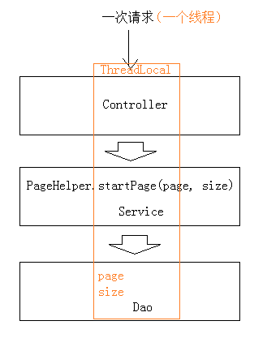

```yaml
pagehelper:
	helper‐dialect: mysql
```

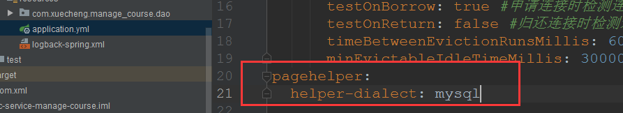

测试`PageHelper`:

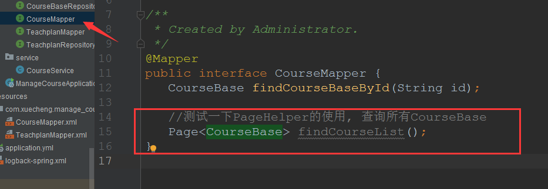

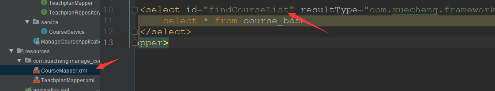

编写测试方法:

```java
@Test
public void testPageHelper(){
    // 在findCourseList之前设置分页参数(ThreadLocal), 查询第一页，每页显示10条
    PageHelper.startPage(1, 10); //不是从0开始
    Page<CourseBase> courseList = courseMapper.findCourseList();
    List<CourseBase> result = courseList.getResult();
    long total = courseList.getTotal();
    System.out.println(result);
}
```

测试结果:

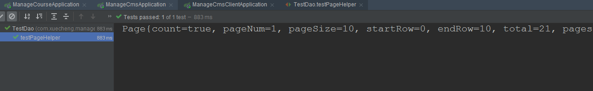

## 二、我的课程-前端页面与Api说明

查看前端相关代码确定API接口:

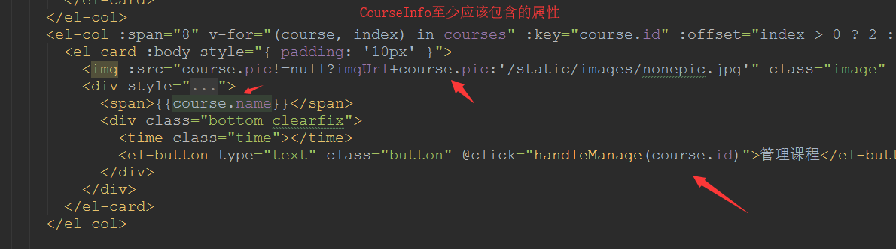

输入参数：
页码、每页显示个数、查询条件

输出结果类型：
`QueryResponseResult<自定义类型>`
在api工程创建course包，创建`CourseControllerApi`接口:

```java
    //查询课程列表
    @ApiOperation("查询我的课程列表")
    QueryResponseResult<CourseInfo> findCourseList(
            int page,
            int size,
            CourseListRequest courseListRequest
    );
```

但是直接按照文档上面增加这个接口会报错: 因为课程提供的`QueryResponseResult.java`没有带上泛型:

于是我修改了 `QueryResponseResult.java`，下面看修改之前的代码和修改之后的代码:

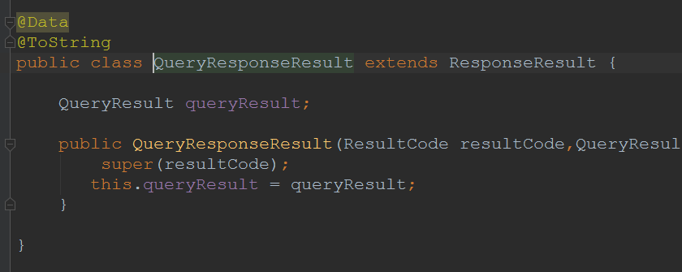

修改后:

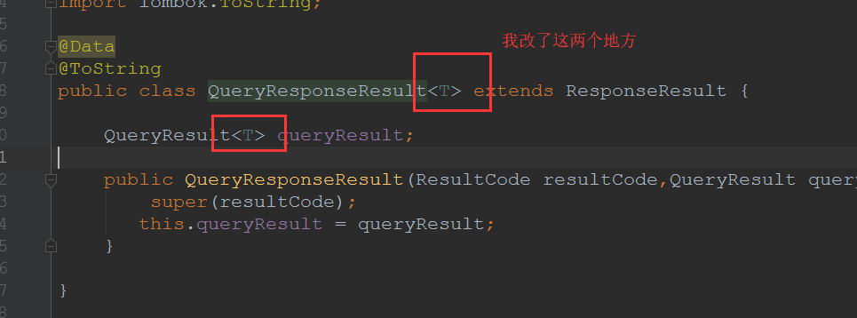

### 1、Dao

然后在`Dao`中增加 查询页面的 方法 `findCourseListPage`

```java
@Mapper
public interface CourseMapper {
   CourseBase findCourseBaseById(String id);

   //测试一下PageHelper的使用, 查询所有CourseBase
   Page<CourseBase> findCourseList();

   // 分页查询 CourseList, 传入的参数是查询的条件
   Page<CourseInfo> findCourseListPage(CourseListRequest courseListRequest);
}
```

### 2、xml

`CourseMapper.xml`:

```xml
<!--根据传入参数查询分页-->
<select id="findCourseListPage" resultType="com.xuecheng.framework.domain.course.ext.CourseInfo"
        parameterType="com.xuecheng.framework.domain.course.request.CourseListRequest">
    select course_base.*,
    (select pic from course_pic where courseid = course_base.id) pic
    from course_base
</select>
```

测试Dao:

```java
@Test
public void testFindCourseListPage(){
    PageHelper.startPage(2, 1);
    CourseListRequest courseListRequest = new CourseListRequest();
    //        courseListRequest.setCompanyId();
    Page<CourseInfo> courseListPage = courseMapper.findCourseListPage(courseListRequest);
    List<CourseInfo> result = courseListPage.getResult();
    //        System.out.println(courseListPage);
    System.out.println(result);
}
```

### 3、Controller

在`Controller`中实现`API`中的方法:

```java
// 查询CourseList显示
@Override
@GetMapping("/coursebase/list/{page}/{size}")
public QueryResponseResult<CourseInfo> findCourseList(
    @PathVariable("page") int page,
    @PathVariable("size") int size,
    CourseListRequest courseListRequest) {
    return courseService.findCourseList(page, size, courseListRequest);
}
```

### 4、Serivce

然后在`Service`中调用`Dao`的方法。以及增加分页的逻辑:

```java
public QueryResponseResult<CourseInfo> findCourseList(int page,
                                                      int size,
                                                      CourseListRequest courseListRequest) {
    if(courseListRequest == null){
        courseListRequest = new CourseListRequest();
    }
    if(page <= 0){
        page = 0;
    }
    if(size <= 0){
        size = 20;
    }
    // 设置分页参数
    PageHelper.startPage(page, size);
    // 分页查询
    Page<CourseInfo> courseListPage = courseMapper.findCourseListPage(courseListRequest);

    List<CourseInfo> result = courseListPage.getResult();// 查询结果
    long total = courseListPage.getTotal();// 总的记录数

    // 构造返回结果
    QueryResult<CourseInfo> queryResult = new QueryResult<>();
    queryResult.setList(result);
    queryResult.setTotal(total);
    return new QueryResponseResult<>(CommonCode.SUCCESS, queryResult);
}
```

### 5、测试:

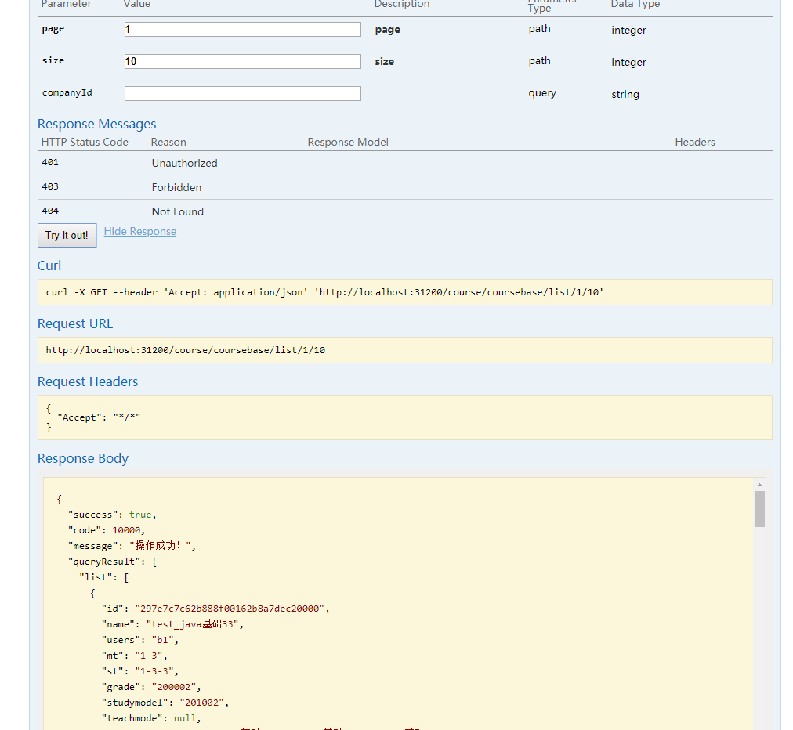

### 6、前端

`/router/index.js`中的路由:

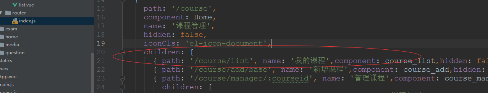

`API`的调用(`course.js`):

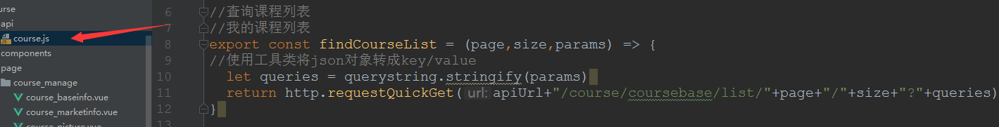

在`course_list.vue`页面调用:

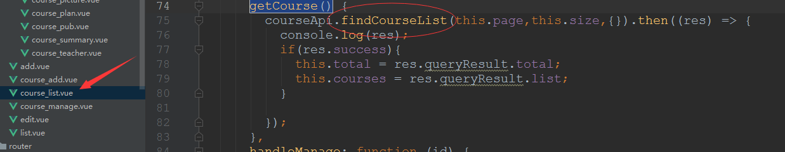

在`mounted`钩子中调用`getCourse()`方法:

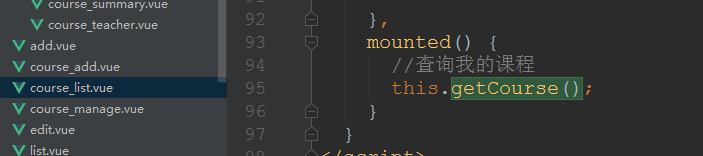

在分页方法中调用getCourse方法

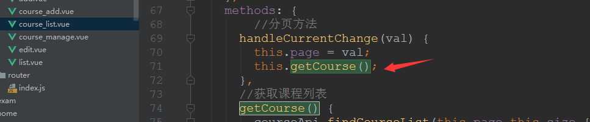

最终测试:

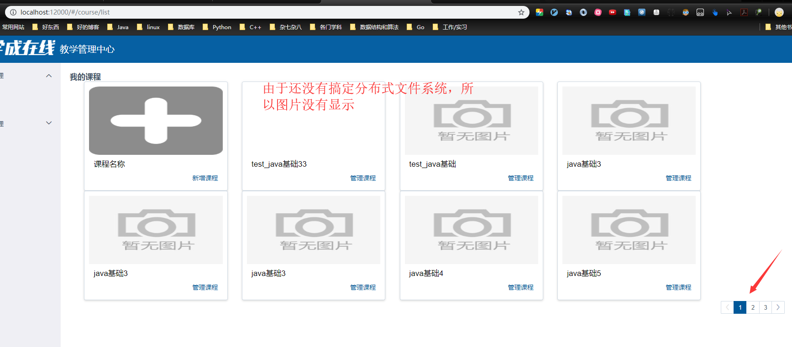

## 三、新增课程-课程分类查询

用户操作流程如下：

1、用户进入“我的课程”页面，点击“新增课程”，进入新增课程页面


2、填写课程信息，选择课程分类、课程等级、学习模式等。

3、信息填写完毕，点击“提交”，课程添加成功或课程添加失败并提示失败原因。

 需要解决的是在新增页面上输入的信息：

1、课程分类

多级分类，需要方便用户去选择。

2、课程等级、学习模式等这些选项建议是可以配置的。

**课程分类查询**

数据库分类的表:

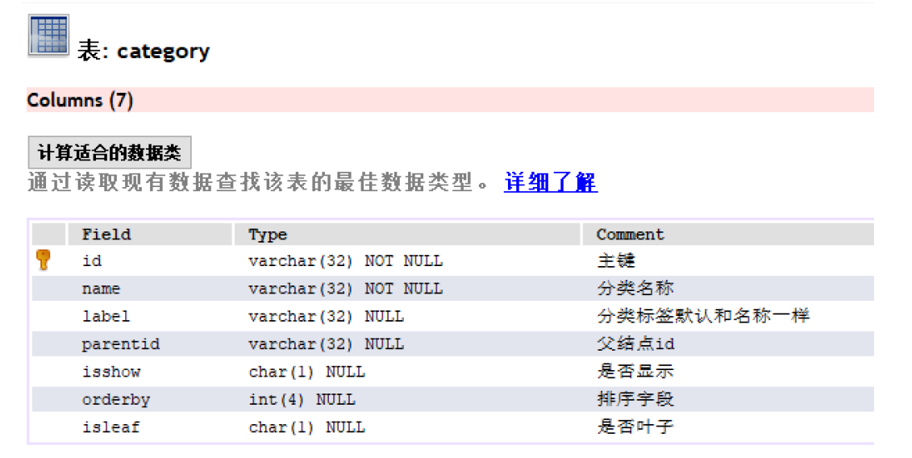

在添加课程时需要选择课程所属的分类，这里需要定义课程分类查询接口。
接口格式要根据前端需要的数据格式来定义，前端展示课程分类使用elemenet-ui的cascader（级联选择器）组
件。

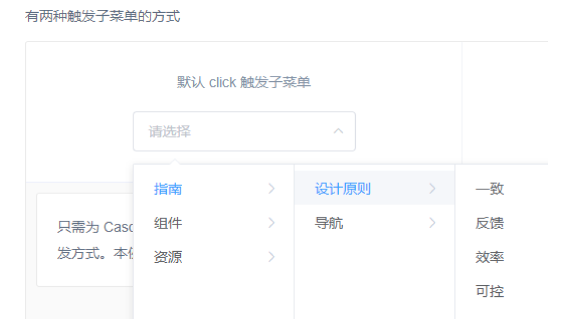

数据模型:

```java
@Data
@ToString
@Entity
@Table(name="category")
@GenericGenerator(name = "jpa-assigned", strategy = "assigned")
//@GenericGenerator(name = "jpa-uuid", strategy = "uuid")
public class Category implements Serializable {
    private static final long serialVersionUID = -906357110051689484L;
    @Id
    @GeneratedValue(generator = "jpa-assigned")
    @Column(length = 32)
    private String id;
    private String name;
    private String label;
    private String parentid;
    private String isshow;
    private Integer orderby;
    private String isleaf;
}
```

定义数据返回格式

```java
@Data
@ToString
public class CategoryNode extends Category {
    List<CategoryNode> children;
}
```

API接口:

```java
@Api(value = "课程分类管理", tags = {"课程分类管理"})
public interface CategoryControllerApi {

    @ApiOperation("查询分类")
    CategoryNode findList();
}
```

定义`mapper`映射文件(`CategoryMapper.xml`)

```xml
<?xml version="1.0" encoding="UTF-8" ?>
<!DOCTYPE mapper PUBLIC "-//mybatis.org//DTD Mapper 3.0//EN"
        "http://mybatis.org/dtd/mybatis-3-mapper.dtd">

<mapper namespace="com.xuecheng.manage_course.dao.CategoryMapper">

    <resultMap type="com.xuecheng.framework.domain.course.ext.CategoryNode" id="categoryMap" >
        <id property="id" column="one_id"/>
        <result property="name" column="one_name"/>
        <result property="label" column="one_label"/>
        <result property="isshow" column="one_isshow"/>
        <result property="isleaf" column="one_isleaf"/>
        <result property="orderby" column="one_orderby"/>
        <result property="parentid" column="one_parentid"/>
        <collection property="children"
                    ofType="com.xuecheng.framework.domain.course.ext.CategoryNode">
            <id property="id" column="two_id"/>
            <result property="name" column="two_name"/>
            <result property="label" column="two_label"/>
            <result property="isshow" column="two_isshow"/>
            <result property="isleaf" column="two_isleaf"/>
            <result property="orderby" column="two_orderby"/>
            <result property="parentid" column="two_parentid"/>
            <collection property="children"
                        ofType="com.xuecheng.framework.domain.course.ext.CategoryNode">
                <id property="id" column="three_id"/>
                <result property="name" column="three_name"/>
                <result property="label" column="three_label"/>
                <result property="isshow" column="three_isshow"/>
                <result property="isleaf" column="three_isleaf"/>
                <result property="orderby" column="three_orderby"/>
                <result property="parentid" column="three_parentid"/>
            </collection>
        </collection>
    </resultMap>


    <select id="selectList" resultMap="categoryMap">
        SELECT
            a.id one_id,
            a.name one_name,
            a.label one_label,
            a.isshow one_isshow,
            a.isleaf one_isleaf,
            a.orderby one_orderby,
            a.parentid one_parentid,
            b.id two_id,
            b.name two_name,
            b.label two_label,
            b.isshow two_isshow,
            b.isleaf two_isleaf,
            b.orderby two_orderby,
            b.parentid two_parentid,
            c.id three_id,
            c.name three_name,
            c.label three_label,
            c.isshow three_isshow,
            c.isleaf three_isleaf,
            c.orderby three_orderby,
            c.parentid three_parentid
        FROM
            category a LEFT JOIN category b
            ON a.id = b.parentid
            LEFT JOIN category c
            ON b.id = c.parentid
        WHERE a.parentid = '0'
        ORDER BY a.orderby,
                b.orderby,
                c.orderby
</select>

</mapper>
```

`Service`:

```java
@Service
public class CategoryService {

    @Autowired
    CategoryMapper categoryMapper;

    //查询分类
    public CategoryNode findList() {
        return categoryMapper.selectList();
    }
}
```

`Controller`:

```java
@RestController
@RequestMapping("/category")
public class CategoryController implements CategoryControllerApi {

    @Autowired
    CategoryService categoryService;

    @Override
    @GetMapping("/list")
    public CategoryNode findList() {
        return categoryService.findList();
    }
}
```

测试:

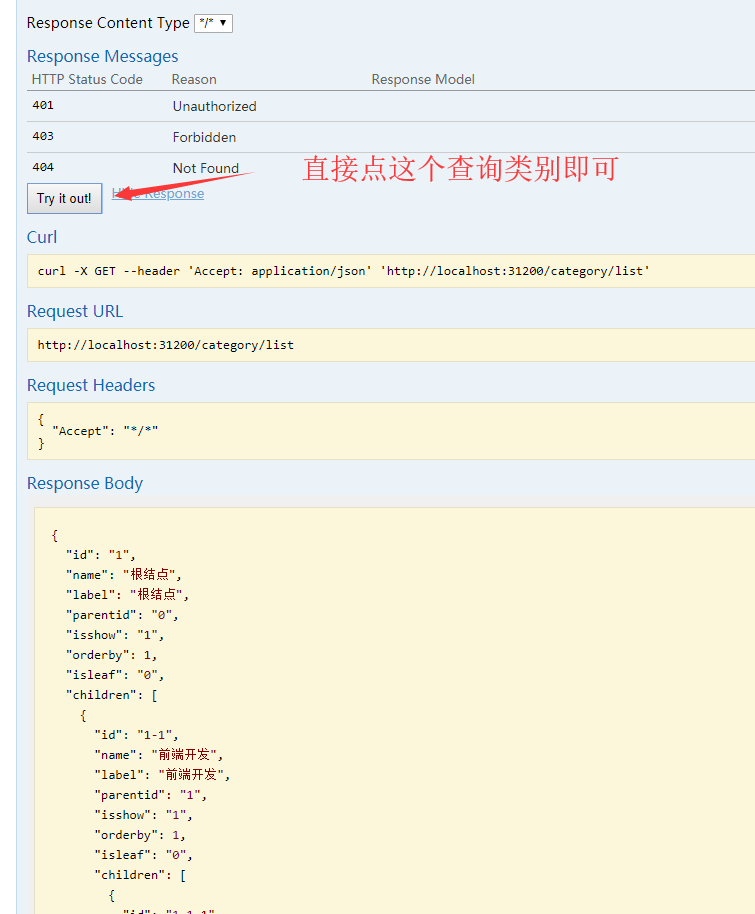

这个不需要开发前端，因为本身就是在添加课程的时候中的一个选项，选择分类而已。

## 四、新增课程-数据字典

​	在新增课程界面需要选择课程等级、课程状态等，这些信息统一采用数据字典管理的方式。

​	本项目对一些业务的分类配置信息，比如：课程等级、课程状态、用户类型、用户状态等进行统一管理，通过在数据库创建数据字典表来维护这些分类信息。

​	数据字典对系统的业务分类进行统一管理，**并且也可以解决硬编码问题**，比如添加课程时选择课程等级，下拉框中的课程等级信息如果在页面硬编码将造成不易修改维护的问题，所以从数据字典表中获取，如果要修改名称则在数据字典修改即可，提高系统的可维护性。

一个字典信息如下：

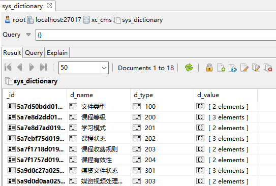

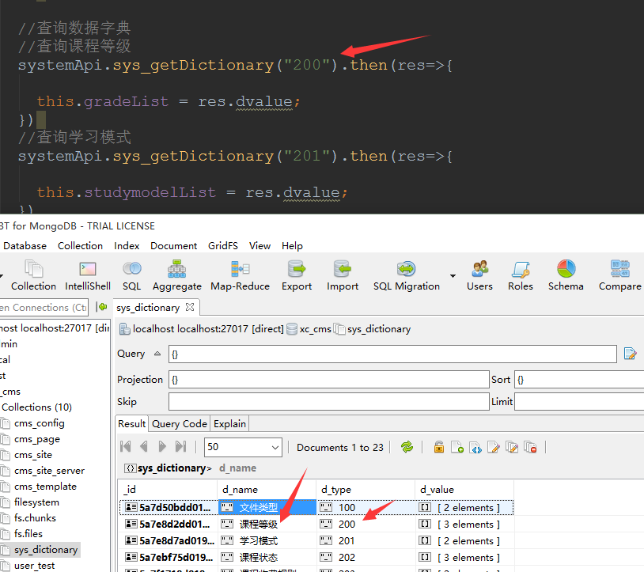

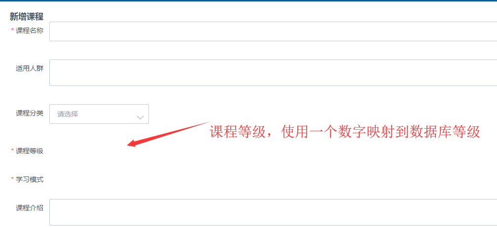

对应一些数据:

```json
{
    "_id" : ObjectId("5a7e8d2dd019f15418fa2b71"), 
    "d_name" : "课程等级", 
    "d_type" : "200", 
    "d_value" : [
        {
            "sd_name" : "低级", 
            "sd_id" : "200001", 
            "sd_status" : "1"
        }, 
        {
            "sd_name" : "中级", 
            "sd_id" : "200002", 
            "sd_status" : "1"
        }, 
        {
            "sd_name" : "高级", 
            "sd_id" : "200003", 
            "sd_status" : "1"
        }
    ]
}
```

字段说明如下：

`d_name`：字典名称

`d_type`：字典分类

`d_value`：字典数据

​	`sd_name`：项目名称

​	`sd_id`：项目id

​	`sd_status`：项目状态（1：可用，0不可用）

这个 查询的`sysDicionary`建议写到`cms`模块中，因为数据库是`MongoDB`中的。

### 1、SysDictionary

对应模型类:

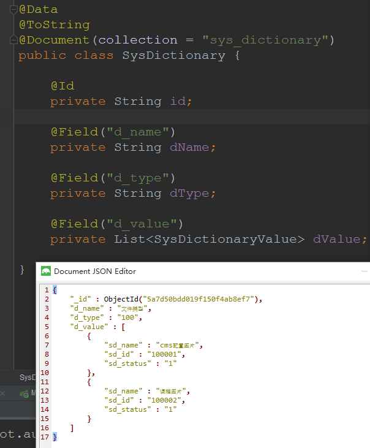

```java
@Data
@ToString
@Document(collection = "sys_dictionary")
public class SysDictionary {

    @Id
    private String id;

    @Field("d_name")
    private String dName;

    @Field("d_type")
    private String dType;

    @Field("d_value")
    private List<SysDictionaryValue> dValue;

}
```

### 2、SysDictionaryValue类型

```java
@Data
@ToString
public class SysDictionaryValue {

    @Field("sd_id")
    private String sdId;

    @Field("sd_name")
    private String sdName;

    @Field("sd_status")
    private String sdStatus;

}
```

### 3、接口API

为了方便其它子系统使用，在cms模块下创建字典查询接口，根据字典的type查询字典信息，接口定义如下：

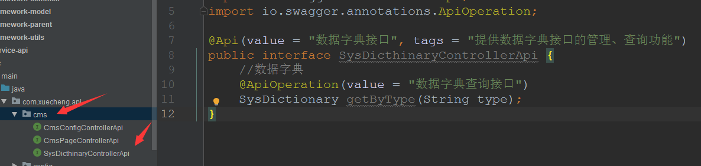

```java
@Api(value = "数据字典接口", tags = "提供数据字典接口的管理、查询功能")
public interface SysDictionaryControllerApi {
    //数据字典
    @ApiOperation(value = "数据字典查询接口")
    SysDictionary getByType(String type);
}
```

### 4、Dao、Service

在cms模块下创建数据库的dao、service等类

```java
@Repository
public interface SysDictionaryDao extends MongoRepository<SysDictionary, String> {
    //根据字典分类查询字典信息
    SysDictionary findBydType(String dType);
}
```

```java
@Service
public class SysdictionaryService {
    
    @Autowired
    SysDictionaryDao sysDictionaryDao;

    //根据字典分类type查询字典信息
    public SysDictionary findDictionaryByType(String type) {
        return sysDictionaryDao.findBydType(type);
    }
}
```

### 5、Controller和测试

```java
@RestController
@RequestMapping("/sys/dictionary")
public class SysDictionaryController implements SysDictionaryControllerApi {
    @Autowired
    SysdictionaryService sysdictionaryService;

    //根据字典分类id查询字典信息
    @Override
    @GetMapping("/get/{type}")
    public SysDictionary getByType(@PathVariable("type") String type) {
        return sysdictionaryService.findDictionaryByType(type);
    }
}
```

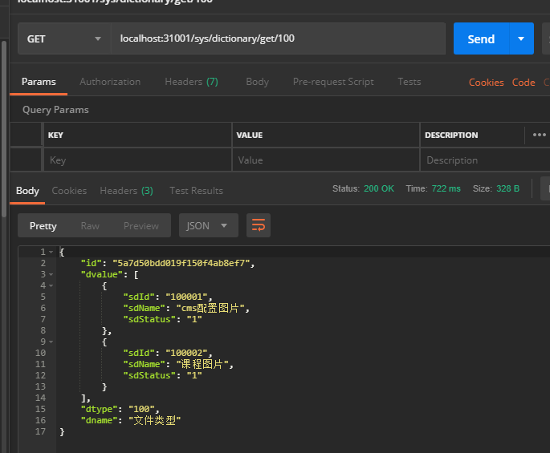

## 五、课程添加完善

### 1、数据字典

本节完成数据字典显示及课程分类显示。

最终页面效果如下:

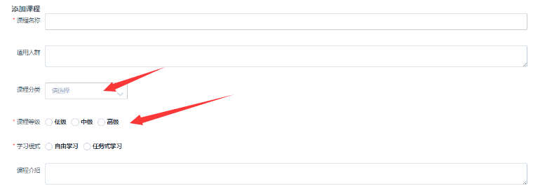

前端

`course_add.vue`页面

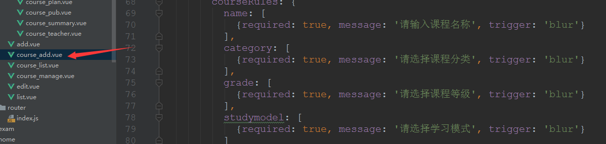

`index.js`

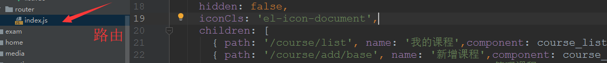

`course_list.vue`:

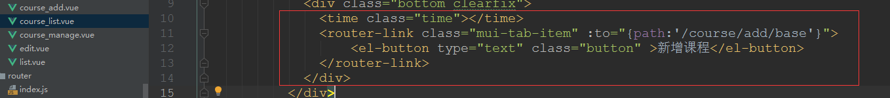

课程添加页面中课程等级、学习模式需要从数据字典查询字典信息。
1）定义方法
数据字典查询 为公用方法，所以定义在`/base/api/system.js`中

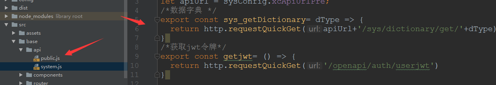

在页面(`course_add.vue`)的钩子方法中查询上面的方法:

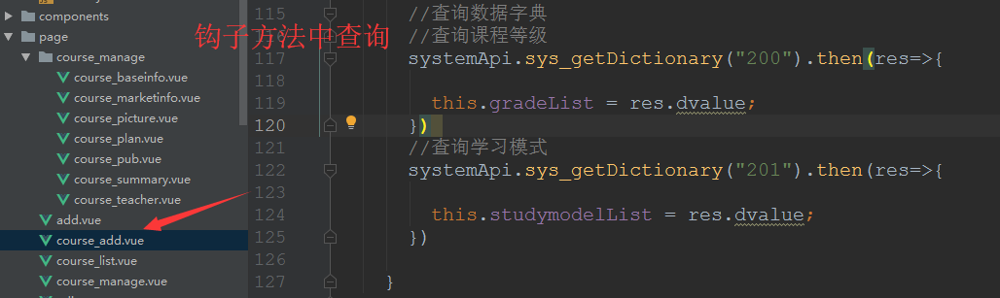

效果:


### 2、课程分类

课程添加页面中课程分类采用`Cascader`组件完成。

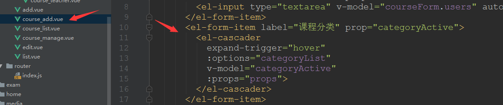

`course.js`:

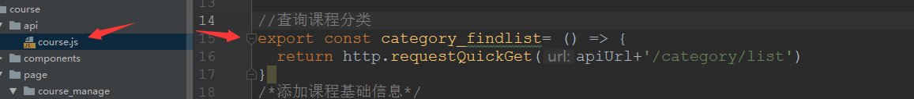

 `course_add.vue`钩子方法中查询:

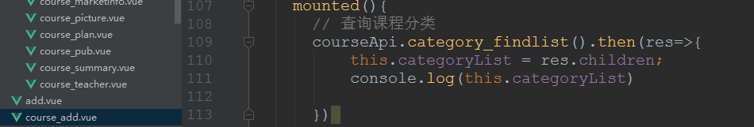

效果:

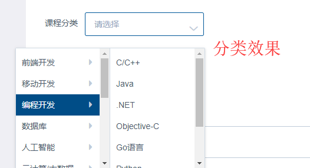

如何获取选择的分类:

用户选择课程分类后，所选分类ID绑定到categoryActive（数组）中，选择了一级、二级分类，分别存储在
categoryActive数组的第一个、第二个元素中。

**API**:

在`CourseControllerAPI.java`中添加一个方法:

```java
@ApiOperation("添加课程基础信息")
AddCourseResult addCourseBase(CourseBase courseBase);
```

在`CourseService.java`中添加下面的方法:

```java
//添加课程提交
@Transactional
public AddCourseResult addCourseBase(CourseBase courseBase) {
    //课程状态默认为未发布
    courseBase.setStatus("202001");
    courseBaseRepository.save(courseBase);
    return new AddCourseResult(CommonCode.SUCCESS, courseBase.getId());
}
```

在`CourseController.java`中添加下面的方法:

```java
@Override
@PostMapping("/coursebase/add")
public AddCourseResult addCourseBase(@RequestBody CourseBase courseBase) {
    return courseService.addCourseBase(courseBase);
}
```

前端以及测试:

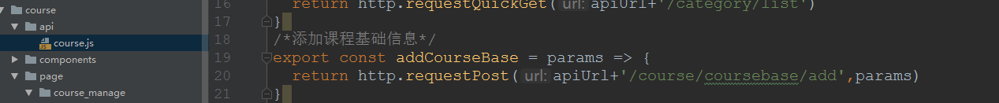

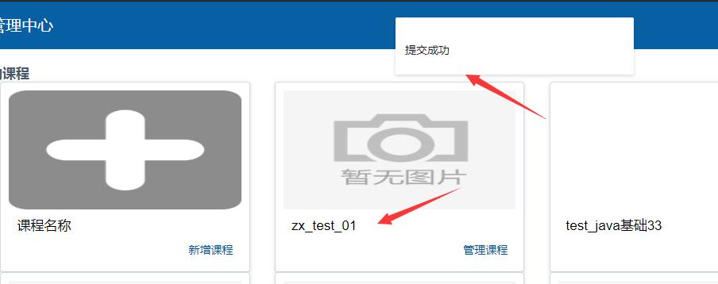

> 注意：将course_base表中的company_id改为非必填，待认证功能开发完成再修改为必填 (没看懂)

## 六、课程修改实战分析（对应课五）

课程添加成功进入课程管理页面，通过课程管理页面修改课程的基本信息、编辑课程图片、编辑课程营销信息等。
本小节实现修改课程。

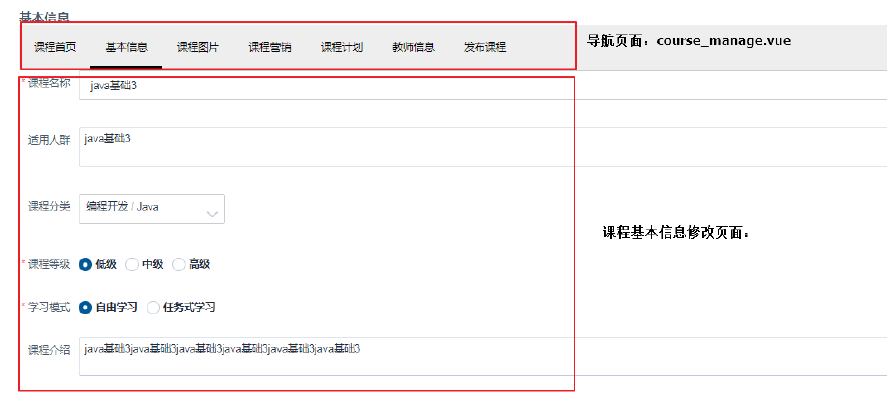

1、定义`course_manage.vue`为课程管理导航页面。

2、各个信息管理页面

通过管理页面的导航可以进入各各信息管理页面，这里先创建各各信息管理页面，页面内容暂时为空，待开发时再
完善，在本模块的page目录下创建course_manage目录，此目录存放各各信息管理页面，页面明细如下：
课程管理首页：`course_summary.vue`
基本信息修改页面：`course_baseinfo.vue`
图片管理页面：`course_picture.vue` 营销信息页面：`course_marketinfo.vue`
老师信息页面：`course_teacher.vue`
课程计划页面：`course_plan.vue`
课程发布页面：`course_pub.vue`

3、路由

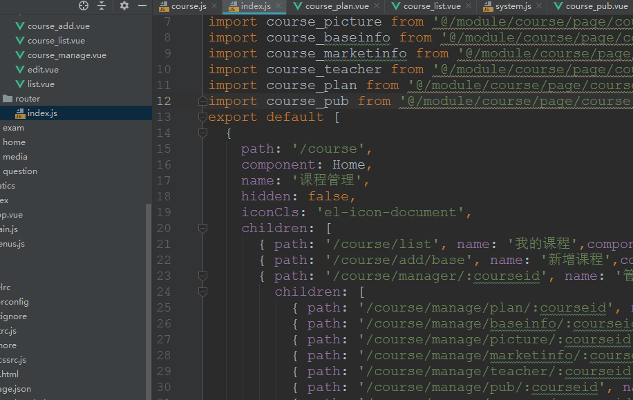

修改课程需要如下接口：
1、根据id查询课程信息
2、修改课程提交
接口定义如下：
1) 根据课程ID查询课程信息

2) 更新课程基础信息

在`CourseControllerApi.java`中添加下面的api定义。

```java
@ApiOperation("获取课程基础信息")
CourseBase getCourseBaseById(String courseId) throws RuntimeException;

@ApiOperation("更新课程基础信息")
ResponseResult updateCourseBase(String id, CourseBase courseBase);
```

`Service`:

```java
// 根据课程ID查询课程信息
public CourseBase getCoursebaseById(String courseId) {
    Optional<CourseBase> optional = courseBaseRepository.findById(courseId);
    if(optional.isPresent()){
        return optional.get();
    }
    return null;
}

@Transactional
public ResponseResult updateCoursebase(String id, CourseBase courseBase) {
    CourseBase one = this.getCoursebaseById(id);
    if(one == null){
        //抛出异常.. ,不存在这个课程信息，这里抛出参数错误异常
        ExceptionCast.cast(CommonCode.INVALID_PARAM);
    }
    //修改课程信息
    one.setName(courseBase.getName());
    one.setMt(courseBase.getMt());
    one.setSt(courseBase.getSt());
    one.setGrade(courseBase.getGrade());
    one.setStudymodel(courseBase.getStudymodel());
    one.setUsers(courseBase.getUsers());
    one.setDescription(courseBase.getDescription());
    CourseBase save = courseBaseRepository.save(one);
    return new ResponseResult(CommonCode.SUCCESS);
}
```

`Controller`

```java
@Override
@GetMapping("/coursebase/get/{courseId}")
public CourseBase getCourseBaseById(@PathVariable("courseId") String courseId) throws
    RuntimeException {
    return courseService.getCoursebaseById(courseId);
}

@Override
@PutMapping("/coursebase/update/{id}")
public ResponseResult updateCourseBase(@PathVariable("id") String id, @RequestBody CourseBase
            courseBase) {
        return courseService.updateCoursebase(id, courseBase);
    }
```

前端:

在course模块下的`course_manage`目录下创建`course_baseinfo.vue`页面，本页面实现课程修改。

**注意注意!!,这里原来的代码中没有写对应的调用服务端的方法，需要我们自己添加，但是course_baseinfo.vue页面是可以的，只是我们要在course.js中添加方法**

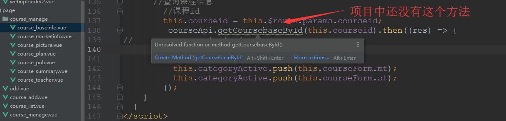

测试:

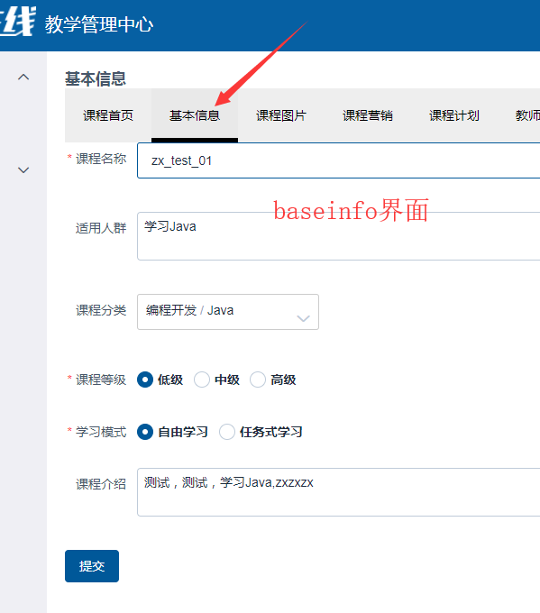

修改课程基本信息:

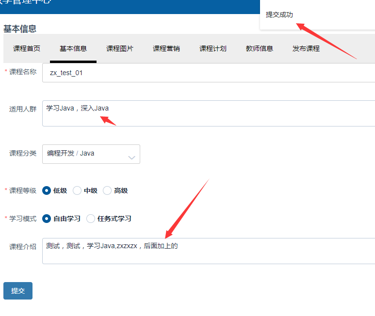

## 七、课程营销实战分析（对应课六）

课程营销信息包括课程价格、课程有效期等信息。

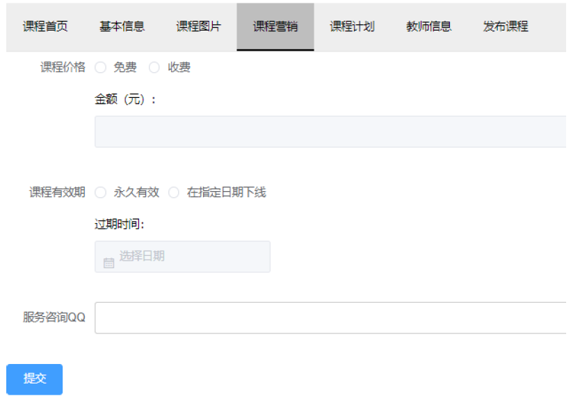

课程营销信息使用`course_market`表存储。

数据模型：

```java
@Data
@ToString
@Entity
@Table(name="course_market")
@GenericGenerator(name = "jpa-assigned", strategy = "assigned")
public class CourseMarket implements Serializable {
    private static final long serialVersionUID = -916357110051689486L;
    @Id
    @GeneratedValue(generator = "jpa-assigned")
    @Column(length = 32)
    private String id;
    private String charge;
    private String valid;
    private String qq;
    private Float price;
    private Float price_old;
//    private Date expires;
    @Column(name = "start_time")
    private Date startTime;
    @Column(name = "end_time")
    private Date endTime;

}
```

接口API

```java
@ApiOperation("获取课程营销信息")
CourseMarket getCourseMarketById(String courseId);

@ApiOperation("更新课程营销信息")
ResponseResult updateCourseMarket(String id, CourseMarket courseMarket);
```

DAO:

```java
public interface CourseMarketRepository extends JpaRepository<CourseMarket, String> {
}
```

`CourseService.java`中添加两个方法:

```java
//查询课程营销信息
public CourseMarket getCourseMarketById(String courseId) {
    Optional<CourseMarket> optional = courseMarketRepository.findById(courseId);
    if (!optional.isPresent()) {
        return optional.get();
    }
    return null;
}

@Transactional
public CourseMarket updateCourseMarket(String id, CourseMarket courseMarket) {
    CourseMarket one = this.getCourseMarketById(id);
    if (one != null) {
        one.setCharge(courseMarket.getCharge());
        one.setStartTime(courseMarket.getStartTime());//课程有效期，开始时间
        one.setEndTime(courseMarket.getEndTime());//课程有效期，结束时间
        one.setPrice(courseMarket.getPrice());
        one.setQq(courseMarket.getQq());
        one.setValid(courseMarket.getValid());
        courseMarketRepository.save(one);
    } else {
        //添加课程营销信息
        one = new CourseMarket();
        BeanUtils.copyProperties(courseMarket, one);
        //设置课程id
        one.setId(id);
        courseMarketRepository.save(one);
    }
    return one;
}
```

`Controller`:

```java
@Override
@PostMapping("/coursemarket/update/{id}")
public ResponseResult updateCourseMarket(@PathVariable("id") String id, @RequestBody CourseMarket
            courseMarket) {
        CourseMarket courseMarket_u = courseService.updateCourseMarket(id, courseMarket);
        if (courseMarket_u != null) {
            return new ResponseResult(CommonCode.SUCCESS);
        } else {
            return new ResponseResult(CommonCode.FAIL);
        }
    }

    @Override
    @GetMapping("/coursemarket/get/{courseId}")
public CourseMarket getCourseMarketById(@PathVariable("courseId") String courseId) {
    return courseService.getCourseMarketById(courseId);
}
```

前端:

`course.js`:

```js
//获取课程营销信息
export const getCourseMarketById = id => {
  return http.requestQuickGet(apiUrl+'/course/coursemarket/get/'+id)
}
// 更新课程营销信息
export const updateCourseMarket =(id,courseMarket) => {
  return http.requestPost(apiUrl+'/course/coursemarket/update/'+id,courseMarket)
}
```

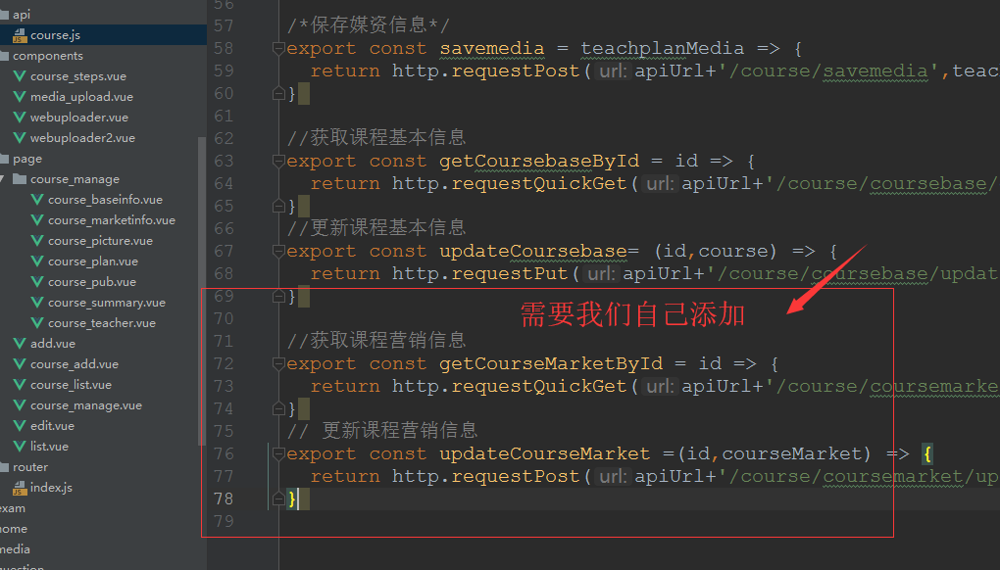

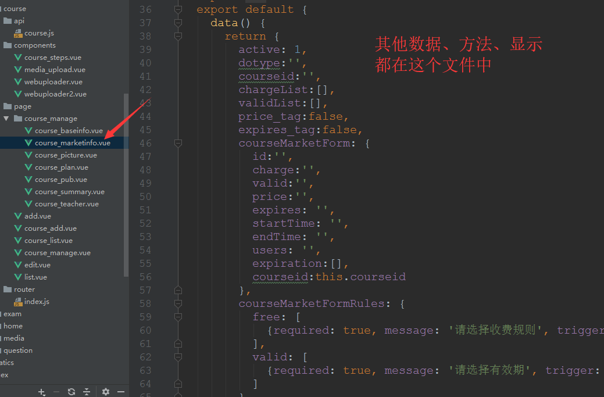

测试:

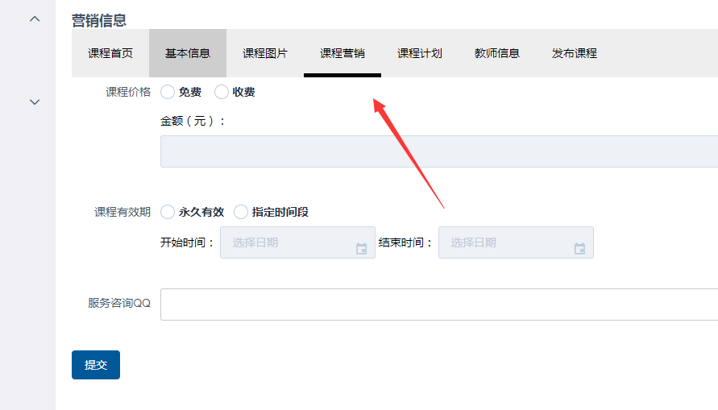