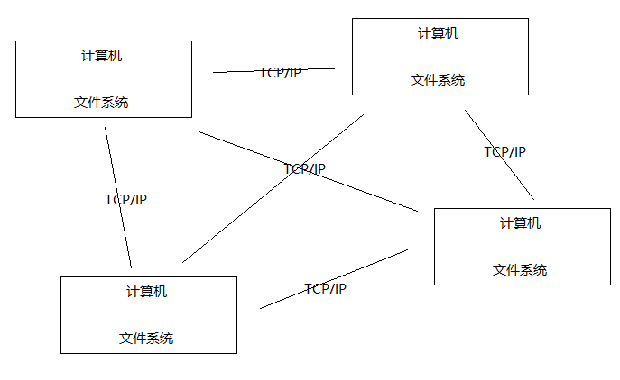
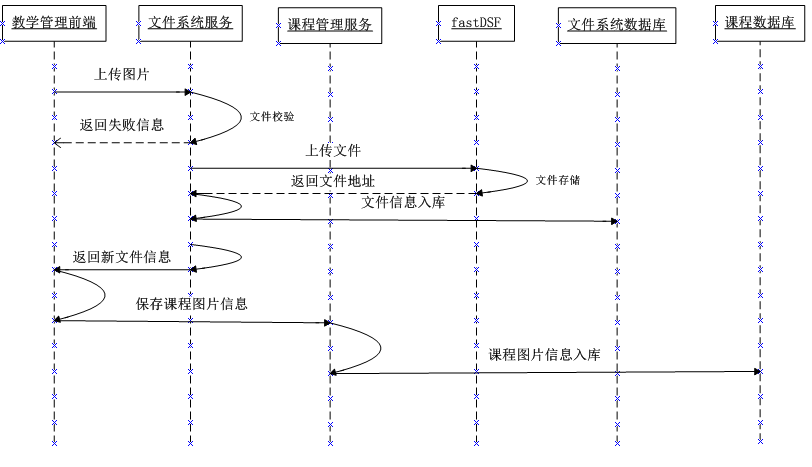

# 课程图片管理 分布式文件系统

## 一、分布式文件系统研究-技术应用场景

分布式文件系统解决了海量文件存储及传输访问的瓶颈问题，对海量视频的管理、对海量图片的管理等。

## 二、分布式文件系统研究-什么是文件系统

文件系统是负责管理和存储文件的系统软件，它是操作系统和硬件驱动之间的桥梁，操作系统通过文件系统
提供的接口去存取文件，用户通过操作系统访问磁盘上的文件。


可以想象一下，如果没有文件系统，你会要在 磁盘中去一个扇区一个扇区的查找你需要的文件。

## 三、分布式文件系统研究-什么是分布式文件系统

采用分布式文件系统可以将多个地点的文件系统通过网络连接起来，组成一个文件系统网络，结点之间通过网络进
行通信，一台文件系统的存储和传输能力有限，我们让文件在多台计算机上存储，通过多台计算共同传输。如下
图：



好处：
1、一台计算机的文件系统处理能力扩充到多台计算机同时处理。
2、一台计算机挂了还有另外副本计算机提供数据。
3、每台计算机可以放在不同的地域，这样用户就可以就近访问，提高访问速度。

### 1、主流的分布式文件系统

```
NFS
GFS
HDFS
```

### 2、分布式文件服务提供商

```
阿里的OSS(Object Storage Service)
七牛云存储
百度云存储
```

## 四、分布式文件系统研究-fastDSF架构介绍

​	FastDFS是用c语言编写的一款开源的分布式文件系统，它是由淘宝资深架构师余庆编写并开源。FastDFS专为互联网量身定制，充分考虑了==冗余备份、负载均衡、线性扩容等机制，并注重高可用、高性能==等指标，使用FastDFS很容易搭建一套高性能的文件服务器集群提供文件上传、下载等服务。

**为什么要使用fastDFS呢**？

​	上边介绍的NFS、GFS都是通用的分布式文件系统，通用的分布式文件系统的优点的是开发体验好，但是系统复杂性高、性能一般，而专用的分布式文件系统虽然开发体验性差，但是系统复杂性低并且性能高。==fastDFS非常适合存储图片等那些小文件，fastDFS不对文件进行分块==，所以它就没有分块合并的开销，fastDFS网络通信采用socket，通信速度很快。


## 五、分布式文件系统研究-fastDSF文件上传和下载流程

### 1、文件上传流程


客户端上传文件后存储服务器将文件ID返回给客户端，此文件ID用于以后访问该文件的索引信息。文件索引信息包括：组名，虚拟磁盘路径，数据两级目录，文件名。


```
group1
组名：文件上传后所在的storage组名称，在文件上传成功后有storage服务器返回，需要客户端自行保存。

M00
虚拟磁盘路径：storage配置的虚拟路径，与磁盘选项store_path*对应。如果配置了store_path0则是M00，如果配置了store_path1则是M01，以此类推。

/02/44
数据两级目录：storage服务器在每个虚拟磁盘路径下创建的两级目录，用于存储数据文件。

wKgDrE34E8wAAAAAGkEIYJK432.sh
文件名：与文件上传时不同。是由存储服务器根据特定信息生成，文件名包含：源存储服务器IP地址、文件创建时间戳、文件大小、随机数和文件拓展名等信息。
```

### 2、文件下载流程


## 六、分布式文件系统研究-fastDFS安装及配置文件说明

安装`Centos7`: 参考: <https://blog.csdn.net/babyxue/article/details/80970526>

虚拟机联网这一块需要好好记录一下 : 参考上面以及这个: 

<https://blog.csdn.net/qq_33214868/article/details/86713315>

<https://www.bilibili.com/video/av52857764?from=search&seid=12315753239418941708>

安装FastDFS这篇文章最好，不接受反驳:<https://www.cnblogs.com/chiangchou/p/fastdfs.html> （这里用单服务器）

> 配置fastdfs当时也参考了下面两个视频，但是感觉没有上面的博客讲的话，最后还是参考了上面的博客的配置: 
>
> <https://www.bilibili.com/video/av15286388/?p=2>
>
> 集群搭建: <https://www.bilibili.com/video/av15286452/?spm_id_from=333.788.videocard.0>


安装fastDFS需要安装C++环境:

```shell
yum -y install gcc gcc-c++
```


FastDFS依赖libevent库，需要安装：

```shell
yum -y install libevent
```


安装libfastcommon

`libfastcommon`是FastDFS官方提供的，`libfastcommon`包含了FastDFS运行所需要的一些基础库


**注意：libfastcommon安装好后会自动将库文件拷贝至/usr/lib64下，由于FastDFS程序引用usr/lib目录所以需要将/usr/lib64下的库文件拷贝至/usr/lib下**。

要拷贝的文件如下：


### 1、FastDFS--tracker安装

将`FastDFS_v5.05.tar.gz`拷贝至`/usr/local/`下


```shell
tar -zxvf FastDFS_v5.05.tar.gz
cd FastDFS
./make.sh 编译
./make.sh install 安装
```

安装成功将安装目录下的`conf`下的文件拷贝到`/etc/fdfs/`下


安装成功后进入`/etc/fdfs`目录：

拷贝一份新的tracker配置文件：
`cp tracker.conf.sample tracker.conf`
修改tracker.conf
`vi tracker.conf`


配置http端口：
`http.server_port=80`


`/usr/bin/fdfs_trackerd /etc/fdfs/tracker.conf restart`
启动的日志显示先停止5619进程（实际环境不是5619）再启动，如下图：


注意：如果没有显示上图要注意是否正常停止原有进程。

搭建多台虚拟机: 克隆一台: (这里就没有演示了，只用了一台服务器)

更改第二台的`ipaddress`:


### 2、FastDFS--storage安装


### 3、fdfs_test-client

`/etc/fdfs/client.conf`


### 4、总结

上面的三个文件`tracker.conf、storage.conf、client.conf`文件分别配置了同一台主机的下面几个路径:

```java
/home/fastdfs/tracker
/home/fastdfs/storage
/home/fastdfs/file
/home/fastdfs/client
```


## 七、分布式文件系统研究-测试-搭建测试环境

测试: 使用fdfs_test上传文件:

我们这里先配置`nginx.conf` ，修改那个返回文件`fileId`的配置别名:


在主机上访问: 


## 八、分布式文件系统研究-测试-上传文件测试

需要关闭防火墙。


测试程序:

配置文件`fastdfs-client.properties`:

```properties
fastdfs.connect_timeout_in_seconds = 70
fastdfs.network_timeout_in_seconds = 80
fastdfs.charset = UTF-8
fastdfs.tracker_servers = 192.168.142.101:22122
```

测试代码:

```java
// 上传测试
@Test
public void testUpload() {
    try {
        ClientGlobal.initByProperties("config/fastdfs-client.properties");
        System.out.println("network_timeout=" + ClientGlobal.g_network_timeout + "ms");
        System.out.println("charset=" + ClientGlobal.g_charset);
        //创建客户端
        TrackerClient tc = new TrackerClient();

        //连接tracker Server
        TrackerServer ts = tc.getConnection();

        if (ts == null) {
            System.out.println("getConnection return null");
            return;
        }
        //获取一个storage server
        StorageServer ss = tc.getStoreStorage(ts);
        if (ss == null) {
            System.out.println("getStoreStorage return null");
        }
        //创建一个storage存储客户端
        StorageClient1 sc1 = new StorageClient1(ts, ss);
        NameValuePair[] meta_list = null;  //new NameValuePair[0];
        //String item = "D:/mac.jpg";
        String item = "D:/Other/Picture/mac.jpg";
        String fileId = sc1.upload_file1(item, "png", meta_list);
        System.out.println("Upload local file " + item + " ok, fileid = " + fileId);
    } catch (Exception ex) {
        ex.printStackTrace();
    }
}
```

测试结果:

 

访问:


## 九、分布式文件系统研究-测试-文件下载测试

查询测试:

```java
@Test
public void testQueryFile() throws IOException, MyException {
    ClientGlobal.initByProperties("config/fastdfs-client.properties");
    TrackerClient tracker = new TrackerClient();
    TrackerServer trackerServer = tracker.getConnection();
    StorageServer storageServer = null;
    StorageClient storageClient = new StorageClient(trackerServer, storageServer);
    FileInfo fileInfo = storageClient.query_file_info("group1",
                                                      "M00/00/00/wKiOZVzn2guATp6mAFNQLSJi6q0589.png"); // mac.jpg的图片的地址
    System.out.println(fileInfo);
}
```

下载测试:

```java
// 下载测试
@Test
public void testDownload() throws IOException, MyException {
    ClientGlobal.initByProperties("config/fastdfs-client.properties");
    TrackerClient tracker = new TrackerClient();
    TrackerServer trackerServer = tracker.getConnection();
    StorageServer storageServer = null;
    StorageClient1 storageClient1 = new StorageClient1(trackerServer,
                                                       storageServer);
    byte[] result =
        storageClient1.download_file1("group1/M00/00/00/wKiOZVzn2guATp6mAFNQLSJi6q0589.png");
    File file = new File("D:/mac2.png");
    FileOutputStream fileOutputStream = new FileOutputStream(file);
    fileOutputStream.write(result);
    fileOutputStream.close();
}
```

测试结果:


## 十、分布式文件系统研究-搭建图片服务虚拟主机

配置` FastDFS-nginx-module`:

解压`fastdfs-nginx-module_v1.16.tar.gz`进入`fastdfs-nginx-module`目录。先改一个地方：然后将模块添加到`nginx`中。


拷贝文件: `mod_fastdfs.conf`文件到`/etc/fdfs`:

并修改`/etc/fdfs/mod_fastdfs.conf`文件:


复制 FastDFS 的部分配置文件到`/etc/fdfs` 目录:


配置nginx，修改`nginx.conf`


启动`nginx`:


浏览: 


配置`Nginx`图片服务虚拟机主机:

在nginx图片代理服务上配置图片服务器虚拟主机


```json
    upstream img_server_pool{
		#server 192.168.101.64:80 weight=10;
		server 192.168.142.101:80 weight=10;
	}
	
	server{
		listen       80;
		server_name  www.xuecheng.com;
		ssi on;
		ssi_silent_errors on;
		location / {
			alias   D:/xcEduUI01/xc-ui-pc-static-portal/;
			index  index.html;
		}
		
		#页面预览
		location /cms/preview/ {
			proxy_pass http://cms_server_pool/cms/preview/;
		}
		
		location /group1 {
			proxy_pass http://img_server_pool;
		}	
		
	}
```

修改`hosts`:


测试效果:

输入: 

```java
http://img.xuecheng.com/group1/M00/00/00/wKiOZVzn2guATp6mAFNQLSJi6q0589.png
```


## 十一、上传图片-需求分析


 





执行流程如下：

1、管理员进入教学管理前端，点击上传图片

2、图片上传至文件系统服务，文件系统请求fastDFS上传文件

3、文件系统将文件入库，存储到文件系统服务数据库中。

4、文件系统服务向前端返回文件上传结果，如果成功则包括文件的Url路径。

5、课程管理前端请求课程管理进行保存课程图片信息到课程数据库。

6、课程管理服务将课程图片保存在课程数据库。


## 十二、上传图片-服务端-创建文件系统服务工程


基本配置文件:

```yaml
server:
  port: 22100
spring:
  application:
    name: xc-service-base-filesystem
#mongo配置
  data:
    mongodb:
      database: xc_fs
      uri: mongodb://localhost:27017/xc_fs
#SpringMVC上传文件配置
  servlet:
    multipart:
      #默认支持文件上传.
      enabled: true
      #支持文件写入磁盘.
      file-size-threshold: 0
      # 上传文件的临时目录
      location:
      # 最大支持文件大小
      max-file-size: 1MB
      # 最大支持请求大小
      max-request-size: 30MB
xuecheng:
  fastdfs:
    connect_timeout_in_seconds: 5
    network_timeout_in_seconds: 30
    charset: UTF-8
    tracker_servers: 192.168.142.101:22122 #多个 trackerServer中间以逗号分隔
```


## 十三、上传图片-服务端-Api接口定义


```java
@Api(value = "文件管理接口", tags = "文件管理接口，提供文件的上传、下载、查询等")
public interface FileSystemControllerApi {

    /**
     * 上传文件
     * @param multipartFile 文件
     * @param filetag       文件标签
     * @param businesskey   业务key
     * @param metedata      元信息,json格式
     * @return
     */
    @ApiOperation("上传文件接口")
    UploadFileResult upload(MultipartFile multipartFile,
                            String filetag,
                            String businesskey,
                            String metadata);
}
```


## 十四、上传图片-服务端-Api接口开发

在`filesystem`服务中编写相关上传图片逻辑:

`Dao`: 

```java
import com.xuecheng.framework.domain.filesystem.FileSystem;
import org.springframework.data.mongodb.repository.MongoRepository;

public interface FileSystemRepository extends MongoRepository<FileSystem,String> {
    
}
```

`Service`:

```java
@Service
public class FileSystemService {

    @Autowired
    FileSystemRepository fileSystemRepository;

    @Value("${xuecheng.fastdfs.tracker_servers}")
    String tracker_servers;
    @Value("${xuecheng.fastdfs.connect_timeout_in_seconds}")
    int connect_timeout_in_seconds;
    @Value("${xuecheng.fastdfs.network_timeout_in_seconds}")
    int network_timeout_in_seconds;
    @Value("${xuecheng.fastdfs.charset}")
    String charset;

    public UploadFileResult upload(MultipartFile file,
                                   String filetag,
                                   String businesskey,
                                   String metadata) {

        if (file == null) {
            ExceptionCast.cast(FileSystemCode.FS_UPLOADFILE_FILEISNULL);
        }
        // 第一步: 将文件上传到fastDFS中，得到一个文件id。
        String fileId = fdfs_upload(file);

        System.out.println(fileId);

        // 第二步: 将文件id及其他信息存储到mongodb中。
        //创建文件信息对象
        FileSystem fileSystem = new FileSystem();
        //文件id
        fileSystem.setFileId(fileId);
        //文件在文件系统中的路径
        fileSystem.setFilePath(fileId);
        //业务标识
        fileSystem.setBusinesskey(businesskey);
        //标签
        fileSystem.setFiletag(filetag);
        //元数据
        if (StringUtils.isNotEmpty(metadata)) {
            try {
                Map map = JSON.parseObject(metadata, Map.class);
                fileSystem.setMetadata(map);
            } catch (Exception e) {
                e.printStackTrace();
            }
        }
        //名称
        fileSystem.setFileName(file.getOriginalFilename());
        //大小
        fileSystem.setFileSize(file.getSize());
        //文件类型
        fileSystem.setFileType(file.getContentType());
        fileSystemRepository.save(fileSystem);
        return new UploadFileResult(CommonCode.SUCCESS, fileSystem);
    }

    //上传文件到fdfs，返回文件id
    private String fdfs_upload(MultipartFile file) {

        try {
            //加载fdfs的配置
            initFdfsConfig();
            //创建tracker client
            TrackerClient trackerClient = new TrackerClient();
            //获取trackerServer
            TrackerServer trackerServer = trackerClient.getConnection();
            //获取storage
            StorageServer storeStorage = trackerClient.getStoreStorage(trackerServer);
            //创建storage client
            StorageClient1 storageClient1 = new StorageClient1(trackerServer, storeStorage);

            //上传文件

            //文件字节
            byte[] bytes = file.getBytes();
            //文件原始名称
            String originalFilename = file.getOriginalFilename();
            //文件扩展名
            String extName = originalFilename.substring(originalFilename.lastIndexOf(".") + 1);
            //文件id
            String file1 = storageClient1.upload_file1(bytes, extName, null);
            return file1;
        } catch (Exception e) {
            e.printStackTrace();
        }
        return null;
    }

    // 加载Fdsf的配置
    private void initFdfsConfig() {
        try {
            ClientGlobal.initByTrackers(tracker_servers);
            ClientGlobal.setG_connect_timeout(connect_timeout_in_seconds);
            ClientGlobal.setG_network_timeout(network_timeout_in_seconds);
            ClientGlobal.setG_charset(charset);
        } catch (Exception e) {
            e.printStackTrace();
            //初始化文件系统出错
            ExceptionCast.cast(FileSystemCode.FS_INITFDFSERROR);
        }
    }
}
```

其中`FileSystemCode.java`种需要添加一个错误:


`Controller`:

```java
@RestController
@RequestMapping("/filesystem")
public class FileSystemController implements FileSystemControllerApi {

    @Autowired
    FileSystemService fileSystemService;

    @Override
    @PostMapping("/upload")
    public UploadFileResult upload(@RequestParam("file") MultipartFile file,
                                   @RequestParam(value = "filetag", required = true)
                                   String filetag,
                                   @RequestParam(value = "businesskey", required = false)
                                   String businesskey,
                                   @RequestParam(value = "metedata", required = false)
                                   String metadata) {

        return fileSystemService.upload(file, filetag, businesskey, metadata);
    }
}
```

## 十五、上传图片-前端-上传文件测试

测试前需要先启动一下服务器的`FastDFS`服务 (可以配置开机启动)。


然后要关闭防火墙，不然会上传失败: 


**这些准备工作可以编写在一个shell脚本中，开启服务器就执行脚本**:

```shell
#!bin/bash
/usr/bin/fdfs_trackerd /etc/fdfs/tracker.conf restart # 启动tracker
/usr/bin/fdfs_storaged /etc/fdfs/storage.conf restart # 启动storage
systemctl stop firewalld.service # 关闭防火墙
/usr/local/nginx/sbin/nginx # 开启nginx
ps aux | grep fdfs # 查看fdfs的服务是否开启
```


上传一个`test1.html`文件:


查看mongodb数据库:


再测试一波，上传`test2.html`:


**前端部分完善和测试如下**

**注意注意： 在前端的course_picture.vue文件中需要加上一个name="file"**


访问存在服务器的图片: 


## 十六、保存课程图片-服务端开发

图片上传到文件系统后，其它子系统如果想使用图片可以引用图片的地址，课程管理模块使用图片的方式是将图片
地址保存到课程数据库中。
业务流程如下：
1、上传图片到文件系统服务
2、保存图片地址到课程管理服务
在课程管理服务创建保存课程与图片对应关系的表 `course_pic`。


3、在`course_pic`保存图片成功后方可查询课程图片信息。

通过查询`course_pic`表数据则查询到某课程的图片信息。 

API设计:


```java
@ApiOperation("添加课程与图片的关联信息")
ResponseResult addCoursePic(String courseId, String pic);
```

模型: 


`Dao`：

```java
public interface CoursePicRepository extends JpaRepository<CoursePic, String> {
}
```

`Service`:

```java
// 添加图片和课程关联
@Transactional
public ResponseResult saveCoursePic(String courseId, String pic) {
    //查询课程图片
    Optional<CoursePic> picOptional = coursePicRepository.findById(courseId);
    CoursePic coursePic = null;
    if (picOptional.isPresent()) {
        coursePic = picOptional.get();
    }
    //没有课程图片则新建对象
    if (coursePic == null) {
        coursePic = new CoursePic();
    }
    coursePic.setCourseid(courseId);
    coursePic.setPic(pic);
    //保存课程图片
    coursePicRepository.save(coursePic);
    return new ResponseResult(CommonCode.SUCCESS);
}
```

`Controller`:

```java
@Override
@PostMapping("/coursepic/add")
public ResponseResult addCoursePic(@RequestParam("courseId") String courseId,
                                   @RequestParam("pic") String pic) {
    //保存课程图片
    return courseService.saveCoursePic(courseId,pic);
}
```

## 十七、保存课程图片-保存图片测试


前端相关逻辑: 


测试: 


## 十八、查询课程图片开发

需求分析: **课程图片上传成功，再次进入课程上传页面应该显示出来已上传的图片**。

 在课程管理服务定义查询方法。

API

```java
@ApiOperation("获取课程基础信息")
CoursePic findCoursePic(String courseId);
```

`Service`:

```java
// 查询课程图片
public CoursePic findCoursePic(String courseId) {
    Optional<CoursePic> picOptional = coursePicRepository.findById(courseId);
    if (picOptional.isPresent()) {
        CoursePic coursePic = picOptional.get();
        return coursePic;
    }
    return null;
}
```

`Controller`:

```java
@Override
@GetMapping("/coursepic/list/{courseId}")
public CoursePic findCoursePic(@PathVariable("courseId") String courseId) {
    return courseService.findCoursePic(courseId);
}
```

前端

逻辑: 


测试:


## 十九、删除课程图片-服务端开发

课程图片上传成功后，可以重新上传，方法是先删除现有图片再上传新图片。
注意：此删除只删除课程数据库的课程图片信息，**不去删除文件数据库的文件信息及文件系统服务器上的文件**，由于课程图片来源于该用户的文件库，所以此图片可能存在多个地方共用的情况，所以要删除文件系统中的文件需要到图片库由用户确认后再删除。

API:

```java
@ApiOperation("删除课程图片")
ResponseResult deleteCoursePic(String courseId);
```

`Controller`:

```java
@Override
@DeleteMapping("/coursepic/delete")
public ResponseResult deleteCoursePic(@RequestParam("courseId") String courseId) {
    return courseService.deleteCoursePic(courseId);
}
```

`Service`:

```java
//删除课程图片
@Transactional
public ResponseResult deleteCoursePic(String courseId) {
    //执行删除，返回1表示删除成功，返回0表示删除失败
    long result = coursePicRepository.deleteByCourseid(courseId);
    if (result > 0) {
        return new ResponseResult(CommonCode.SUCCESS);
    }
    return new ResponseResult(CommonCode.FAIL);
}
```

`Dao`中要手动增加一个`deleteByCourseid`的方法，因为删除是否成功需要看返回值。

```java
public interface CoursePicRepository extends JpaRepository<CoursePic, String> {
    long deleteByCourseid(String courseId); 
}
```

## 二十、删除课程图片-前端开发

API的调用: 

```js
//删除课程图片
export const deleteCoursePic= courseId => {
return http.requestDelete(apiUrl+'/course/coursepic/delete?courseId='+courseId)
}
```


`before-remove`说明：删除文件之前的钩子，参数为上传的文件和文件列表，**若返回 false 或者返回 Promise 且被reject，则停止删除**。

Promise是ES6提供的用于异步处理的对象，因为axios提交是异步提交，这里使用promise作为返回值。
Promise的使用方法如下：
Promise对象在处理过程中有三种状态：
pending：进行中
resolved：操作成功
rejected: 操作失败
Promise的构建方法如下：

```js
const promise = new Promise(function(resolve,reject){
    //...TODO...
    if(操作成功){
        resolve(value);
    }else{
        reject(error);
    }
})
```

上边的构造方法function(resolve,reject)执行流程如下：
1）方法执行一些业务逻辑。
2）如果操作成功将Promise的状态由pending变为resolved，并将操作结果传出去
3）如果操作失败会将promise的状态由pending变为rejected，并将失败结果传出去。
上边说的操作成功将操作结果传给谁了呢？操作失败将失败结果传给谁了呢？
通过promise的then、catch来指定

```js
promise.then(function (result) {
	console.log('操作成功：' + result);
});
promise.catch(function (reason) {
	console.log('操作失败：' + reason);
});
```

例子如下：
1、定义一个方法，返回promise对象

```js
testpromise(i){
    return new Promise((resolve,reject)=>{
        if(i % 2==0){
            resolve('成功了')
        }else{
            reject('拒绝了')
        }
    })
}
```

2、调用此方法
向方法传入偶数、奇数进行测试。

```js
this.testpromise(3).then(res=>{//在then中对成功结果进行处理
	alert(res) // 打印"成功了"
}).catch(res=>{//在catch中对操作失败结果进行处理 (reject)
	alert(res) // 打印 "拒绝了"
})
```

测试: 

