# 课程预览 Eureka Feign

## 一、Eureka注册中心-Eureka介绍


1、Eureka Server是服务端，负责管理各各微服务结点的信息和状态。

2、在微服务上部署Eureka Client程序，远程访问Eureka Server将自己注册在Eureka Server。

3、微服务需要调用另一个微服务时从Eureka Server中获取服务调用地址，进行远程调用。

## 二、Eureka注册中心-搭建Eureka单机环境

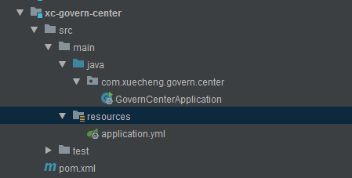

`GovernCenterApplication.java`:

```java
@EnableEurekaServer//标识这是一个Eureka服务
@SpringBootApplication
public class GovernCenterApplication {
    public static void main(String[] args) {
        SpringApplication.run(GovernCenterApplication.class, args);
    }
}
```

`application.yml`:

```yaml
server:
  port: 50101 #服务端口
spring:
  application:
    name: xc-govern-center #指定服务名
eureka:
  client:
    registerWithEureka: false #服务注册，是否将自己注册到Eureka服务中
    fetchRegistry: false #服务发现，是否从Eureka中获取注册信息
    serviceUrl: #Eureka客户端与Eureka服务端的交互地址，高可用状态配置对方的地址，单机状态配置自己（如果不配置则默认本机8761端口）
      defaultZone: http://localhost:50101/eureka/
  server:
    enable-self-preservation: false #是否开启自我保护模式
    eviction-interval-timer-in-ms: 60000 #服务注册表清理间隔（单位毫秒，默认是60*1000）
```

`registerWithEureka`：被其它服务调用时需向Eureka注册
`fetchRegistry`：需要从Eureka中查找要调用的目标服务时需要设置为true
`serviceUrl.defaultZone`:  配置上报Eureka服务地址高可用状态配置对方的地址，单机状态配置自己
`enable-self-preservation`：自保护设置，下边有介绍。
`eviction-interval-timer-in-ms`：清理失效结点的间隔，在这个时间段内如果没有收到该结点的上报则将结点从服务列表中剔除。

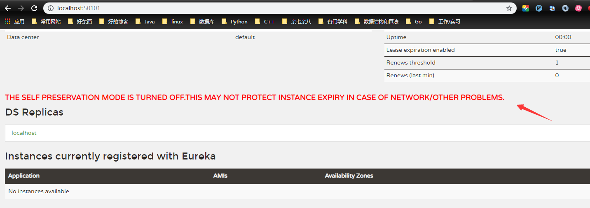

意思: 自我保护模式被关闭。在网络或其他问题的情况下可能不会保护实例失效。

Eureka Server有一种自我保护模式，当微服务不再向Eureka Server上报状态，Eureka Server会从服务列表将此
服务删除，如果出现网络异常情况（微服务正常），此时Eureka server进入自保护模式，不再将微服务从服务列
表删除。
在开发阶段建议关闭自保护模式(生成模式下可以开启)。

## 三、Eureka注册中心-搭建Eureka高可用环境

Eureka Server 高可用环境需要部署两个Eureka server，它们互相向对方注册。如果在本机启动两个Eureka需要注意两个Eureka Server的端口要**设置不一样**，这里我们部署一个Eureka Server工程，将端口可配置，制作两个Eureka Server启动脚本，启动不同的端口，如下图：


1、在实际使用时Eureka Server至少部署两台服务器，实现高可用。

2、两台Eureka Server**互相注册**。

3、微服务需要连接两台Eureka Server注册，当其中一台Eureka死掉也不会影响服务的注册与发现。

4、微服务会定时向Eureka server发送心跳，报告自己的状态。

5、微服务从注册中心获取服务地址以RESTful方式发起远程调用。

**相关基本配置**: 

1、端口可配置

```yaml
server:
	port: ${PORT:50101} #服务端口，前面的PORT可以在运行的时候指定
```

2、Eureka服务端的交互地址可配置

```yaml
eureka:
	client:
		registerWithEureka: true #服务注册，是否将自己注册到Eureka服务中
		fetchRegistry: true #服务发现，是否从Eureka中获取注册信息
		serviceUrl: #Eureka客户端与Eureka服务端的交互地址，高可用状态配置对方的地址，单机状态配置自己（如果不配置则默认本机8761端口）
			defaultZone: ${EUREKA_SERVER:http://eureka02:50102/eureka/}
```

3、Eureka 组成高可用，两个Eureka互相向对方注册，这里需要通过域名或主机名访问（改一下`hosts`），这里我们设置两个Eureka服务的主机名分别为 eureka01、eureka02。

```yaml
eureka:
	client:
		registerWithEureka: true #服务注册，是否将自己注册到Eureka服务中
		fetchRegistry: true #服务发现，是否从Eureka中获取注册信息
		serviceUrl: #Eureka客户端与Eureka服务端的交互地址，高可用状态配置对方的地址，单机状态配置自己（如果不配置则默认本机8761端口）
			defaultZone: ${EUREKA_SERVER:http://eureka02:50102/eureka/}
	server:
		enable‐self‐preservation: false #是否开启自我保护模式
		eviction‐interval‐timer‐in‐ms: 60000 #服务注册表清理间隔（单位毫秒，默认是60*1000）
	instance:
		hostname: ${EUREKA_DOMAIN:eureka01}
```

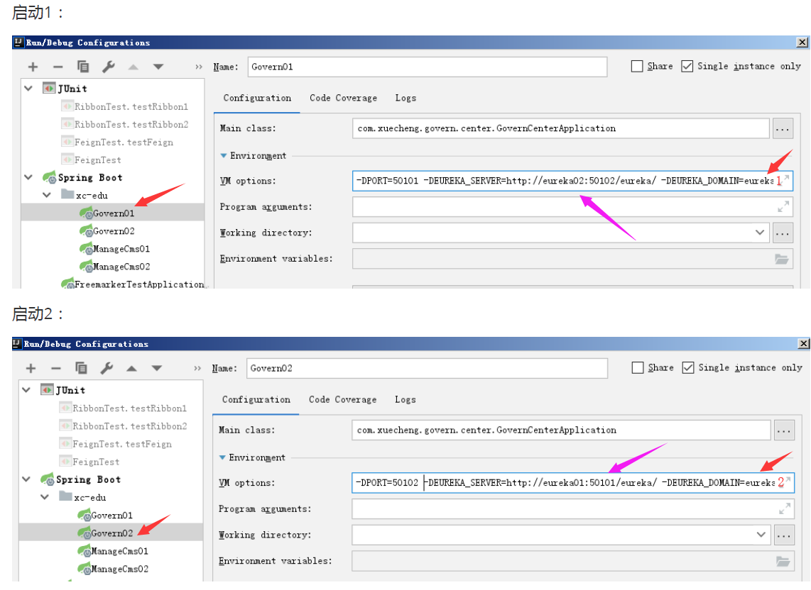

## 四、Eureka注册中心-将服务注册到Eureka Server

将cms服务注册到`Eureka Server`，在cms服务中添加`eureka-client`依赖。

```xml
<dependency>
    <groupId>org.springframework.cloud</groupId>
    <artifactId>spring-cloud-starter-netflix-eureka-client</artifactId>
</dependency>
```

```yaml
eureka:
  client:
    registerWithEureka: true #服务注册开关
    fetchRegistry: true #服务发现开关
    serviceUrl: #Eureka客户端与Eureka服务端进行交互的地址，多个中间用逗号分隔
      defaultZone: ${EUREKA_SERVER:http://localhost:50101/eureka/}
  instance:
    prefer-ip-address: true #将自己的ip地址注册到Eureka服务中
    ip-address: ${IP_ADDRESS:127.0.0.1}
    instance-id: ${spring.application.name}:${server.port} #指定实例id
```

添加一个注解: `@EnableDiscoveryClient`

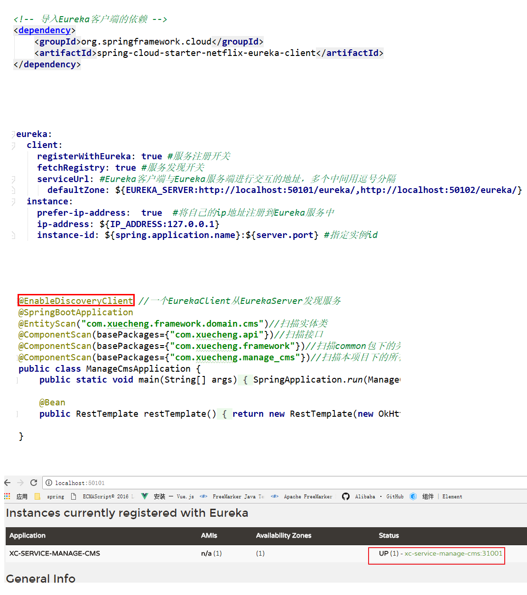

启动`cms`服务，然后查看

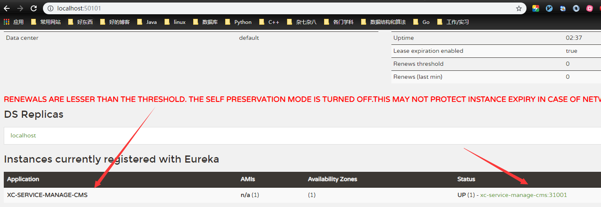

同理，把课程管理也注册到`Eureka`中。

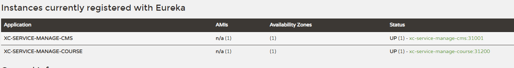

## 五、Feign远程调用-客户端负载均衡介绍

**服务端的负载均衡**: 硬件比如：F5、Array等，软件比如：`LVS、Nginx`等。


用户请求先到达负载均衡器（也相当于一个服务），负载均衡器根据负载均衡算法将请求转发到微服务。负载均衡算法有：轮训、随机、加权轮训、加权随机、地址哈希等方法，负载均衡器维护一份服务列表，根据负载均衡算法将请求转发到相应的微服务上，所以负载均衡可以为微服务集群分担请求，降低系统的压力。

`Ribbon`是**客户端的负载均衡器**。

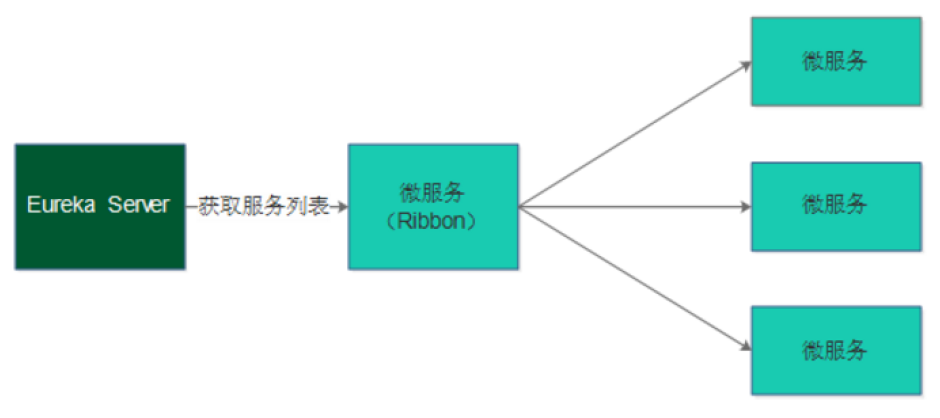

1、在消费微服务中使用Ribbon实现负载均衡，Ribbon先从EurekaServer中获取服务列表。

2、Ribbon根据负载均衡的算法去调用微服务。

## 六、Feign远程调用-Ribbon测试

两个测试Ribbon的服务

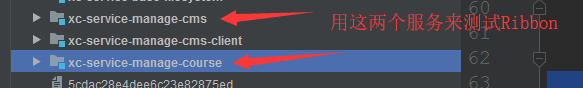

用`course`来调用`cms`:

在`course`中引入依赖: 

由于依赖了spring-cloud-starter-eureka，会自动添加spring-cloud-starter-ribbon依赖

```xml
<!--下面这个不要添加，erueka已经包含了ribbon-->
<dependency>
    <groupId>org.springframework.cloud</groupId>
    <artifactId>spring-cloud-starter-ribbon</artifactId>
</dependency>
<dependency>
    <groupId>com.squareup.okhttp3</groupId>
    <artifactId>okhttp</artifactId>
</dependency>
```

在课程管理服务的`application.yml`中配置ribbon参数

```yaml
ribbon:
  MaxAutoRetries: 2 #最大重试次数，当Eureka中可以找到服务，但是服务连不上时将会重试
  MaxAutoRetriesNextServer: 3 #切换实例的重试次数
  OkToRetryOnAllOperations: false #对所有操作请求都进行重试，如果是get则可以，如果是post，put等操作没有实现幂等的情况下是很危险的,所以设置为false
  ConnectTimeout: 5000 #请求连接的超时时间
  ReadTimeout: 6000 #请求处理的超时时间
```

这里启动两个`cms`的实例，然后在`course`中负载均衡的调用`cms`实例：

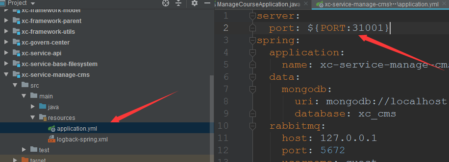

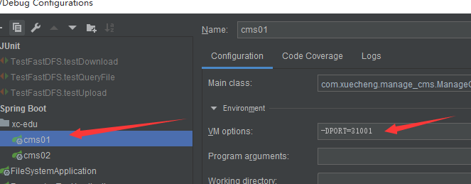

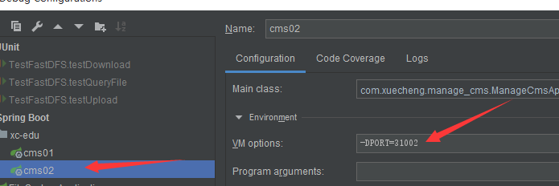

1）启动两个cms服务，注意端口要不一致
启动完成观察Eureka Server的服务列表

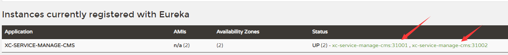

定义RestTemplate，使用`@LoadBalanced`注解
在课程管理服务的启动类中定义RestTemplate

```java
@Bean
@LoadBalanced //一定要加上这个注解
public RestTemplate restTemplate() {
    return new RestTemplate(new OkHttp3ClientHttpRequestFactory());
}
```

测试: 

**添加@LoadBalanced注解后，restTemplate会走LoadBalancerInterceptor拦截器**，此拦截器中会通过
RibbonLoadBalancerClient查询服务地址，可以在此类打断点观察每次调用的服务地址和端口，两个cms服务会轮流被调用。

测试: 

```java
@SpringBootTest
@RunWith(SpringRunner.class)
public class TestRibbon {

    @Autowired
    RestTemplate restTemplate;

    //负载均衡调用
    @Test
    public void testRibbon() {
        //服务id
        String serviceId = "XC-SERVICE-MANAGE-CMS";
        for (int i = 0; i < 10; i++) {
            //通过服务id调用
            ResponseEntity<CmsPage> forEntity = restTemplate.getForEntity("http://" + serviceId
                    + "/cms/page/get/5a754adf6abb500ad05688d9", CmsPage.class);
            CmsPage cmsPage = forEntity.getBody();
            System.out.println(cmsPage);
        }
    }
}

```

结果:

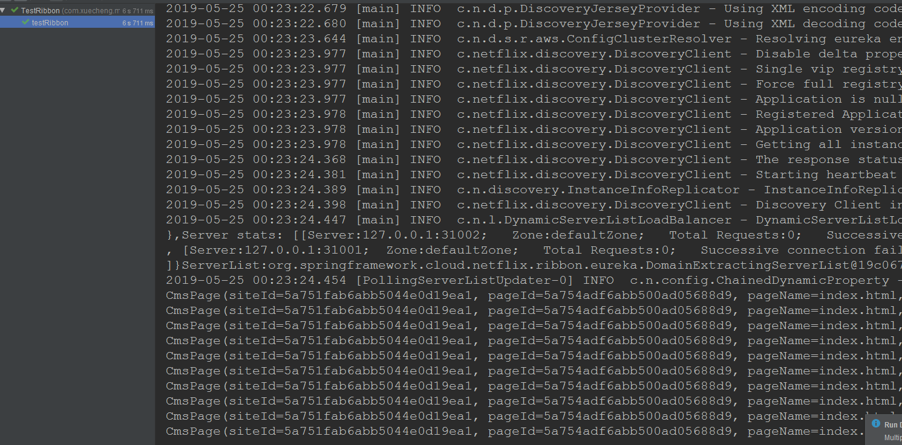

## 七、Feign远程调用-Feign测试

Feign是Netflix公司开源的轻量级rest客户端，使用Feign可以非常方便的实现Http 客户端。Spring Cloud引入
Feign并且集成了Ribbon实现客户端负载均衡调用。

1、在课程管理服务添加下边的依赖：

```xml
<dependency>
    <groupId>org.springframework.cloud</groupId>
    <artifactId>spring-cloud-starter-openfeign</artifactId>
</dependency>
```

2、定义FeignClient接口

参考Swagger文档定义FeignClient，注意接口的Url、请求参数类型、返回值类型与Swagger接口一致。
在课程管理服务中创建`client`包，定义查询cms页面的客户端该用接口：

```java
@FeignClient(value = "XC-SERVICE-MANAGE-CMS")
public interface CmsPageClient {

    @GetMapping("/cms/page/get/{id}")
    CmsPage findById(@PathVariable("id") String id);
}
```

3、在启动类上添加`@EnableFeignClients`，这样就会去扫描添加了`@FeignClient`的类。

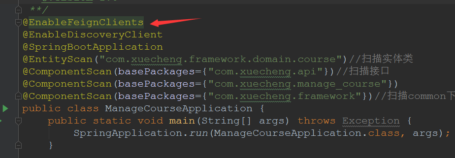

4、测试

记得这里要先启动`Eureka`。

还是调用`cms`服务中的`findCmsPageById`方法，根据id查询CmsPage。

```java
@SpringBootTest
@RunWith(SpringRunner.class)
public class TestFeign {

    // 直接注入那个接口即可
    // Spring会扫描标记了@FeignClient注解的接口，并生成此接口的代理对象
    @Autowired
    CmsPageClient cmsPageClient;

    @Test
    public void testFeign(){
        CmsPage cmsPage = cmsPageClient.findById("5a754adf6abb500ad05688d9");
        System.out.println(cmsPage);
    }
}
```

测试结果:

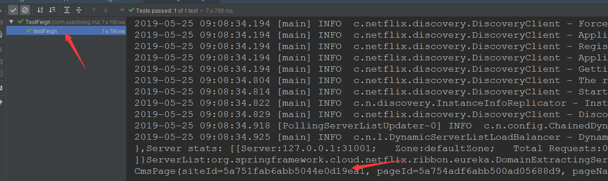

## 八、课程预览技术方案

课程预览是为了保证课程发布后的正确性，通过课程预览可以直观的通过课程详情页面看到课程的信息是否正确，
通过课程预览看到的页面内容和课程发布后的页面内容是一致的

nginx比tomcat的性能更好。

下图是课程详情页面的预览图：

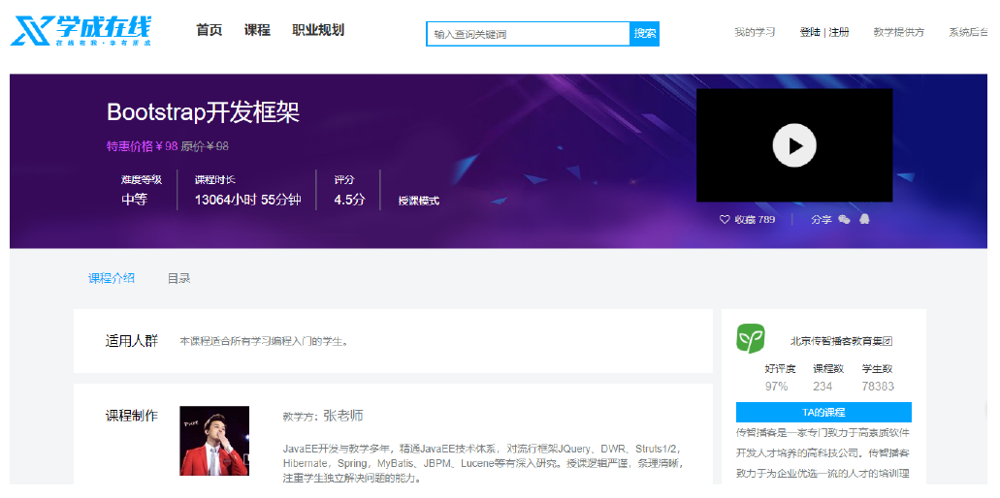

课程详情页面技术方案

**一个需求就是SEO，要非常有利于爬虫抓取页面上信息**，并且生成页面快照，利于用户通过搜索引擎搜索
课程信息。

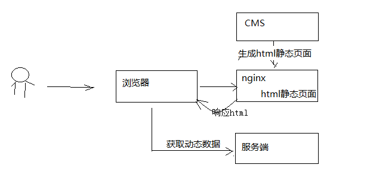

优点：**使用Nginx作为web服务器，并且直接访问html页面，性能出色**。
缺点：需要维护大量的静态页面，增加了维护的难度。
选择方案2作为课程详情页面的技术解决方案，将课程详情页面生成Html静态化页面，并发布到Nginx上。

## 九、课程详情页面静态化-静态页面测试

页面内容组成:

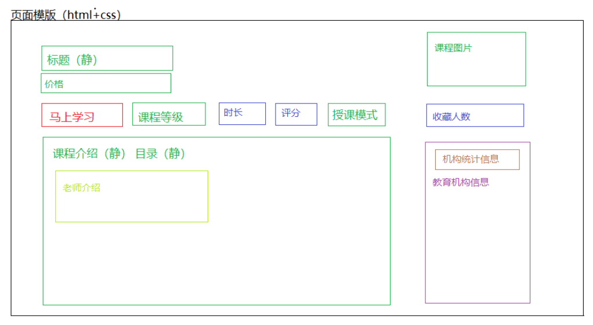

打开静态页面，观察每部分的内容。
**红色表示动态信息，红色以外表示静态信息**。
红色动态信息：表示一个按钮，根据用户的登录状态、课程的购买状态显示按钮的名称及按钮的事件。

**页面拆分**

将**课程资料中的“静态页面目录”中的static目录拷贝到D:/xcEdu01/下**

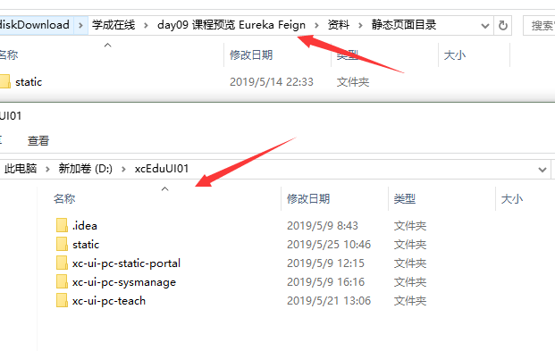

在nginx中配置静态虚拟主机如下：

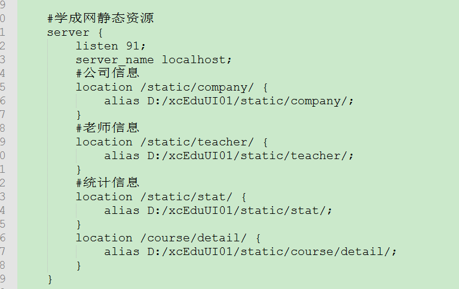

```properties
	#学成网静态资源
	server {
		listen 91;
		server_name localhost;
		#公司信息
		location /static/company/ {
			alias D:/xcEduUI01/static/company/;
		}
		#老师信息
		location /static/teacher/ {
			alias D:/xcEduUI01/static/teacher/;
		}
		#统计信息
		location /static/stat/ {
			alias D:/xcEduUI01/static/stat/;
		}
		location /course/detail/ {
			alias D:/xcEduUI01/static/course/detail/;
		}
	}
```

通过www.xuecheng.com虚拟主机转发到静态资源
由于课程页面需要通过SSI加载页头和页尾所以需要通过www.xuecheng.com虚拟主机转发到静态资源
在www.xuecheng.com虚拟主机加入如下配置：

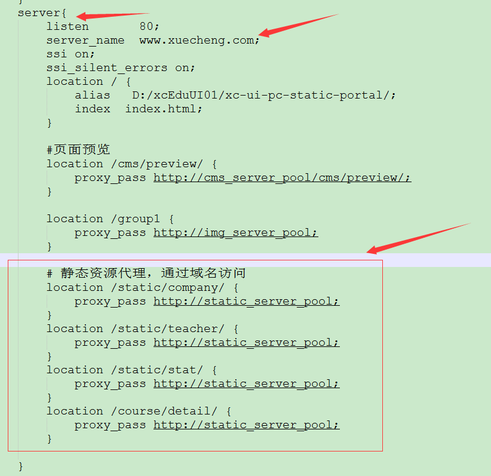

```properties
		# 静态资源代理，通过域名访问
		location /static/company/ {
			proxy_pass http://static_server_pool;
		}
		location /static/teacher/ {
			proxy_pass http://static_server_pool;
		}
		location /static/stat/ {
			proxy_pass http://static_server_pool;
		}
		location /course/detail/ {
			proxy_pass http://static_server_pool;
		}
```

配置upstream实现请求转发到资源服务虚拟主机：

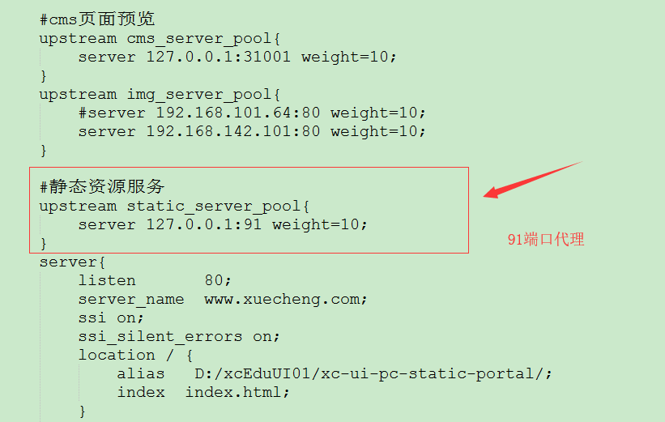

```properties
	#静态资源服务
	upstream static_server_pool{
		server 127.0.0.1:91 weight=10;
	}
```

门户静态资源路径

门户中的一些图片、样式等静态资源统一通过/static路径对外提供服务，在www.xuecheng.com虚拟主机中配置如下：

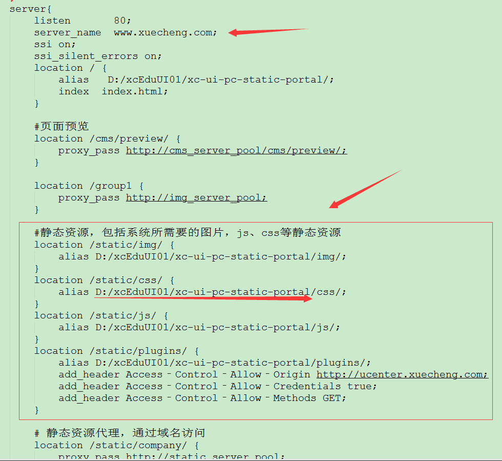

```properties
        #静态资源，包括系统所需要的图片，js、css等静态资源
		location /static/img/ {
			alias D:/xcEduUI01/xc-ui-pc-static-portal/img/;
		}
		location /static/css/ {
			alias D:/xcEduUI01/xc-ui-pc-static-portal/css/;
		}
		location /static/js/ {
			alias D:/xcEduUI01/xc-ui-pc-static-portal/js/;
		}
		location /static/plugins/ {
			alias D:/xcEduUI01/xc-ui-pc-static-portal/plugins/;
			add_header Access‐Control‐Allow‐Origin http://ucenter.xuecheng.com;
			add_header Access‐Control‐Allow‐Credentials true;
			add_header Access‐Control‐Allow‐Methods GET;
		}		
```

cors跨域参数：
`Access-Control-Allow-Origin`：允许跨域访问的外域地址
如果允许任何站点跨域访问则设置为*，通常这是不建议的。
`Access-Control-Allow-Credentials`： 允许客户端携带证书访问
`Access-Control-Allow-Methods`：允许客户端跨域访问的方法

效果:

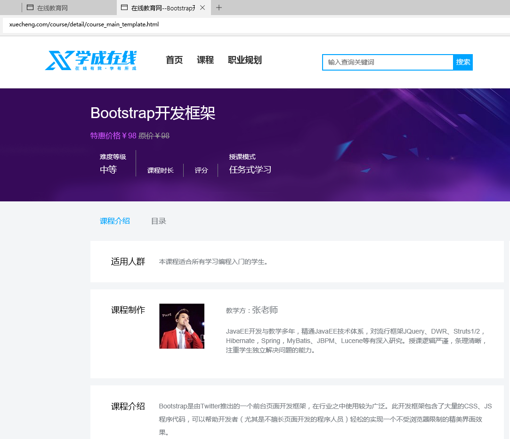

页面动态维护的脚本:

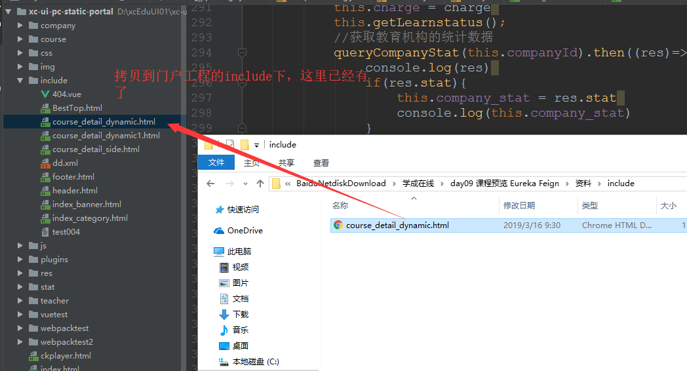

注意在`D:/xcEdu01/static/course/detail`下面有一个`course_main_template.html`模板文件，这个就是课程详情的静态内容模板，将来做模板就基于这个做。

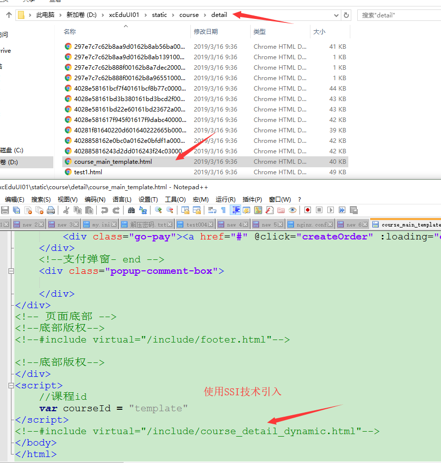

## 十、课程详情页面静态化-课程详情模型数据查询接口

静态化操作需要模型数据方可进行静态化，课程数据模型由课程管理服务提供，仅供课程静态化程序调用使用。

```java
@Data
@ToString
@NoArgsConstructor
public class CourseView implements Serializable {
    private CourseBase courseBase; //基础信息
    private CourseMarket courseMarket; //课程营销
    private CoursePic coursePic; //课程图片
    private TeachplanNode TeachplanNode;//教学计划
}
```

接口定义如下

```java
@ApiOperation("课程视图查询")
CourseView courseview(String id);
```

`Controller`:

```java
@Override
@GetMapping("/courseview/{id}")
public CourseView courseview(@PathVariable("id") String id) {
    return courseService.getCoruseView(id);
}
```

`Service`:

```java
//获取课程详情页面信息，包括基本信息、图片、营销、课程计划
    public CourseView getCourseView(String id) {
        CourseView courseView = new CourseView();

        //查询课程基本信息
        Optional<CourseBase> courseBaseOptional = courseBaseRepository.findById(id);
        if(courseBaseOptional.isPresent()){
            CourseBase courseBase = courseBaseOptional.get();
            courseView.setCourseBase(courseBase);
        }
        //查询课程营销信息
        Optional<CourseMarket> courseMarketOptional = courseMarketRepository.findById(id);
        if(courseMarketOptional.isPresent()){
            CourseMarket courseMarket = courseMarketOptional.get();
            courseView.setCourseMarket(courseMarket);
        }
        //查询课程图片信息
        Optional<CoursePic> picOptional = coursePicRepository.findById(id);
        if(picOptional.isPresent()){
            CoursePic coursePic = picOptional.get();
            courseView.setCoursePic(coursePic);
        }
        //查询课程计划信息
        TeachplanNode teachplanNode = teachplanMapper.selectList(id);
        courseView.setTeachplanNode(teachplanNode);

        return courseView;
    }
```

这里要添加一个`Dao`，查询课程营销信息:

```java
public interface CourseMarketRepository extends JpaRepository<CourseMarket, String> {
}
```

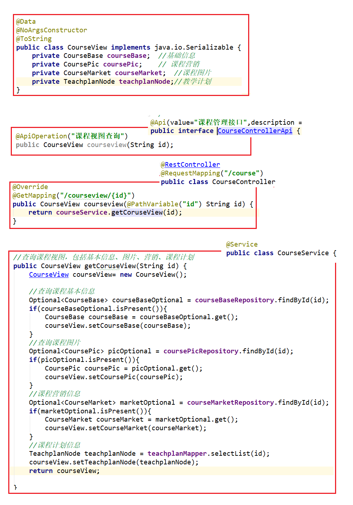

使用swagger测试:

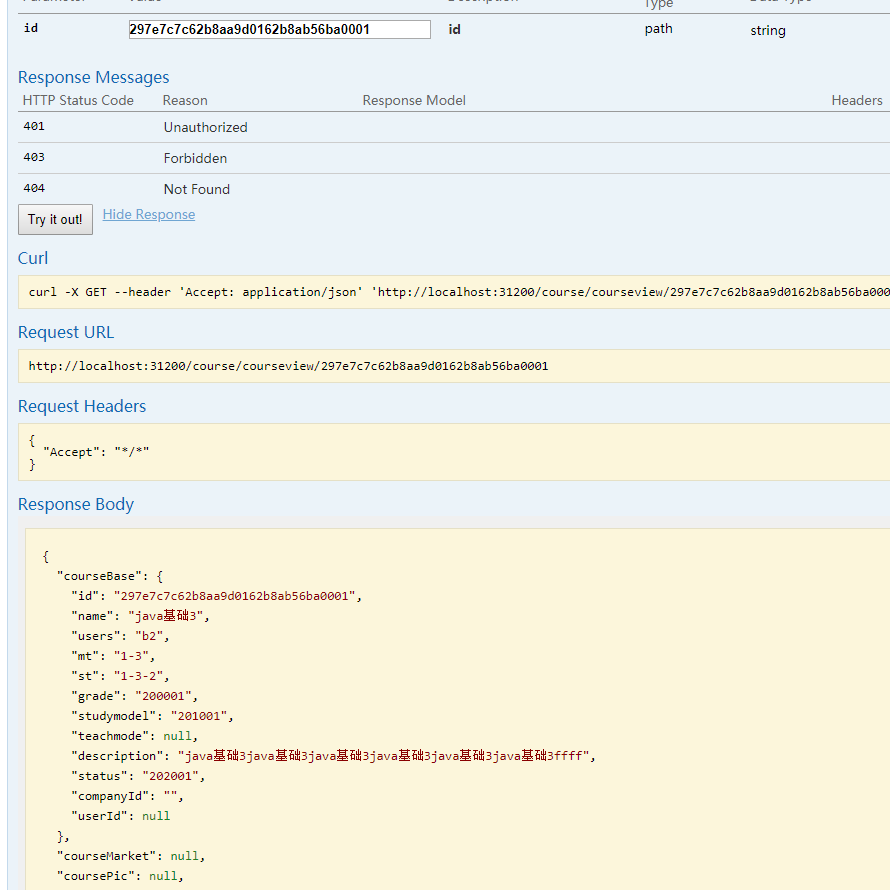

## 十一、课程详情页面静态化-课程信息模板设计

将资料中提供的模板拷贝到`test-freemarker`工程中测试: 

将`course.ftl`拷贝到test-freemarker工程的`resources/templates`下，并在test-freemarker工程的controller中添加测试方法:

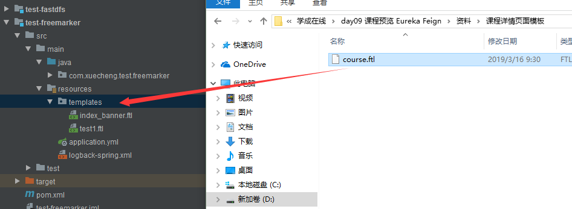

测试:

```java
//课程详情页面测试
@RequestMapping("/course")
public String course(Map<String,Object> map){
    ResponseEntity<Map> forEntity =
        restTemplate.getForEntity("http://localhost:31200/course/courseview/4028e581617f945f01617f9dabc40000", Map.class);
    Map body = forEntity.getBody();
    map.putAll(body); // 注意这里是putAll
    return "course";
}
```

效果: (因为这里没有Nginx的SSI包含，所以没有样式)

**注意注意！！！，在资料PDF中的map.put("model",body);是错误的，需要map.putAll(body);才是可以的**

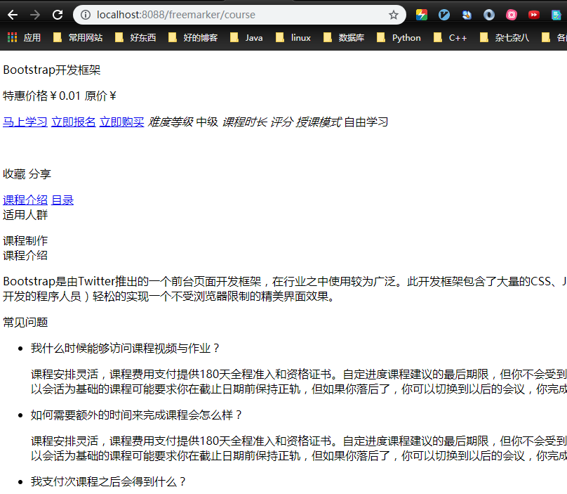

**模板保存到数据库!!**

模板编写并测试通过后要在数据库保存：
1、模板信息保存在`xc_cms`数据库(mongodb)的`cms_template`表 
2、模板文件保存在`mongodb`的GridFS中。

```java
@Test
public void testStore2() throws FileNotFoundException {
    String path = "D:/xcEduService01/test-freemarker/src/main/resources/templates/course.ftl";
    File file = new File(path);
    FileInputStream inputStream = new FileInputStream(file);
    //保存模版文件内容
    ObjectId objectId = gridFsTemplate.store(inputStream, "课程详情模板文件","");
    System.out.println(objectId);
}
```

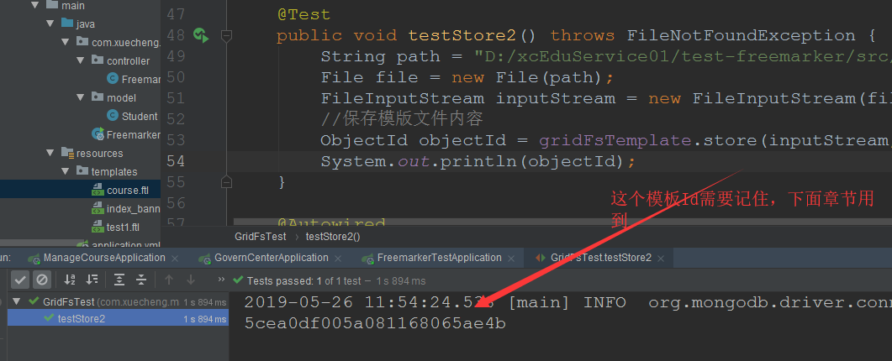

**保存成功需要记录模板文件的id，即上边代码中的fileId**。

这里是`5cea0df005a081168065ae4b`。然后我们去对应的数据库中查找到。

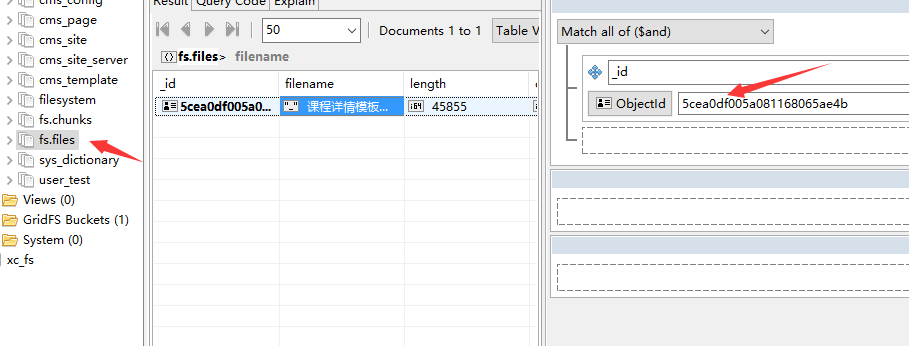

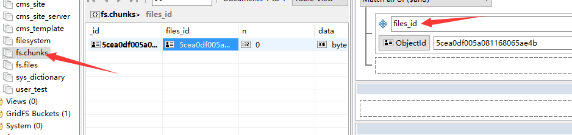

第二步：向cms_template表添加模板记录（请不要重复添加）

**使用Studio 3T连接mongodb，向cms_template添加记录**：

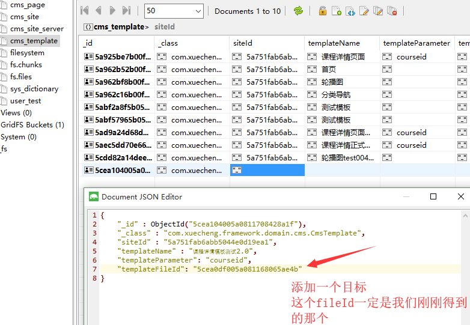

将来我们就要用到下面生成的那个模板`Id`，对应引用的文件`Id`就是我们刚刚生成的(保存`course.ftl`生成的)。

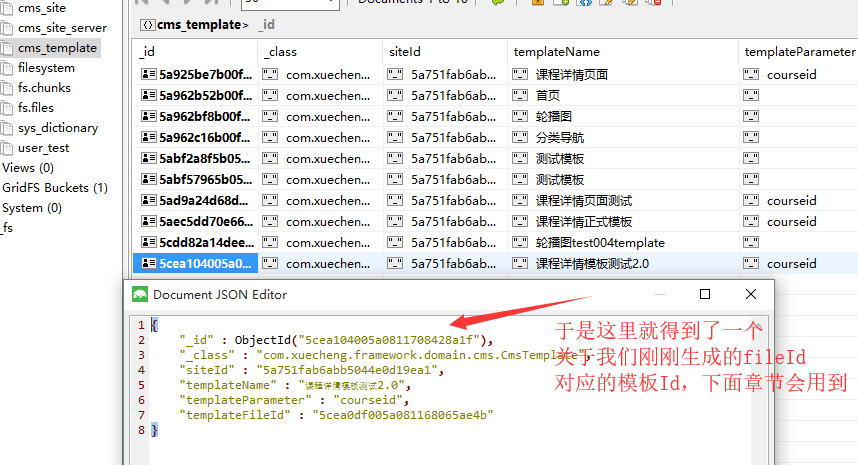

## 十二、课程预览功能开发-需求分析

课程预览功能将使用cms系统提供的页面预览功能，业务流程如下：

1、用户进入课程管理页面，点击课程预览，请求到课程管理服务

2、**课程管理服务远程调用cms添加页面接口向cms添加课程详情页面**

3、课程管理服务得到cms返回课程详情页面id，并拼接生成课程预览Url

4、课程管理服务将课程预览Url给前端返回

5、用户在前端页面请求课程预览Url，打开新窗口显示课程详情内容

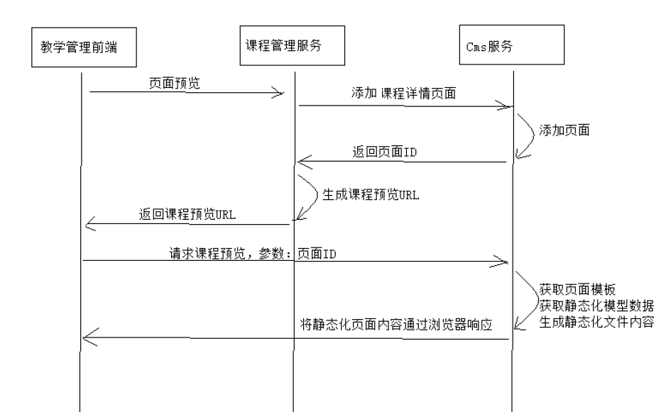


## 十三、课程预览功能开发-CMS页面预览接口测试

手动搞定CMS部分的数据：

添加一个课程详情站点`cms_site`：

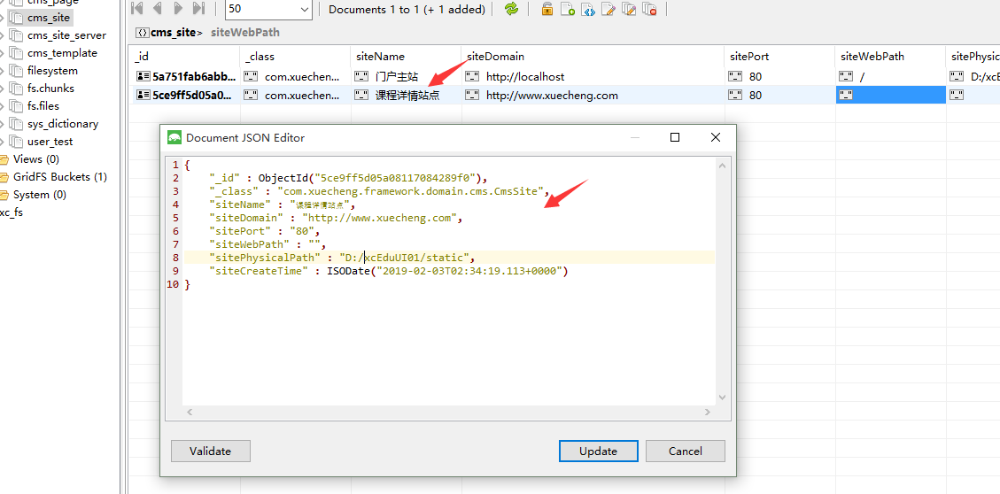

也要注意这里的`sitePhysicalPath`是我们机器的物理路径:

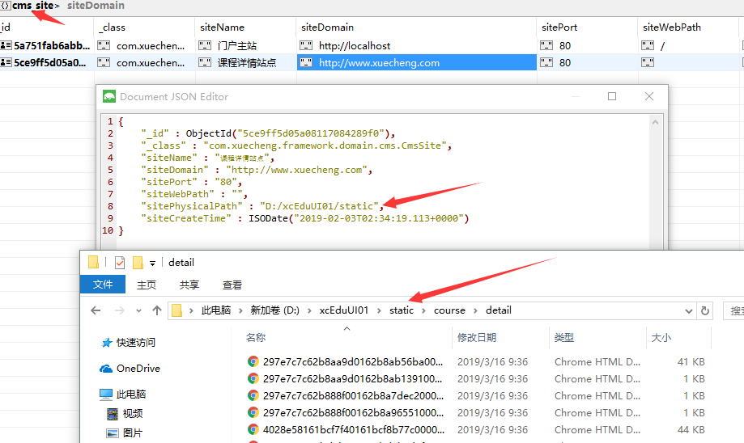

然后我们要用到在`十一`节中添加的模板ID，并在`cms_page`集合中完善一个页面:

`cms_page`内容如下: 

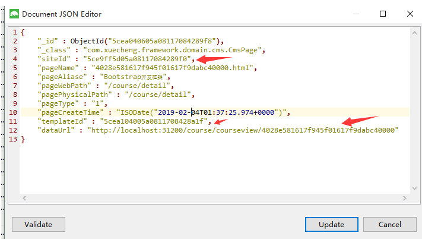

具体的依赖图如下

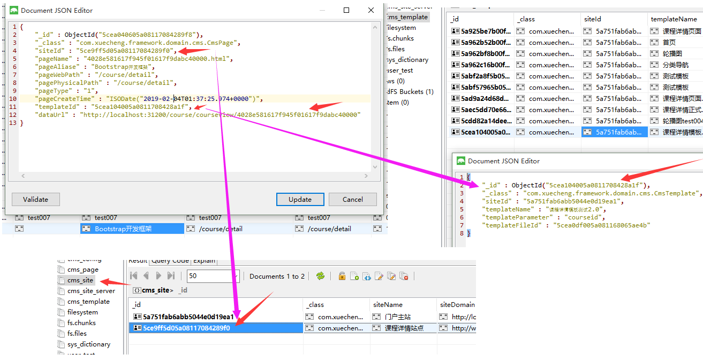

这里还需要注意需要在返回页面的时候，指定返回的页面是`html`，所以在之前的`CmsPagePreviewController`的基础上还要加上一句代码:

```java
 response.setHeader("Content-type","text/html;charset=utf-8");
```

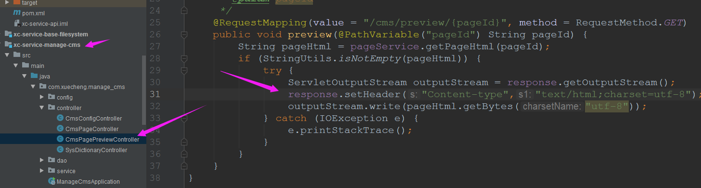

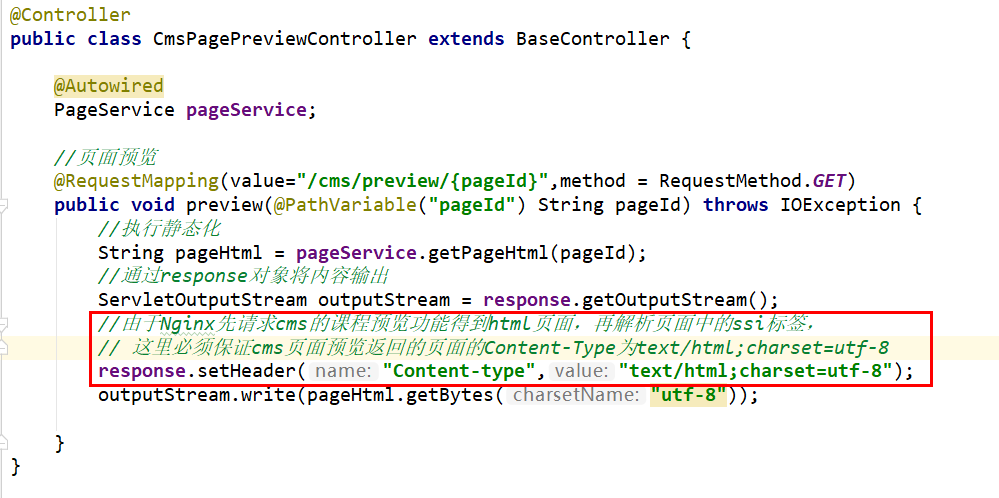

然后我们要通过`nginx`（有SSI技术）来访问测试:

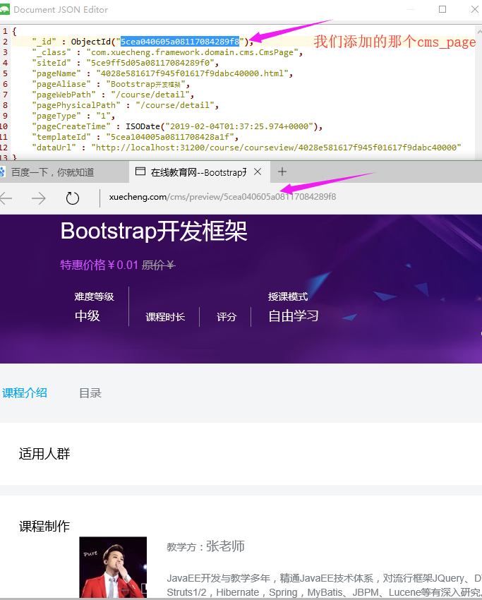

## 十四、课程预览功能开发-CMS添加页面接口

cms服务对外提供添加页面接口，实现：如果不存在页面则添加，否则就更新页面信息。
此接口由课程管理服务在课程预览时调用。

API

```java
@ApiOperation("保存页面")
CmsPageResult save(CmsPage cmsPage);
```

`Controller`:

```java
@Override
@PostMapping("/save")
public CmsPageResult save(@RequestBody CmsPage cmsPage) {
    return pageService.save(cmsPage);
}
```

`Service`:

```java
//添加页面，如果已存在则更新页面
public CmsPageResult save(CmsPage cmsPage) {
    //校验页面是否存在，根据页面名称、站点Id、页面webpath查询
    CmsPage one =
        cmsPageRepository.findByPageNameAndSiteIdAndPageWebPath(cmsPage.getPageName(),
                                                                cmsPage.getSiteId(), cmsPage.getPageWebPath());
    if (one != null) {
        //更新
        return this.update(one.getPageId(), cmsPage);
    }
    //添加
    return this.add(cmsPage);
}
```


## 十五、课程预览功能开发-接口开发

课程预览接口，这里要调用cms的服务。用到`Feign`:

此Api是课程管理前端请求服务端进行课程预览的Api
请求：课程Id
响应：课程预览Url


响应类型:

```java
@Data
@ToString
@NoArgsConstructor
public class CoursePublishResult extends ResponseResult {

    private String previewUrl;

    public CoursePublishResult(ResultCode resultCode, String previewUrl) {
        
        super(resultCode);
        this.previewUrl = previewUrl;
    }
}
```

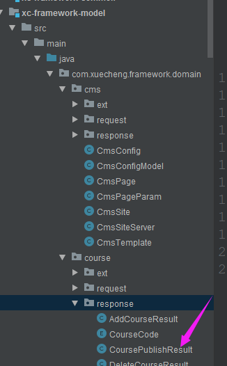

接口API定义:

```java
@ApiOperation("预览课程")
CoursePublishResult preview(String id); // 根据课程Id来预览
```

`Controller` (CourseController):

```java
@Override
@PostMapping("/preview/{id}")
public CoursePublishResult preview(@PathVariable("id") String id) {
    return courseService.preview(id);
}
```

`Service` (CourseService):

```java
 
    @Value("${course-publish.dataUrlPre}")
    private String publish_dataUrlPre;
    @Value("${course-publish.pagePhysicalPath}")
    private String publish_page_physicalpath;
    @Value("${course-publish.pageWebPath}")
    private String publish_page_webpath;
    @Value("${course-publish.siteId}")
    private String publish_siteId;
    @Value("${course-publish.templateId}")
    private String publish_templateId;
    @Value("${course-publish.previewUrl}")
    private String previewUrl;

	//根据id查询课程基本信息
    public CourseBase findCourseBaseById(String courseId) {
        Optional<CourseBase> baseOptional = courseBaseRepository.findById(courseId);
        if (baseOptional.isPresent()) {
            CourseBase courseBase = baseOptional.get();
            return courseBase;
        }
        ExceptionCast.cast(CourseCode.COURSE_GET_NOTEXISTS);
        return null;
    }

    // 课程预览
    public CoursePublishResult preview(String courseId) {
        // 1、请求cms添加页面 (需要远程调用Feign)

        CourseBase one = this.findCourseBaseById(courseId);
        //发布课程预览页面
        CmsPage cmsPage = new CmsPage();  //站点

        cmsPage.setSiteId(publish_siteId);//课程预览站点
        cmsPage.setTemplateId(publish_templateId);//模板
        cmsPage.setPageName(courseId + ".html");   //页面名称
        cmsPage.setPageAliase(one.getName());//页面别名
        cmsPage.setPageWebPath(publish_page_webpath);   //页面访问路径
        cmsPage.setPagePhysicalPath(publish_page_physicalpath);//页面存储路径

        // 发布url + 课程id
        cmsPage.setDataUrl(publish_dataUrlPre + courseId);//数据url
        //远程请求cms保存页面信息

        CmsPageResult cmsPageResult = cmsPageClient.saveCmsPage(cmsPage);
        if (!cmsPageResult.isSuccess()) {
            return new CoursePublishResult(CommonCode.FAIL, null);
        }
        //页面id
        String pageId = cmsPageResult.getCmsPage().getPageId();

        // 拼装页面预览的url (页面url)
        String pageUrl = previewUrl + pageId;

        // 返回 CoursePublishResult，携带pageUrl
        return new CoursePublishResult(CommonCode.SUCCESS, pageUrl);
    }
```

需要用到的的远程调用`client/CmsPageClient`中添加一个save方法 (并在`CourseService`中注入`CmsPageClient`):

```java
//保存页面，用于课程预览
@PostMapping("/cms/page/save")
CmsPageResult save(@RequestBody CmsPage cmsPage);
```

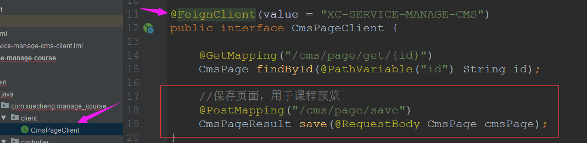

这里还需要配置页面一些参数信息，需要对照之前我们手工添加的来做:

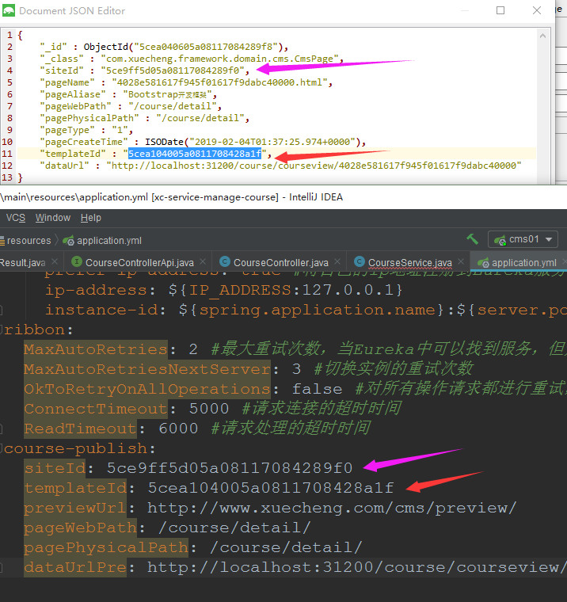

```yaml
course-publish:
  siteId: 5ce9ff5d05a08117084289f0
  templateId: 5cea104005a0811708428a1f
  previewUrl: http://www.xuecheng.com/cms/preview/
  pageWebPath: /course/detail/
  pagePhysicalPath: /course/detail/
  dataUrlPre: http://localhost:31200/course/courseview/
```

此外还有一个添加的错误Code:

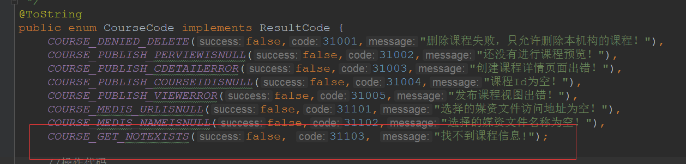

## 十六、课程预览功能开发-接口测试

有一个小bug

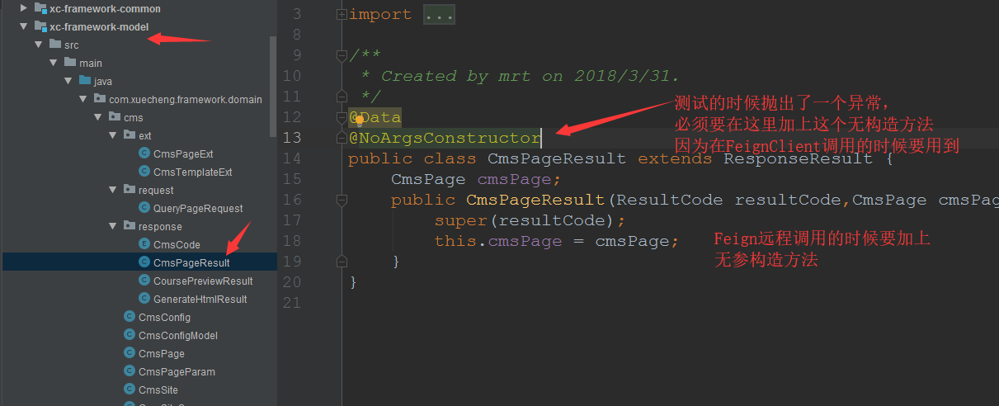

测试:

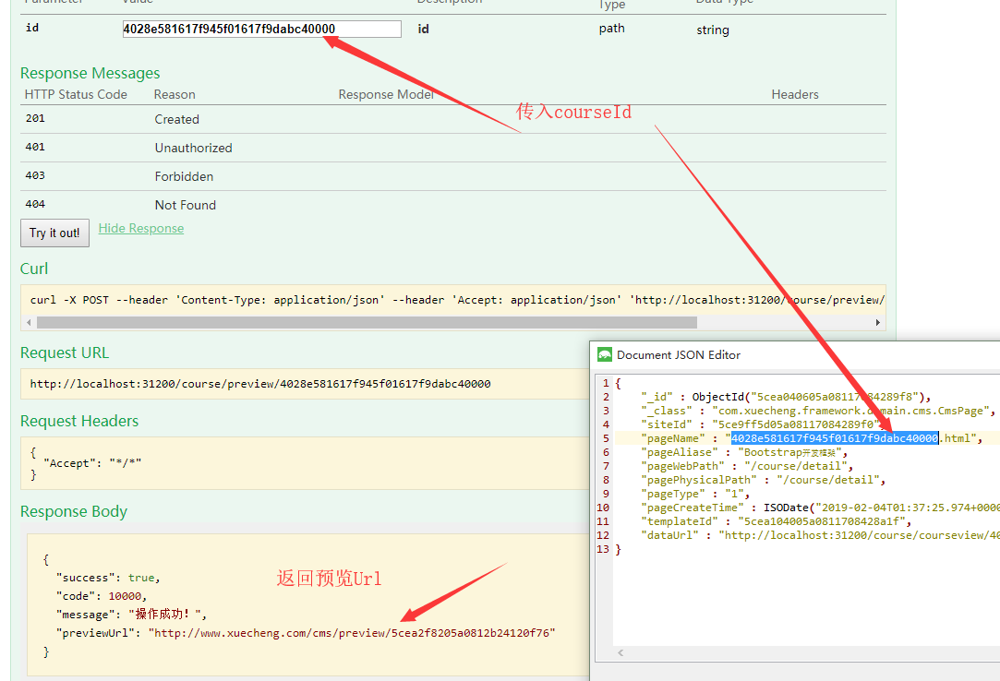

可以在浏览器输入返回的`previewUrl` :


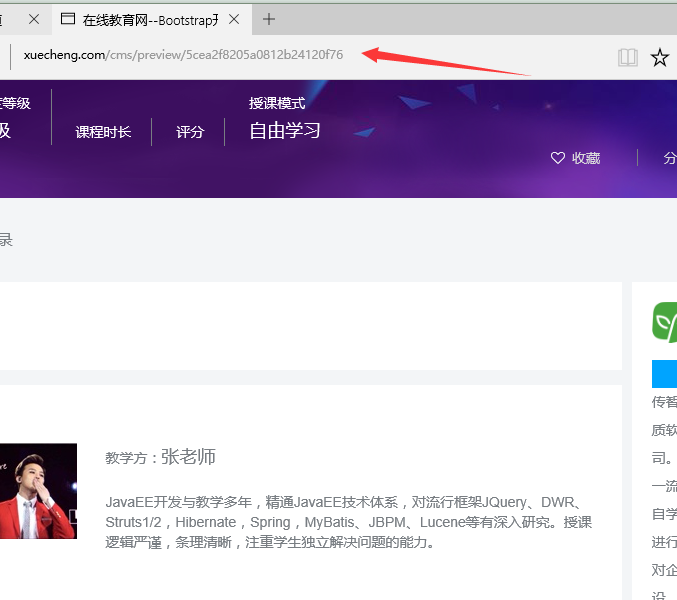

## 十七、课程预览功能开发-前后端测试

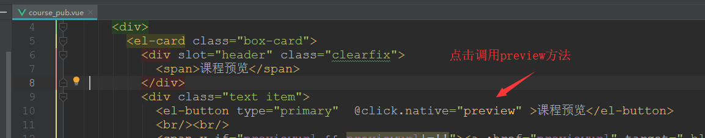

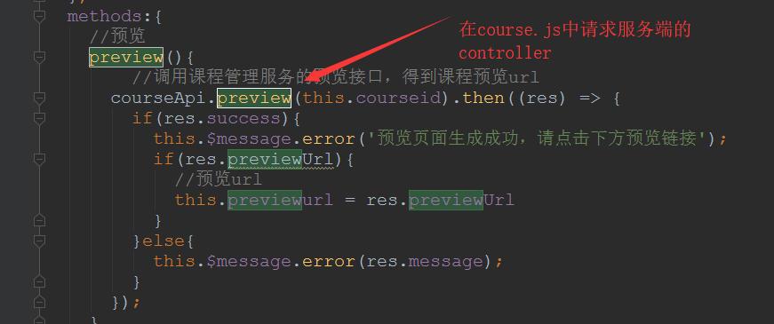

`course.js`中的调用:

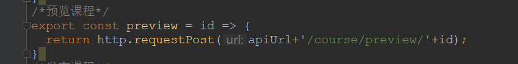

最后如果请求拿到url就点击:

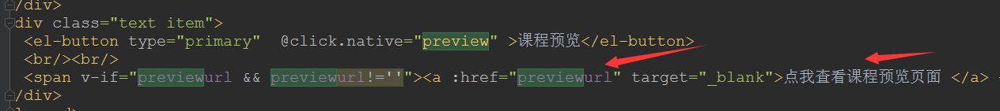

相关逻辑: 

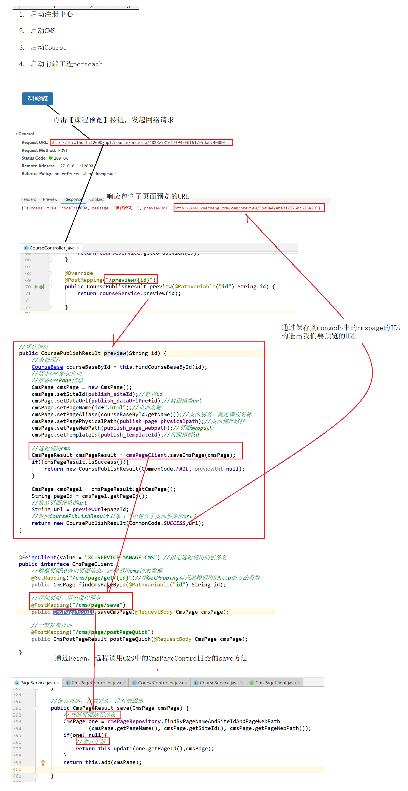

演示效果:

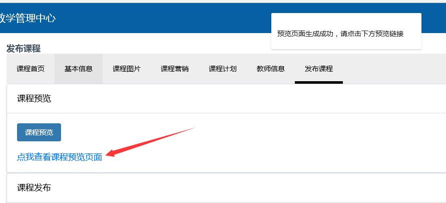

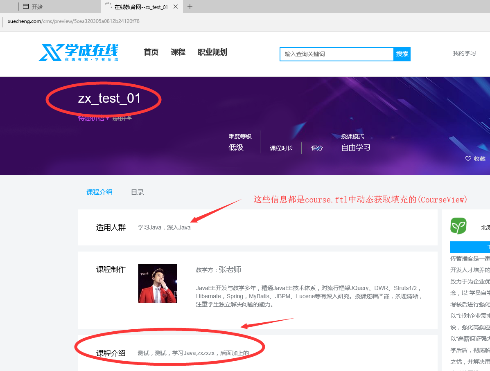