# 课程发布 ElasticSearch

## 一、课程发布-需求分析

课程发布后将生成正式的课程详情页面，课程发布后用户即可浏览课程详情页面，并开始课程的学习。
课程发布生成课程详情页面的流程与课程预览业务流程相同，如下：
1、用户进入教学管理中心，进入某个课程的管理界面
2、点击课程发布，前端请求到课程管理服务
3、课程管理服务远程调用CMS生成课程发布页面，CMS将课程详情页面发布到服务器
4、课程管理服务修改课程发布状态为 “已发布”，并向前端返回发布成功
5、用户在教学管理中心点击“课程详情页面”链接，查看课程详情页面内容

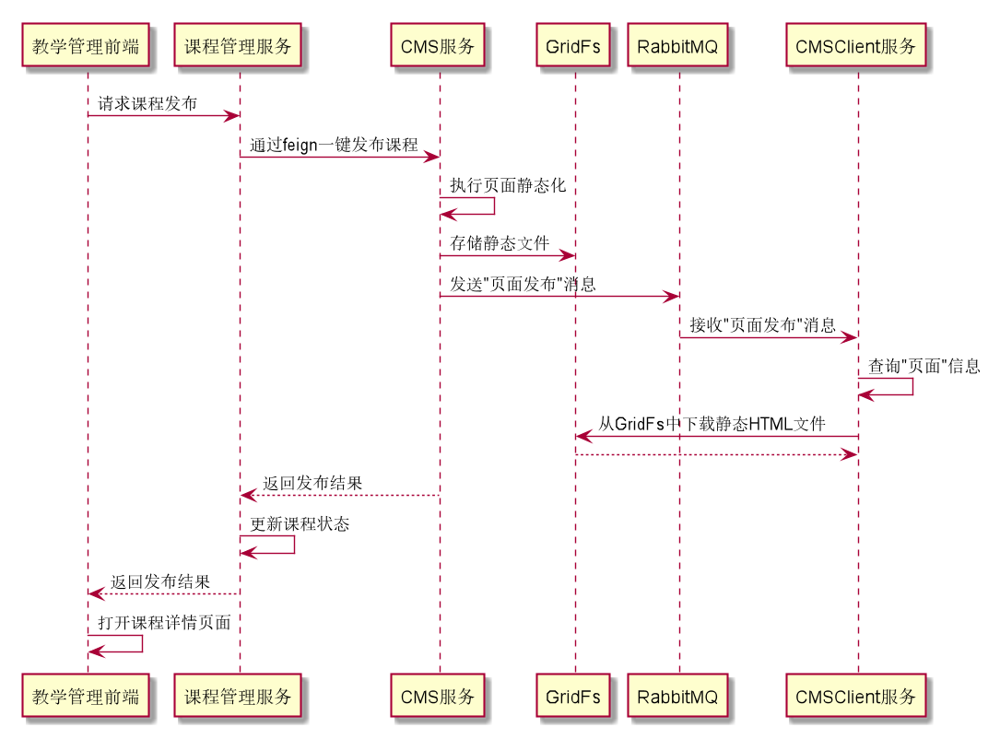

## 二、课程发布-CMS一键发布-接口定义

页面发布成功cms返回页面的`url`

页面`Url= cmsSite.siteDomain+cmsSite.siteWebPath+ cmsPage.pageWebPath + cmsPage.pageName`

定义返回的类型: 

```java 
@Data
@NoArgsConstructor//无参构造器注解
public class CmsPostPageResult extends ResponseResult {

    private String pageUrl; // 最后浏览的url

    public CmsPostPageResult(ResultCode resultCode, String pageUrl) {
        super(resultCode);
        this.pageUrl = pageUrl;
    }
}
```

一键发布接口：

```java
@ApiOperation("一键发布页面")
CmsPostPageResult postPageQuick(CmsPage cmsPage);
```

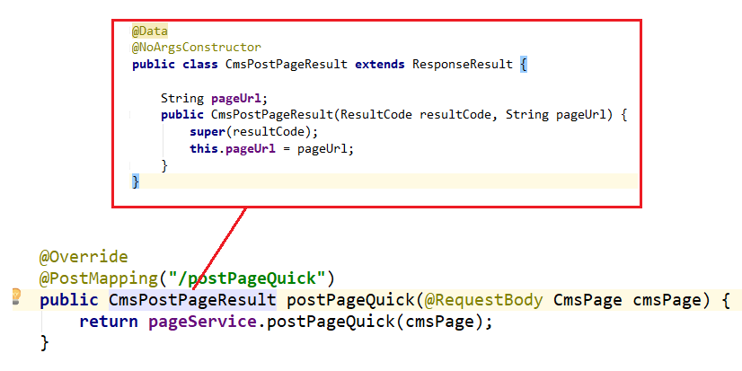

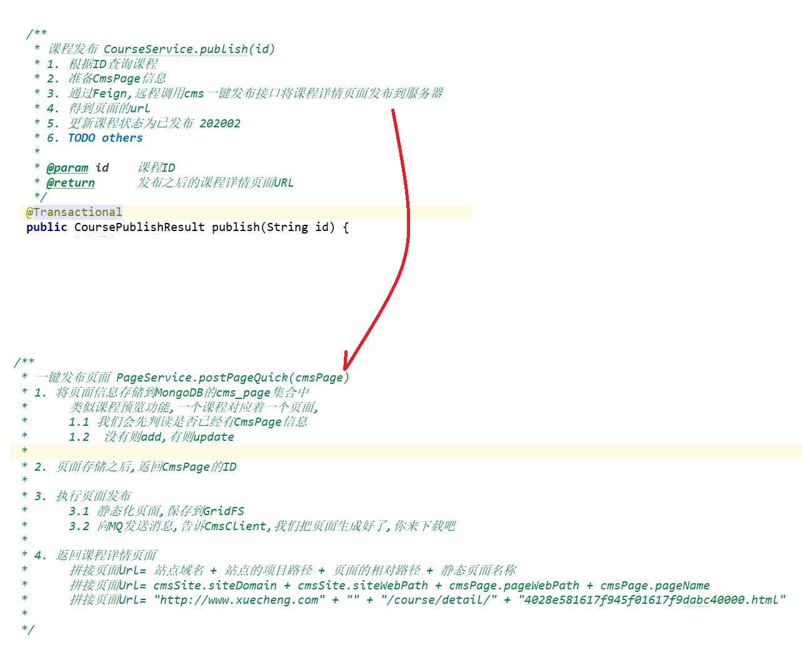

## 三、课程发布-CMS一键发布-接口开发

`Controller`:

```java
@Override
@PostMapping("/postPageQuick")
public CmsPostPageResult postPageQuick(@RequestBody CmsPage cmsPage) {
    return pageService.postPageQuick(cmsPage);
}
```

`Service`:

```java
// 一键页面发布
public CmsPostPageResult postPageQuick(CmsPage cmsPage) {

    // 1、将页面信息存储到cms_page集合中
    //添加页面
    CmsPageResult save = this.save(cmsPage); // 返回的是CmsPageResult
    if(!save.isSuccess()){
        return new CmsPostPageResult(CommonCode.FAIL,null);
    }
    CmsPage saveCmsPage = save.getCmsPage();

    //要布的页面id
    String pageId = saveCmsPage.getPageId();

    // 2、执行页面发布(先静态化、保存GridFs、向MQ发送消息)
    ResponseResult responseResult = this.post(pageId);
    if(!responseResult.isSuccess()){
        return new CmsPostPageResult(CommonCode.FAIL,null);
    }
    //得到页面的url
    //页面url=站点域名+站点webpath+页面webpath+页面名称
    //站点id
    String siteId = saveCmsPage.getSiteId();
    //查询站点信息
    CmsSite cmsSite = findCmsSiteById(siteId);
    //站点域名
    String siteDomain = cmsSite.getSiteDomain();
    //站点web路径
    String siteWebPath = cmsSite.getSiteWebPath();
    //页面web路径
    String pageWebPath = saveCmsPage.getPageWebPath();
    //页面名称
    String pageName = saveCmsPage.getPageName();
    //页面的web访问地址
    String pageUrl = siteDomain+siteWebPath+pageWebPath+pageName;
    return new CmsPostPageResult(CommonCode.SUCCESS,pageUrl);
}

//根据id查询站点信息
public CmsSite findCmsSiteById(String siteId){
    Optional<CmsSite> optional = cmsSiteRepository.findById(siteId);
    if(optional.isPresent()){
        return optional.get();
    }
    return null;
}
```

还需要添加一个`CmsSiteRepository`:

```java
public interface CmsSiteRepository extends MongoRepository<CmsSite, String> {
}
```


## 四、课程发布-课程发布服务端-接口开发

定义课程发布API: 此Api接口由课程管理提供，由课程管理前端调用此Api接口，实现课程发布。

```java
@ApiOperation("发布课程")
CoursePublishResult publish(String id);
```

在`course`微服务这边定义远程调用 (调用cms中的方法) 的方法:

```java
//一键发布页面
@PostMapping("/cms/page/postPageQuick")
CmsPostPageResult postPageQuick(@RequestBody CmsPage cmsPage);
```

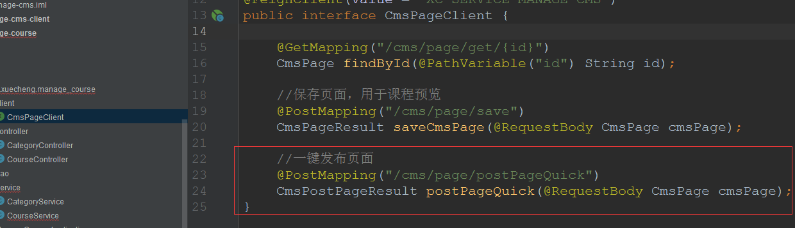

`Service`:

```java
//课程发布
@Transactional
public CoursePublishResult publish(String courseId) {
    // 1、调用cms一键发布接口课程详情页面发布到服务端
    CmsPostPageResult cmsPostPageResult = publish_page(courseId);
    if (!cmsPostPageResult.isSuccess()) {
        ExceptionCast.cast(CommonCode.FAIL);
    }

    // 2、保存课程的发布状态为 "已发布"
    CourseBase courseBase = saveCoursePubState(courseId);
    if(courseBase == null){
        return new CoursePublishResult(CommonCode.FAIL, null);
    }

    // 3、保存课程索引信息....缓存课程信息...(待做)


    // 4、最后一定要返回页面url
    String pageUrl = cmsPostPageResult.getPageUrl(); //获取发布之后的result
    return new CoursePublishResult(CommonCode.SUCCESS, pageUrl);
}

//发布课程正式页面
public CmsPostPageResult publish_page(String courseId) {
    // 为了下面获取名称
    CourseBase courseBaseById = this.findCourseBaseById(courseId);

    //发布课程预览页面
    CmsPage cmsPage = new CmsPage();

    cmsPage.setSiteId(publish_siteId);//  //站点, 课程预览站点
    cmsPage.setTemplateId(publish_templateId); //模板
    cmsPage.setPageName(courseId + ".html");//页面名称
    cmsPage.setPageAliase(courseBaseById.getName());//页面别名
    cmsPage.setPageWebPath(publish_page_webpath);//页面访问路径
    cmsPage.setPagePhysicalPath(publish_page_physicalpath);//页面存储路径
    cmsPage.setDataUrl(publish_dataUrlPre + courseId);//数据url

    // 远程调用cms发布页面
    CmsPostPageResult cmsPostPageResult = cmsPageClient.postPageQuick(cmsPage);
    return cmsPostPageResult;
}

//更新课程发布状态
private CourseBase saveCoursePubState(String courseId) {
    CourseBase courseBase = this.findCourseBaseById(courseId);
    //更新发布状态
    courseBase.setStatus("202002"); // 这个状态在数据库中是已经发布的意思
    CourseBase save = courseBaseRepository.save(courseBase);
    return save;
}
```

注意更改状态，我们之前提到那个数据字典:

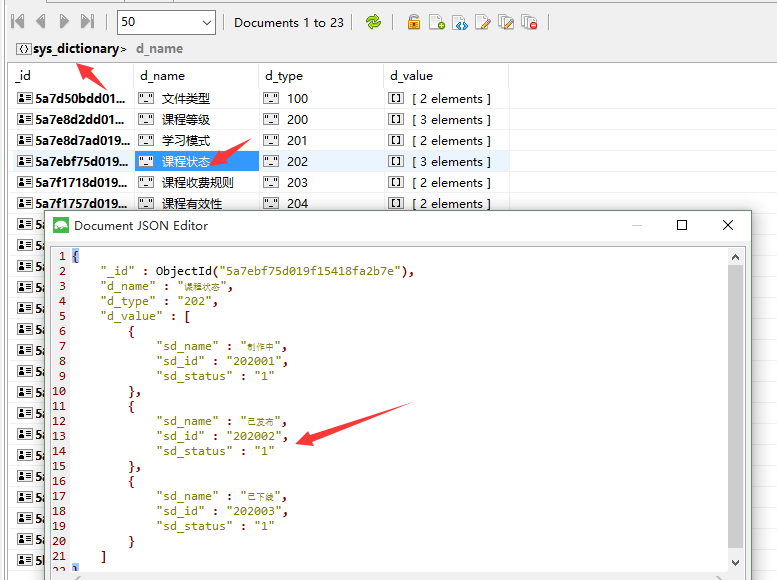

## 五、课程发布-课程发布服务端-接口测试

在nginx配置课程详情页面的虚拟主机，实现访问：`www.xuecheng.com/course/detail/.....html`。

这些在课程预览的时候都已经配置过了。

```properties
#静态资源服务
upstream static_server_pool{
	server 127.0.0.1:91 weight=10;
}
server {
    listen 80;
    server_name www.xuecheng.com;
    ssi on;
    ssi_silent_errors on;
    #课程预览
    location /course/detail/ {
    proxy_pass http://static_server_pool;
    }
}
#学成网静态资源
server {
    listen 91;
    server_name localhost;
    #公司信息
    location /static/company/ {
    alias F:/develop/xuecheng/static/company/;
    }
    ...
```

这样: cms会将课程预览页面发布到服务器的`D:/xcEduUI01/static/course/detail/`下，通过
`www.xuecheng.com/course/detail/`来访问。


然后是课程站点信息，在`cms_site`集合中，我们之前在页面预览的时候也已经添加了。

```json
{ 
    "_id" : ObjectId("5ce9ff5d05a08117084289f0"), 
    "_class" : "com.xuecheng.framework.domain.cms.CmsSite", 
    "siteName" : "课程详情站点", 
    "siteDomain" : "http://www.xuecheng.com", 
    "sitePort" : "80", 
    "siteWebPath" : "", 
    "sitePhysicalPath" : "D:/xcEduUI01/static", 
    "siteCreateTime" : ISODate("2019-02-03T02:34:19.113+0000")
}
```

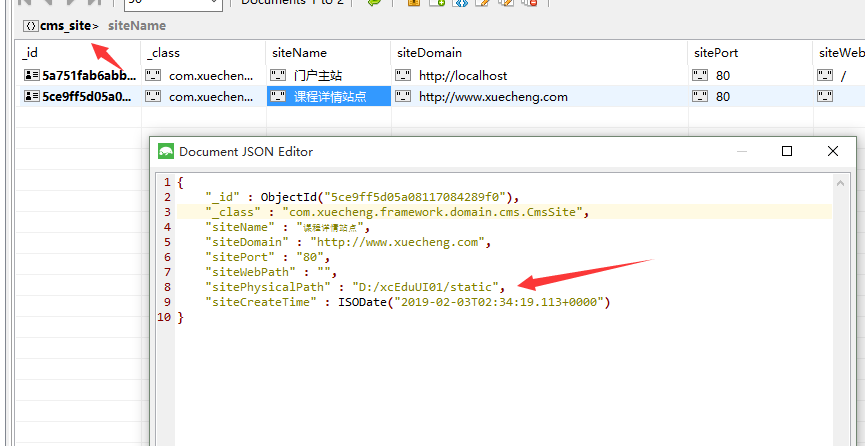

然后测试GridFS保存。（之前也测试过一次，就是保存`course.ftl`）

然后下面就是测试流程:

1、启动RabbitMQ服务
2、启动cms服务
3、启动cms_client，注意配置routintKey和队列名称

注意下面三个要相同:

```yaml
xuecheng:
  mq:
    queue: queue_cms_postpage_03 #cms客户端监控的队列名称（不同的客户端监控的队列不能重复）
    routingKey: 5ce9ff5d05a08117084289f0	#此routingKey为门户站点ID
```

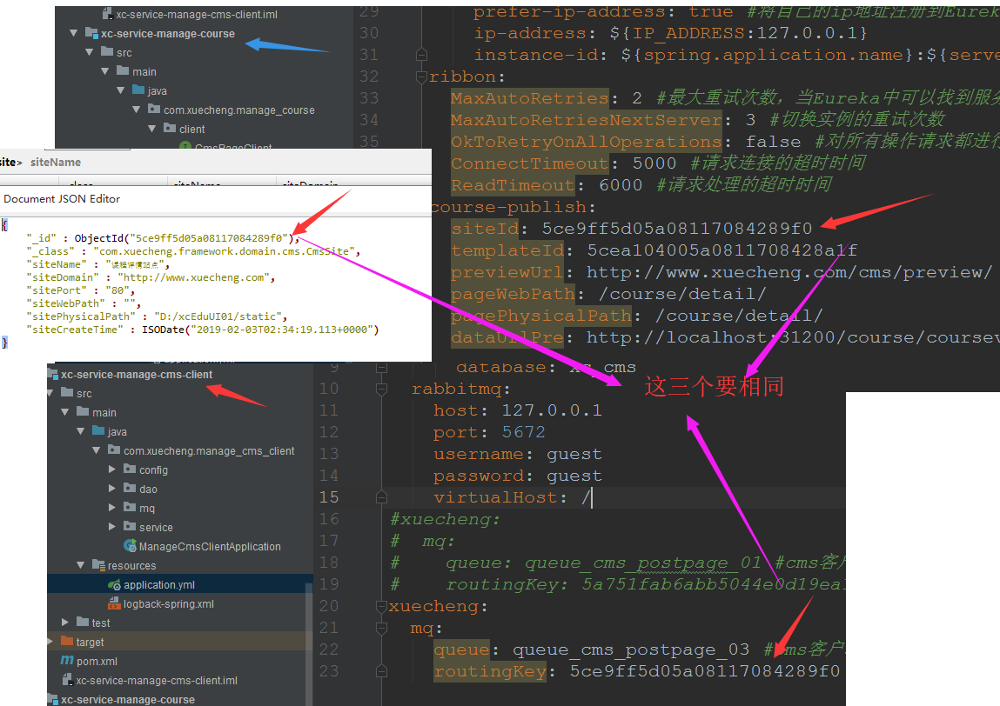

测试:

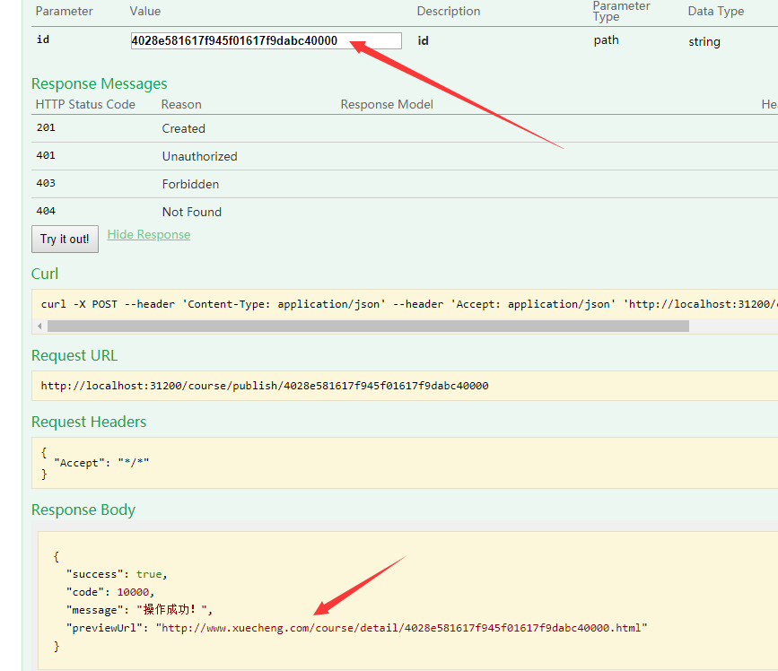

访问一下返回的发布页面:


检查消息队列中也有:

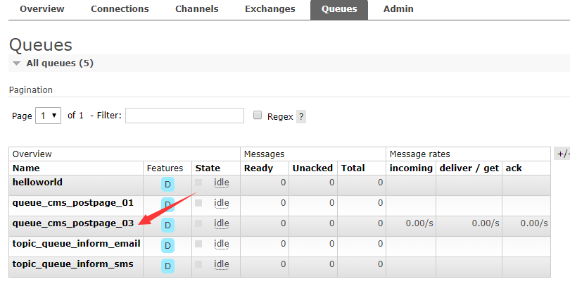

## 六、课程发布-前后端调试

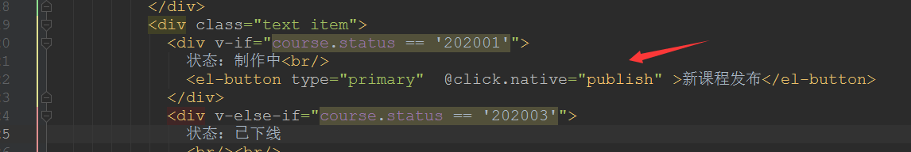

这里有个小bug (成功之后要获取课程状态)

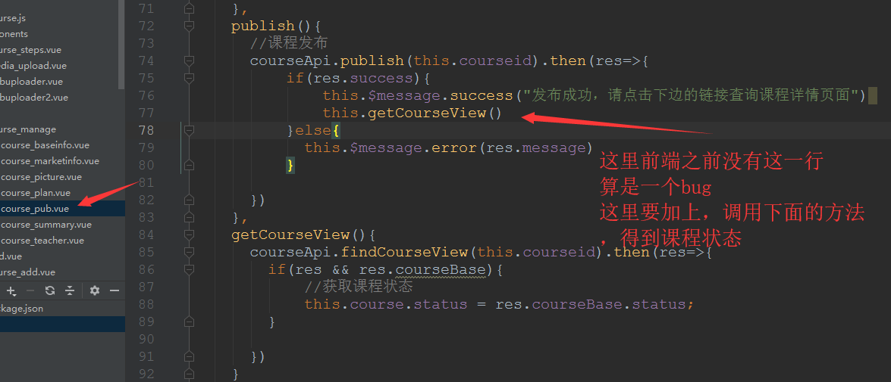

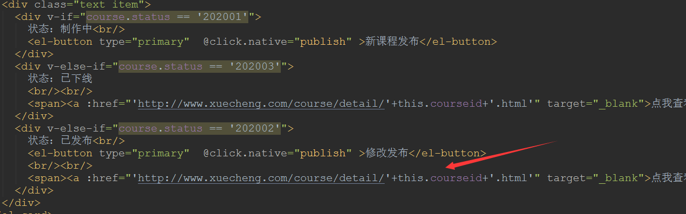

测试 (**这里有个诡异的地方**，用Edge浏览器，发布之后不能马上刷新，但是`google`可以。然而我的`google`一直不支持`www.xuecheng.com`访问(和Google本身不支持这个域名有关系)):


## 七、ElasticSearch-介绍

### 1、elasticsearch介绍

1.elasticsearch是一个基于**Lucene**的高扩展的分布式搜索服务器，支持开箱即用。
2.elasticsearch隐藏了Lucene的复杂性，对外提供`Restful 接口`来操作索引、搜索。
3.扩展性好，可部署上百台服务器集群，处理PB级数据。
4.近实时【Elasticsearch是一个接近实时的搜索平台。这意味着，从索引一个文档直到这个文档能够被搜索到有一个轻微的延迟（通常是1秒以内）】的去索引数据、搜索数据。

### 2、ElasticSearch的使用案例

- 2013年初，GitHub抛弃了Solr，采取ElasticSearch 来做PB级的搜索。 “GitHub使用ElasticSearch搜索20TB的数据，包括13亿文件和1300亿行代码”
- 维基百科：启动以elasticsearch为基础的核心搜索架构
- SoundCloud：“SoundCloud使用ElasticSearch为1.8亿用户提供即时而精准的音乐搜索服务”
- 百度：百度目前广泛使用ElasticSearch作为文本数据分析，采集百度所有服务器上的各类指标数据及用户自定义数据，通过对各种数据进行多维分析展示，辅助定位分析实例异常或业务层面异常。目前覆盖百度内部20多个业务线（包括casio、云分析、网盟、预测、文库、直达号、钱包、风控等），单集群最大100台机器，200个ES节点，每天导入30TB+数据
- 新浪使用ES 分析处理32亿条实时日志
- 阿里使用ES 构建挖财自己的日志采集和分析体系

### 3、ElasticSearch对比Solr

- Solr 利用 Zookeeper 进行分布式管理，而 Elasticsearch 自身带有分布式协调管理功能;
- Solr 支持更多格式的数据，而 Elasticsearch 仅支持json文件格式；
- Solr 官方提供的功能更多，而 Elasticsearch 本身更注重于核心功能，高级功能多有第三方插件提供；
- Solr 在传统的搜索应用中表现好于 Elasticsearch，但在处理实时搜索应用时效率明显低于 Elasticsearch

## 八、ElasticSearch-原理与应用

### 1、倒排索引

逻辑结构部分是一个倒排索引表：
1、将要搜索的文档内容分词，所有不重复的词组成分词列表。
2、将搜索的文档最终以Document方式存储起来。
3、每个词和docment都有关联。

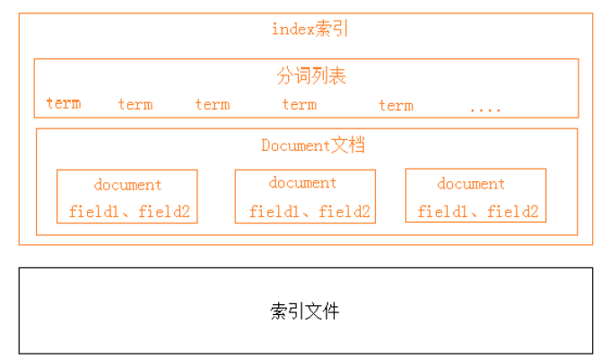

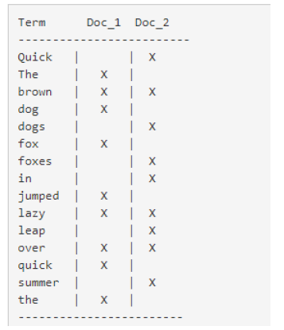

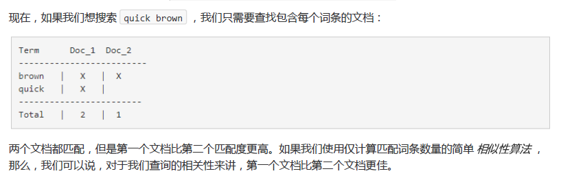

### 2、es在项目中的应用方式

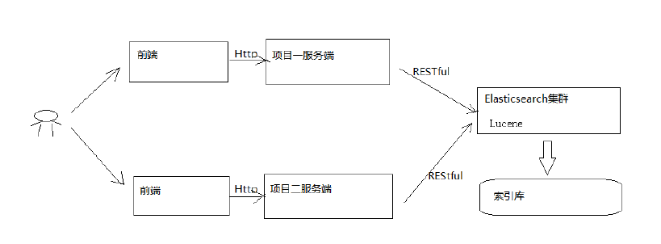


```
1）用户在前端搜索关键字
2）项目前端通过http方式请求项目服务端
3）项目服务端通过Http RESTful方式请求ES集群进行搜索
4）ES集群从索引库检索数据。
```


## 九、ElasticSearch-安装与配置-安装

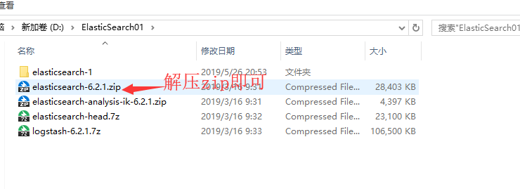

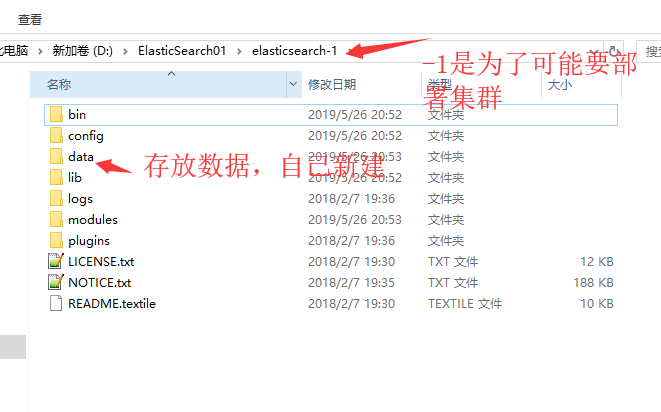

将资料中的三个配置文件拷贝到原来的安装目录:

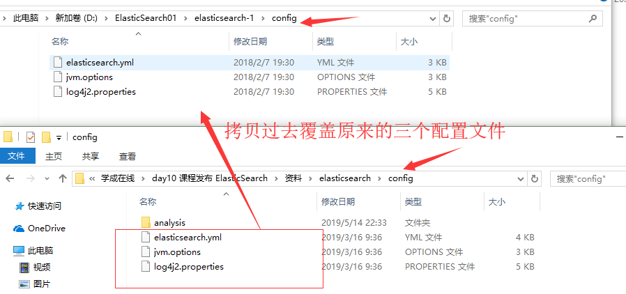

其中`elasticsearch.yml`配置如下:

```yaml
cluster.name: xuecheng
node.name: xc_node_1
network.host: 0.0.0.0
http.port: 9200
transport.tcp.port: 9300
node.master: true
node.data: true
discovery.zen.ping.unicast.hosts: ["0.0.0.0:9300", "0.0.0.0:9301"]
discovery.zen.minimum_master_nodes: 1
node.ingest: true
bootstrap.memory_lock: false
node.max_local_storage_nodes: 2

path.data: D:/ElasticSearch01/elasticsearch-1/data
path.logs: D:/ElasticSearch01/elasticsearch-1/logs

http.cors.enabled: true
http.cors.allow-origin: /.*/
```

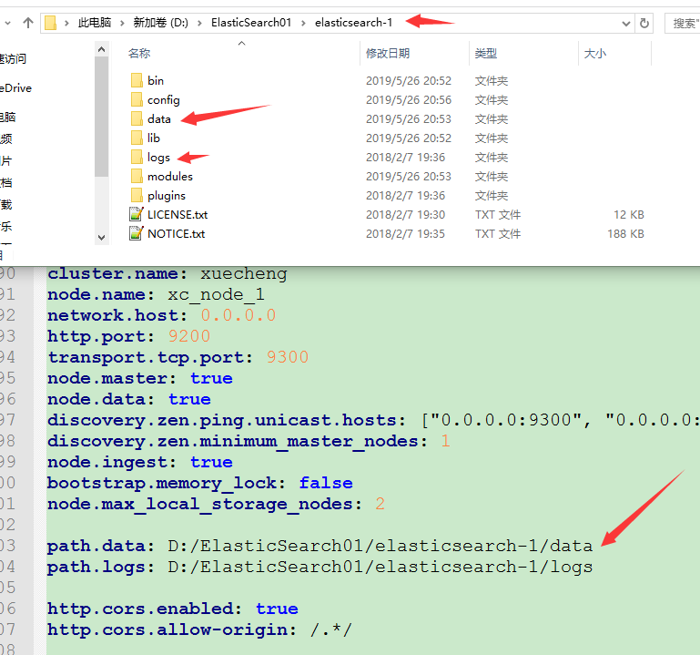

启动报错:  <https://blog.csdn.net/Jailman/article/details/88685404>

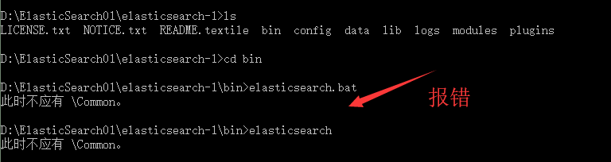

需要配置Java环境:

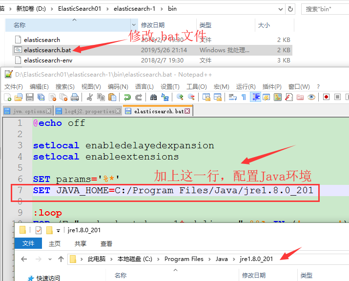


在浏览器测试:

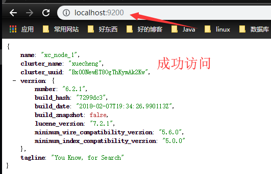

## 十、ElasticSearch-安装与配置-head插件

解压插件并启动:

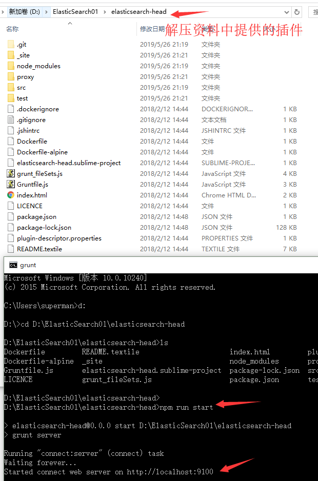

如果没有提供，可以使用git下载:

```shell
git clone git://github.com/mobz/elasticsearch-head.git
cd elasticsearch-head
npm install 
npm run start 
open HTTP：//本地主机：9100/
```

访问: 

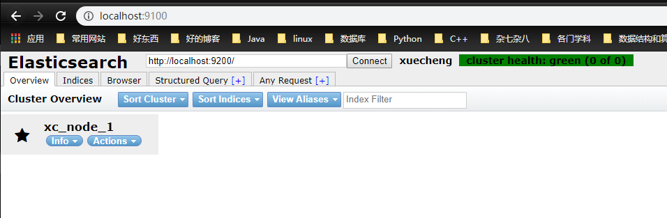

## 十一、ElasticSearch-快速入门-创建索引库

 使用`postman`向elasticsearch中添加:

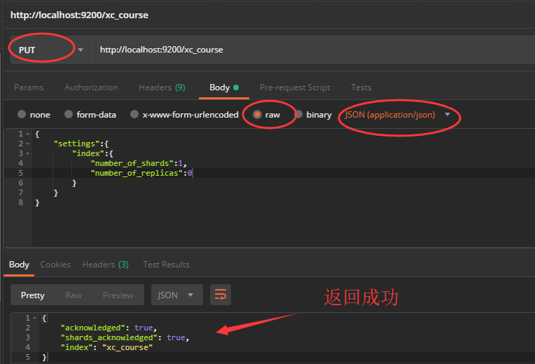

上面的动作创建了一个索引，相当于是在`MYSQL`中创建了一张表，相当于在`MongoDB`中创建了一个集合。

效果： 

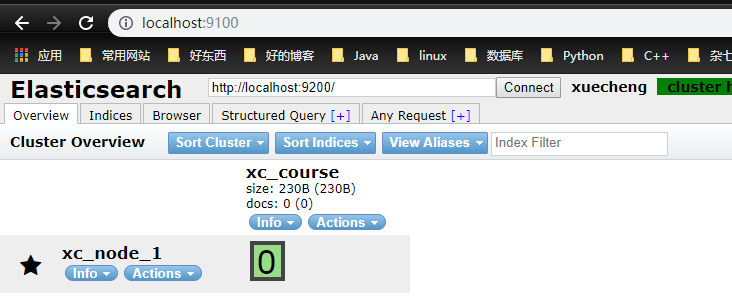

**MySql如何能模糊搜索**?

MySql也是有索引的.

`name like %张%`,会造成索引的失效.

## 十二、ElasticSearch-快速入门-创建映射

在索引中每个文档都包括了一个或多个field，创建映射就是向索引库中创建field的过程，下边是document和field
与关系数据库的概念的类比：
`文档（Document）----------------Row记录`
`字段（Field）-------------------Columns 列`
注意：6.0之前的版本有type（类型）概念，type相当于关系数据库的表，ES官方将在ES9.0版本中彻底删除type。

上边讲的创建索引库相当于关系数据库中的数据库还是表？

1、如果相当于数据库就表示一个索引库可以创建很多不同类型的文档，这在ES中也是允许的。
2、如果相当于表就表示一个索引库只能存储相同类型的文档，ES官方建议 在一个索引库中只存储相同类型的文
档。

实战: 

我们要把课程信息存储到ES中，这里我们创建课程信息的映射，先来一个简单的映射，如下：
发送：`post http://localhost:9200/索引库名称/类型名称/_mapping`
创建类型为`xc_course`的映射，共包括三个字段：name、description、studymondel
由于ES6.0版本还没有将type彻底删除，所以暂时把type起一个没有特殊意义的名字。
post 请求：`http://localhost:9200/xc_course/doc/_mapping`
表示：在xc_course索引库下的doc类型下创建映射。doc是类型名，可以自定义，在ES6.0中要弱化类型的概念，
给它起一个没有具体业务意义的名称。

```json
{
	"properties": {
		"name": {
			"type": "text"
		},
		"description": {
			"type": "text"
		},
		"studymodel": {
			"type": "keyword"
		}
	}
}
```

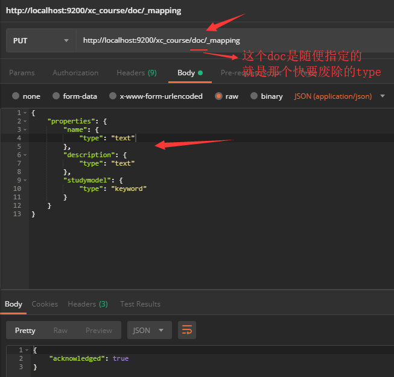

查看映射:

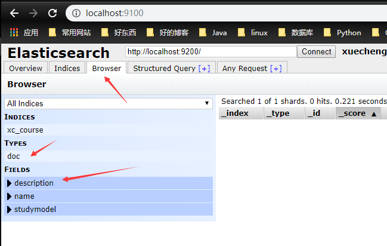

## 十三、ElasticSearch-快速入门-创建文档

ES中的文档相当于MySQL数据库表中的记录。
发送：put 或Post http://localhost:9200/xc_course/doc/id值
（如果不指定id值ES会自动生成ID）
http://localhost:9200/xc_course/doc/4028e58161bcf7f40161bcf8b77c0000

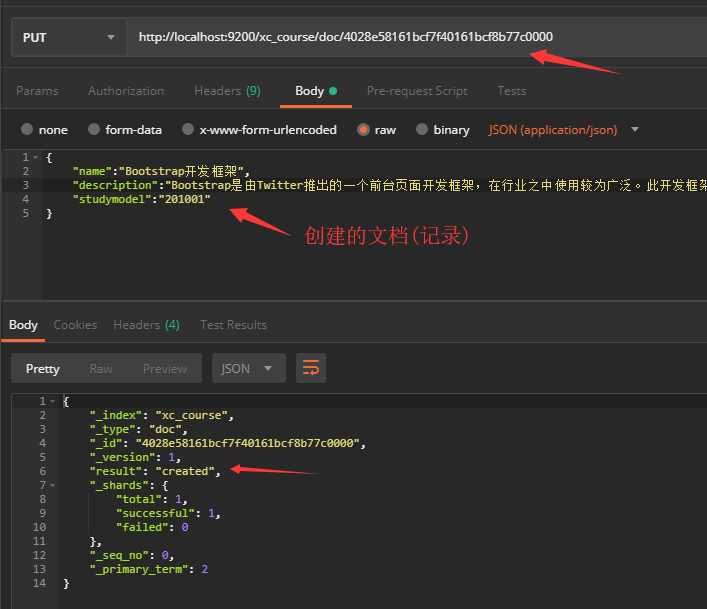

json数据如下:

```json
{
	"name":"Bootstrap开发框架",
	"description":"Bootstrap是由Twitter推出的一个前台页面开发框架，在行业之中使用较为广泛。此开发框架包含了大量的CSS、JS程序代码，可以帮助开发者（尤其是不擅长页面开发的程序人员）轻松的实现一个不受浏览器限制的精美界面效果。",
	"studymodel":"201001"
}
```

可以在浏览器查看创建的数据: 

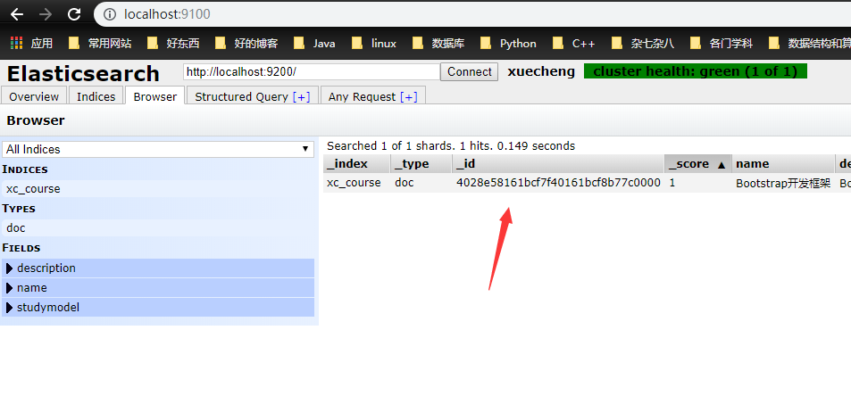


## 十四、ElasticSearch-快速入门-搜索文档

可以通过get请求 (根据id):

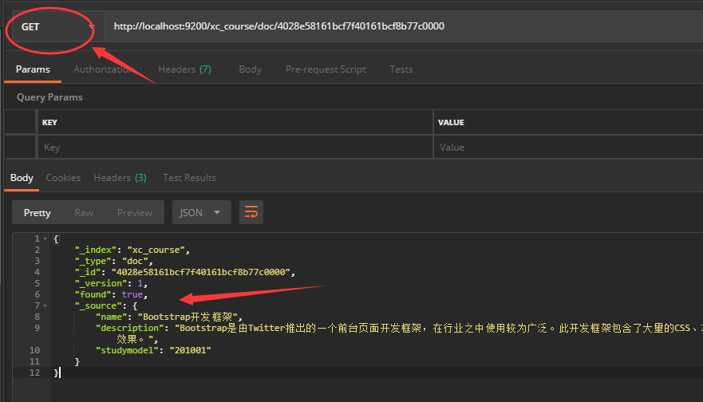

通过`search`搜索:

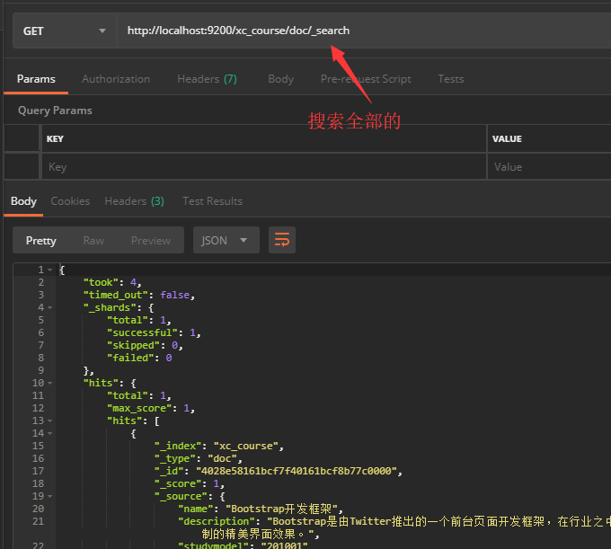

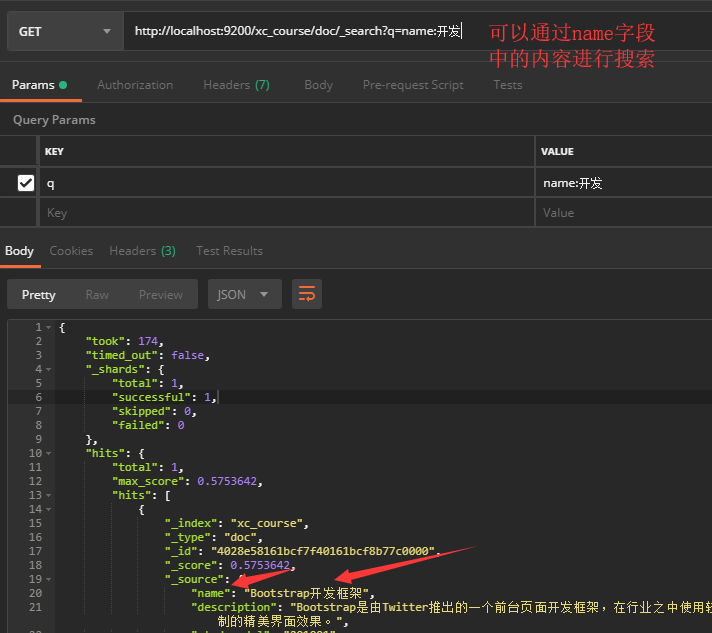

## 十五、ElasticSearch-IK分词器-安装IK分词器

在添加文档时会进行分词，索引中存放的就是一个一个的词（term），当你去搜索时就是拿关键字去匹配词，最终找到词关联的文档。
测试当前索引库使用的分词器：
post 发送：`localhost:9200/_analyze`

json内容如下: 

`{"text":"测试分词器，后边是测试内容：spring cloud实战"}`
结果如下：

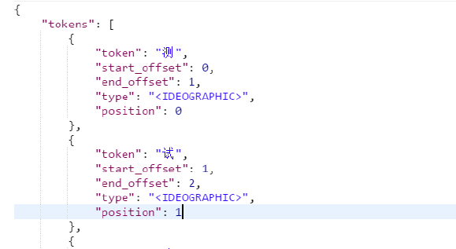

分词效果不好，太细。

IK分词器起到对中文进行分词的作用.

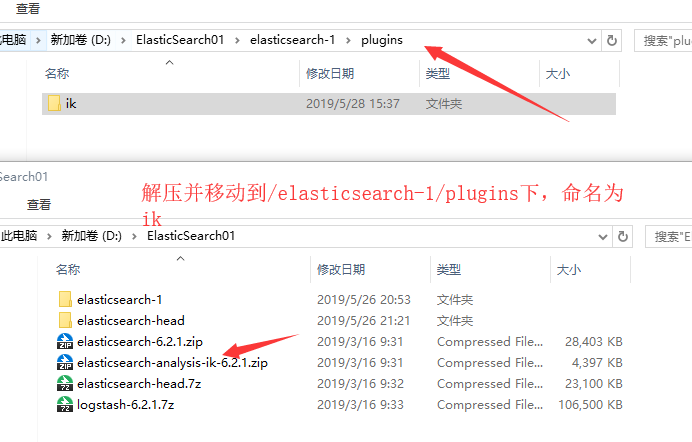

加上分词器后搜索:

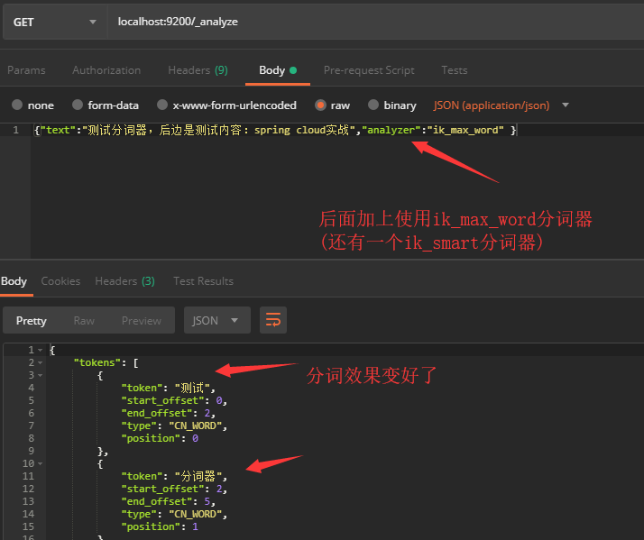

## 十六、ElasticSearch-IK分词器-自定义词汇

如果要让分词器支持一些专有词语，可以自定义词库。
iK分词器自带一个main.dic的文件，此文件为词库文件。

比如没有自定义"鑫陈莹郑"这个词汇。则搜索如下:

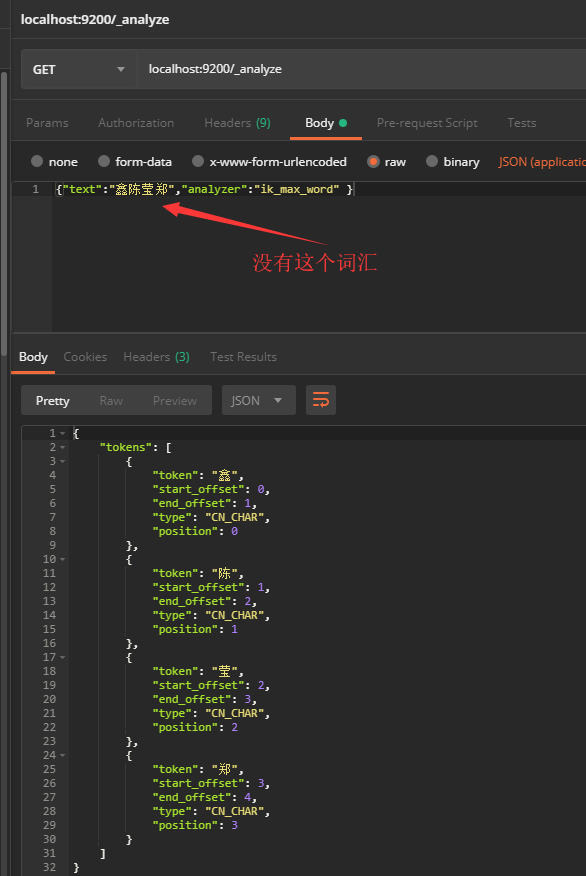

下面开始自定义:

### 1、IKAnalyzer.cfg.xml

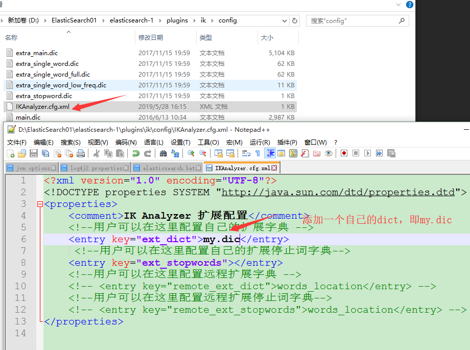

```xml
<?xml version="1.0" encoding="UTF-8"?>
<!DOCTYPE properties SYSTEM "http://java.sun.com/dtd/properties.dtd">
<properties>
	<comment>IK Analyzer 扩展配置</comment>
	<!--用户可以在这里配置自己的扩展字典 -->
	<entry key="ext_dict">my.dic</entry>
	 <!--用户可以在这里配置自己的扩展停止词字典-->
	<entry key="ext_stopwords">stop.dic</entry>
</properties>
```

### 2、扩展词库my.dic

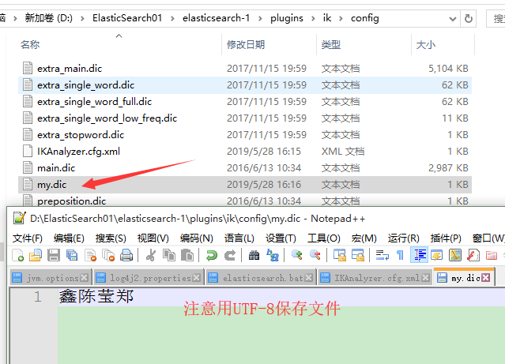

注意： **文档的编码格式为UTF-8**

```
鑫陈莹郑
```

测试搜索:

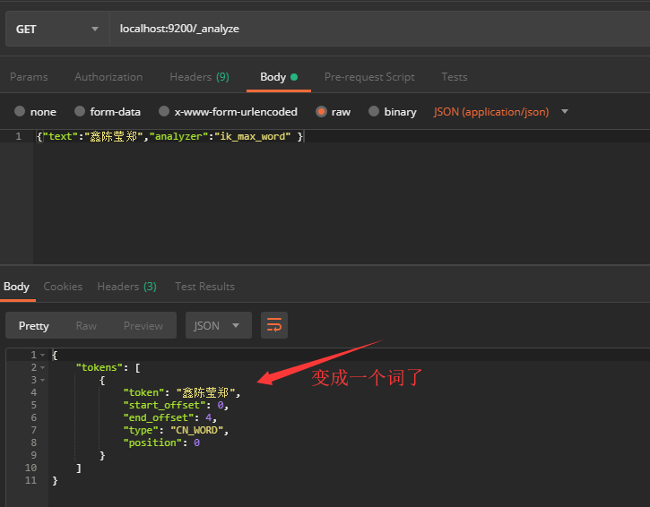

### 3、停用词库stop.dic

```
共产党
江泽民
```

## 十七、ElasticSearch-映射-映射维护方法

只能添加

不能更新 (**一开始就要确定好类型**)

后面不能更改类型。

## 十八、ElasticSearch-映射-常用映射类型

字符串包括text和keyword两种类型：
1、text
1）analyzer
通过analyzer属性指定分词器。
下边指定name的字段类型为text，使用ik分词器的ik_max_word分词模式。

```json
"name": {
    "type": "text",
    "analyzer":"ik_max_word"
}
```

上边指定了analyzer是指在索引和搜索都使用ik_max_word，如果单独想定义搜索时使用的分词器则可以通过
search_analyzer属性。
**对于ik分词器建议是索引时使用ik_max_word将搜索内容进行细粒度分词，搜索时使用ik_smart提高搜索精确性**。

2）index
通过index属性指定是否索引。
默认为index=true，即要进行索引，只有进行索引才可以从索引库搜索到。

比如图片可以设置`index = false`，不需要索引。

**keyword**

上边介绍的text文本字段在映射时要设置分词器，keyword字段为关键字字段，通常搜索keyword是按照整体搜
索，所以创建keyword字段的索引时是不进行分词的，比如：邮政编码、手机号码、身份证等。keyword字段通常
用于过虑、排序、聚合等。

## 十九、ElasticSearch-索引管理-搭建搜索工程

这里导入依赖的时候出现了问题（**搞了几个小时，不知道什么原因，最后重新更改maven，并更改本地repository和中央仓库，才搞定**）
依赖:

```xml
<dependency>
    <groupId>org.elasticsearch.client</groupId>
    <artifactId>elasticsearch-rest-high-level-client</artifactId>
    <version>6.2.1</version>
</dependency>
<dependency>
    <groupId>org.elasticsearch</groupId>
    <artifactId>elasticsearch</artifactId>
    <version>6.2.1</version>
</dependency>
```

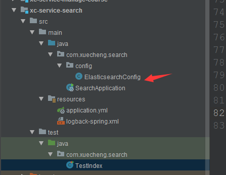

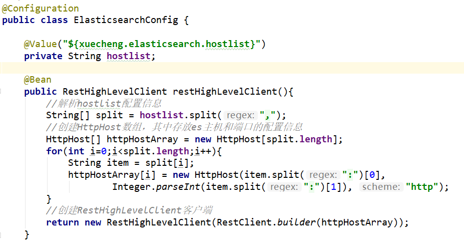

## 二十、ElasticSearch-索引管理-创建索引库

```java
@SpringBootTest
@RunWith(SpringRunner.class)
public class TestIndex {

    @Autowired
    RestHighLevelClient client;

    @Autowired
    RestClient restClient;

    //创建索引库
    @Test
    public void testCreateIndex() throws IOException {
        //创建索引对象
        CreateIndexRequest createIndexRequest = new CreateIndexRequest("xc_course");
        //设置参数
        createIndexRequest.settings(Settings.builder().put("number_of_shards","1").put("number_of_replicas","0"));
        //指定映射
        createIndexRequest.mapping("doc"," {\n" +
                " \t\"properties\": {\n" +
                "            \"studymodel\":{\n" +
                "             \"type\":\"keyword\"\n" +
                "           },\n" +
                "            \"name\":{\n" +
                "             \"type\":\"keyword\"\n" +
                "           },\n" +
                "           \"description\": {\n" +
                "              \"type\": \"text\",\n" +
                "              \"analyzer\":\"ik_max_word\",\n" +
                "              \"search_analyzer\":\"ik_smart\"\n" +
                "           },\n" +
                "           \"pic\":{\n" +
                "             \"type\":\"text\",\n" +
                "             \"index\":false\n" +
                "           }\n" +
                " \t}\n" +
                "}", XContentType.JSON);
        //操作索引的客户端
        IndicesClient indices = client.indices();
        //执行创建索引库
        CreateIndexResponse createIndexResponse = indices.create(createIndexRequest);
        //得到响应
        boolean acknowledged = createIndexResponse.isAcknowledged();
        System.out.println(acknowledged);

    }

    //删除索引库
    @Test
    public void testDeleteIndex() throws IOException {
        //删除索引对象
        DeleteIndexRequest deleteIndexRequest = new DeleteIndexRequest("xc_course");
        //操作索引的客户端
        IndicesClient indices = client.indices();
        //执行删除索引
        DeleteIndexResponse delete = indices.delete(deleteIndexRequest);
        //得到响应
        boolean acknowledged = delete.isAcknowledged();
        System.out.println(acknowledged);
    }

}

```

## 二十一、ElasticSearch-索引管理-文档的增删改查

这里在添加文档的时候一直报错，也找了很久的问题。

一直报错：`ElasticSearch ClusterBlockException[blocked by: [FORBIDDEN/12/index read-only / allow delete (api)];`

参考下面博客，最后知道是由于**磁盘容量不够导致的问题**。<https://blog.csdn.net/qq_14965807/article/details/79400481>


于是将`path.data`和`path.logs`更改目录，更改到`C`盘。

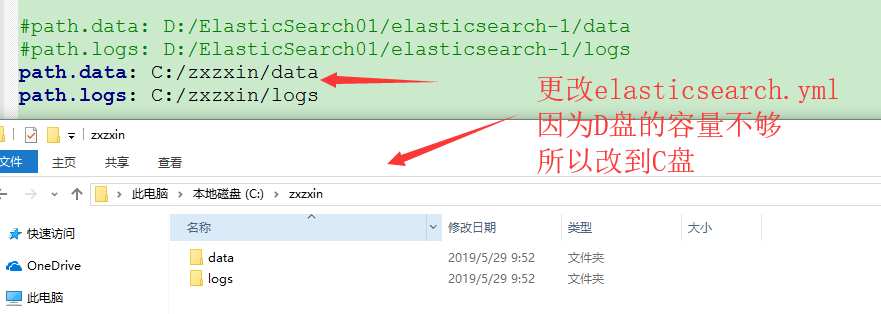

添加代码: 

```java
//添加文档
@Test
public void testAddDoc() throws IOException {
    //文档内容
    //准备json数据
    Map<String, Object> jsonMap = new HashMap<>();
    jsonMap.put("name", "spring cloud实战");
    jsonMap.put("description", "本课程主要从四个章节进行讲解： 1.微服务架构入门 2.spring cloud 基础入门 3.实战Spring Boot 4.注册中心eureka。");
    jsonMap.put("studymodel", "201001");
    SimpleDateFormat dateFormat =new SimpleDateFormat("yyyy-MM-dd HH:mm:ss");
    jsonMap.put("timestamp", dateFormat.format(new Date()));
    jsonMap.put("price", 5.6f);

    //创建索引创建对象
    IndexRequest indexRequest = new IndexRequest("xc_course","doc");
    //文档内容
    indexRequest.source(jsonMap);
    //通过client进行http的请求
    IndexResponse indexResponse = client.index(indexRequest);
    DocWriteResponse.Result result = indexResponse.getResult();
    System.out.println(result);
}
```


其他 删除、更新可以参考项目中`TestIndex`下的具体代码。

改: 先删除再添加

​	

