# 搜索服务

注意这里PDF内容还是第十天的`Elasticsearch研究v1.2.pdf`中后面的搜索服务内容。

## 一、ElasticSearch-搜索管理-准备环境

删除之前的索引库`xc_course`，重新创建`xc_course`，并在资料中找到创建的`.txt`文档。


创建映射：

```json
{
    "properties": {
        "description": {
            "type": "text",
            "analyzer": "ik_max_word",
            "search_analyzer": "ik_smart"
        },
        "name": {
            "type": "text",
            "analyzer": "ik_max_word",
            "search_analyzer": "ik_smart"
        },
		"pic":{
			"type":"text",
			"index":false
		},
        "price": {
            "type": "float"
        },
        "studymodel": {
            "type": "keyword"
        },
        "timestamp": {
            "type": "date",
            "format": "yyyy-MM-dd HH:mm:ss||yyyy-MM-dd||epoch_millis"
        }
    }
}
```

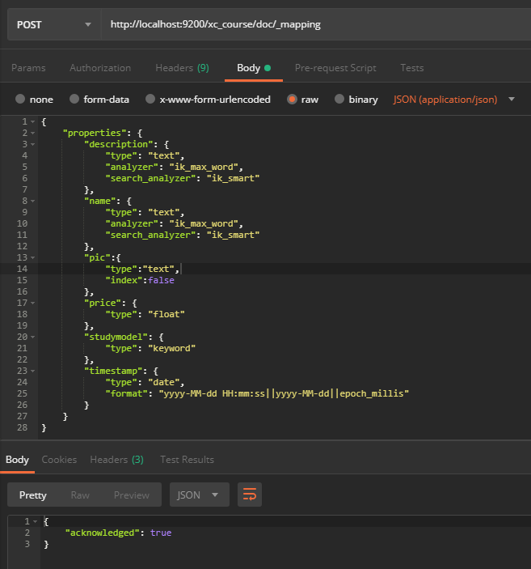

```json
{
	"name": "Bootstrap开发",
	"description": "Bootstrap是由Twitter推出的一个前台页面开发框架，是一个非常流行的开发框架，此框架集成了多种页面效果。此开发框架包含了大量的CSS、JS程序代码，可以帮助开发者（尤其是不擅长页面开发的程序人员）轻松的实现一个不受浏览器限制的精美界面效果。",
	"studymodel": "201002",
	"price":38.6,
	"timestamp":"2018-04-25 19:11:35",
	"pic":"group1/M00/00/00/wKhlQFs6RCeAY0pHAAJx5ZjNDEM428.jpg"
}
```

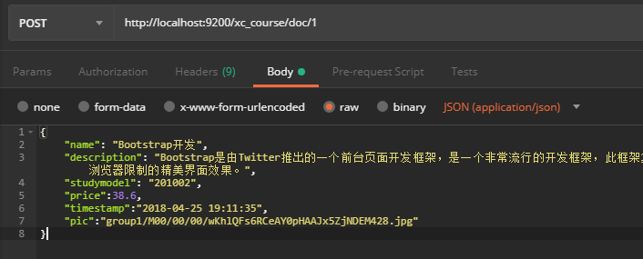

按照上面的方式再插入两条文档，最后内容如下:

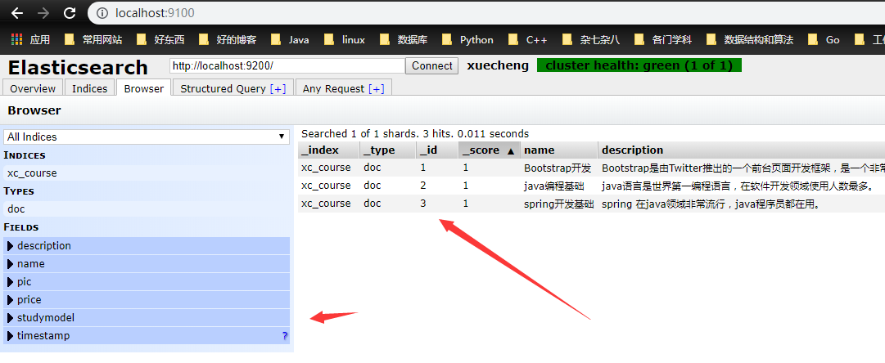

可以简单测试一下搜索:

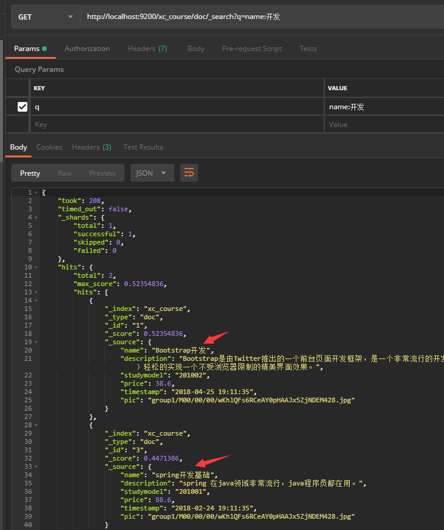

## 二、ElasticSearch-搜索管理-DSL搜索-查询所有文档

使用postman并使用DSL进行搜索，注意是`POST`请求方式：

`post   :     http://localhost:9200/xc_course/doc/_search`

```json
{
	"query": {
		"match_all": {}
	},
	"_source" : ["name","studymodel"]
}
```

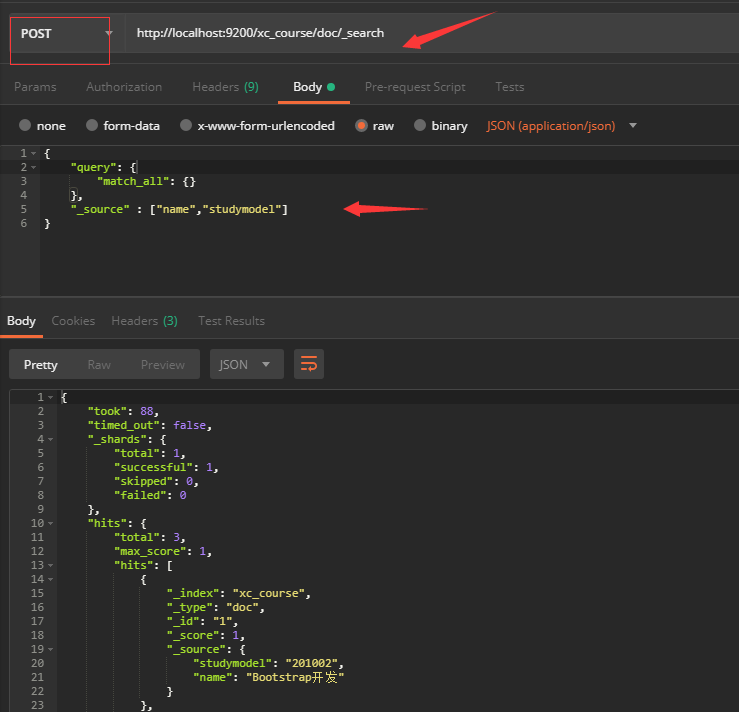

使用JavaClient代码如下:

```java
//搜索type下的全部记录
@Test
public void testSearchAll() throws IOException {
    SearchRequest searchRequest = new SearchRequest("xc_course");
    searchRequest.types("doc");
    SearchSourceBuilder searchSourceBuilder = new SearchSourceBuilder();
    searchSourceBuilder.query(QueryBuilders.matchAllQuery());
    //source源字段过虑
    searchSourceBuilder.fetchSource(new String[]{"name", "studymodel", "description"}, new String[]{});
    searchRequest.source(searchSourceBuilder);
    SearchResponse searchResponse = client.search(searchRequest);
    SearchHits hits = searchResponse.getHits();
    SearchHit[] searchHits = hits.getHits();
    for (SearchHit hit : searchHits) {
        String index = hit.getIndex();
        String type = hit.getType();
        String id = hit.getId();
        float score = hit.getScore();
        String sourceAsString = hit.getSourceAsString();

        Map<String, Object> sourceAsMap = hit.getSourceAsMap();
        String name = (String) sourceAsMap.get("name");
        String studymodel = (String) sourceAsMap.get("studymodel");
        String description = (String) sourceAsMap.get("description");


        System.out.println(name);
        System.out.println(studymodel);
        System.out.println(description);
    }
}
```

## 三、ElasticSearch-搜索管理-DSL搜索-分页查询

设置分页参数，设置两个参数`from、size`。注意`from`是起始的文档的下标，从0开始。size是**每页**查询的文档的数量。

使用`postman`:

```json
{
	"from" : 2, "size" : 1,
	"query": {
		"match_all": {}
	},
	"_source" : ["name","studymodel"]
}
```

使用JavaClient:

```java
//分页查询，设置起始下标，从0开始
searchSourceBuilder.from(0);
//每页显示个数
searchSourceBuilder.size(10);
```

```java
// 在这里设置分页的参数, from 和 size
int page = 2, size = 1; //这里page是起始的页码，如果从2开始，则起始from = size
int from = (page - 1) * size;
searchSourceBuilder.from(from);
searchSourceBuilder.size(size);
```

前人留下的异常: 

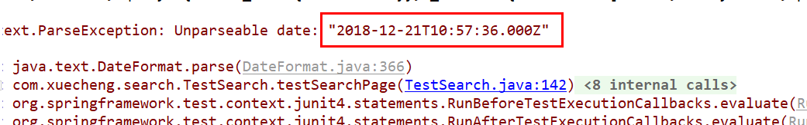

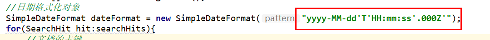

## 四、ElasticSearch-搜索管理-DSL搜索-TermQuery和Id查询

使用TermQuery查询(精确匹配，不会分词)

测试，分别按照`spring`和`spring开发基础`来查询。

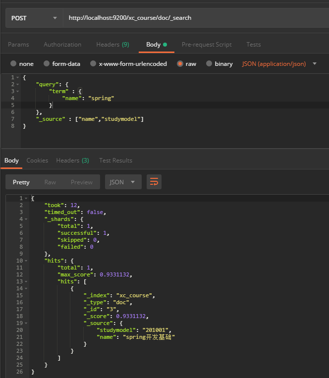

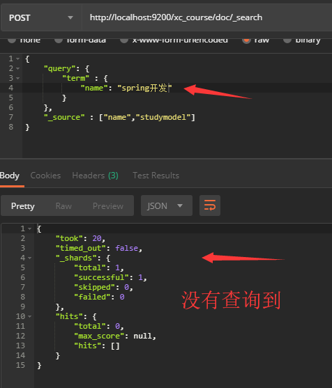

JavaClient使用:

```java
 searchSourceBuilder.query(QueryBuilders.termQuery("name", "spring"));
```

**根据ID查询**(这里在JavaClient调用的时候有一个坑需要特别注意，这里是termsQuery而不是termQuery)

```java
// 注意是termsQuery而不是termQuery
String[] ids = new String[]{"1", "2"};
searchSourceBuilder.query(QueryBuilders.termsQuery("_id", ids));
```


## 五、ElasticSearch-搜索管理-DSL搜索-MatchQuery

match Query即全文检索，它的搜索方式是先将搜索字符串分词，再使用各各词条从索引中搜索。
match query与Term query区别是match query在搜索前先将搜索关键字分词，再拿各各词语去索引中搜索。

过程:

1、将“spring开发”分词，分为spring、开发两个词
2、再使用spring和开发两个词去匹配索引中搜索。
3、由于设置了operator为or，只要有一个词匹配成功则就返回该文档。

```java
 //匹配关键字 , 匹配spring或者开发
searchSourceBuilder.query(QueryBuilders.matchQuery("name", "spring开发")
                          .operator(Operator.OR));
```

上边使用的operator = or表示只要有一个词匹配上就得分，如果实现三个词至少有两个词匹配如何实现？
使用minimum_should_match可以指定文档匹配词的占比：

```java
searchSourceBuilder.query(QueryBuilders.matchQuery("name", "spring开发")
                          .minimumShouldMatch("80%"));
```

## 六、ElasticSearch-搜索管理-DSL搜索-MultiMatchQuery

multiQuery，一次可以匹配多个字段。

“name^10” 表示权重提升10倍，执行上边的查询，发现name中包括spring关键字的文档排在前边。

```java
{
	"query": {
		"multi_match" : {
			"query" : "spring框架",
			"minimum_should_match": "50%",
			"fields": [ "name^10", "description" ]
		}
	}
}
```

JavaClient:

```java
searchSourceBuilder.query(QueryBuilders.multiMatchQuery("spring框架",
                                                        "name", "description")
                          .minimumShouldMatch("50%").field("name",10));
```


## 七、ElasticSearch-搜索管理-DSL搜索-布尔查询

布尔查询对应于Lucene的BooleanQuery查询，实现将多个查询组合起来。
三个参数：
must：文档必须匹配must所包括的查询条件，相当于 “AND” should：文档应该匹配should所包括的查询条件其
中的一个或多个，相当于 "OR" must_not：文档不能匹配must_not所包括的该查询条件，相当于“NOT”

```json
{
	"_source" : [ "name", "studymodel", "description"],
		"from" : 0, "size" : 1,
			"query": {
				"bool" : {
					"must":[
					{
						"multi_match" : {
						"query" : "spring框架",
						"minimum_should_match": "50%",
						"fields": [ "name^10", "description" ]
					}
					},
					{
					"term":{
						"studymodel" : "201001"
					}
				}
			]
		}
	}
}
```

must：表示必须，多个查询条件必须都满足。（通常使用must）
should：表示或者，多个查询条件只要有一个满足即可。
must_not：表示非。

JavaClient

```java
        MultiMatchQueryBuilder multiMatchQueryBuilder = QueryBuilders.multiMatchQuery("spring框架",
                "name", "description")
                .minimumShouldMatch("50%");
        multiMatchQueryBuilder.field("name",10);

        //TermQuery
        TermQueryBuilder termQueryBuilder = QueryBuilders.termQuery("studymodel", "201001");

        //布尔查询
        BoolQueryBuilder boolQueryBuilder = QueryBuilders.boolQuery();
        boolQueryBuilder.must(multiMatchQueryBuilder);
        boolQueryBuilder.must(termQueryBuilder);

        //设置布尔查询对象
        searchSourceBuilder.query(boolQueryBuilder);
```

## 八、ElasticSearch-搜索管理-DSL搜索-过虑器

过滤器的效率比普通的query效率上要更加的高。

```java
{
	"_source" : [ "name", "studymodel", "description","price"],
		"query": {
			"bool" : {
				"must":[
					{
					"multi_match" : {
						"query" : "spring框架",
						"minimum_should_match": "50%",
						"fields": [ "name^10", "description" ]
						}
					}
					],
					"filter": [
						{ "term": { "studymodel": "201001" }},
						{ "range": { "price": { "gte": 60 ,"lte" : 100}}}
					]
		}
	}
}
```

JavaClient

在基于布尔查询的基础上进行过滤。

需要在boolQueryBuilder的上配置一个`filter`，即`boolQueryBuilder.filter(QueryBuilders...)`

```java

        MultiMatchQueryBuilder multiMatchQueryBuilder = QueryBuilders.multiMatchQuery("spring框架",
                "name", "description")
                .minimumShouldMatch("50%");
        multiMatchQueryBuilder.field("name",10);

        BoolQueryBuilder boolQueryBuilder = QueryBuilders.boolQuery();
        boolQueryBuilder.must(multiMatchQueryBuilder);

        //----在这里进行过滤的功能
        boolQueryBuilder.filter(QueryBuilders.termQuery("studymodel", "201001"));
        boolQueryBuilder.filter(QueryBuilders.rangeQuery("price").gte(60).lte(100));

        searchSourceBuilder.query(boolQueryBuilder);
```

## 九、ElasticSearch-搜索管理-DSL搜索-排序

```java
//source源字段过虑
searchSourceBuilder.fetchSource(new String[]{"name", "studymodel"}, new String[]{});

// 排序，按照studymodel降序，和price升序
searchSourceBuilder.sort("studymodel", SortOrder.DESC);
searchSourceBuilder.sort("price", SortOrder.ASC);


searchRequest.source(searchSourceBuilder);
```


## 十、ElasticSearch-搜索管理-DSL搜索-高亮

设置高亮的Field

设置高亮的前缀和后缀

## 十一、ElasticSearch-集群-集群结构


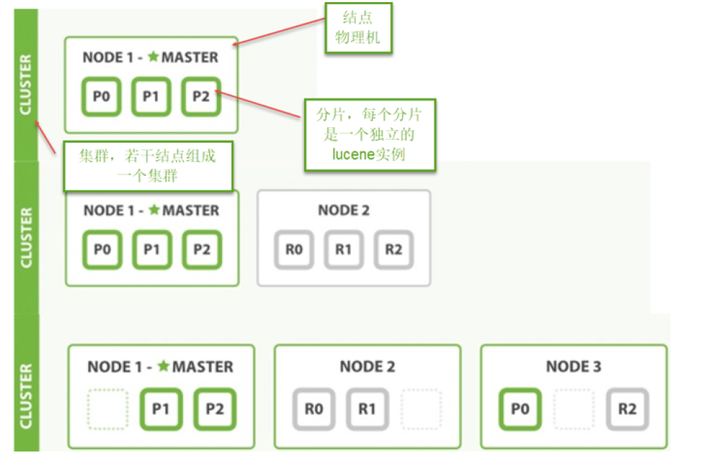


## 十二、ElasticSearch-集群-搭建集群

**实现创建一个2结点的集群，并且索引的分片我们设置2片，每片一个副本**。

主结点：master节点主要用于集群的管理及索引 比如新增结点、分片分配、索引的新增和删除等。 数据结点：
data 节点上保存了数据分片，它负责索引和搜索操作。 客户端结点：client 节点仅作为请求客户端存在，client的
作用也作为负载均衡器，client 节点不存数据，只是将请求均衡转发到其它结点。

通过下边两项参数来配置结点的功能：

node.master: #是否允许为主结点
node.data: #允许存储数据作为数据结点
node.ingest: #是否允许成为协调节点，

四种组合方式：

`master=true，data=true`：即是主结点又是数据结点
`master=false，data=true`：仅是数据结点
`master=true，data=false`：仅是主结点，不存储数据
`master=false，data=false`：即不是主结点也不是数据结点，此时可设置ingest为true表示它是一个客户端。

搭建: 

`es-1`更改:

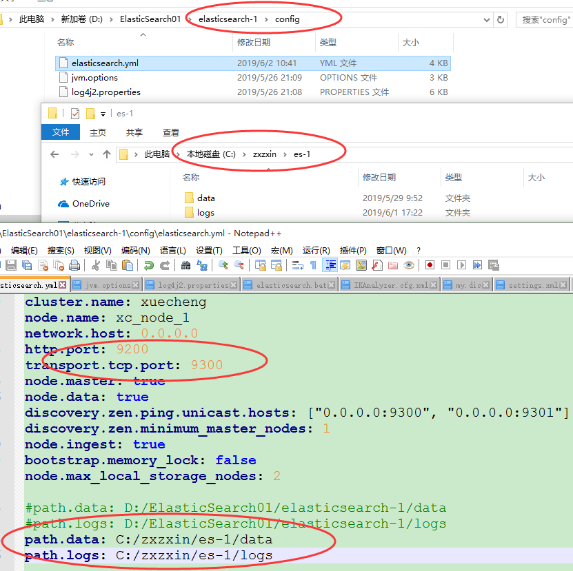

`es-2`的搭建(复制`elasticsearch-1`文件夹):

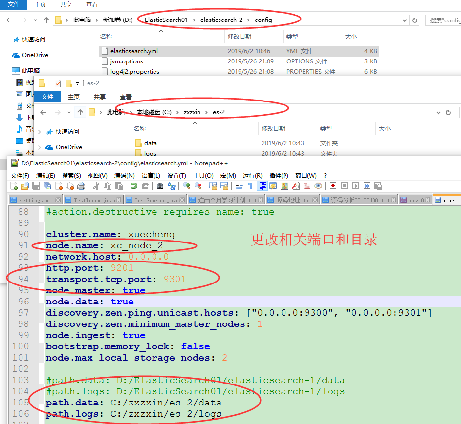

分别启动两台`es`

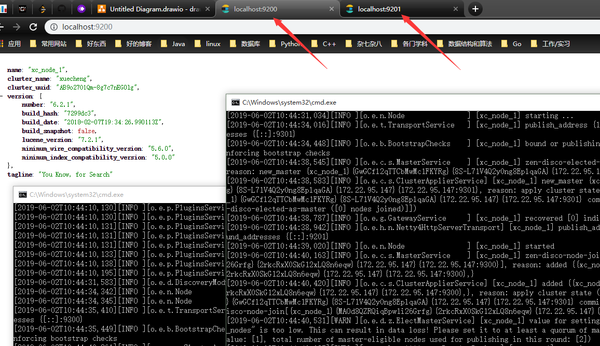

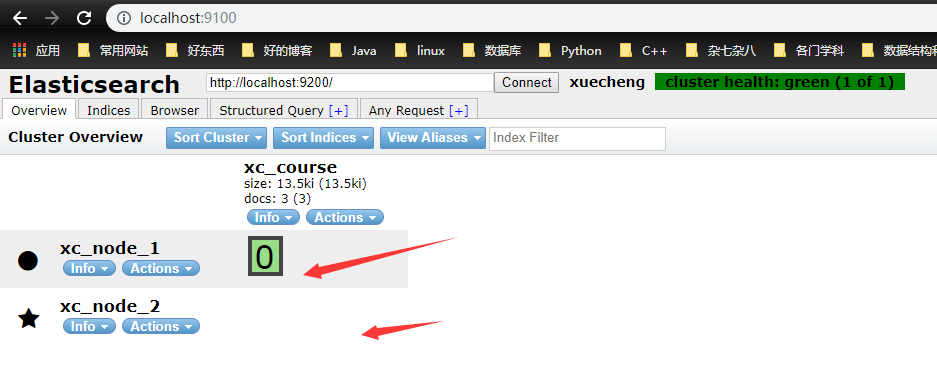


通过访问 `GET /_cluster/health` 来查看Elasticsearch 的集群健康情况。
用三种颜色来展示健康状态： green 、 yellow 或者 red 。
green：所有的主分片和副本分片都正常运行。 yellow：所有的主分片都正常运行，但有些副本分片运行不正常。
red：存在主分片运行不正常。

Get请求：http://localhost:9200/_cluster/health

## 十三、课程搜索需求分析


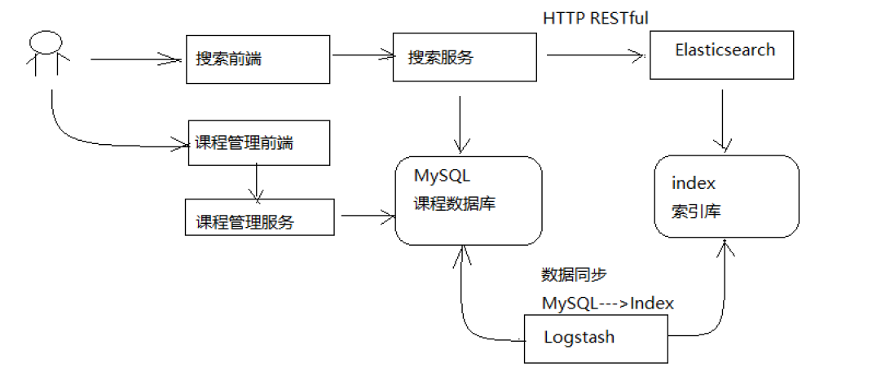

1、课程管理服务将数据写到MySQL数据库
2、**使用Logstash将MySQL数据库中的数据写到ES的索引库**。
3、用户在前端搜索课程信息，请求到搜索服务。
4、搜索服务请求ES搜索课程信息。

## 十四、课程索引-技术方案

**Logstash**

如何维护课程索引信息？
1、当课程向MySQL添加后同时将课程信息添加到索引库。
采用Logstach实现，Logstach会从MySQL中将数据采集到ES索引库。
2、当课程在MySQL更新信息后同时更新该课程在索引库的信息。
采用Logstach实现。
3、当课程在MySQL删除后同时将该课程从索引库删除。
手工写程序实现，在删除课程后将索引库中该课程信息删除。


## 十五、课程索引-准备课程索引信息-CoursePub模型

course_pub表包含了`course_base、	course_pic、course_market、teachplan`几张表的信息

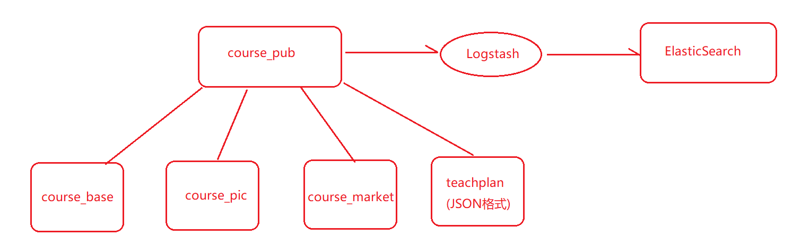

`course_pub`:

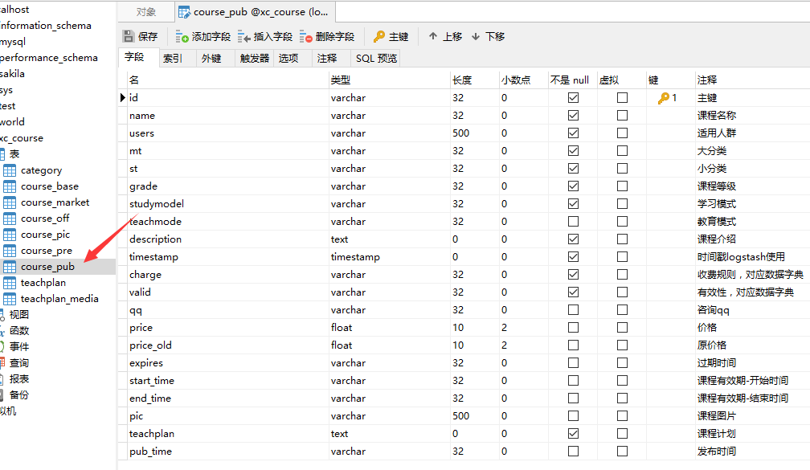

对应的模型数据:

```java
@Data
@ToString
@Entity
@Table(name="course_pub")
@GenericGenerator(name = "jpa-assigned", strategy = "assigned")
public class CoursePub implements Serializable {
    private static final long serialVersionUID = -916357110051689487L;
    @Id
    @GeneratedValue(generator = "jpa-assigned")
    @Column(length = 32)
    private String id;
    private String name;
    private String users;
    private String mt;
    private String st;
    private String grade;
    private String studymodel;
    private String teachmode;
    private String description;
    private String pic;//图片
    private Date timestamp;//时间戳
    private String charge;
    private String valid;
    private String qq;
    private Float price;
    private Float price_old;
    private String expires;
    private String teachplan;//课程计划
    @Column(name="pub_time")
    private String pubTime;//课程发布时间
}
```

## 十六、课程索引-准备课程索引信息-保存CoursePub

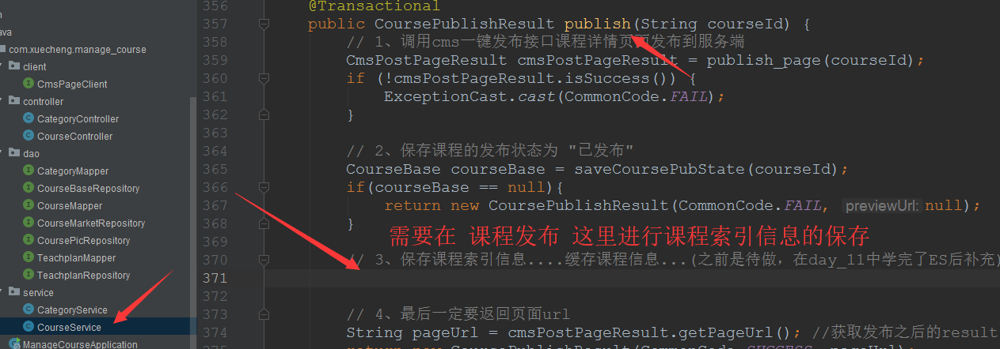

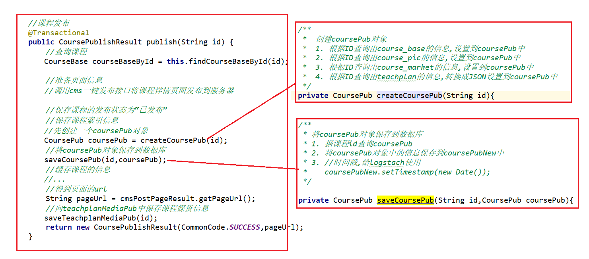

1）创建course_pub表的dao

```java
public interface CoursePubRepository extends JpaRepository<CoursePub, String> {
}
```

2)修改课程发布service (修改`CourseService`)

```java
//课程发布
@Transactional
public CoursePublishResult publish(String courseId) {
    //............

    // 3、保存课程索引信息....缓存课程信息...(之前是待做，在day_11中学完了ES后补充)

    //创建课程索引信息 (创建CoursePub对象)
    CoursePub coursePub = createCoursePub(courseId);

    // 数据库保存CoursePub
    //向数据库保存课程索引信息
    CoursePub newCoursePub = saveCoursePub(courseId, coursePub);
    if (newCoursePub == null) {
        //创建课程索引信息失败
        ExceptionCast.cast(CourseCode.COURSE_PUBLISH_CREATE_INDEX_ERROR);
    }
    //............
}

private CoursePub saveCoursePub(String courseId, CoursePub coursePub) {

    CoursePub coursePubNew = null;
    //根据课程id查询coursePub
    Optional<CoursePub> coursePubOptional = coursePubRepository.findById(courseId);
    if(coursePubOptional.isPresent()){
        coursePubNew = coursePubOptional.get();
    }else{
        coursePubNew = new CoursePub();
    }

    //将coursePub对象中的信息保存到coursePubNew中
    BeanUtils.copyProperties(coursePub,coursePubNew);
    coursePubNew.setId(courseId);
    //时间戳,给logstach使用
    coursePubNew.setTimestamp(new Date());
    //发布时间
    SimpleDateFormat simpleDateFormat = new SimpleDateFormat("YYYY-MM-dd HH:mm:ss");
    String date = simpleDateFormat.format(new Date());
    coursePubNew.setPubTime(date);
    coursePubRepository.save(coursePubNew);
    return coursePubNew;
}

// 创建课程索引信息
private CoursePub createCoursePub(String courseId) {
    CoursePub coursePub = new CoursePub();
    //根据课程id查询course_base
    Optional<CourseBase> baseOptional = courseBaseRepository.findById(courseId);
    // 这里一开始写错了 (课程资料中写错了)，写成了courseBaseOptional == null
    if(baseOptional.isPresent()){
        CourseBase courseBase = baseOptional.get();
        //将courseBase属性拷贝到CoursePub中
        BeanUtils.copyProperties(courseBase,coursePub);
    }

    //查询课程图片
    Optional<CoursePic> picOptional = coursePicRepository.findById(courseId);
    if(picOptional.isPresent()){
        CoursePic coursePic = picOptional.get();
        BeanUtils.copyProperties(coursePic, coursePub);
    }

    //课程营销信息
    Optional<CourseMarket> marketOptional = courseMarketRepository.findById(courseId);
    if(marketOptional.isPresent()){
        CourseMarket courseMarket = marketOptional.get();
        BeanUtils.copyProperties(courseMarket, coursePub);
    }
    //课程计划信息
    TeachplanNode teachplanNode = teachplanMapper.selectList(courseId);
    String jsonString = JSON.toJSONString(teachplanNode);
    //将课程计划信息json串保存到 course_pub中
    coursePub.setTeachplan(jsonString);
    return coursePub;
}
```


## 十七、课程索引-准备课程索引信息-保存CoursePub测试

这里有一个bug找了很久，原因就是课件中提供的pdf中`createCoursePub()`方法中有一个错误。

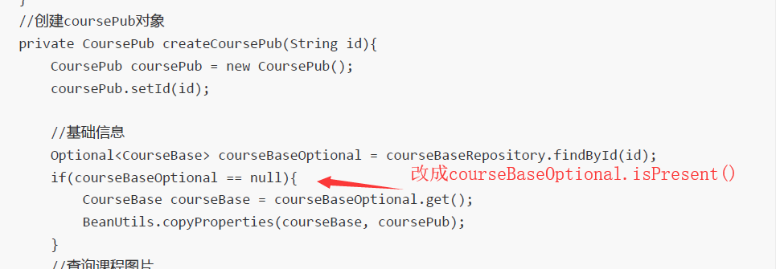

点击发布课程按钮: 


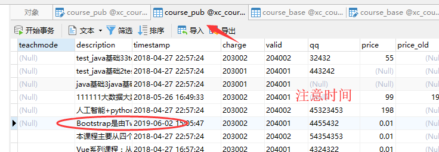

## 十八、课程索引-搭建ES环境

这里使用单机ES，先删除原先的数据。然后创建新的映射。

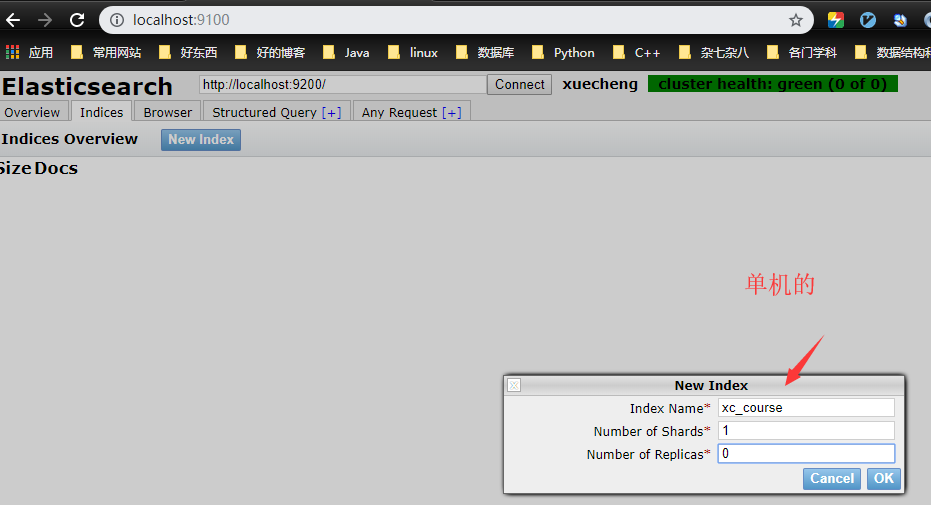

然后创建映射:

**注意课件pdf中的时间的横线`-`要从中文改成英文格式的**

```json
{
	"properties" : {
		"description" : {
			"analyzer" : "ik_max_word",
			"search_analyzer": "ik_smart",
			"type" : "text"
		},
		"grade" : {
			"type" : "keyword"
		},
		"id" : {
			"type" : "keyword"
		},
		"mt" : {
			"type" : "keyword"
		},
		"name" : {
			"analyzer" : "ik_max_word",
			"search_analyzer": "ik_smart",
			"type" : "text"
		},
		"users" : {
			"index" : false,
			"type" : "text"
		},
		"charge" : {
			"type" : "keyword"
		},
		"valid" : {
			"type" : "keyword"
		},
		"pic" : {
			"index" : false,
			"type" : "keyword"
		},
		"qq" : {
			"index" : false,
			"type" : "keyword"
		},
		"price" : {
			"type" : "float"
		},
		"price_old" : {
			"type" : "float"
		},
		"st" : {
			"type" : "keyword"
		},
		"status" : {
			"type" : "keyword"
		},
		"studymodel" : {
			"type" : "keyword"
		},
		"teachmode" : {
			"type" : "keyword"
		},
		"teachplan" : {
			"analyzer" : "ik_max_word",
			"search_analyzer": "ik_smart",
			"type" : "text"
		},
		"expires" : {
			"type" : "date",
			"format": "yyyy-MM-dd HH:mm:ss"
		},
		"pub_time" : {
			"type" : "date",
			"format": "yyyy-MM-dd HH:mm:ss"
		},
		"start_time" : {
			"type" : "date",
			"format": "yyyy-MM-dd HH:mm:ss"
		},
		"end_time" : {
			"type" : "date",
			"format": "yyyy-MM-dd HH:mm:ss"
		}
	}
}
```

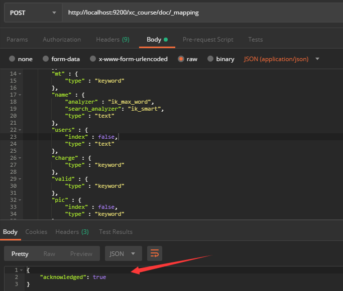

## 十九、课程索引-Logstash创建索引-安装配置

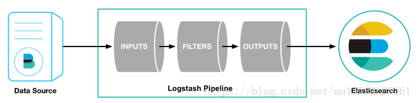

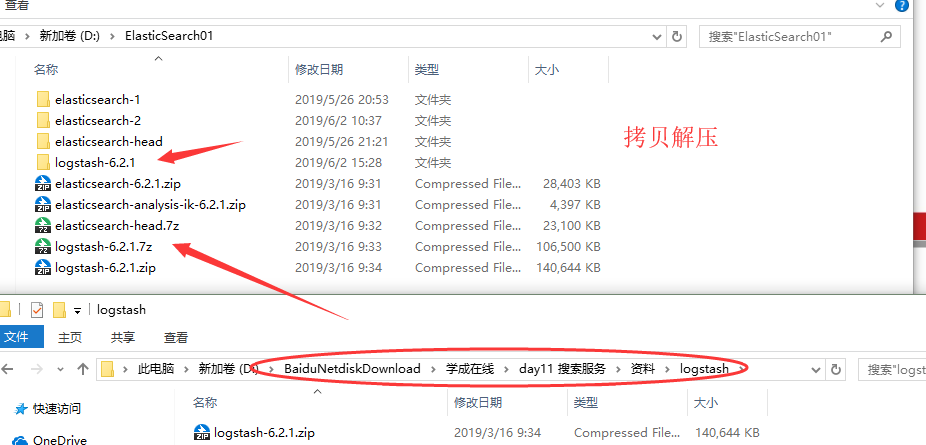

1)、下载Ruby安装

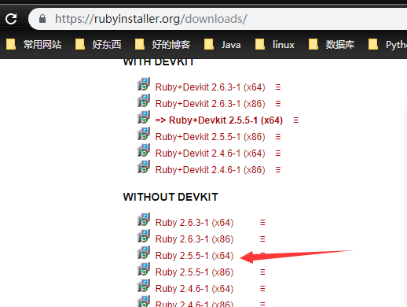


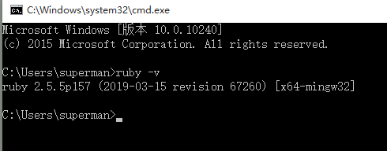

2)、安装`logstash-input-jdbc`插件(这里解压的包里面已经装了)

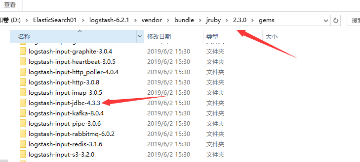

3)、拷贝两个配置文件

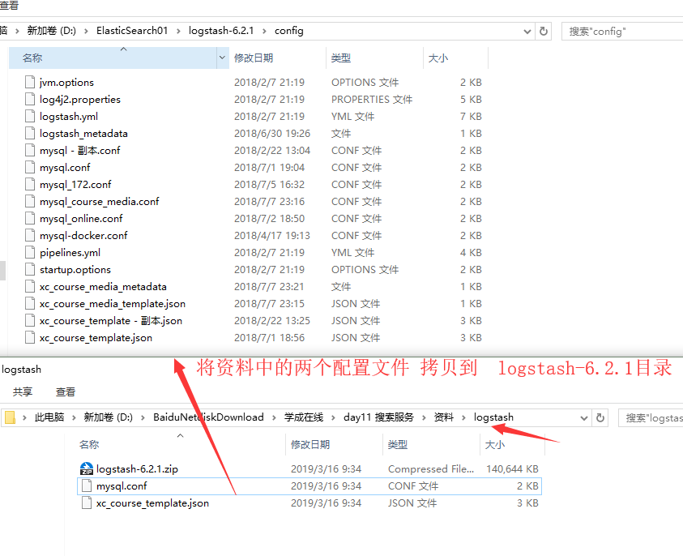

其中`xc_course_template.json`中的内容:

```json
{
   "mappings" : {
      "doc" : {
         "properties" : {
            "charge" : {
               "type" : "keyword"
            },
            "description" : {
               "analyzer" : "ik_max_word",
               "search_analyzer" : "ik_smart",
               "type" : "text"
            },
            "end_time" : {
               "format" : "yyyy-MM-dd HH:mm:ss",
               "type" : "date"
            },
            "expires" : {
               "format" : "yyyy-MM-dd HH:mm:ss",
               "type" : "date"
            },
            "grade" : {
               "type" : "keyword"
            },
            "id" : {
               "type" : "keyword"
            },
            "mt" : {
               "type" : "keyword"
            },
            "name" : {
               "analyzer" : "ik_max_word",
               "search_analyzer" : "ik_smart",
               "type" : "text"
            },
            "pic" : {
               "index" : false,
               "type" : "keyword"
            },
            "price" : {
               "type" : "float"
            },
            "price_old" : {
               "type" : "float"
            },
            "pub_time" : {
               "format" : "yyyy-MM-dd HH:mm:ss",
               "type" : "date"
            },
            "qq" : {
               "index" : false,
               "type" : "keyword"
            },
            "st" : {
               "type" : "keyword"
            },
            "start_time" : {
               "format" : "yyyy-MM-dd HH:mm:ss",
               "type" : "date"
            },
            "status" : {
               "type" : "keyword"
            },
            "studymodel" : {
               "type" : "keyword"
            },
            "teachmode" : {
               "type" : "keyword"
            },
            "teachplan" : {
               "analyzer" : "ik_max_word",
               "search_analyzer" : "ik_smart",
               "type" : "text"
            },
            "users" : {
               "index" : false,
               "type" : "text"
            },
            "valid" : {
               "type" : "keyword"
            }
         }
      }
   },
   "template" : "xc_course"
}

```

然后是`mysql.conf`的配置文件，需要更改mysql的相关配置:

```ruby
input {
  stdin {
  }
  jdbc {
  jdbc_connection_string => "jdbc:mysql://localhost:3306/xc_course?useUnicode=true&characterEncoding=utf-8&useSSL=true&serverTimezone=UTC"
  # the user we wish to excute our statement as
  jdbc_user => "root"
  jdbc_password => root
  # the path to our downloaded jdbc driver  
  jdbc_driver_library => "D:/software/repository/mysql/mysql-connector-java/5.1.41/mysql-connector-java-5.1.41.jar"
  # the name of the driver class for mysql
  jdbc_driver_class => "com.mysql.jdbc.Driver"
  jdbc_paging_enabled => "true"
  jdbc_page_size => "50000"
  #要执行的sql文件
  #statement_filepath => "/conf/course.sql"
  statement => "select * from course_pub where timestamp > date_add(:sql_last_value,INTERVAL 8 HOUR)"
  #定时配置
  schedule => "* * * * *"
  record_last_run => true
  last_run_metadata_path => "D:/ElasticSearch01/logstash-6.2.1/config/logstash_metadata"
  }
}


output {
  elasticsearch {
  #ES的ip地址和端口
  hosts => "localhost:9200"
  #hosts => ["localhost:9200","localhost:9202","localhost:9203"]
  #ES索引库名称
  index => "xc_course"
  document_id => "%{id}"
  document_type => "doc"
  template =>"D:/ElasticSearch01/logstash-6.2.1/config/xc_course_template.json"
  template_name =>"xc_course"
  template_overwrite =>"true"
  }
  stdout {
 #日志输出
  codec => json_lines
  }
}

```

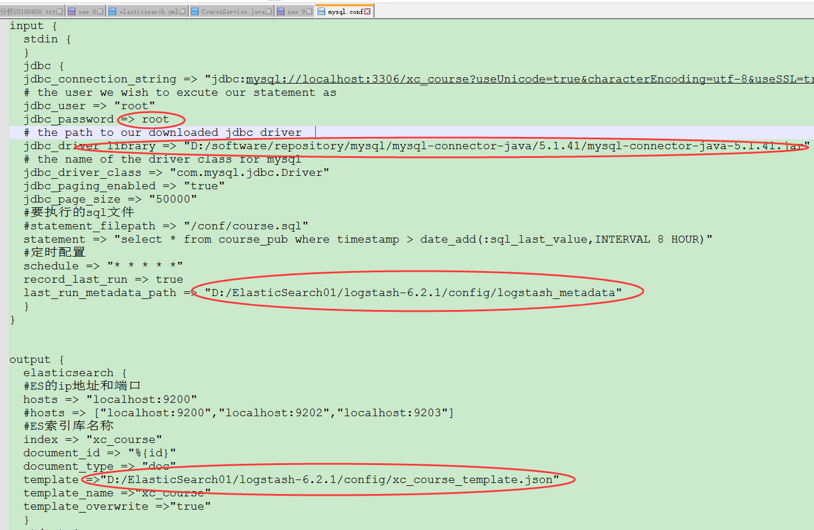

更新的文件配置(win10搬家)

```ruby
input {
  stdin {
  }
  jdbc {
  jdbc_connection_string => "jdbc:mysql://localhost:3306/xc_course?useUnicode=true&characterEncoding=utf-8&useSSL=true&serverTimezone=UTC"
  # the user we wish to excute our statement as
  jdbc_user => "root"
  jdbc_password => root
  # the path to our downloaded jdbc driver  
  jdbc_driver_library => "D:/Program Files/maven_repository/mysql/mysql-connector-java/5.1.40/mysql-connector-java-5.1.40.jar"
  # the name of the driver class for mysql
  jdbc_driver_class => "com.mysql.jdbc.Driver"
  jdbc_paging_enabled => "true"
  jdbc_page_size => "50000"
  #要执行的sql文件
  #statement_filepath => "/conf/course.sql"
  statement => "select * from course_pub where timestamp > date_add(:sql_last_value,INTERVAL 8 HOUR)"
  #定时配置
  schedule => "* * * * *"
  record_last_run => true
  last_run_metadata_path => "D:/xcCode/ElasticSearch01/logstash-6.2.1/config/logstash_metadata"
  }
}


output {
  elasticsearch {
  #ES的ip地址和端口
  hosts => "localhost:9200"
  #hosts => ["localhost:9200","localhost:9202","localhost:9203"]
  #ES索引库名称
  index => "xc_course"
  document_id => "%{id}"
  document_type => "doc"
  template =>"D:/xcCode/ElasticSearch01/logstash-6.2.1/config/xc_course_template.json"
  template_name =>"xc_course"
  template_overwrite =>"true"
  }
  stdout {
 #日志输出
  codec => json_lines
  }
}

```


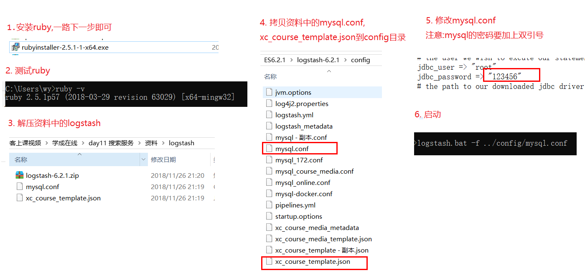

## 二十、课程索引-Logstash创建索引-测试

启动logstash测试:

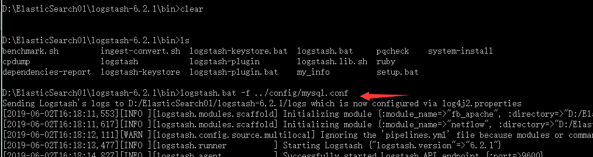

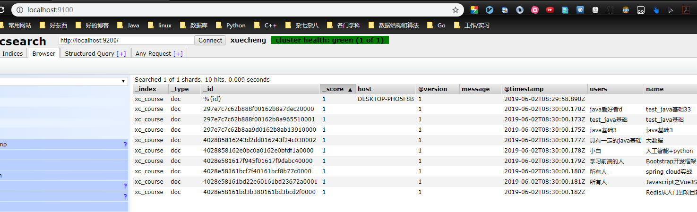

这**里要注意时间戳问题**:

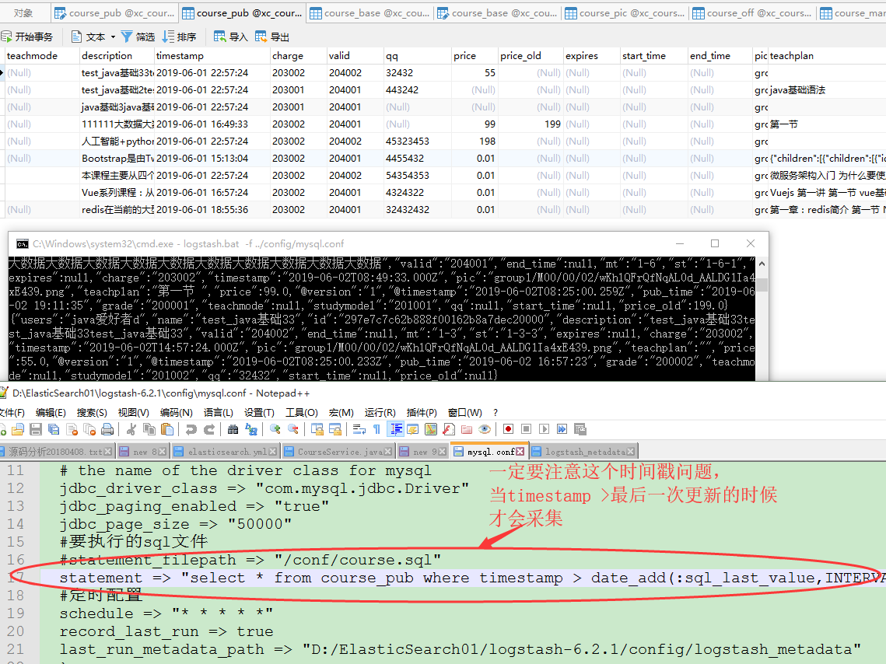

## 二十一、课程搜索-需求分析

输入框中: 关键字搜索: **MultiMatchQuery**,能从多个Field进行搜索(`name、desc、teachplan`)

分类搜索: 过滤器

等级: 过滤器

把3个查询条件放置到BoolQuery


## 二十二、课程搜索-Api定义

完善`xc-service-search`工程，其中配置文件`application.yml`需要完善一下(这里课件pdf又有错误)。

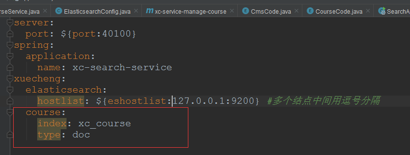

```yml
server:
  port: ${port:40100}
spring:
  application:
    name: xc-search-service
xuecheng:
  elasticsearch:
    hostlist: ${eshostlist:127.0.0.1:9200} #多个结点中间用逗号分隔
  course:
    index: xc_course
    type: doc
```


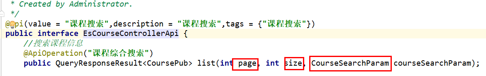

```java
@Api(value = "课程搜索", tags = "课程搜索")
public interface EsCourseControllerApi {

    @ApiOperation("课程搜索")
    QueryResponseResult<CoursePub> list(int page, int size,
                                        CourseSearchParam courseSearchParam) throws IOException;
}
```

其中传递的查询参数类如下: 

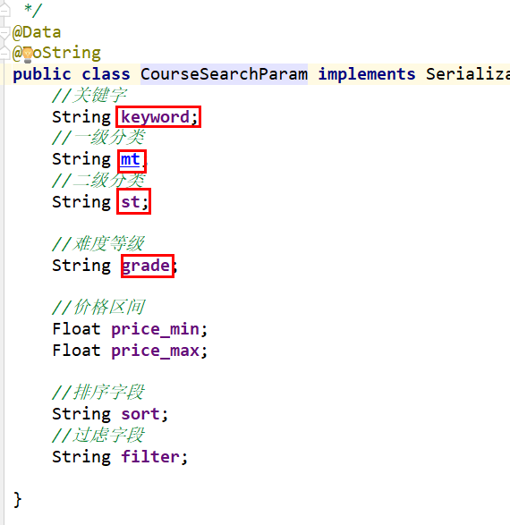


## 二十三、课程搜索-接口实现-按关键字搜索

`Controller`:

```java
@RestController
@RequestMapping("/search/course")
public class EsCourseController implements EsCourseControllerApi {

    @Autowired
    EsCourseService esCourseService;

    @Override
    @GetMapping(value = "/list/{page}/{size}")
    public QueryResponseResult<CoursePub> list(@PathVariable("page") int page, @PathVariable("size") int size,
                                               CourseSearchParam courseSearchParam) {
        return esCourseService.list(page, size, courseSearchParam);
    }
}
```

`Service`：

```java
@Service
public class EsCourseService {

    @Value("${xuecheng.course.index}")
    private String index;
    @Value("${xuecheng.course.type}")
    private String type;
    @Value("${xuecheng.course.source_field}")
    private String source_field;

    @Autowired
    RestHighLevelClient restHighLevelClient;

    //课程搜索
    public QueryResponseResult<CoursePub> list(int page, int size, CourseSearchParam courseSearchParam) {
        if (courseSearchParam == null) {
            courseSearchParam = new CourseSearchParam();
        }
        //创建搜索请求对象
        SearchRequest searchRequest = new SearchRequest(index);
        //设置搜索类型
        searchRequest.types(type);

        SearchSourceBuilder searchSourceBuilder = new SearchSourceBuilder();
        //过虑源字段
        String[] source_field_array = source_field.split(",");
        searchSourceBuilder.fetchSource(source_field_array, new String[]{});
        //创建布尔查询对象
        BoolQueryBuilder boolQueryBuilder = QueryBuilders.boolQuery();

        //搜索条件
        //根据关键字搜索
        if (StringUtils.isNotEmpty(courseSearchParam.getKeyword())) {
            MultiMatchQueryBuilder multiMatchQueryBuilder = QueryBuilders.multiMatchQuery(
                    courseSearchParam.getKeyword(), "name", "description", "teachplan")
                    .minimumShouldMatch("70%")
                    .field("name", 10);
            boolQueryBuilder.must(multiMatchQueryBuilder);
        }
        // 分类搜索
        if (StringUtils.isNotEmpty(courseSearchParam.getMt())) {
            //根据一级分类
            boolQueryBuilder.filter(QueryBuilders.termQuery("mt", courseSearchParam.getMt()));
        }
        if (StringUtils.isNotEmpty(courseSearchParam.getSt())) {
            //根据二级分类
            boolQueryBuilder.filter(QueryBuilders.termQuery("st", courseSearchParam.getSt()));
        }
        if (StringUtils.isNotEmpty(courseSearchParam.getGrade())) {
            //根据难度等级
            boolQueryBuilder.filter(QueryBuilders.termQuery("grade", courseSearchParam.getGrade()));
        }

        //设置boolQueryBuilder到searchSourceBuilder
        searchSourceBuilder.query(boolQueryBuilder);
        searchRequest.source(searchSourceBuilder);

        QueryResult<CoursePub> queryResult = new QueryResult();
        List<CoursePub> list = new ArrayList<>();

        try {
            //执行搜索
            SearchResponse searchResponse = restHighLevelClient.search(searchRequest);
            //获取响应结果
            SearchHits hits = searchResponse.getHits();
            //匹配的总记录数
            long totalHits = hits.totalHits;
            queryResult.setTotal(totalHits);
            SearchHit[] searchHits = hits.getHits();
            for (SearchHit hit : searchHits) {
                CoursePub coursePub = new CoursePub();
                //源文档
                Map<String, Object> sourceAsMap = hit.getSourceAsMap();
                //取出name
                String name = (String) sourceAsMap.get("name");
                coursePub.setName(name);
                //图片
                String pic = (String) sourceAsMap.get("pic");
                coursePub.setPic(pic);
                //价格
                Double price = null;
                try {
                    if (sourceAsMap.get("price") != null) {
                        price = (Double) sourceAsMap.get("price");
                    }

                } catch (Exception e) {
                    e.printStackTrace();
                }
                coursePub.setPrice(price);
                //旧价格
                Double price_old = null;
                try {
                    if (sourceAsMap.get("price_old") != null) {
                        price_old = (Double) sourceAsMap.get("price_old");
                    }
                } catch (Exception e) {
                    e.printStackTrace();
                }
                coursePub.setPrice_old(price_old);
                //将coursePub对象放入list
                list.add(coursePub);
            }

        } catch (IOException e) {
            e.printStackTrace();
        }
        queryResult.setList(list);
        QueryResponseResult<CoursePub> queryResponseResult =
                new QueryResponseResult<CoursePub>(CommonCode.SUCCESS, queryResult);
        return queryResponseResult;
    }
}

```

`application.yml`增加配置:

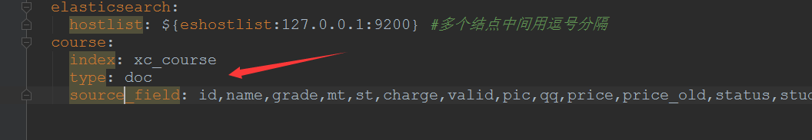

注意这里价格要改成Double的(按照视频来，pdf有误)

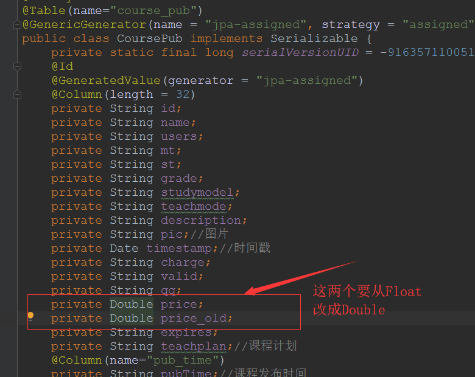


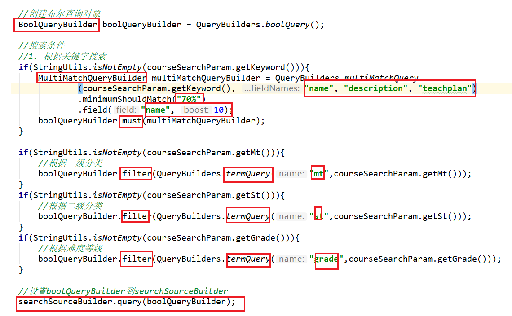


## 二十四、课程搜索-接口实现-按关键字搜索测试


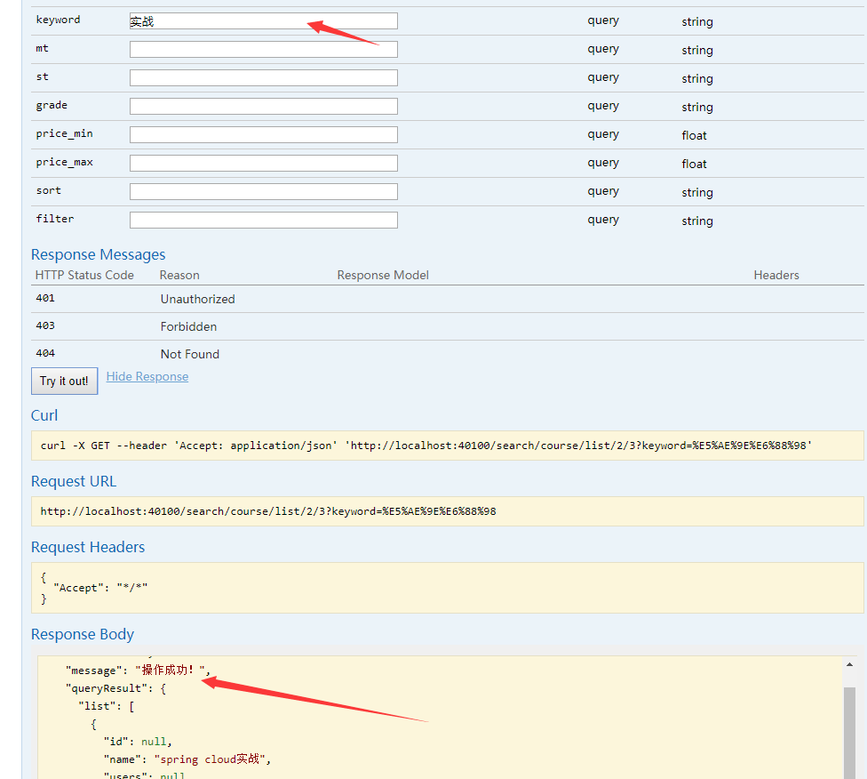

测试: 

## 二十五、课程搜索-接口实现-按分类和难度等级搜索

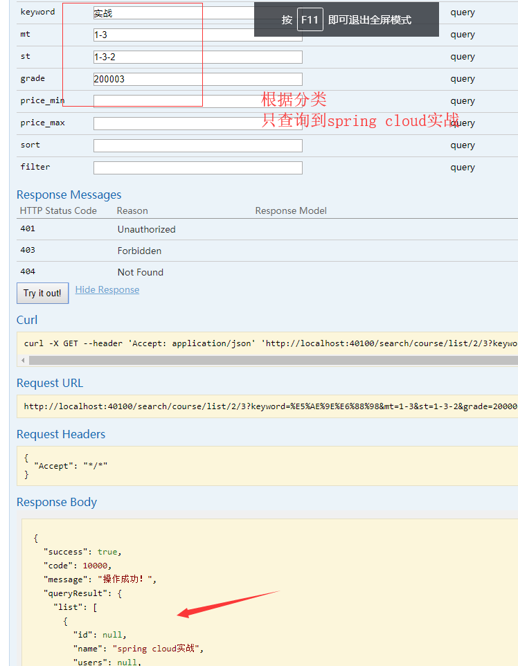

测试的时候可以改变某一个(写错)，就发现查不出来了。

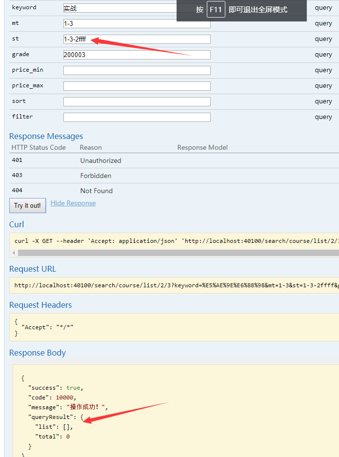