# 搜索前端 Nuxt.js

## 一、搜索前端技术需求-SEO


## 二、搜索前端技术需求-服务端渲染和客户端渲染

### 1、服务端渲染


### 2、客户端渲染

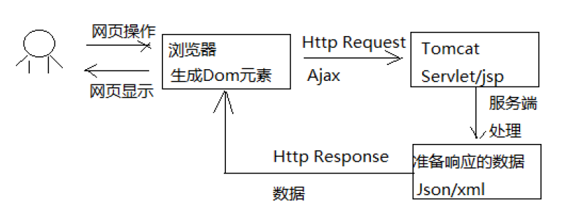

**因为我们要比较利于SEO，所以我们要使用服务端渲染技术**。

## 三、Nuxt.js介绍

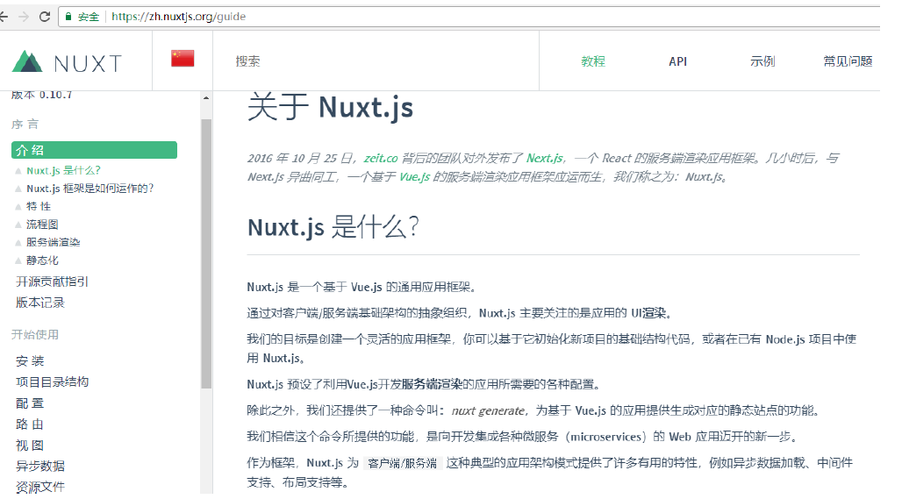

从上图可以看到：
react框架提供`next.js`实现服务端渲染。
vue.js框架提供`Nuxt.js`实现服务端渲染。

## 四、Nuxt.js基本使用-创建Nuxt工程

解压资料中的`xc-ui-pc-portal`到`D:xcEdu01/`的前端工程下。用`WebStorm`打开

## 五、Nuxt.js基本使用-页面布局

基本测试:

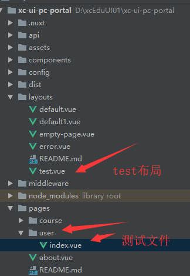

`layout/test.vue`布局代码: 添加头和尾，注意一定要使用`<nuxt/>`标签。

```vue
<template>

  <div>
    <div>这里是头</div>
    <nuxt/>  <!-- 注意：布局文件中一定要加 <nuxt/> 组件用于显示页面内容。 -->
    <div>这里是尾</div>
  </div>

</template>

<script>
  export default {

  }
</script>

<style>

</style>

```

建立测试文件`pages/user/index.vue`，测试`test.vue`布局:

```vue

<template>

  <div>
    管理页面
  </div>

</template>

<script>

  export default {
    layout : "test"
  }

</script>

<style>

</style>

```

**然后这里测试有个很重要的问题，好像系统的`localhost:10000`端口默认被占用了，所以我只好使用`localhost:10001`端口，这里要注意，如果其他前端或者后端默认用到了`10000`端口，就记得要改~~~**

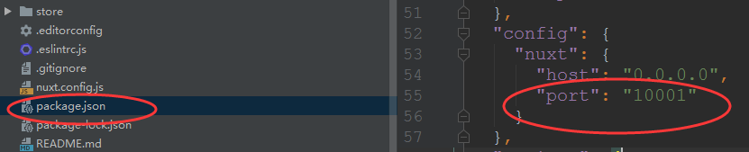

测试: 访问`localhost:10001/user`即可，会默认访问`user/`下的`index.vue`

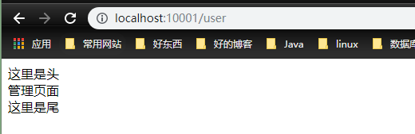

## 六、Nuxt.js基本使用-路由 

Nuxt.js 依据 pages 目录结构自动生成 vue-router 模块的路由配置。
Nuxt.js根据pages的目录结构及页面名称定义规范来生成路由，下边是一个基础路由的例子：

假设 pages 的目录结构如下：

```j
pages/
‐‐| user/
‐‐‐‐‐| index.vue
‐‐‐‐‐| one.vue
```

那么，Nuxt.js 自动生成的路由配置如下：

```js
router: {
    routes: [
        {
            name: 'user',
            path: '/user',
            component: 'pages/user/index.vue'
		},
		{
            name: 'user‐one',
            path: '/user/one',
            component: 'pages/user/one.vue'
   		 }
	]
}
```

访问: 

<http://localhost:10001/user/one>

**嵌套路由**

 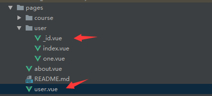

`user.vue`:

```js
<template>
  <div>
    用户管理导航，<nuxt-link :to="'/user/101'">修改</nuxt-link>
    <nuxt-child/>
  </div>
</template>
<script>
  export default{
    layout:"test"
  }
</script>
<style>
</style>

```

`_id.vue`:

```js
<template>
  <div>
    修改用户信息{{id}}
  </div>
</template>
<script>
  export default{
    layout:"test",
    data(){
      return {
        id:''
      }
    },
    mounted(){
      this.id = this.$route.params.id;
      console.log(this.id)
    }
  }
</script>
<style>
</style>

```

## 七、Nuxt.js基本使用-获取数据-asyncData

服务端渲染的使用，由于不是客户端的渲染，所以可以在打开查看源代码的时候,可以看到源代码。

`_id.vue`:

```js
<template>
  <div>
    修改用户信息{{id}},名称：{{name}}
  </div>
</template>
<script>
  export default{
    layout:"test",
    data(){
      return {
        id:''
      }
    },
    asyncData(){ // 服务端 渲染
      console.log("async方法")
      // alert(0);  无法在服务端运行的(会报错)
      return {
        name:'zxzxin'
      }
    },
    methods:{
      //这里面的方法都是给客户端Vue实例调用的  (客户端渲染)
    },
    mounted(){
      this.id = this.$route.params.id;
      console.log(this.id)
    }
  }
</script>
<style>
</style>

```

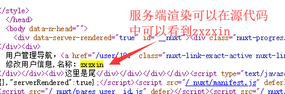

## 八、Nuxt.js基本使用-获取数据-async&await

使用async 和 await配合promise也可以实现同步调用，nuxt.js中使用`async/await`实现同步调用效果。

先看`Promise`时的异步调用:

```js
<template>
  <div>
    异步
  </div>
</template>
<script>
  export default{
    methods:{
      a(){
        return new Promise(function(resolve,reject){
          setTimeout(function () {
            resolve(1)
          },2000)
        })
      },
      b(){
        return new Promise(function(resolve,reject){
          setTimeout(function () {
            resolve(2)
          },1000)
        })
      }
    },
    mounted(){
      this.a().then(res=>{
        alert(res)
        console.log(res)
      })
      this.b().then(res=>{
        alert(res)
        console.log(res)
      })
    }
  }
</script>
<style>
</style>

```

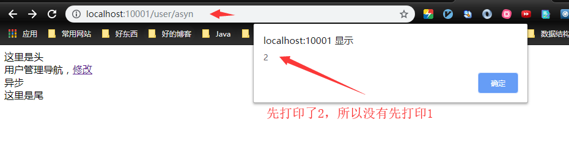

再看同步的执行:

```js
<template>
  <div>
    同步
  </div>
</template>
<script>
  export default{
    async asyncData({ store, route }) { //注意这里的async

      console.log("async方法")
      var a = await new Promise(function (resolve, reject) { //注意这里的await
        setTimeout(function () {
          console.log("1")
          resolve(1)
        },2000)
      });
      var a = await new Promise(function (resolve, reject) {
        setTimeout(function () {
          console.log("2")
          resolve(2)
        },1000)
      });
    }
  }
</script>
<style>
</style>

```

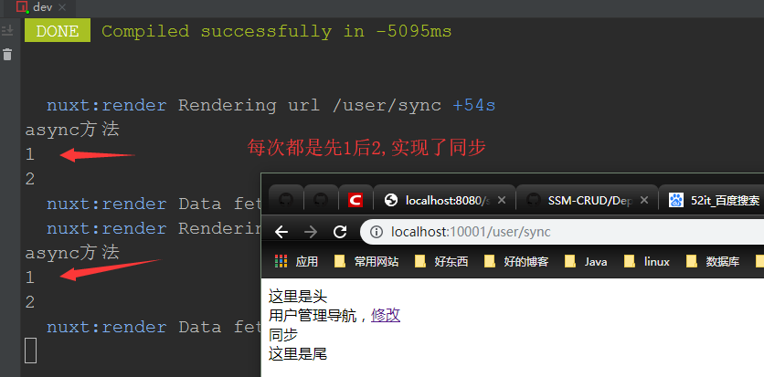

## 九、搜索前端开发-搜索页面

先配置`nginx.conf`:

1)、注意这里我之前将前端`xc-ui-pc-portal`端口改成了`10001`，所以不要配置错了。

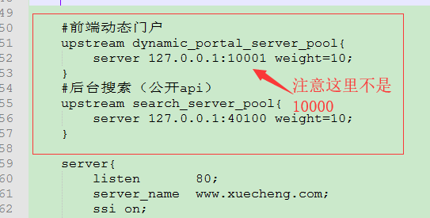

```js
#前端动态门户
upstream dynamic_portal_server_pool{
    server 127.0.0.1:10001 weight=10;
}
#后台搜索（公开api）
upstream search_server_pool{
    server 127.0.0.1:40100 weight=10;
}
```

2)、

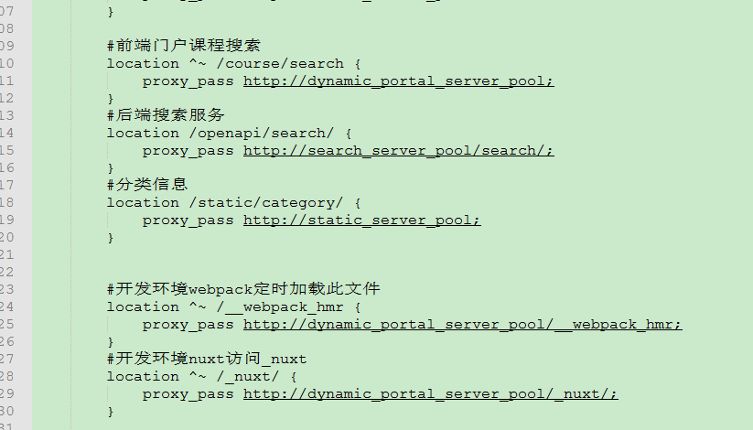

```js
#前端门户课程搜索
		location ^~ /course/search {
			proxy_pass http://dynamic_portal_server_pool;
		}
		#后端搜索服务
		location /openapi/search/ {
			proxy_pass http://search_server_pool/search/;
		}
		#分类信息
		location /static/category/ {
			proxy_pass http://static_server_pool;
		}
		
		
		#开发环境webpack定时加载此文件
		location ^~ /__webpack_hmr {
			proxy_pass http://dynamic_portal_server_pool/__webpack_hmr;
		}
		#开发环境nuxt访问_nuxt
		location ^~ /_nuxt/ {
			proxy_pass http://dynamic_portal_server_pool/_nuxt/;
		}
```

3)、

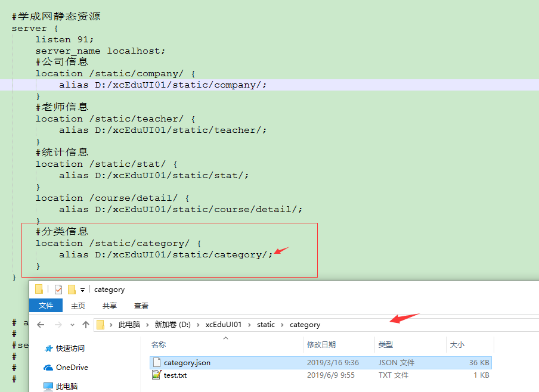

```js
#分类信息
location /static/category/ {
    alias D:/xcEduUI01/static/category;
}
```

4）、

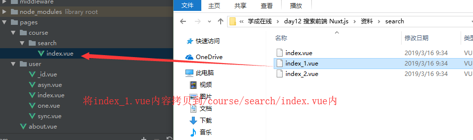

5）、启动nginx，访问`http://www.xuecheng.com/course/search`:

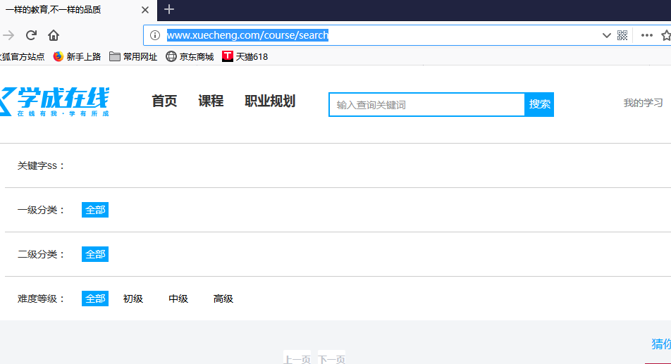

## 十、搜索前端开发-搜索全部

启动`xc-service-search`服务和`elasticsearch`服务，然后更改`xc-ui-pc-portal`工程的下的`page/course/search/index.vue`页面的`asyncData()`如下:

```js
async asyncData({ store, route }) {//服务端调用方法
    //搜索课程
    let page = route.query.page;
    if(!page){
        page = 1;
    }else{
        page = Number.parseInt(page)
    }
    console.log(page);

    let course_data = await courseApi.search_course(page,2,route.query);

    if (course_data &&　course_data.queryResult ) {
        let keywords = ''
        let mt=''
        let st=''
        let grade=''
        let keyword=''
        let total = course_data.queryResult.total
        if( route.query.mt){
            mt = route.query.mt
        }
        if( route.query.st){
            st = route.query.st
        }
        if( route.query.grade){
            grade = route.query.grade
        }
        if( route.query.keyword){
            keyword = route.query.keyword
        }
        return {
            courselist: course_data.queryResult.list,//课程列表
            keywords:keywords,
            mt:mt,
            st:st,
            grade:grade,
            keyword:keyword,
            page:page,
            total:total,
            imgUrl:config.imgUrl
        }
    }else {
        return {
            courselist: {},
            first_category: {},
            second_category: {},
            mt: '',
            st: '',
            grade: '',
            keyword: '',
            page: page,
            total: 0,
            imgUrl: config.imgUrl
        }
    }
}
```

刷新访问`http://www.xuecheng.com/course/search`:

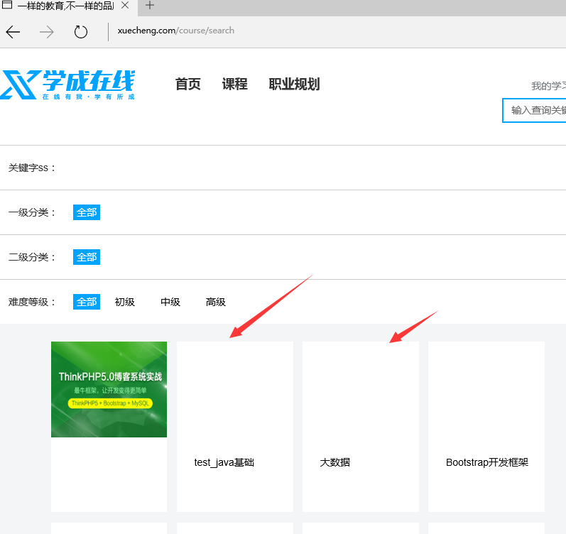

## 十一、搜索前端开发-分页搜索

1、让服务端支持分页查询 (在服务端搜索工程中添加分页的逻辑代码)

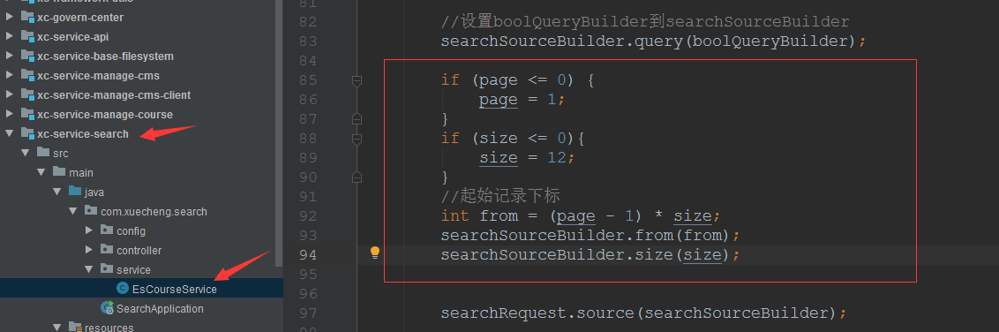

2、让前端分页调用（配置对应的分页按钮）

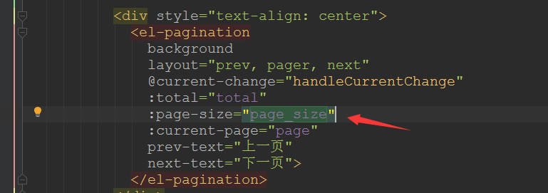

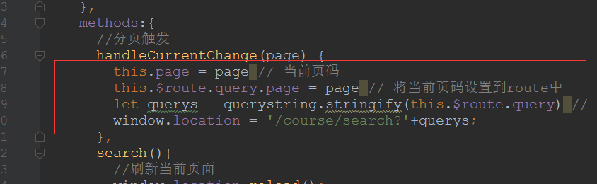

## 十二、搜索前端开发-按分类搜索

分类搜索:


这些分类数据是不经常变化的,我们可以考虑缓存起来,可以选用Redis或者静态化。此处我们选择静态化。

课程分类将通过页面静态化的方式写入静态资源下，通过`/category/category.json`可访问，通过
www.xuecheng.com/static/category/category.json即可访问。

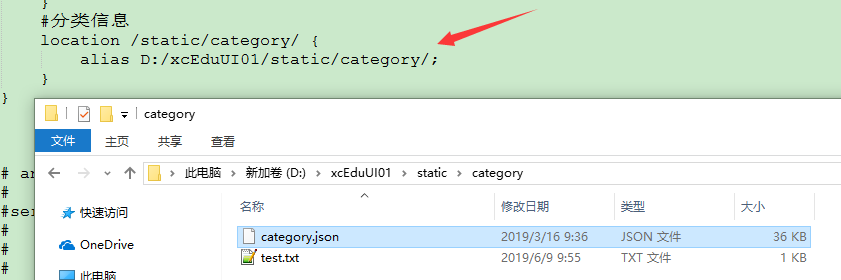

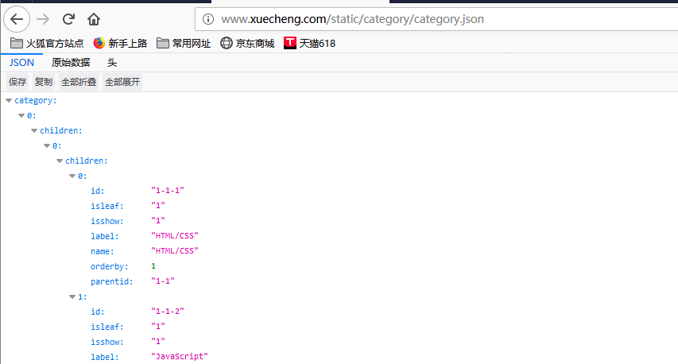

**这里出现了一个诡异的问题，nginx配置完后，重启nginx一直没有生效，硬是让我把电脑重启之后再启动nginx才搞定，真是见了鬼！！！！！！！！！！**

前端:

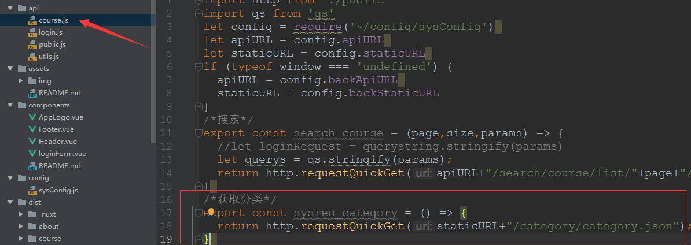

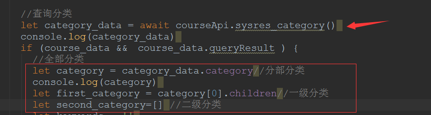

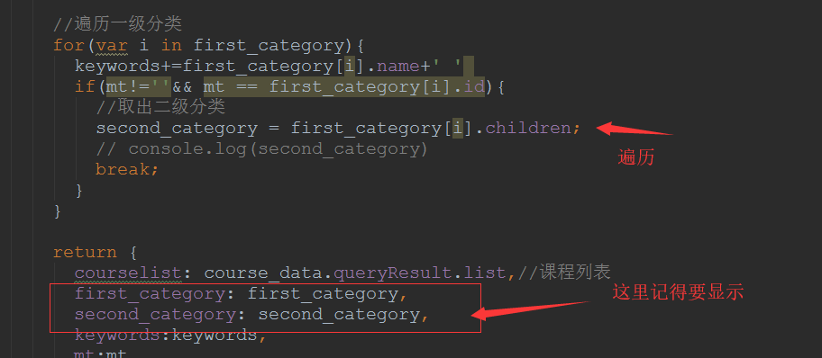

结果:

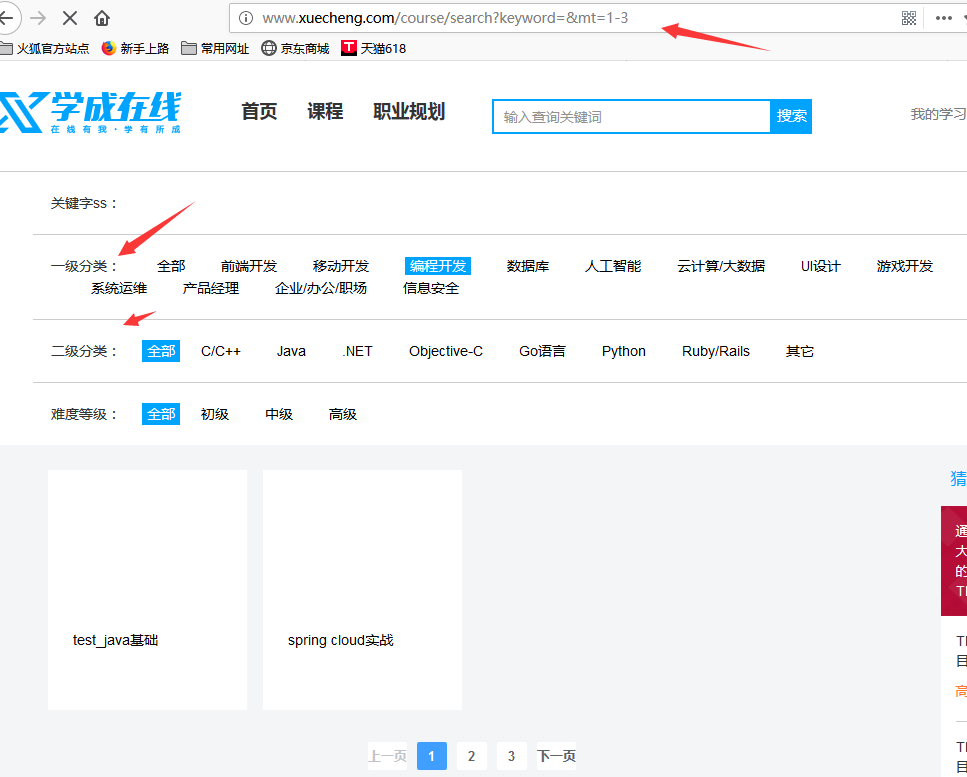

## 十三、搜索前端开发-按难度等级搜索及高亮显示

服务端设置高亮: (注意下面还增加了一个设置CoursePub `id`的小部分)

```java
//设置高亮
HighlightBuilder highlightBuilder = new HighlightBuilder();
highlightBuilder.preTags("<font class='eslight'>");
highlightBuilder.postTags("</font>");
highlightBuilder.fields().add(new HighlightBuilder.Field("name"));
searchSourceBuilder.highlighter(highlightBuilder);


QueryResult<CoursePub> queryResult = new QueryResult();
List<CoursePub> list = new ArrayList<>();

try {
    //执行搜索
    SearchResponse searchResponse = restHighLevelClient.search(searchRequest);
    //获取响应结果
    SearchHits hits = searchResponse.getHits();
    //匹配的总记录数
    long totalHits = hits.totalHits;
    queryResult.setTotal(totalHits);
    SearchHit[] searchHits = hits.getHits();
    for (SearchHit hit : searchHits) {
        CoursePub coursePub = new CoursePub();
        //源文档
        Map<String, Object> sourceAsMap = hit.getSourceAsMap();

        //这里是后面新增的 取出课程的id
        String id = (String) sourceAsMap.get("id");
        coursePub.setId(id);

        //取出name
        String name = (String) sourceAsMap.get("name");

        // 在这里取出高亮的字段 (将name字段高亮)
        Map<String, HighlightField> highlightFields = hit.getHighlightFields();
        if(highlightFields.get("name") != null){
            HighlightField highlightFieldName = highlightFields.get("name");
            Text[] fragments = highlightFieldName.getFragments();

            StringBuffer sb = new StringBuffer();
            for(Text txt : fragments){
                sb.append(txt);
            }
            name = sb.toString();
        }
        coursePub.setName(name);
        ....


```

前端:  (增加`.eslight`的样式)

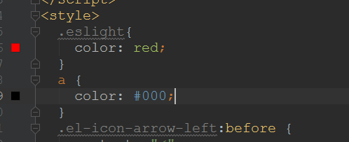

结果演示：

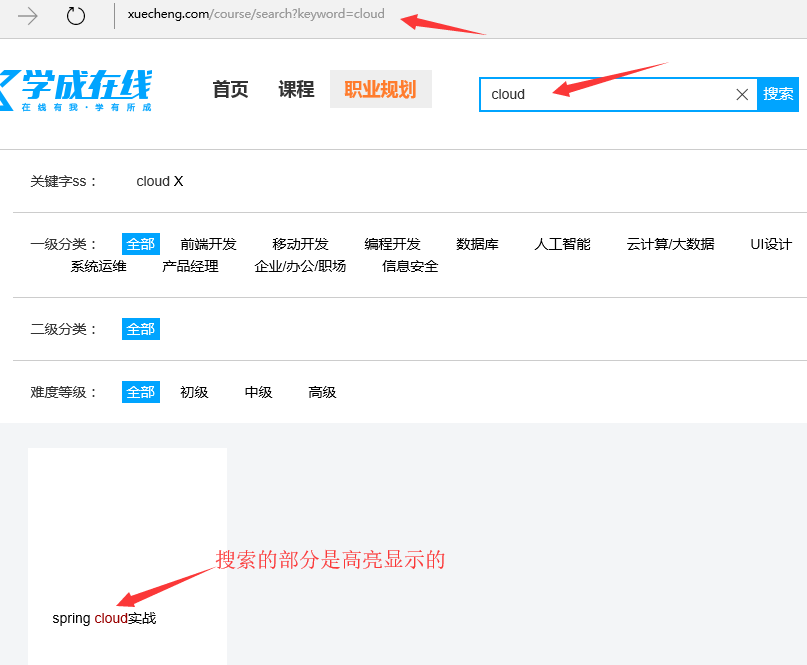

## 十四、课程发布到搜索集成测试

1）、需要启动的服务:

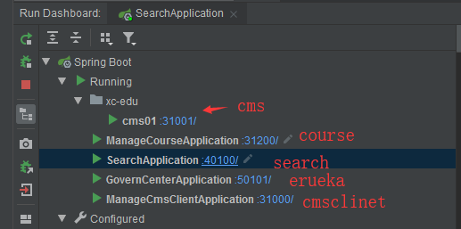

2）、需要启动`ES`和`logstash`。

3）、需要启动`xc-ui-pc-teach`和`xc-ui-pc-portal`。

4）、需要启动`nginx`。

测试:

为了测试，将之前的`Bootstrap开发框架`改成`Bootstrap高级开发框架`，并且手动更改数据库中的发布状态和基本的描述信息:

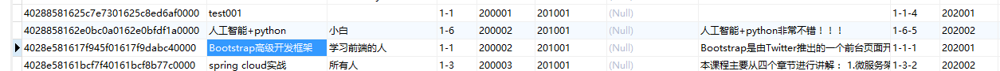

测试:

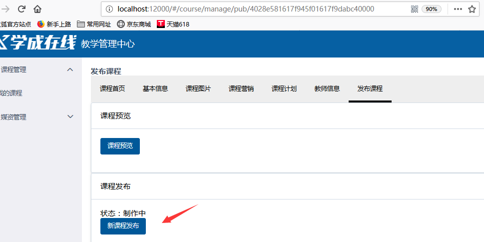


发布完成之后，就能直接在课程搜索中搜索到:

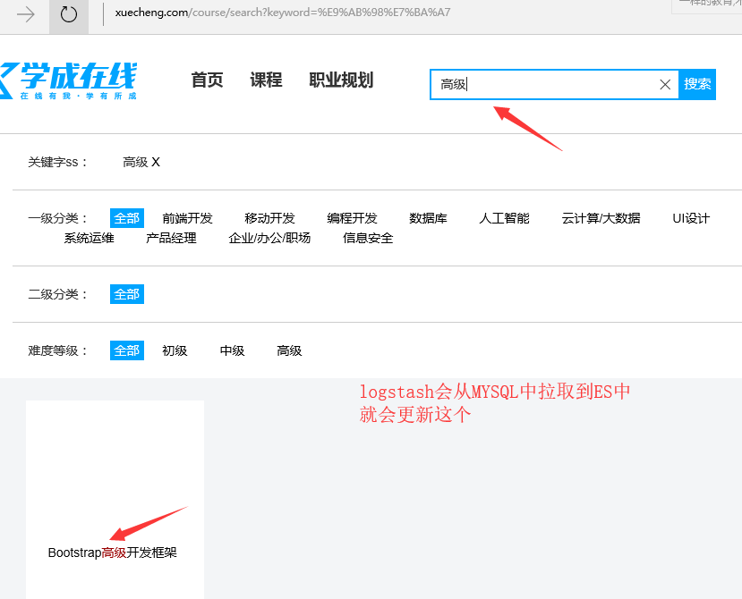

