# 在线学习 HLS

## 一、在线学习需求分析

学成在线作为在线教育网站，提供多种学习形式，包括：录播、直播、图文、社群等，学生登录进入学习中心即可
在线学习，本章节将开发录播课程的在线学习功能，需求如下：

1、学生可以在windows浏览器上在线观看视频。
2、播放器具有快进、快退、暂停等基本功能。
3、学生可以方便切换章节进行学习。

## 二、在线点播解决方案

流媒体:

流式传输
在网络上传输音、视频信息有两个方式：下载和流式传输。
流式传输包括如下两种方式：
1） 顺序流式传输
即顺序下载音、视频文件，可以实现边下载边播放，不过，用户只能观看已下载的视频内容，无法快进到未
下载的视频部分，顺序流式传输可以使用Http服务器来实现，比如Nginx、Apache等。
2）实时流式传输
实时流式传输可以解决顺序流式传输无法快进的问题，它与Http流式传输不同，它必须使用流媒体服务器并
且使用流媒体协议来传输视频，它比Http流式传输复杂。常见的实时流式传输协议有RTSP、RTMP、RSVP
等。

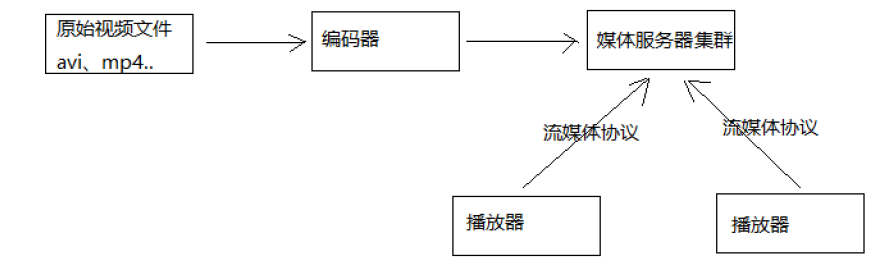

媒体服务获取到编码好的视频文件，对外提供流媒体数据传输接口，接口协议包括 ：HTTP、RTSP、
RTMP等。

点播方案:  播放器使用**HLS**协议连接http服务器（Nginx、Apache等）实现近实时流方式播放视频
HLS协议规定：基于Http协议，视频封装格式为ts，视频的编码格式为H264,音频编码格式为MP3、AAC或者AC-
3。

**HLS是 一个Apple的动态码率自适应结束，主要用于PC和Apple终端的音视频服务，包括一个m3u8的索引为文件，TS媒体分片文件和key加密串文件**。

HLS的工作方式是：**将视频拆分成若干ts格式的小文件，通过m3u8格式的索引文件对这些ts小文件建立索引**。一般10秒一个ts文件，播放器连接m3u8文件播放，当快进时通过m3u8即可找到对应的索引文件，并去下载对应的ts文件，从而实现快进、快退以近实时 的方式播放视频。

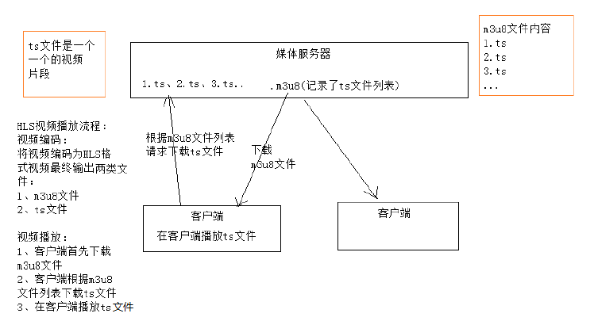

## 三、视频编码-基本概念

文件格式：是指`.mp4`、`.avi`、`.rmvb`等 这些不同扩展名的视频文件的文件格式。

音视频编码格式：通过音视频的压缩技术，将视频格式转换成另一种视频格式，通过视频编码实现流媒体的传输。
比如：一个.avi的视频文件原来的编码是a，通过编码后编码格式变为b，音频原来为c，通过编码后变为d。

## 四、视频编码-FFmpeg的基本使用

本项目使用`FFmpeg`对视频进行编码。

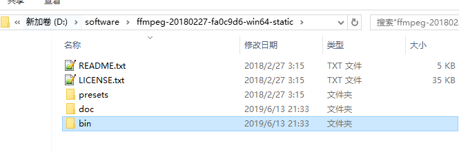

配置bin目录环境变量。

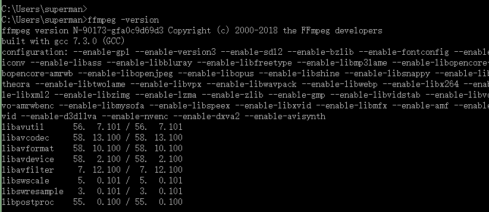


## 五、视频编码-FFmpeg生成m3u8文件

测试，将`lucene.avi`先转换成`.mp4`，然后转换成`m3u8`文件。

```shell
ffmpeg.exe -i lucene.avi -c:v libx264 -s 1280x720 -pix_fmt yuv420p -b:a 63k -b:v 753k -r 18 .\lucene.mp4

ffmpeg -i lucene.mp4 -hls_time 10 -hls_list_size 0 -hls_segment_filename ./hls/lucene_%05d.ts ./hls/lucene.m3u8
```


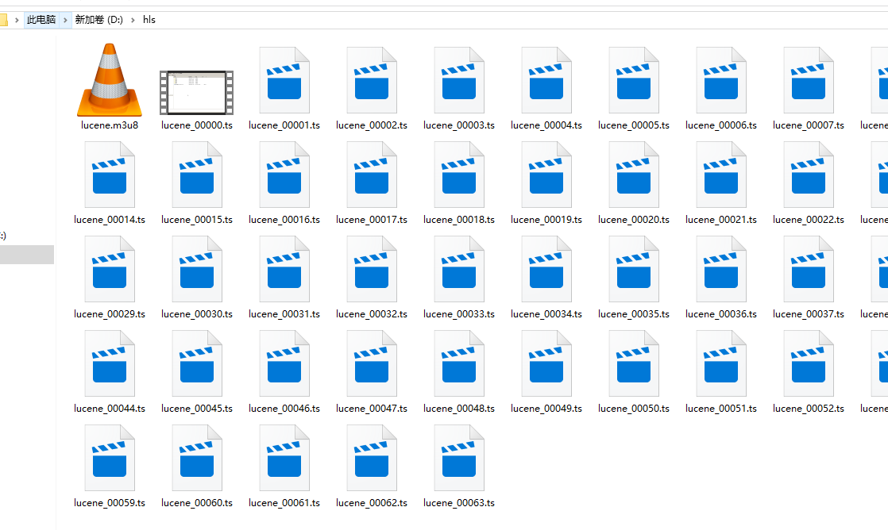

## 六、播放器-搭建媒体服务器测试videojs 

本项目采用H5播放器，使用`Video.js`开源播放器。


**HLS协议基于Http协议，本项目使用Nginx作为视频服务器**。下图是Nginx媒体服务器的配置流程图：

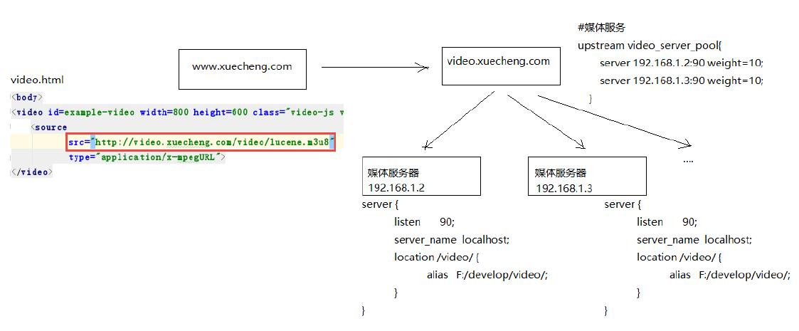


Nginx.conf配置:

`video.xuecheng.com`进行负载均衡处理，将视频请求转发到媒体服务器根据上边的流程，我们在媒体服务器上安装Nginx，并配置如下：

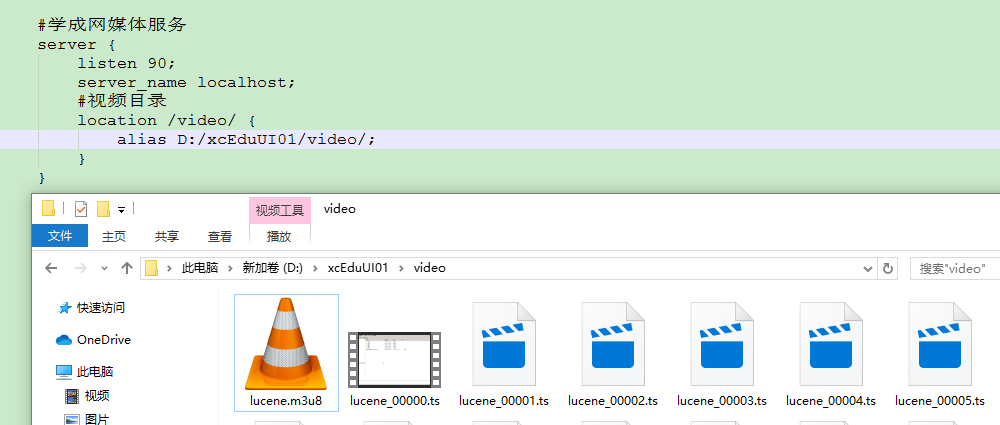

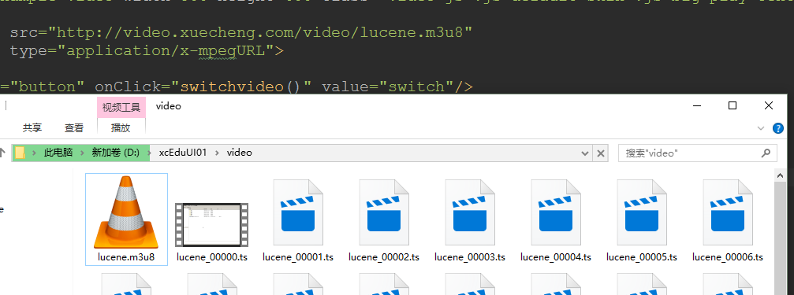

```properties
	#学成网媒体服务
	server {
		listen 90;
		server_name localhost;
		#视频目录
		location /video/ {
			alias D:/xcEduUI01/video/;
		}
	}
```

媒体服务器不止一台，通过代理实现负载均衡功能，使用Nginx作为媒体服务器的代理，此代理服务器作为
video.xuecheng.com域名服务器。配置video.xuecheng.com虚拟主机：
注意：开发中代理服务器和媒体服务器在同一台服务器，使用同一个Nginx。

```properties
#学成网媒体服务代理
	map $http_origin $origin_list{
		default http://www.xuecheng.com;
		"~http://www.xuecheng.com" http://www.xuecheng.com;
		"~http://ucenter.xuecheng.com" http://ucenter.xuecheng.com;
	}
	#学成网媒体服务代理
	server {
		listen 80;
		server_name video.xuecheng.com;
		location /video {
			proxy_pass http://video_server_pool;
			add_header Access-Control-Allow-Origin $origin_list;
			#add_header Access-Control-Allow-Origin *;
			add_header Access-Control-Allow-Credentials true;
			add_header Access-Control-Allow-Methods GET;
		}
	}
	
```

`video_server_pool`的配置如下：

媒体流服务:

```properties
    #媒体服务
	upstream video_server_pool{
		server 127.0.0.1:90 weight=10;
	}
```

测试:

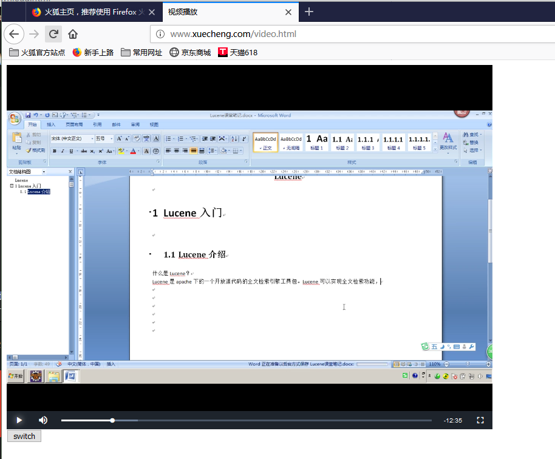

## 七、搭建学习中心工程&测试videojs

注意测试不能用google，因为我的`www.xuecheng.com`这些通过`nginx`代理，但是`google`访问不了`www.xuecheng.com`。


将资料中的`xc-ui-pc-learning`拷贝到`D:/XCEduUI01`下面，并进入`cmd`输入命令`cnpm install`，进行相关依赖的安装。


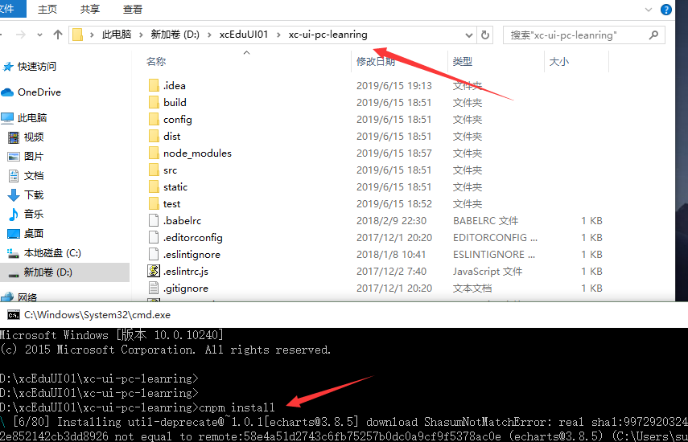


然后进行`nginx.conf`的配置。

先配置一个用户中心代理:

```properties
	
	#学成网用户中心
	server {
		listen 80;
		server_name ucenter.xuecheng.com;
		#个人中心
		location / {
			proxy_pass http://ucenter_server_pool;
		}
	}
    #前端ucenter
	upstream ucenter_server_pool{
		#server 127.0.0.1:7081 weight=10;
		server 127.0.0.1:13000 weight=10;
	}
```

然后在访问的时候，访问`/plugins/`的跨域问题。

```properties
# 测试播放视频的时候，访问plugins报错，解决(跨域)
		location /plugins/ {
			alias D:/xcEduUI01/xc-ui-pc-static-portal/plugins/;
			add_header Access-Control-Allow-Origin http://ucenter.xuecheng.com;
			add_header Access-Control-Allow-Credentials true;
			add_header Access-Control-Allow-Methods GET;
		}		
```


测试访问:

请求：http://ucenter.xuecheng.com/#/learning/1/2
第一个参数：courseId，课程id，这里是测试页面效果随便输入一个ID即可，这里输入1
第二个参数：chapter，课程计划id，这里是测试页面效果随便输入一个ID即可，这里输入2

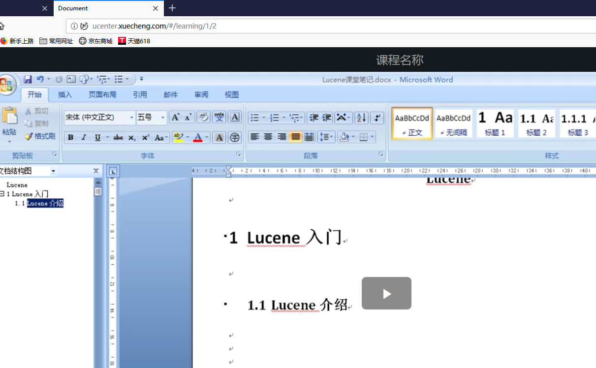


## 八、媒资管理-需求分析


每个教学机构都可以在媒资系统管理自己的教学资源，包括：视频、教案等文件。
目前媒资管理的主要管理对象是课程录播视频，包括：媒资文件的查询、视频上传、视频删除、视频处理等。

- 媒资查询：教学机构查询自己所拥有的媒体文件。
- 视频上传：将用户线下录制的教学视频上传到媒资系统。
- 视频处理：视频上传成功，系统自动对视频进行编码处理。
- 视频删除 ：如果该视频已不再使用，可以从媒资系统删除。

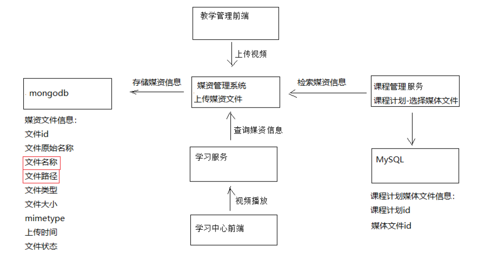


## 九、媒资管理-开发环境

导入`xc-service-manage-media`工程:

配置文件:

```yaml
server:
  port: 31400
spring:
  application:
    name: xc-service-manage-media
  data:
    mongodb:
      uri:  mongodb://localhost:27017/xc_media
      database: xc_media
xc-service-manage-media:
  upload-location: D:/xcCode/xcEduUI01/video/
eureka:
  client:
    registerWithEureka: true #服务注册开关
    fetchRegistry: true #服务发现开关
    serviceUrl: #Eureka客户端与Eureka服务端进行交互的地址，多个中间用逗号分隔
      defaultZone: ${EUREKA_SERVER:http://localhost:50101/eureka/}
  instance:
    prefer-ip-address:  true  #将自己的ip地址注册到Eureka服务中
    ip-address: ${IP_ADDRESS:127.0.0.1}
    instance-id: ${spring.application.name}:${server.port} #指定实例id
ribbon:
  MaxAutoRetries: 2 #最大重试次数，当Eureka中可以找到服务，但是服务连不上时将会重试，如果eureka中找不到服务则直接走断路器
  MaxAutoRetriesNextServer: 3 #切换实例的重试次数
  OkToRetryOnAllOperations: false  #对所有操作请求都进行重试，如果是get则可以，如果是post，put等操作没有实现幂等的情况下是很危险的,所以设置为false
  ConnectTimeout: 5000  #请求连接的超时时间
  ReadTimeout: 6000 #请求处理的超时时间
```


## 十、媒资管理-上传文件-断点续传解决方案

大文件上传的要求最基本的是断点续传。提高用户体验性。

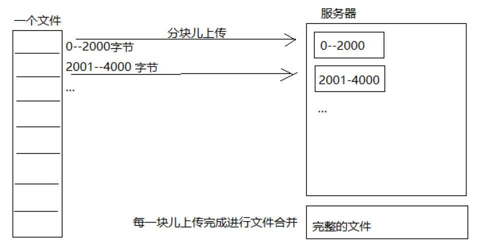

上传流程如下：
1、上传前先把文件分成块
2、一块一块的上传，上传中断后重新上传，已上传的分块则不用再上传
3、各分块上传完成最后合并文件

## 十一、媒资管理-上传文件-文件分块测试

文件分块的流程如下：
1、获取源文件长度
2、根据设定的分块文件的大小计算出块数
3、从源文件读数据依次向每一个块文件写数据。

```java
    //测试文件分块方法
    @Test
    public void testChunk() throws IOException {
        File sourceFile = new File("D:/xcEduUI01/lucene.mp4");
//        File sourceFile = new File("d:/logo.png");
        String chunkPath = "D:/xcEduUI01/chunks/";
        File chunkFolder = new File(chunkPath);

        if (!chunkFolder.exists()) {
            chunkFolder.mkdirs();
        }
        //分块大小
        long chunkSize = 1024 * 1024 * 1;
        //分块数量
        long chunkNum = (long) Math.ceil(sourceFile.length() * 1.0 / chunkSize);
        if (chunkNum <= 0) {
            chunkNum = 1;
        }
        //缓冲区大小
        byte[] b = new byte[1024];
        //使用RandomAccessFile访问文件
        RandomAccessFile raf_read = new RandomAccessFile(sourceFile, "r");
        //分块
        for (int i = 0; i < chunkNum; i++) {
            //创建分块文件
            File file = new File(chunkPath + i);
            boolean newFile = file.createNewFile();
            if (newFile) {
                //向分块文件中写数据
                RandomAccessFile raf_write = new RandomAccessFile(file, "rw");
                int len = -1;
                while ((len = raf_read.read(b)) != -1) {
                    raf_write.write(b, 0, len);
                    if (file.length() > chunkSize) { // 每个大于1MB就退出
                        break;
                    }
                }
                raf_write.close();
            }
        }
        raf_read.close();
    }
```

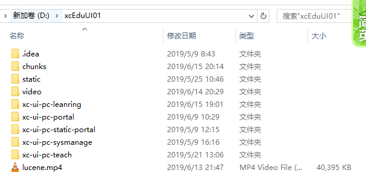

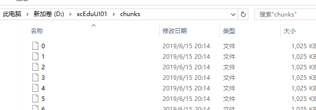

## 十二、媒资管理-上传文件-文件合并测试

文件合并流程：
1、找到要合并的文件并按文件合并的先后进行排序。
2、创建合并文件
3、依次从合并的文件中读取数据向合并文件写入数

```java
 //测试文件合并方法
    @Test
    public void testMerge() throws IOException {
        //块文件目录
        File chunkFolder = new File("D:/xcEduUI01/chunks/");
        //合并文件
        File mergeFile = new File("D:/xcEduUI01/lucene_merge.mp4");
        if (mergeFile.exists()) {
            mergeFile.delete();
        }
        //创建新的合并文件
        mergeFile.createNewFile();
        //用于写文件
        RandomAccessFile raf_write = new RandomAccessFile(mergeFile, "rw");
        //指针指向文件顶端
        raf_write.seek(0);
        //缓冲区
        byte[] b = new byte[1024];
        //分块列表
        File[] fileArray = chunkFolder.listFiles();
        // 转成集合，便于排序
        List<File> fileList = new ArrayList<>(Arrays.asList(fileArray));
        // 从小到大排序
        Collections.sort(fileList, (o1, o2) -> {
            if (Integer.parseInt(o1.getName()) < Integer.parseInt(o2.getName())) {
                return 1;
            }
            return -1;
        });
        //合并文件
        for (File chunkFile : fileList) {
            RandomAccessFile raf_read = new RandomAccessFile(chunkFile, "rw");
            int len = -1;
            while ((len = raf_read.read(b)) != -1) {
                raf_write.write(b, 0, len);
            }
            raf_read.close();
        }
        raf_write.close();
    }
```

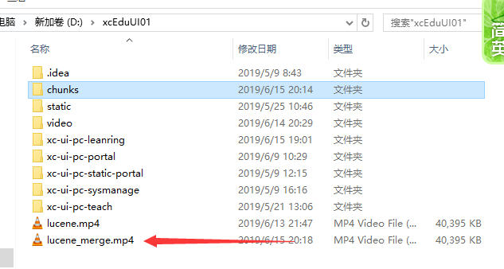

## 十三、媒资管理-上传文件-前端页面

使用`WebUploader`。


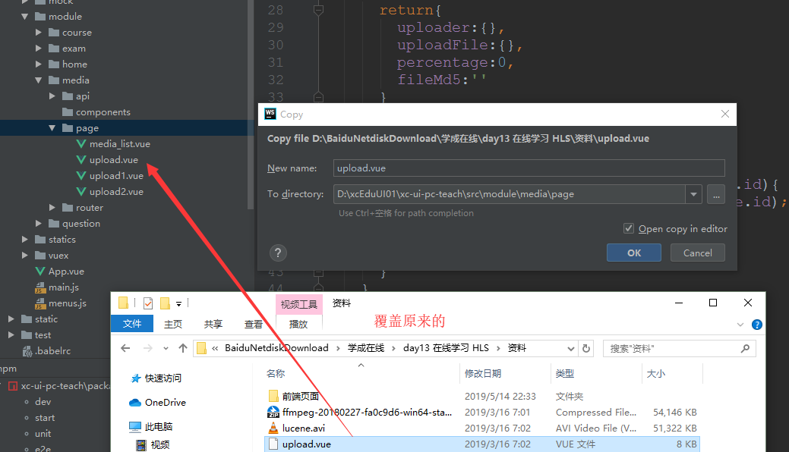

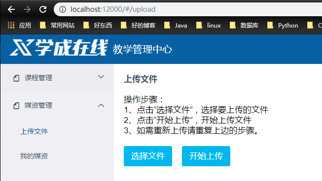

## 十四、媒资管理-上传文件-Api接口

定义文件上传的Api接口，此接收是前端WebUploader调用服务端的接口。

```java
@Api(value = "媒资管理接口", tags = "媒资管理接口，提供文件上传，文件处理等接口")
public interface MediaUploadControllerApi {

    @ApiOperation("文件上传注册")
    ResponseResult register(String fileMd5,
                            String fileName,
                            Long fileSize,
                            String mimetype,
                            String fileExt);

    @ApiOperation("分块检查")
    CheckChunkResult checkchunk(String fileMd5,
                                Integer chunk,
                                Integer chunkSize);

    @ApiOperation("上传分块")
    ResponseResult uploadchunk(MultipartFile file,
                               Integer chunk,
                               String fileMd5);

    @ApiOperation("合并文件")
    ResponseResult mergechunks(String fileMd5,
                               String fileName,
                               Long fileSize,
                               String mimetype,
                               String fileExt);
}
```

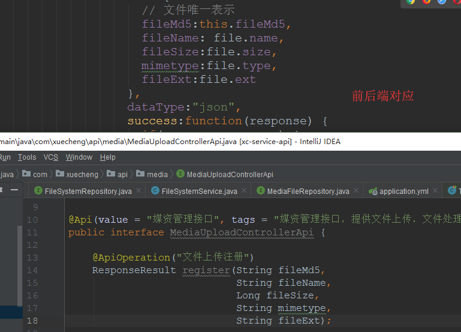


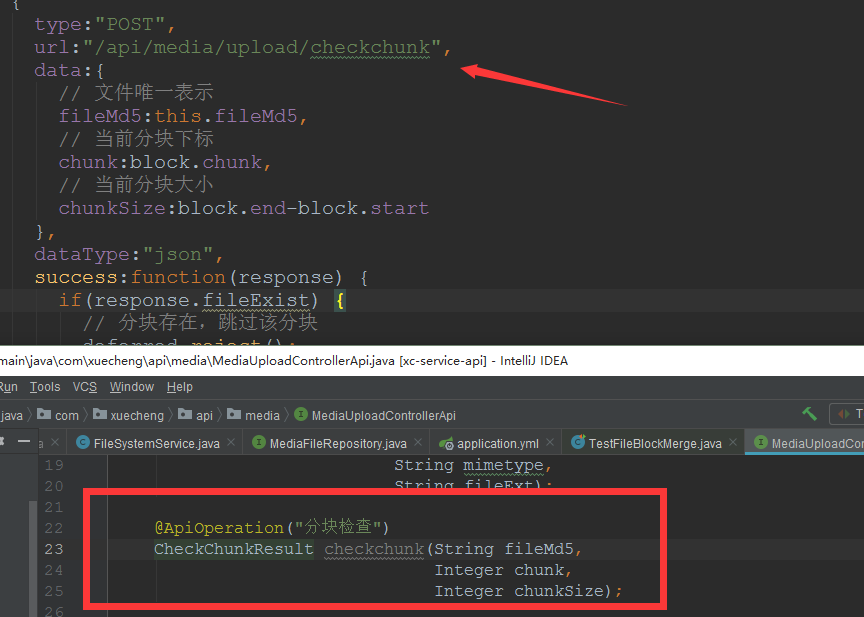

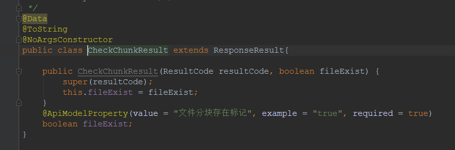


服务端需要实现如下功能：
1、上传前检查上传环境
检查文件是否上传，已上传则直接返回。
检查文件上传路径是否存在，不存在则创建。
2、分块检查
检查分块文件是否上传，已上传则返回true。
未上传则检查上传路径是否存在，不存在则创建。
3、分块上传
将分块文件上传到指定的路径。
4、合并分块
将所有分块文件合并为一个文件。
在数据库记录文件信息。

## 十五、媒资管理-上传文件-上传注册

1、配置
application.yml配置上传文件的路径：

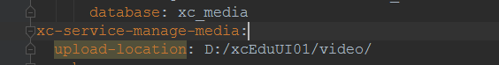

2、Dao

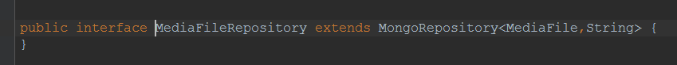

3、Controller

```java
@RestController
@RequestMapping("/media/upload")
public class MediaUploadController implements MediaUploadControllerApi {

    @Autowired
    MediaUploadService mediaUploadService;

    //文件上传前的注册
    @Override
    @PostMapping("/register")
    public ResponseResult register(String fileMd5, String fileName, Long fileSize, String mimetype, String fileExt) {
        return mediaUploadService.register(fileMd5, fileName, fileSize, mimetype, fileExt);
    }
}
```

4、Service

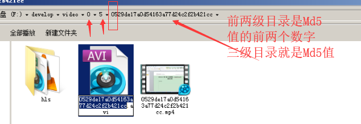

```java
@Service
public class MediaUploadService {

    @Autowired
    MediaFileRepository mediaFileRepository;

    @Value("${xc-service-manage-media.upload-location}")
    String uploadLocation;

    //文件上传前的注册
    public ResponseResult register(String fileMd5, String fileName, Long fileSize, String mimetype, String fileExt) {
        //一、检查文件在磁盘中是否存在
        // 文件所属的目录的路径
        String fileFolderPath = getFileFolderPath(fileMd5);
        //文件路径
        String filePath = getFilePath(fileMd5, fileExt);
        File file = new File(filePath);

        //二、检查文件信息在mongodb中是否存在
        //2、查询数据库文件是否存在
        Optional<MediaFile> optional = mediaFileRepository.findById(fileMd5);
        //文件存在直接返回
        if(file.exists() && optional.isPresent()){
            ExceptionCast.cast(MediaCode.UPLOAD_FILE_REGISTER_EXIST);
        }
        //文件不存在时做一些准备工作，检查文件所在目录是否存在，如果不存在则创建
        File fileFolder = new File(fileFolderPath);
        if(!fileFolder.exists()){
            fileFolder.mkdirs();
        }
        return new ResponseResult(CommonCode.SUCCESS);
    }

    /**
     * 根据文件md5得到文件路径
     * 规则：
     * 一级目录：md5的第一个字符
     * 二级目录：md5的第二个字符
     * 三级目录：md5
     * 文件名：md5+文件扩展名
     *
     * @param fileMd5 文件md5值
     * @param fileExt 文件扩展名
     * @return 文件路径
     */
    //文件路径
    private String getFilePath(String fileMd5, String fileExt) {
        return getFileFolderPath(fileMd5) + fileMd5 + "." + fileExt;
    }
    //得到文件所在目录
    private String getFileFolderPath(String fileMd5) {
        return uploadLocation + getFileFolderRelativePath(fileMd5);
    }

    //得到文件目录相对路径，路径中去掉根目录
    private String getFileFolderRelativePath(String fileMd5) {
        return fileMd5.substring(0, 1) + "/" + fileMd5.substring(1, 2) + "/" + fileMd5 + "/";
    }

}
```

## 十六、媒资管理-上传文件-分块检查

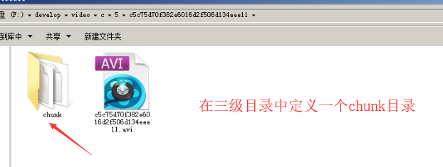

`Controller`:

```java
@Override
@PostMapping("/checkchunk")
public CheckChunkResult checkchunk(String fileMd5, Integer chunk, Integer chunkSize) {
    return mediaUploadService.checkchunk(fileMd5, chunk, chunkSize);
}
```

`Service`:

```java
//得到文件目录相对路径，路径中去掉根目录
private String getFileFolderRelativePath(String fileMd5) {
    return fileMd5.substring(0, 1) + "/" + fileMd5.substring(1, 2) + "/" + fileMd5 + "/";
}

//二、检查分块文件是否存在
public CheckChunkResult checkchunk(String fileMd5, Integer chunk, Integer chunkSize) {
    //得到块文件所在路径
    String chunkFileFolderPath = getChunkFileFolderPath(fileMd5);
    //块文件的文件名称以1,2,3..序号命名，没有扩展名
    File chunkFile = new File(chunkFileFolderPath + chunk);

    if (chunkFile.exists()) {
        return new CheckChunkResult(MediaCode.CHUNK_FILE_EXIST_CHECK, true);
    } else {
        return new CheckChunkResult(MediaCode.CHUNK_FILE_EXIST_CHECK, false);
    }
}
```

## 十七、媒资管理-上传文件-上传分块

`Controller`:

```java
@Override
@PostMapping("/uploadchunk")
public ResponseResult uploadchunk(MultipartFile file, Integer chunk, String fileMd5) {
    return mediaUploadService.uploadchunk(file, chunk, fileMd5);
}
```

`Service`:

```java
//得到块文件所在目录
private String getChunkFileFolderPath(String fileMd5) {
    return getFileFolderPath(fileMd5) + "/" + "chunk" + "/";
}

//三、上传分块
public ResponseResult uploadchunk(MultipartFile file, Integer chunk, String fileMd5) {
    if (file == null) {
        ExceptionCast.cast(MediaCode.UPLOAD_FILE_REGISTER_ISNULL);
    }
    // 如果块文件目录不存在需要创建
    File chunkFolderFile = new File(getChunkFileFolderPath(fileMd5));
    if(!chunkFolderFile.exists()){
        chunkFolderFile.mkdirs();
    }

    //块文件路径
    File chunkFile = new File(getChunkFileFolderPath(fileMd5) + chunk);

    //上传块文件
    InputStream is = null;
    FileOutputStream os = null;
    try {
        is = file.getInputStream();
        os = new FileOutputStream(chunkFile);
        IOUtils.copy(is, os);
    } catch (Exception e) {
        e.printStackTrace();
        log.error("upload chunk file fail:{}", e.getMessage());
        ExceptionCast.cast(MediaCode.CHUNK_FILE_UPLOAD_FAIL);
    } finally {
        try {
            is.close();
        } catch (IOException e) {
            e.printStackTrace();
        }
        try {
            os.close();
        } catch (IOException e) {
            e.printStackTrace();
        }
    }
    return new ResponseResult(CommonCode.SUCCESS);
}
```


## 十八、媒资管理-上传文件-合并分块 

 1）将块文件合并

2）校验文件md5是否正确

3）向Mongodb写入文件信息

`Controller`:

```java
@Override
@PostMapping("/mergechunks")
public ResponseResult mergechunks(String fileMd5, String fileName, Long fileSize, String mimetype, String fileExt) {
    return mediaUploadService.mergechunks(fileMd5, fileName, fileSize, mimetype, fileExt);
}
```

`Service`:

```java

// 四、合并分块
public ResponseResult mergechunks(String fileMd5, String fileName, Long fileSize, String mimetype, String fileExt) {
    // 1、合并所有分块
    File chunkFolderPathFile = new File(getChunkFileFolderPath(fileMd5));
    if (!chunkFolderPathFile.exists()) {
        chunkFolderPathFile.mkdirs();
    }

    //合并文件路径
    File mergeFile = new File(getFilePath(fileMd5, fileExt));
    //如果合并文件已存在则删除，否则创建新文件
    try {
        if (mergeFile.exists()) {
            mergeFile.delete();
        } else {
            //创建一个新文件
            mergeFile.createNewFile();
        }
    } catch (IOException e) {
        e.printStackTrace();
    }
    //文件列表
    File[] files = chunkFolderPathFile.listFiles();
    List<File> chunkFileList = Arrays.asList(files);
    //对块文件进行排序
    Collections.sort(chunkFileList, (o1, o2) -> {
        if (Integer.parseInt(o1.getName()) > Integer.parseInt(o2.getName())) {
            return 1;
        }
        return -1;
    });
    //合并工作
    mergeFile = mergeFile(mergeFile, chunkFileList);
    if (mergeFile == null) {
        ExceptionCast.cast(MediaCode.MERGE_FILE_FAIL);
    }

    // 2、校验文件
    boolean checkResult = this.checkFileMd5(mergeFile, fileMd5);
    if (!checkResult) {
        ExceptionCast.cast(MediaCode.MERGE_FILE_CHECKFAIL);
    }

    // 3、写入信息到MongoDB数据库
    MediaFile mediaFile = new MediaFile();
    mediaFile.setFileId(fileMd5);
    mediaFile.setFileName(fileMd5+"."+fileExt);
    mediaFile.setFileOriginalName(fileName);
    //文件路径保存相对路径
    mediaFile.setFilePath(getFileFolderRelativePath(fileMd5)); //注意这里的Path是相对路径
    mediaFile.setFileSize(fileSize);
    mediaFile.setUploadTime(new Date());
    mediaFile.setMimeType(mimetype);
    mediaFile.setFileType(fileExt);
    //状态为上传成功
    mediaFile.setFileStatus("301002");
    mediaFileRepository.save(mediaFile);
    return new ResponseResult(CommonCode.SUCCESS);
}

private File mergeFile(File mergeFile, List<File> chunkFileList) {
    try {
        //创建写文件对象
        RandomAccessFile raf_write = new RandomAccessFile(mergeFile, "rw");
        //遍历分块文件开始合并
        //读取文件缓冲区
        byte[] b = new byte[1024];
        for (File chunkFile : chunkFileList) {
            RandomAccessFile raf_read = new RandomAccessFile(chunkFile, "r");
            int len = -1;
            //读取分块文件
            while ((len = raf_read.read(b)) != -1) {
                //向合并文件中写数据
                raf_write.write(b, 0, len);
            }
            raf_read.close();
        }
        raf_write.close();
    } catch (Exception e) {
        e.printStackTrace();
        log.error("merge file error:{}", e.getMessage());
        return null;
    }
    return mergeFile;
}

private boolean checkFileMd5(File mergeFile, String fileMd5) {
    if(mergeFile == null || StringUtils.isEmpty(fileMd5)){
        return false;
    }
    //进行md5校验
    FileInputStream mergeFileInputStream = null;
    try {
        mergeFileInputStream = new FileInputStream(mergeFile);
        //得到文件的md5
        String mergeFileMd5 = DigestUtils.md5Hex(mergeFileInputStream);
        //比较md5
        if(fileMd5.equalsIgnoreCase(mergeFileMd5)){
            return true;
        }
    } catch (Exception e) {
        e.printStackTrace();
        log.error("checkFileMd5 error,file is:{},md5 is: {}",mergeFile.getAbsoluteFile(), fileMd5);
    }finally{
        try {
            if (mergeFileInputStream != null) {
                mergeFileInputStream.close();
            }
        } catch (IOException e) {
            e.printStackTrace();
        }
    }
    return false;
}
```


## 十九、媒资管理-上传文件-测试

测试:

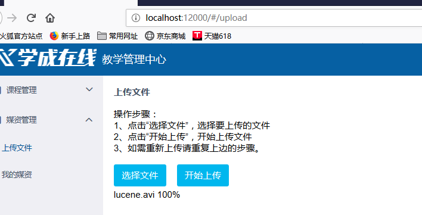

查看上传目录和对应的MongoDB数据库:

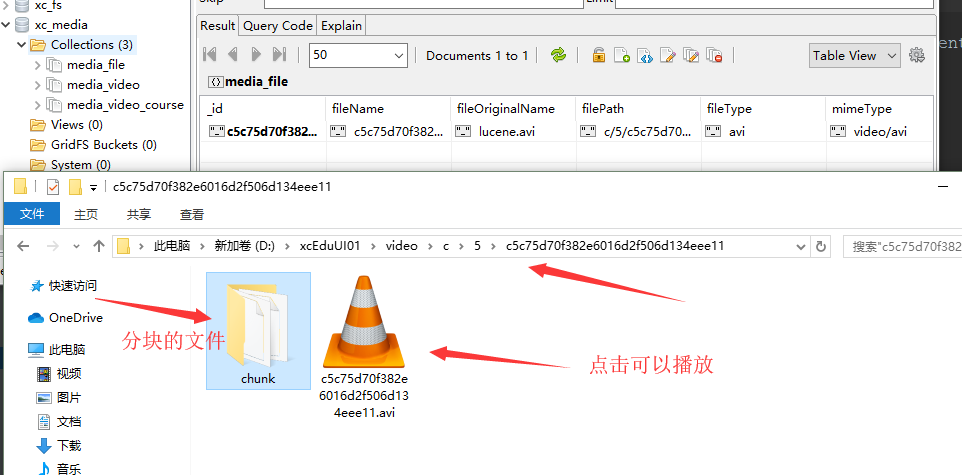

