# 媒资管理

## 一、视频处理-需求分析

原始视频通常需要经过编码处理，生成m3u8和ts文件方可基于HLS协议播放视频。通常用户上传原始视频，系统
自动处理成标准格式，系统对用户上传的视频自动编码、转换，最终生成m3u8文件和ts文件，处理流程如下：
1、用户上传视频成功
2、系统对上传成功的视频自动开始编码处理
3、用户查看视频处理结果，没有处理成功的视频用户可在管理界面再次触发处理
4、视频处理完成将视频地址及处理结果保存到数据库

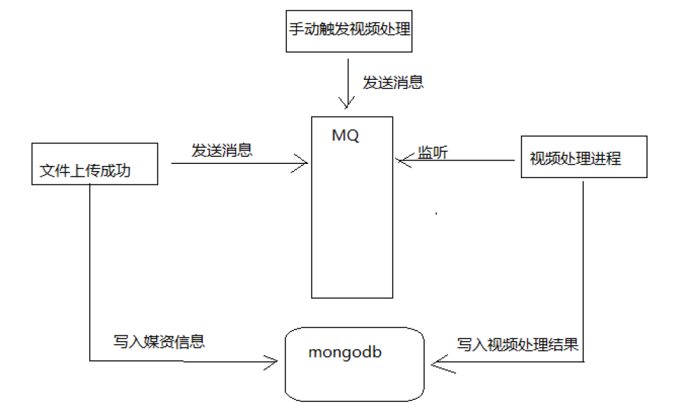

1、监听MQ，接收视频处理消息。
2、进行视频处理。
3、向数据库写入视频处理结果。

## 二、视频处理-视频处理工程创建

导入`xc-service-manage-media-processor`工程:

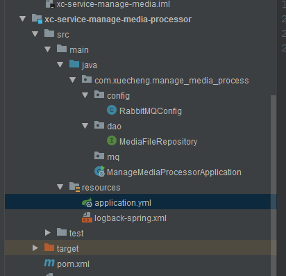

其中，工程的`application.yml`的配置如下:

```yaml
server:
  port: 31450
spring:
  application:
    name: xc-service-manage-media-processor
  data:
    mongodb:
      uri:  mongodb://localhost:27017/xc_media
      database: xc_media
#rabbitmq配置
  rabbitmq:
    host: 127.0.0.1
    port: 5672
    username: guest
    password: guest
    virtual-host: /
xc-service-manage-media:
  mq:
    queue-media-video-processor: queue_media_video_processor
    routingkey-media-video: routingkey_media_video
  video-location: D:/xcEduUI01/video/
  ffmpeg-path: D:/software/ffmpeg-20180227-fa0c9d6-win64-static/bin/ffmpeg.exe
```

后来更改了:

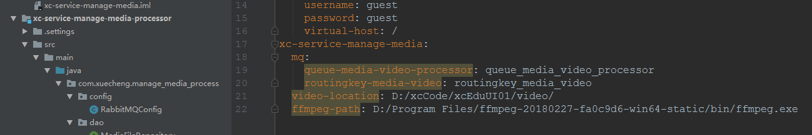

使用`rabbitMQ`的`routing`交换机模式，视频处理程序监听视频处理队列，如下图：

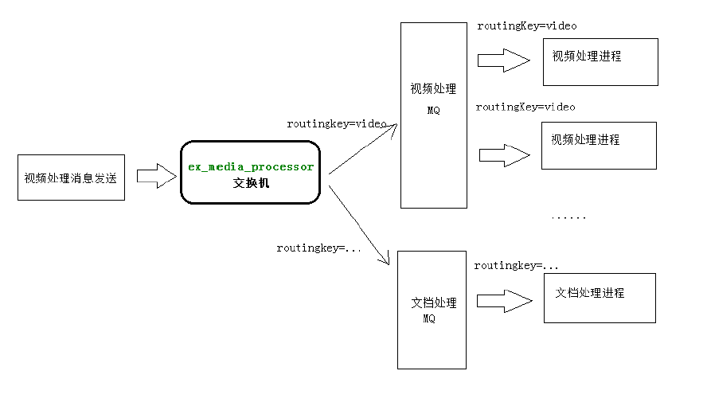

## 三、视频处理-视频处理技术方案

ffmpeg是一个可行的视频处理程序，可以通过Java调用ffmpeg.exe完成视频处理。
在java中可以使用Runtime类和`Process Builder`类两种方式来执行外部程序，工作中至少掌握一种。
本项目使用Process Builder的方式来调用ffmpeg完成视频处理。

一个简单的使用例子: 在cmd中使用`ipconfig`:

```java
//使用ProcessBuilder来调用第三方应用程序
@Test
public void testProcessBuilder() throws IOException {

    //创建ProcessBuilder对象
    ProcessBuilder processBuilder = new ProcessBuilder();
    //设置执行的第三方程序(命令)
    //        processBuilder.command("ping","127.0.0.1");
    processBuilder.command("ipconfig");

    //        processBuilder.command("java","-jar","f:/xc-service-manage-course.jar");
    //将标准输入流和错误输入流合并，通过标准输入流读取信息就可以拿到第三方程序输出的错误信息、正常信息
    processBuilder.redirectErrorStream(true);
    //启动一个进程
    Process process = processBuilder.start();

    //由于前边将错误和正常信息合并在输入流，只读取输入流
    InputStream inputStream = process.getInputStream();

    //将字节流转成字符流
    InputStreamReader reader = new InputStreamReader(inputStream, "gbk");
    //字符缓冲区
    char[] chars = new char[1024];
    int len = -1;
    while ((len = reader.read(chars)) != -1) {
        String string = new String(chars, 0, len);
        System.out.println(string);
    }
    inputStream.close();
    reader.close();
}
```


视频转换测试调用:

```java
@Test
public void testFFmpeg() {
    ProcessBuilder processBuilder = new ProcessBuilder();
    //定义命令内容
    List<String> command = new ArrayList<>();
    command.add("D:/software/ffmpeg-20180227-fa0c9d6-win64-static/bin/ffmpeg.exe");
    command.add("-i");
    command.add("D:/software/ffmpeg_test/1.avi");
    command.add("-y");//覆盖输出文件
    command.add("-c:v");
    command.add("libx264");
    command.add("-s");
    command.add("1280x720");
    command.add("-pix_fmt");
    command.add("yuv420p");
    command.add("-b:a");
    command.add("63k");
    command.add("-b:v");
    command.add("753k");
    command.add("-r");
    command.add("18");
    command.add("D:/software/ffmpeg_test/1.mp4");
    processBuilder.command(command);
    //将标准输入流和错误输入流合并，通过标准输入流读取信息
    processBuilder.redirectErrorStream(true);
    try {
        //启动进程
        Process start = processBuilder.start();
        //获取输入流
        InputStream inputStream = start.getInputStream();
        //转成字符输入流
        InputStreamReader inputStreamReader = new InputStreamReader(inputStream, "gbk");
        int len = -1;
        char[] c = new char[1024];
        StringBuffer sb = new StringBuffer();
        //读取进程输入流中的内容
        while ((len = inputStreamReader.read(c)) != -1) {
            String s = new String(c, 0, len);
            sb.append(s);
            System.out.print(s);
        }
        inputStream.close();
    } catch (IOException e) {
        e.printStackTrace();
    }
}
```

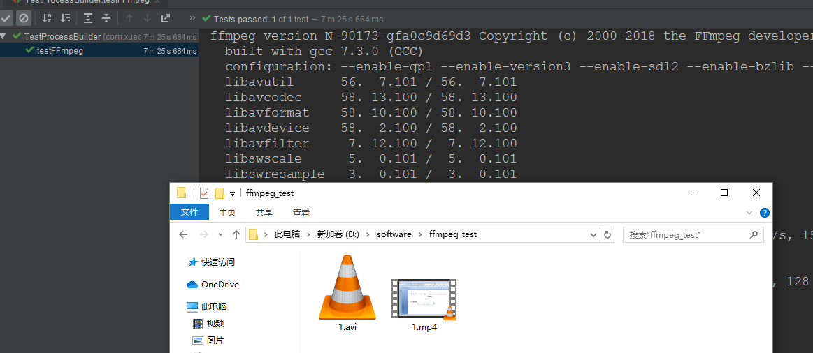

项目中的处理方案: 提供了三个视频转换的工具类:

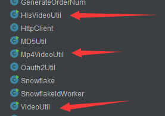

`Mp4VideoUtil.java`完成`avi`转`mp4`

`HlsVideoUtil.java`完成`mp4`转`hls`


使用`Mp4VideoUtil`来进行转换:

```java
//测试使用工具类将avi转成mp4
@Test
public void testProcessMp4() {
    //String ffmpeg_path, String video_path, String mp4_name, String mp4folder_path
    //ffmpeg的路径
    String ffmpeg_path = "D:/software/ffmpeg-20180227-fa0c9d6-win64-static/bin/ffmpeg.exe";
    //video_path视频地址
    String video_path = "D:/software/ffmpeg_test/1.avi";
    //mp4_name mp4文件名称
    String mp4_name = "1.mp4";
    //mp4folder_path mp4文件目录路径
    String mp4folder_path = "D:/software/ffmpeg_test/";

    Mp4VideoUtil mp4VideoUtil = new Mp4VideoUtil(ffmpeg_path, video_path, mp4_name, mp4folder_path);
    //开始编码,如果成功返回success，否则返回输出的日志
    String result = mp4VideoUtil.generateMp4();

    System.out.println(result);
}
```

## 四、视频处理-视频处理实现-业务流程分析

MQ消息统一采用json格式，视频处理生产方会向MQ发送如下消息，视频处理消费方接收此消息后进行视频处
理：
`｛“mediaId” : XXX｝`

处理流程:

1）接收视频处理消息；
2）判断媒体文件是否需要处理（本视频处理程序目前只接收avi视频的处理），当前只有avi文件需要处理，其它文件需要更新处理状态为“无需处理”；
3）处理前初始化处理状态为“未处理”；
4）处理失败需要在数据库记录处理日志，及处理状态为“处理失败”；
5）处理成功记录处理状态为“处理成功”；

## 五、视频处理-视频处理实现-生成mp4 (消息消费方)

在mq包下创建`MediaProcessTask`类，此类负责监听视频处理队列，并进行视频处理。
整个视频处理内容较多，这里分两部分实现：生成Mp4和生成m3u8，**下边代码实现了生成mp4**。

```java
@Component
@Slf4j
public class MediaProcessTask {

    //ffmpeg绝对路径
    @Value("${xc-service-manage-media.ffmpeg-path}")
    String ffmpegPath;

     //上传文件根目录
    @Value("${xc-service-manage-media.video-location}")
    String serverPath;


    @Autowired
    MediaFileRepository mediaFileRepository;

    // 接受视频处理消息 进行 视频处理
    @RabbitListener(queues = "${xc-service-manage-media.mq.queue-media-video-processor}")
    public void receiveMediaProcessTask(String msg) {

        // 1、解析消息内容，得到mediaId
        Map msgMap = JSON.parseObject(msg, Map.class);
        log.info("receive media process task msg: {}", msgMap);

        // 2、拿mediaId从数据库查询文件信息
        //媒资文件id
        String mediaId = (String) msgMap.get("mediaId");
        //获取媒资文件信息
        Optional<MediaFile> optionalMediaFile = mediaFileRepository.findById(mediaId);
        if (!optionalMediaFile.isPresent()) {
            return;
        }
        MediaFile mediaFile = optionalMediaFile.get();
        //获取媒资文件类型
        String fileType = mediaFile.getFileType();
        if (!fileType.equals("avi")) {
            mediaFile.setProcessStatus("303004"); //无需处理的 数据字典
            mediaFileRepository.save(mediaFile); //保存到数据库
            return;
        }
        //需要处理
        mediaFile.setProcessStatus("303001");//处理中
        mediaFileRepository.save(mediaFile);

        // 3、使用工具类将avi文件生成mp4

        //(ffmpeg_path,  video_path,  mp4_name,  mp4folder_path)
        String video_path = serverPath + mediaFile.getFilePath() + mediaFile.getFileName();
        String mp4_name = mediaFile.getFileId() + ".mp4";
        String mp4folder_path = serverPath + mediaFile.getFilePath();
        Mp4VideoUtil mp4VideoUtil = new Mp4VideoUtil(ffmpegPath, video_path, mp4_name, mp4folder_path);
        String mp4Result = mp4VideoUtil.generateMp4();
        if (mp4Result == null || !mp4Result.equals("success")) {
            //操作失败写入处理日志
            setFailProcess(mp4Result, mediaFile);
            return;
        }

        // 4、将mp4生成m3u8和ts文件

    }

    //操作失败写入处理日志
    private void setFailProcess(String result, MediaFile mediaFile){
        mediaFile.setProcessStatus("303003");//处理状态为处理失败
        MediaFileProcess_m3u8 mediaFileProcess_m3u8 = new MediaFileProcess_m3u8();
        mediaFileProcess_m3u8.setErrormsg(result);
        mediaFile.setMediaFileProcess_m3u8(mediaFileProcess_m3u8);
        mediaFileRepository.save(mediaFile);
    }
}

```


## 六、视频处理-视频处理实现-生成m3u8

接着实现第4步。将mp4生成m3u8和ts文件。

```java
// 4、将mp4生成m3u8和ts文件
String mp4_video_path = serverPath + mediaFile.getFilePath() + mp4_name;//此地址为mp4的地址
String m3u8_name = mediaFile.getFileId() + ".m3u8";
String m3u8folder_path = serverPath + mediaFile.getFilePath() + "hls/";
HlsVideoUtil hlsVideoUtil = new
    HlsVideoUtil(ffmpegPath, mp4_video_path, m3u8_name, m3u8folder_path);
String tsResult = hlsVideoUtil.generateM3u8();

if (tsResult == null || !tsResult.equals("success")) {
    setFailProcess(tsResult, mediaFile);
    return;
}

//处理成功，获取m3u8和ts文件列表
List<String> ts_list = hlsVideoUtil.get_ts_list();
mediaFile.setProcessStatus("303003");

MediaFileProcess_m3u8 mediaFileProcess_m3u8 = new MediaFileProcess_m3u8();
mediaFileProcess_m3u8.setTslist(ts_list);
mediaFile.setMediaFileProcess_m3u8(mediaFileProcess_m3u8);
String fileUrl = mediaFile.getFilePath() + "hls/" + m3u8_name; // 还有一个很重要的步骤,保存需要访问的fileUrl
mediaFile.setFileUrl(fileUrl);
mediaFileRepository.save(mediaFile);
```


## 七、视频处理-发送视频处理消息分析&更正FilePath

更正文件filePath（`xc-service-manage-media`工程中的`MediaUploadService`类的`mergechunks()`方法），我的没有写错(当时看了pdf)，所以不需要更正。


## 八、视频处理-发送视频处理消息(消息生产方）

需要在`xc-service-manage-media`工程中发送消息(`MediaUploadService`中添加一个发送消息的方法)。


步骤:

1、创建一个`sendProcessVideoMsg(mediaId)`方法；


2、在`mergechunks()`最后调用`sendProcessVideoMsg()`方法，发送消息；


3、需要在`application.yml`中配置交换机；

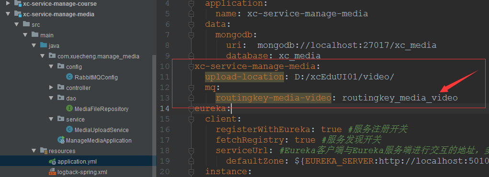

4、需要注入`RabbitTemplate`来发送消息；


5、需要从`xc-service-manage-media-processor`中拷贝`RabbitMQConfig`类到`xc-service-manage-media`中。

`RabbitMQConfig.java`:

```java
@Configuration
public class RabbitMQConfig {

    //交换机, 需要和消费方一样
    public static final String EX_MEDIA_PROCESSTASK = "ex_media_processor";

    /**
     * 交换机配置
     * @return the exchange
     */
    @Bean(EX_MEDIA_PROCESSTASK)
    public Exchange EX_MEDIA_VIDEOTASK() {
        return ExchangeBuilder.directExchange(EX_MEDIA_PROCESSTASK).durable(true).build();
    }
}
```

最后贴出`MediaUploadService.java`的实现:

```java
@Service
@Slf4j
public class MediaUploadService {

    @Autowired
    RabbitTemplate rabbitTemplate;

    //视频处理路由
    @Value("${xc-service-manage-media.mq.routingkey-media-video}")
    public String routingkey_media_video;

    // 四、合并分块
    public ResponseResult mergechunks(String fileMd5, String fileName, Long fileSize, String mimetype, String fileExt) {
        // 1、合并所有分块
        File chunkFolderPathFile = new File(getChunkFileFolderPath(fileMd5));
        if (!chunkFolderPathFile.exists()) {
            chunkFolderPathFile.mkdirs();
        }

		.................

        //新增代码，向MQ发送视频处理消息
        sendProcessVideoMsg(mediaFile.getFileId());

        return new ResponseResult(CommonCode.SUCCESS);
    }


    //发送视频处理消息 (在合并chunks的时候也需要发送消息)
    public ResponseResult sendProcessVideoMsg(String mediaId) {

        //先验证一下在MongoDB中有没有
        Optional<MediaFile> optionalMediaFile = mediaFileRepository.findById(mediaId);
        if (!optionalMediaFile.isPresent()) {
            return new ResponseResult(CommonCode.FAIL);
        }
        //发送视频处理消息
        Map<String, String> msgMap = new HashMap<>();
        msgMap.put("mediaId", mediaId);
        String msg = JSON.toJSONString(msgMap); //发送的消息

        //向MQ发送消息
        try {
            rabbitTemplate.convertAndSend(RabbitMQConfig.EX_MEDIA_PROCESSTASK, routingkey_media_video,
                    msg);
            log.info("send media process task msg:{}", msg);
        } catch (Exception e) {
            e.printStackTrace();
            log.info("send media process task error,msg is:{},error:{}", msg, e.getMessage());
            return new ResponseResult(CommonCode.FAIL);
        }
        return new ResponseResult(CommonCode.SUCCESS);
    }
}
```

## 九、视频处理-视频处理测试

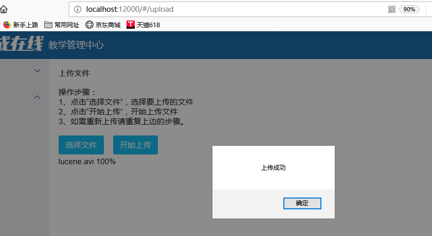

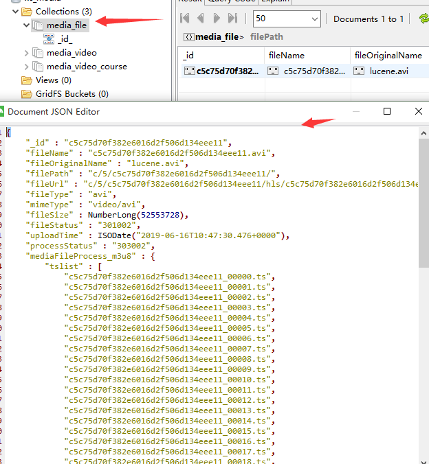

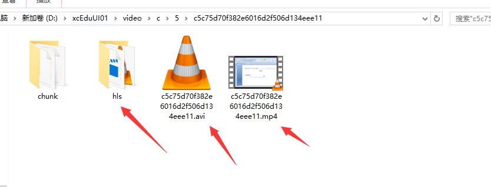

## 十、视频处理-视频处理并发设置

之前的程序的  生成视频处理(即生成`/hls`这个下面的`ts`和`m3u8`文件)这个过程是串行处理的。这样会消耗更多的资源。可以配置成可以处理并发的数目。

1、先在`xc-service-manage-media-processor`下的`RabbitMQConfig.java`中 添加一个`Factory`:

```java
@Configuration
public class RabbitMQConfig {

    //消费者并发数量
    public static final int DEFAULT_CONCURRENT = 10;

    @Bean("customContainerFactory")
    public SimpleRabbitListenerContainerFactory
    containerFactory(SimpleRabbitListenerContainerFactoryConfigurer configurer, ConnectionFactory
            connectionFactory) {
        SimpleRabbitListenerContainerFactory factory = new SimpleRabbitListenerContainerFactory();
        factory.setConcurrentConsumers(DEFAULT_CONCURRENT);
        factory.setMaxConcurrentConsumers(DEFAULT_CONCURRENT);
        configurer.configure(factory, connectionFactory);
        return factory;
    }
}
```

2、在`@RabbitListener`注解中指定容器工厂

```java
// 接受视频处理消息 进行 视频处理
@RabbitListener(queues = "${xc-service-manage-media.mq.queue-media-video-processor}",
                containerFactory="customContainerFactory")
```

## 十一、我的媒资-需求分析&Api定义

通过我的媒资可以查询本教育机构拥有的媒资文件，进行文件处理、删除文件、修改文件信息等操作，具体需求如
下：
1、分页查询我的媒资文件
2、删除媒资文件
3、处理媒资文件
4、修改媒资文件信息

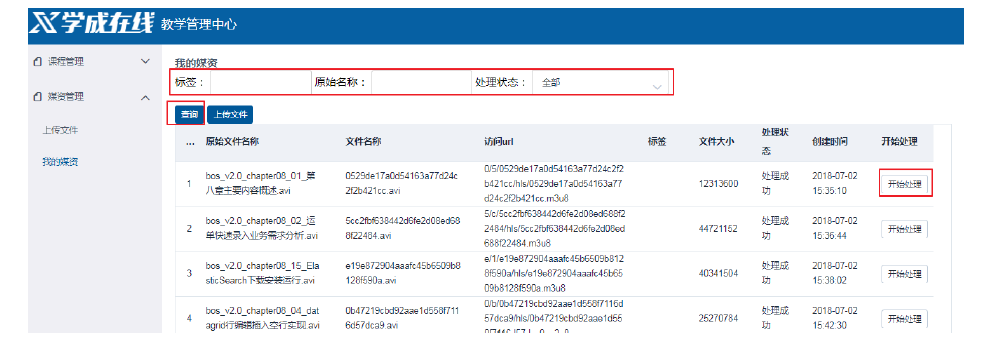


## 十二、我的媒资-服务端开发

定义接口:

```java
@Api(value = "媒体文件管理", tags = {"媒体文件管理接口"})
public interface MediaFileControllerApi {

    @ApiOperation("查询文件列表")
    QueryResponseResult findList(int page, int size, QueryMediaFileRequest
            queryMediaFileRequest);

}
```

`Controller`:

```java
@RestController
@RequestMapping("/media/file")
public class MediaFileController implements MediaFileControllerApi {


    @Autowired
    MediaFileService mediaFileService;


    @Override
    @GetMapping("/list/{page}/{size}")

    public QueryResponseResult findList(@PathVariable("page") int page, @PathVariable("size")
            int size, QueryMediaFileRequest queryMediaFileRequest) {
        //媒资文件查询
        return mediaFileService.findList(page,size,queryMediaFileRequest);
    }
}
```

`Service`:

```java
@Service
public class MediaFileService {

    @Autowired
    MediaFileRepository mediaFileRepository;

    public QueryResponseResult findList(int page, int size, QueryMediaFileRequest queryMediaFileRequest) {
        if(queryMediaFileRequest == null){
            queryMediaFileRequest = new QueryMediaFileRequest();
        }

        MediaFile mediaFile = new MediaFile();
        if(StringUtils.isNotEmpty(queryMediaFileRequest.getFileOriginalName())){
            mediaFile.setFileOriginalName(queryMediaFileRequest.getFileOriginalName());
        }
        if(StringUtils.isNotEmpty(queryMediaFileRequest.getTag())){
            mediaFile.setTag(queryMediaFileRequest.getTag());
        }
        if(StringUtils.isNotEmpty(queryMediaFileRequest.getProcessStatus())){
            mediaFile.setProcessStatus(queryMediaFileRequest.getProcessStatus());
        }

        //查询条件匹配器
        ExampleMatcher matcher = ExampleMatcher.matching()
                .withMatcher("tag", ExampleMatcher.GenericPropertyMatchers.contains()) // tag字段模糊匹配
                .withMatcher("fileOriginalName", ExampleMatcher.GenericPropertyMatchers.contains())
                .withMatcher("processStatus", ExampleMatcher.GenericPropertyMatchers.exact()); //处理状态精确匹配( 默认的 )

        Example<MediaFile> example = Example.of(mediaFile, matcher);

        if(page <= 0){
            page = 1;
        }
        page = page - 1;
        if(size <= 0){
            size = 10;
        }

        //2、分页
        Pageable pageable = PageRequest.of(page, size);

        Page<MediaFile> all = mediaFileRepository.findAll(example, pageable);

        //3、返回结果
        long total= all.getTotalElements();
        List<MediaFile> content = all.getContent();
        QueryResult<MediaFile> queryResult = new QueryResult<>();
        queryResult.setTotal(total);
        queryResult.setList(content);
        return new QueryResponseResult(CommonCode.SUCCESS, queryResult);
    }
}

```


## 十三、我的媒资-前端开发


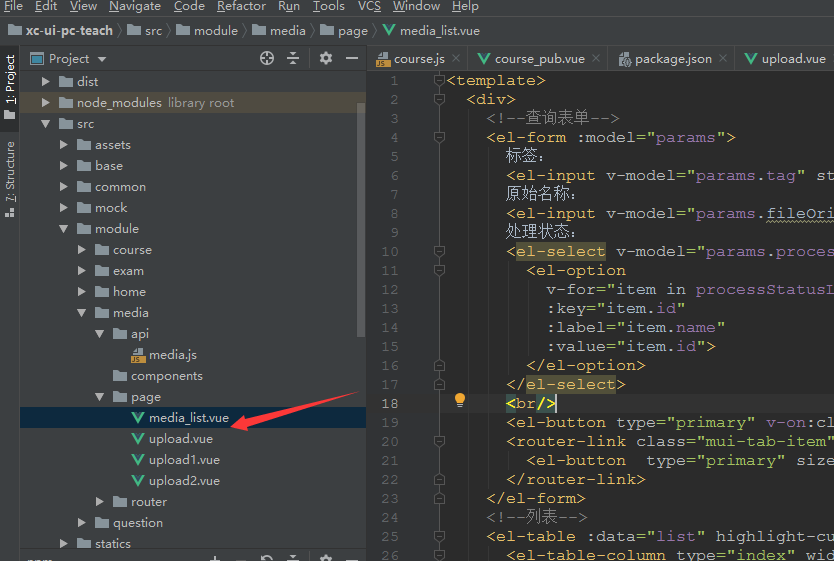

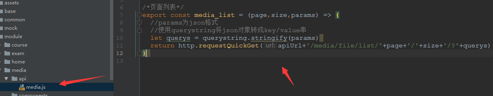

显示结果:

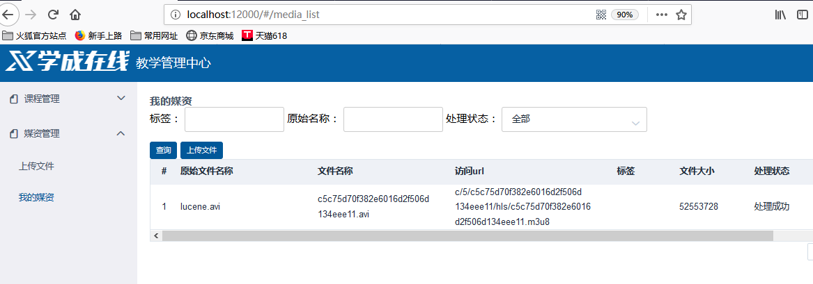

## 十四、媒资与课程计划关联-需求分析

到目前为止，媒资管理已完成文件上传、视频处理、我的媒资功能等基本功能。其它模块已可以使用媒资管理功
能，本节要讲解课程计划在编辑时如何选择媒资文件。

操作的业务流程如下：
1、进入课程计划修改页面
2、选择视频
打开媒资文件查询窗口，找到该课程章节的视频，选择此视频。
点击“选择媒资文件”打开媒资文件列表

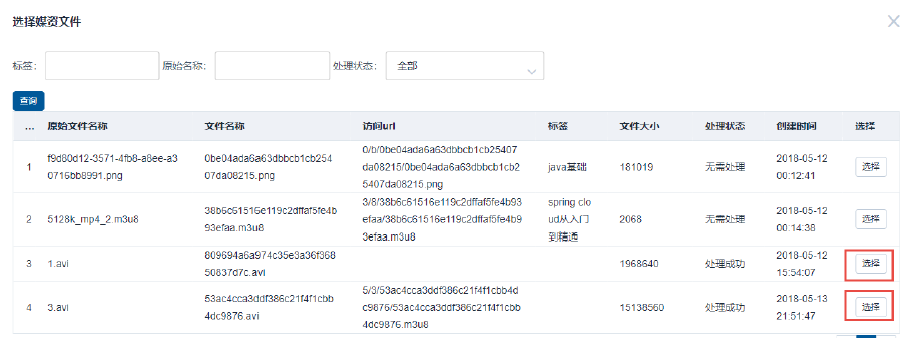

选择成功后，将在课程管理数据库保存课程计划对应在的课程视频地址。
在课程管理数据库创建表` teachplan_media` 存储课程计划与媒资关联信息，如下：

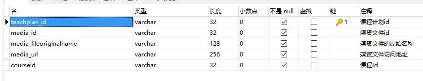

`grade=3`的章节要和视频相关联。

## 十五、媒资与课程计划关联-选择视频

需求实现:

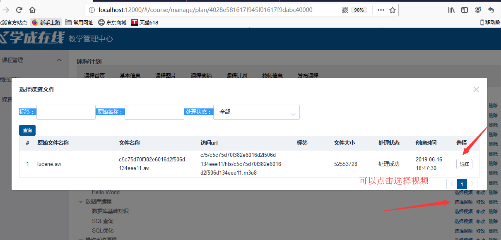

这里这个窗口和之前媒资展示列表的窗口很像，所以不需要单独开发一个页面，可以使用Vue.js中的父子组件来实现。

上一章已实现了我的媒资页面，所以媒资查询窗口页面不需要再开发，将“我的媒资页面”作为一个组件在修改课程
计划页面中引用，如下图：

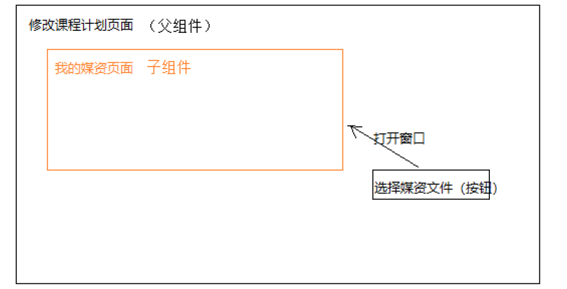

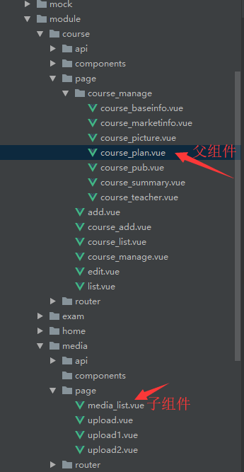


## 十六、媒资与课程计划关联-保存视频信息-需求分析&Api定义

保存视频信息，API开发

**用户进入课程计划页面，选择视频，将课程计划与视频信息保存在课程管理数据库中**。
用户操作流程：
1、进入课程计划，点击”选择视频“，打开我的媒资查询页面
2、为课程计划选择对应的视频，选择“选择”
3、前端请求课程管理服务保存课程计划与视频信息 (在父组件`course_plan`中会调用服务端接口)。


此接口作为前端请求课程管理服务保存课程计划与视频信息的接口：
在课程管理服务增加接口:

```java
@Api(value = "课程管理接口", tags = "课程管理接口，提供课程的增、删、改、查")
public interface CourseControllerApi {

    @ApiOperation("保存媒资信息")
    ResponseResult savemedia(TeachplanMedia teachplanMedia);
}
```

其中`TeachplanMedia`类中包含了课程计划和媒资关联的相关属性:

```java
@Data
@ToString
@Entity
@Table(name="teachplan_media")
@GenericGenerator(name = "jpa-assigned", strategy = "assigned")
public class TeachplanMedia implements Serializable {
    private static final long serialVersionUID = -916357110051689485L;
    @Id
    @GeneratedValue(generator = "jpa-assigned")
    @Column(name="teachplan_id")
    private String teachplanId;

    @Column(name="media_id")
    private String mediaId;

    @Column(name="media_fileoriginalname")
    private String mediaFileOriginalName;

    @Column(name="media_url")
    private String mediaUrl;
    private String courseId;
}

```

## 十七、媒资与课程计划关联-保存视频信息-服务端开发

`Controller`:

```java
@Override
@PostMapping("/savemedia")
public ResponseResult savemedia(@RequestBody TeachplanMedia teachplanMedia) {
    return courseService.savemedia(teachplanMedia);
}
```

`Service`:

```java
//保存课程计划于媒资文件的关联信息
public ResponseResult savemedia(TeachplanMedia teachplanMedia) {
    if (teachplanMedia == null || StringUtils.isEmpty(teachplanMedia.getTeachplanId())) {
        ExceptionCast.cast(CommonCode.INVALID_PARAM);
    }
    //课程计划
    String teachplanId = teachplanMedia.getTeachplanId();

    //查询课程计划
    Optional<Teachplan> teachplanOptional = teachplanRepository.findById(teachplanId);
    if (!teachplanOptional.isPresent()) {
        ExceptionCast.cast(CourseCode.COURSE_MEDIA_TEACHPLAN_ISNULL);
    }

    Teachplan teachplan = teachplanOptional.get();
    //只允许为叶子结点课程计划选择视频
    String grade = teachplan.getGrade();
    if (StringUtils.isEmpty(grade) || !grade.equals("3")) {
        ExceptionCast.cast(CourseCode.COURSE_MEDIA_TEACHPLAN_GRADEERROR);
    }

    TeachplanMedia one = null;
    Optional<TeachplanMedia> teachplanMediaOptional = teachplanMediaRepository.findById(teachplanId);
    if (teachplanMediaOptional.isPresent()) {
        one = teachplanMediaOptional.get();
    } else {
        one = new TeachplanMedia();
    }

    //保存媒资信息与课程计划信息
    one.setTeachplanId(teachplanId);
    one.setCourseId(teachplanMedia.getCourseId());
    one.setMediaFileOriginalName(teachplanMedia.getMediaFileOriginalName());
    one.setMediaId(teachplanMedia.getMediaId());
    one.setMediaUrl(teachplanMedia.getMediaUrl());
    teachplanMediaRepository.save(one);
    return new ResponseResult(CommonCode.SUCCESS);
}
```

`DAO`:

```java
public interface TeachplanMediaRepository extends JpaRepository<TeachplanMedia, String> {
}
```


## 十八、媒资与课程计划关联-保存视频信息-前端开发

注意这里导入的代码有个小bug:

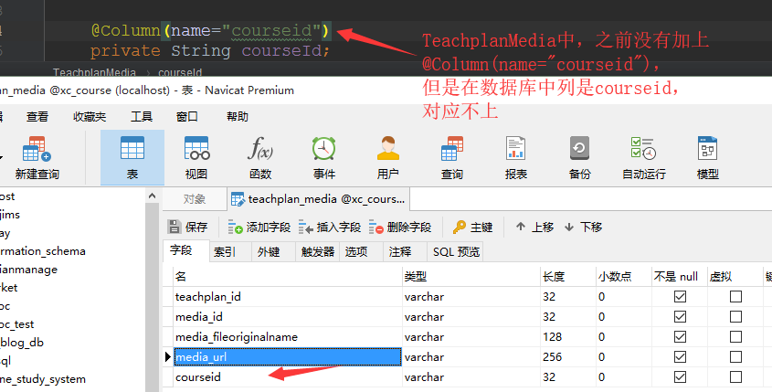

测试:

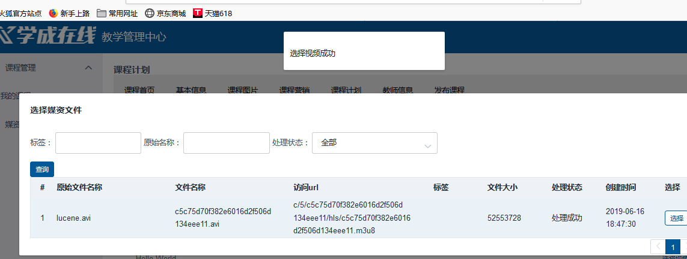


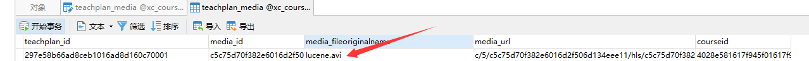

## 十九、媒资与课程计划关联-查询视频信息

课程计划的视频信息保存后在页面无法查看，本节解决课程计划页面显示相关联的媒资信息。
解决方案：
在获取课程计划树结点信息时将关联的媒资信息一并查询，并在前端显示，下图说明了课程计划显示的区域。

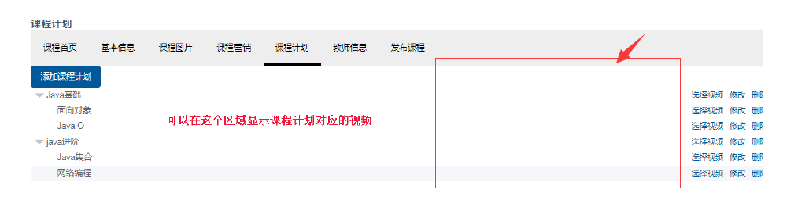


步骤:

1、修改模型，在课程计划结果信息中添加媒资信息

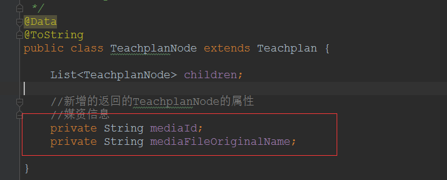

```java
@Data
@ToString
public class TeachplanNode extends Teachplan {

    List<TeachplanNode> children;

    //新增的返回的TeachplanNode的属性
    //媒资信息
    private String mediaId;
    private String mediaFileOriginalName;

}
```

2、修改查询TeachplanNode的sql语句，添加关联查询媒资信息(这样就可以得到媒资文件的原始名称展示在页面中间的空白处。)

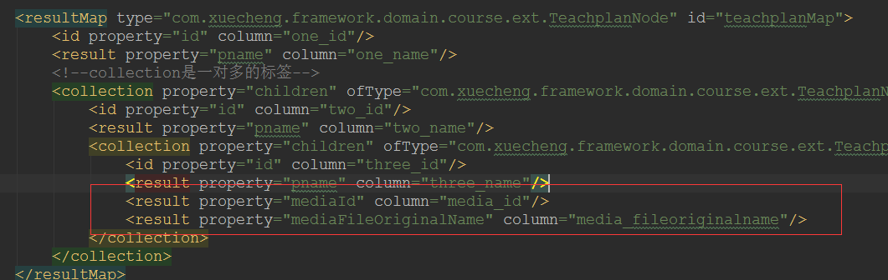


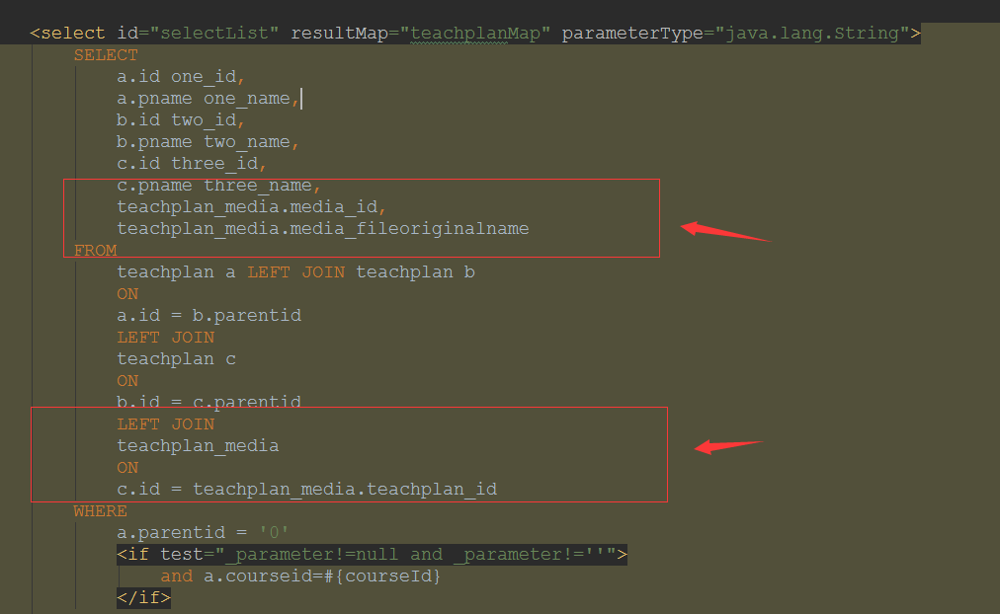

贴出完整`TeachplanMapper.xml`文件:

```xml
<?xml version="1.0" encoding="UTF-8" ?>
<!DOCTYPE mapper PUBLIC "-//mybatis.org//DTD Mapper 3.0//EN" "http://mybatis.org/dtd/mybatis-3-mapper.dtd" >

<!--TeachplanMapper.java的路径-->
<mapper namespace="com.xuecheng.manage_course.dao.TeachplanMapper">

    <resultMap type="com.xuecheng.framework.domain.course.ext.TeachplanNode" id="teachplanMap">
        <id property="id" column="one_id"/>
        <result property="pname" column="one_name"/>
        <!--collection是一对多的标签-->
        <collection property="children" ofType="com.xuecheng.framework.domain.course.ext.TeachplanNode">
            <id property="id" column="two_id"/>
            <result property="pname" column="two_name"/>
            <collection property="children" ofType="com.xuecheng.framework.domain.course.ext.TeachplanNode">
                <id property="id" column="three_id"/>
                <result property="pname" column="three_name"/>
                <result property="mediaId" column="media_id"/>
                <result property="mediaFileOriginalName" column="media_fileoriginalname"/>
            </collection>
        </collection>
    </resultMap>

    <select id="selectList" resultMap="teachplanMap" parameterType="java.lang.String">
        SELECT
            a.id one_id,
            a.pname one_name,
            b.id two_id,
            b.pname two_name,
            c.id three_id,
            c.pname three_name,
            teachplan_media.media_id,
            teachplan_media.media_fileoriginalname
        FROM
            teachplan a LEFT JOIN teachplan b
            ON
            a.id = b.parentid
            LEFT JOIN
            teachplan c
            ON
            b.id = c.parentid
            LEFT JOIN
            teachplan_media
            ON
            c.id = teachplan_media.teachplan_id
        WHERE
            a.parentid = '0'
            <if test="_parameter!=null and _parameter!=''">
                and a.courseid=#{courseId}
            </if>
        ORDER BY
            a.orderby,
            b.orderby,
            c.orderby
    </select>

</mapper>
```

重启测试:

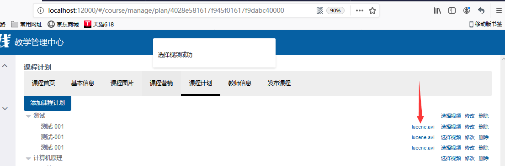

