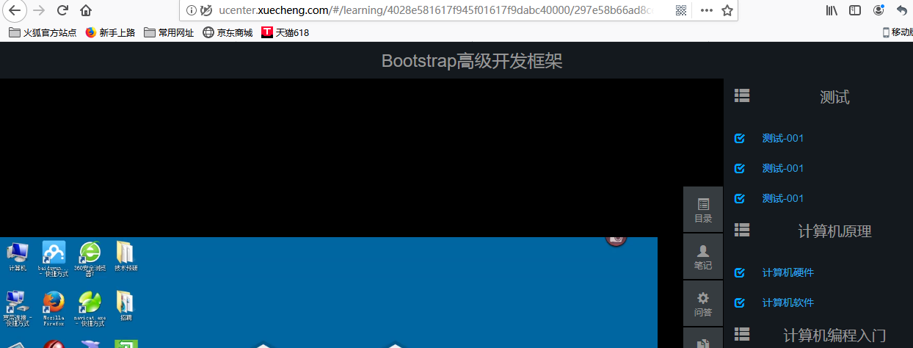

# 媒资管理系统集成

## 一、学习页面查询课程计划-需求分析&Api定义

在线学习页面所需要的信息有两类：一类是课程计划信息、一类是课程学习信息（视频地址、学
习进度等）


在线学习集成媒资管理的需求如下：

1、在线学习页面显示课程计划
2、点击课程计划播放该课程计划对应的视频


课程计划信息从哪里获取？
目前课程计划信息在课程管理数据库和ES索引库中存在，考虑性能要求，课程发布后对课程的查询统一从ES索引库
中查询。
前端通过请求搜索服务获取课程信息**，需要单独在搜索服务中定义课程信息查询接口**。
本接口接收课程id，查询课程所有信息返回给前端。


## 二、学习页面查询课程计划-服务端开发

`Controller`:

```java
@RestController
@RequestMapping("/search/course")
public class EsCourseController implements EsCourseControllerApi {

    @Autowired
    EsCourseService esCourseService;

    @Override
    @GetMapping("/getall/{id}")
    public Map<String, CoursePub> getAll(@PathVariable("id") String id) {
        return esCourseService.getAll(id);
    }
}
```

`Service`: (用ES根据课程`courseId`查询课程信息)

```java

//根据课程Id查询课程信息
public Map<String, CoursePub> getAll(String id) {

    //设置索引库
    SearchRequest searchRequest = new SearchRequest(index);
    //设置类型
    searchRequest.types(type);
    SearchSourceBuilder searchSourceBuilder = new SearchSourceBuilder();
    //根据课程id进行查询
    searchSourceBuilder.query(QueryBuilders.termsQuery("id", id)); //name value

    //可以设置过滤字段，但是这里是查询所有的
    //searchSourceBuilder.fetchSource(new String[]{"name"}, new String[]{}); //设置包含的和不包含的

    searchRequest.source(searchSourceBuilder);

    //获取搜索结果
    SearchResponse searchResponse = null;
    try {
        searchResponse = restHighLevelClient.search(searchRequest);
    } catch (IOException e) {
        e.printStackTrace();
    }

    SearchHits hits = searchResponse.getHits();
    SearchHit[] searchHits = hits.getHits();
    Map<String, CoursePub> resMap = new HashMap<>();

    for (SearchHit hit : searchHits) {
        Map<String, Object> sourceAsMap = hit.getSourceAsMap();

        //取出来
        String courseId = (String) sourceAsMap.get("id");
        String name = (String) sourceAsMap.get("name");
        String grade = (String) sourceAsMap.get("grade");
        String charge = (String) sourceAsMap.get("charge");
        String pic = (String) sourceAsMap.get("pic");
        String description = (String) sourceAsMap.get("description");
        String teachplan = (String) sourceAsMap.get("teachplan");

        CoursePub coursePub = new CoursePub();
        coursePub.setId(courseId);
        coursePub.setName(name);
        coursePub.setGrade(grade);
        coursePub.setCharge(charge);
        coursePub.setPic(pic);
        coursePub.setDescription(description);
        coursePub.setTeachplan(teachplan);

        resMap.put(courseId, coursePub); //推入结果集
    }
    return resMap;
}
```


## 三、学习页面查询课程计划-前端开发


在`nginx.conf`中增加代码:


```properties
	#学成网用户中心
	server {
		listen 80;
		server_name ucenter.xuecheng.com;
		#个人中心
		location / {
			proxy_pass http://ucenter_server_pool;
		}
		#后端搜索服务
		location /openapi/search/ {
			proxy_pass http://search_server_pool/search/;
		}
	}
```


前端修改:

修改`learning_video.vue`:


代码:

```js
systemApi.course_view(this.courseId).then((view_course)=>{
    //增加代码
    if(!view_course || !view_course[this.courseId]){
        this.$message.error("获取课程信息失败，请重新进入此页面！")
        return ;
    }
    let courseInfo = view_course[this.courseId]
    console.log(courseInfo)
    this.coursename = courseInfo.name
    if(courseInfo.teachplan){
        let teachplan = JSON.parse(courseInfo.teachplan)
        this.teachplanList = teachplan.children
    }

})
```


测试:

启动下面的东西:

1、ES

2、ES-head插件，从里面找一个课程id；


3、`xc-service-search`服务

4、前端`xc-ui-pc-learning`


测试:

输入: http://ucenter.xuecheng.com/#/learning/4028e581617f945f01617f9dabc40000/1

第一个参数为课程id，测试时从ES索引库找一个课程id
0：第二个参数为课程计划id，此参数用于点击课程计划播放视频。

测试的过程中，出现了问题，重启电脑之后又可以了，可能又是`nginx`配置的问题(更改配置文件，调用`nginx.exe -s reload`无效)


## 四、学习页面获取视频播放地址-需求分析

用户进入在线学习页面，点击课程计划将播放该课程计划对应的教学视频。
业务流程如下：


业务流程说明：
1、用户进入在线学习页面，页面请求搜索服务获取课程信息（包括课程计划信息）并且在页面展示。
2、在线学习请求学习服务获取视频播放地址。
3、**学习服务校验当前用户是否有权限学习**，如果没有权限学习则提示用户。
4、学习服务校验通过，请求搜索服务获取课程媒资信息。
5、搜索服务请求ElasticSearch获取课程媒资信息。


为什么要请求ElasticSearch查询课程媒资信息？
出于性能的考虑，公开查询课程信息从搜索服务查询。
什么时候将课程媒资信息存储到ElasticSearch中？
**课程媒资信息是在课程发布的时候存入ElasticSearch**(使用logstash)，因为课程发布后课程信息将基本不再修改。

**可以采取和采集课程信息一样的方式。在课程发布的时候，将信息保存到`teachplan_media_pub`表中，然后使用`logstash`在这个表中采集信息到`ES`中**。


```sql
CREATE TABLE `teachplan_media_pub` (
    `teachplan_id` varchar(32) NOT NULL COMMENT '课程计划id',
    `media_id` varchar(32) NOT NULL COMMENT '媒资文件id',
    `media_fileoriginalname` varchar(128) NOT NULL COMMENT '媒资文件的原始名称',
    `media_url` varchar(256) NOT NULL COMMENT '媒资文件访问地址',
    `courseid` varchar(32) NOT NULL COMMENT '课程Id',
    `timestamp` timestamp NOT NULL DEFAULT CURRENT_TIMESTAMP ON UPDATE CURRENT_TIMESTAMP COMMENT 'logstash使用',
    PRIMARY KEY (`teachplan_id`)
) ENGINE=InnoDB DEFAULT CHARSET=utf8
```


## 五、学习页面获取视频播放地址-课程发布存储媒资信息-需求分析 

课程媒资信息是在课程发布的时候存入ElasticSearch索引库，因为课程发布后课程信息将基本不再修改，具体的
业务流程如下。

业务流程如下：
1、课程发布，向课程媒资信息表写入数据。
1）根据课程id删除teachplanMediaPub中的数据
2）根据课程id查询teachplanMedia数据
3）将查询到的teachplanMedia数据插入到teachplanMediaPub中
2、Logstash定时扫描课程媒资信息表，并将课程媒资信息写入索引库。

**即在`teachplan_media_pub`中先删后插入**。

## 六、学习页面获取视频播放地址-课程发布存储媒资信息-实现

在`package com.xuecheng.framework.domain.course;`包下面添加一个模型:  `TeachplanMediaPub`:

```java
@Data
@ToString
@Entity
@Table(name = "teachplan_media_pub")
@GenericGenerator(name = "jpa-assigned", strategy = "assigned")
public class TeachplanMediaPub implements Serializable {

    private static final long serialVersionUID = -916357110051689485L;

    @Id
    @GeneratedValue(generator = "jpa-assigned")
    @Column(name = "teachplan_id")
    private String teachplanId;

    @Column(name = "media_id")
    private String mediaId;

    @Column(name = "media_fileoriginalname")
    private String mediaFileOriginalName;

    @Column(name = "media_url")
    private String mediaUrl;

    @Column(name = "courseid")
    private String courseId;

    //时间戳 为了logstash中的时间戳
    @Column(name = "timestamp")
    private Date timestamp;
}
```

因为需要先从`TeachplanMedia`查询，而且要从`TeachplanMediaPub`中根据id删除，所以需要创建两个dao：

```java
public interface TeachplanMediaRepository extends JpaRepository<TeachplanMedia, String> {

    List<TeachplanMedia> findByCourseId(String courseId);
}
```

```java
public interface TeachplanMediaPubRepository extends JpaRepository<TeachplanMediaPub, String> {

    //根据id删除记录
    long deleteByCourseId(String courseId);
}
```


在`xc-service-manage-course`中发布课程的方法的最后添加媒资信息:

```java
//课程发布
@Transactional
public CoursePublishResult publish(String courseId) {

    ......
        // 4、最后一定要返回页面url
        String pageUrl = cmsPostPageResult.getPageUrl(); //获取发布之后的result

    // 5、后面新增的(媒资中(TeachplanMediaPub中)保存媒资信息，之后由logstash采集到ES)
    saveTeachplanMediaPub(courseId);

    return new CoursePublishResult(CommonCode.SUCCESS, pageUrl);
}

//保存媒资信息(新增的方法)
private void saveTeachplanMediaPub(String courseId){
    //查询课程媒资信息
    List<TeachplanMedia> teachplanMediaList = teachplanMediaRepository.findByCourseId(courseId);
    //先删除，然后存储到teachplanMediaPub
    teachplanMediaPubRepository.deleteByCourseId(courseId);
    List<TeachplanMediaPub> teachplanMediaPubList = new ArrayList<>();
    for(TeachplanMedia teachplanMedia : teachplanMediaList){
        TeachplanMediaPub teachplanMediaPub = new TeachplanMediaPub();
        BeanUtils.copyProperties(teachplanMedia, teachplanMediaPub);
        teachplanMediaPub.setTimestamp(new Date());
        teachplanMediaPubList.add(teachplanMediaPub);
    }
    teachplanMediaPubRepository.saveAll(teachplanMediaPubList);

}
```


## 七、学习页面获取视频播放地址-课程发布存储媒资信息-测试


测试课程发布后是否成功将课程媒资信息存储到teachplan_media_pub中，测试流程如下：
1、指定一个课程
2、为课程计划添加课程媒资
3、执行课程发布
4、观察课程计划媒资信息是否存储至teachplan_media_pub中
注意：由于此测试仅用于测试发布课程计划媒资信息的功能，可暂时将cms页面发布的功能暂时屏蔽，提高测试效
率。

**需要启动的东西:**


以及前端的`xc-ui-pc-teach`和`ES`

测试:


查看数据库中新的表`teachplanMediaPub`表中有没有增加信息:


## 八、学习页面获取视频播放地址-Logstash扫描课程计划媒资

Logstash定时扫描课程媒资信息表，并将课程媒资信息写入索引库。

1、创建`xc_course_media`索引


2、并向此索引创建如下映射


```json
{
	"properties" : {
		"courseid" : {
			"type" : "keyword"
		},
		"teachplan_id" : {
			"type" : "keyword"
		},
		"media_id" : {
			"type" : "keyword"
		},
		"media_url" : {
			"index" : false,
			"type" : "text"
		},
		"media_fileoriginalname" : {
			"index" : false,
			"type" : "text"
		}
	}
}
```

 配置`logstash-6.21`的`D:\ElasticSearch01\logstash-6.2.1\config`下的配置文件`mysql_course_media.conf`:


```properties
input {
  stdin {
  }
  jdbc {
  jdbc_connection_string => "jdbc:mysql://localhost:3306/xc_course?useUnicode=true&characterEncoding=utf-8&useSSL=true&serverTimezone=UTC"
  # the user we wish to excute our statement as
  jdbc_user => "root"
  jdbc_password => root
  # the path to our downloaded jdbc driver  
  jdbc_driver_library => "D:/software/repository/mysql/mysql-connector-java/5.1.41/mysql-connector-java-5.1.41.jar"
  # the name of the driver class for mysql
  jdbc_driver_class => "com.mysql.jdbc.Driver"
  jdbc_paging_enabled => "true"
  jdbc_page_size => "50000"
  #要执行的sql文件
  #statement_filepath => "/conf/course.sql"
  statement => "select * from teachplan_media_pub where timestamp > date_add(:sql_last_value,INTERVAL 8 HOUR)"
  #定时配置
  schedule => "* * * * *"
  record_last_run => true
  last_run_metadata_path => "D:/ElasticSearch01/logstash-6.2.1/config/xc_course_media_metadata"
  }
}


output {
  elasticsearch {
  #ES的ip地址和端口
  hosts => "localhost:9200"
  #hosts => ["localhost:9200","localhost:9202","localhost:9203"]
  #ES索引库名称
  index => "xc_course_media"
  document_id => "%{teachplan_id}"
  document_type => "doc"
  template =>"D:/ElasticSearch01/logstash-6.2.1/config/xc_course_media_template.json"
  template_name =>"xc_course_media"
  template_overwrite =>"true"
  }
  stdout {
 #日志输出
  codec => json_lines
  }
}

```

启动`logstash`:

在`bin`目录输入命令:

```shell
logstash.bat -f ../config/mysql_course_media.conf
```


## 九、学习页面获取视频播放地址-搜索服务查询课程媒资接口

搜索服务提供查询课程媒资接口，此接口供学习服务调用。

在课程搜索包下定义Api：

```java
@ApiOperation("根据课程计划id查询媒资信息")
TeachplanMediaPub getMedia(String teachplanId);
```

在`xc-service-search`服务的`application.yml`中添加索引库的配置文件信息：


```yaml
server:
  port: ${port:40100}
spring:
  application:
    name: xc-search-service
xuecheng:
  elasticsearch:
    hostlist: ${eshostlist:127.0.0.1:9200} #多个结点中间用逗号分隔
  course:
    index: xc_course
    type: doc
    source_field: id,name,grade,mt,st,charge,valid,pic,qq,price,price_old,status,studymodel,teachmode,expires,pub_time,start_time,end_time
  media:
    index: xc_course_media
    type: doc
    source_field: courseid,media_id,media_url,teachplan_id,media_fileoriginalname
```

`Controller`:

```java

    @Override
    @GetMapping(value = "/getmedia/{teachplanId}")
    public TeachplanMediaPub getMedia(@PathVariable("teachplanId") String teachplanId) {

        //将课程计划id放在数组中，为调用service作准备
        String[] teachplanIds = new String[]{teachplanId};
        //通过service查询ES获取课程媒资信息
        QueryResponseResult<TeachplanMediaPub> mediaPubQueryResponseResult =
                esCourseService.getMedia(teachplanIds);
        QueryResult<TeachplanMediaPub> queryResult = mediaPubQueryResponseResult.getQueryResult();
        //取第一个List即可
        if (queryResult != null && queryResult.getList() != null && queryResult.getList().size() > 0) {
            return queryResult.getList().get(0); //返回课程计划对应课程媒资
        }
        return new TeachplanMediaPub();
    }
```

`Service`: (EsCourseService)

```java

    @Value("${xuecheng.media.index}")
    private String media_index;

    @Value("${xuecheng.media.type}")
    private String media_type;

    @Value("${xuecheng.media.source_field}")
    private String media_source_field;

	//根据课程计划id数组查询 TeachplanMediaPub 集合
    public QueryResponseResult<TeachplanMediaPub> getMedia(String[] teachplanIds) {
        //设置索引
        SearchRequest searchRequest = new SearchRequest(media_index);
        //设置类型
        searchRequest.types(media_type);
        SearchSourceBuilder searchSourceBuilder = new SearchSourceBuilder();

        //source源字段过虑
        String[] source_fields = media_source_field.split(",");
        searchSourceBuilder.fetchSource(source_fields, new String[]{}); // 需要的、不需要的

        //查询条件，根据课程计划id查询(可传入多个id) // 注意是terms
        searchSourceBuilder.query(QueryBuilders.termsQuery("teachplan_id", teachplanIds));

        searchRequest.source(searchSourceBuilder);
        SearchResponse searchResponse = null;
        try {
            searchResponse = restHighLevelClient.search(searchRequest);
        } catch (IOException e) {
            e.printStackTrace();
        }
        SearchHits hits = searchResponse.getHits();
        SearchHit[] searchHits = hits.getHits();
        long total = hits.getTotalHits();

        List<TeachplanMediaPub> teachplanMediaPubList = new ArrayList<>();

        for (SearchHit hit : searchHits) {
            Map<String, Object> sourceAsMap = hit.getSourceAsMap();

            TeachplanMediaPub teachplanMediaPub = new TeachplanMediaPub();

            //取出课程计划媒资信息
            String courseid = (String) sourceAsMap.get("courseid");
            String media_id = (String) sourceAsMap.get("media_id");
            String media_url = (String) sourceAsMap.get("media_url");
            String teachplan_id = (String) sourceAsMap.get("teachplan_id");
            String media_fileoriginalname = (String) sourceAsMap.get("media_fileoriginalname");

            teachplanMediaPub.setCourseId(courseid);
            teachplanMediaPub.setMediaUrl(media_url);
            teachplanMediaPub.setMediaFileOriginalName(media_fileoriginalname);
            teachplanMediaPub.setMediaId(media_id);
            teachplanMediaPub.setTeachplanId(teachplan_id);

            //将数据加入列表
            teachplanMediaPubList.add(teachplanMediaPub);

        }

        //构建返回课程媒资信息对象
        QueryResult<TeachplanMediaPub> queryResult = new QueryResult<>();

        queryResult.setList(teachplanMediaPubList);
        queryResult.setTotal(total); 

        return new QueryResponseResult<>(CommonCode.SUCCESS, queryResult);
    }
```


## 十、学习页面获取视频播放地址-搜索服务查询课程媒资接口-测试 

swagger-ui测试：

在`xc_course_media`索引库中取一个`teachplanId`来查询:


## 十一、在线学习接口-需求分析

**需要在学习服务这里提供一个根据课程计划id(`teachplanId`)来获取视频播放地址的接口**。

**在学习服务中使用`FeignClient`调用搜索服务来查询课程计划所对应的视频播放地址**。


## 十二、在线学习接口-搭建开发环境

从资料中导入数据库和学习工程服务`xc-service-learning`。


`xc-service-learning`的配置文件`application.yml`:

```yaml
server:
  port: ${PORT:40600}
spring:
  application:
    name: xc-service-learning
  datasource:
    druid:
      url: ${MYSQL_URL:jdbc:mysql://localhost:3306/xc_learning?characterEncoding=utf-8}
      username: root
      password: root
      driverClassName: com.mysql.jdbc.Driver
      initialSize: 5  #初始建立连接数量
      minIdle: 5  #最小连接数量
      maxActive: 20 #最大连接数量
      maxWait: 10000  #获取连接最大等待时间，毫秒
      testOnBorrow: true #申请连接时检测连接是否有效
      testOnReturn: false #归还连接时检测连接是否有效
      timeBetweenEvictionRunsMillis: 60000 #配置间隔检测连接是否有效的时间（单位是毫秒）
      minEvictableIdleTimeMillis: 300000  #连接在连接池的最小生存时间（毫秒）
#rabbitmq配置
  rabbitmq:
    host: 127.0.0.1
    port: 5672
    username: guest
    password: guest
    publisher-confirms: true
    virtual-host: /
eureka:
  client:
    registerWithEureka: true #服务注册开关
    fetchRegistry: true #服务发现开关
    serviceUrl: #Eureka客户端与Eureka服务端进行交互的地址，多个中间用逗号分隔
      defaultZone: ${EUREKA_SERVER:http://localhost:50101/eureka/,http://localhost:50102/eureka/}
  instance:
    prefer-ip-address:  true  #将自己的ip地址注册到Eureka服务中
    ip-address: ${IP_ADDRESS:127.0.0.1}
    instance-id: ${spring.application.name}:${server.port} #指定实例id
ribbon:
  MaxAutoRetries: 2 #最大重试次数，当Eureka中可以找到服务，但是服务连不上时将会重试，如果eureka中找不到服务则直接走断路器
  MaxAutoRetriesNextServer: 3 #切换实例的重试次数
  OkToRetryOnAllOperations: false  #对所有操作请求都进行重试，如果是get则可以，如果是post，put等操作没有实现幂等的情况下是很危险的,所以设置为false
  ConnectTimeout: 5000  #请求连接的超时时间
  ReadTimeout: 6000 #请求处理的超时时间
```


## 十三、在线学习接口-Api接口定义

增加一个模型类:

```java
@Data
@ToString
@NoArgsConstructor //远程调用的时候一定不要忘记
public class GetMediaResult extends ResponseResult { // 继承所有响应结果的类

    //媒资文件播放地址
    private String fileUrl;

    public GetMediaResult(ResultCode resultCode, String fileUrl) {
        super(resultCode);
        this.fileUrl = fileUrl;
    }
}
```

定义接口，学习服务根据传入课程ID、章节Id(课程计划ID)来取学习地址。

```java
@Api(value = "录播课程学习管理", tags = "录播课程学习管理")
public interface CourseLearningControllerApi {

    @ApiOperation("获取课程学习地址") // courseId用来校验 学生的相关权限
    GetMediaResult getMedia(String courseId, String teachplanId);

}
```

## 十四、在线学习接口-服务端开发-将搜索服务注册到Eureka

因为学习服务要调用搜索服务，所以先将搜索服务注册到`Eureka`，然后在学习服务中调用搜索服务。

在`xc-service-search`的`application.yml`中添加配置到`Eureka`的配置:

```yaml
eureka:
  client:
    registerWithEureka: true #服务注册开关
    fetchRegistry: true #服务发现开关
    serviceUrl: #Eureka客户端与Eureka服务端进行交互的地址，多个中间用逗号分隔
      defaultZone: ${EUREKA_SERVER:http://localhost:50101/eureka/}
  instance:
    prefer-ip-address:  true  #将自己的ip地址注册到Eureka服务中
    ip-address: ${IP_ADDRESS:127.0.0.1}
    instance-id: ${spring.application.name}:${server.port} #指定实例id
ribbon:
  MaxAutoRetries: 2 #最大重试次数，当Eureka中可以找到服务，但是服务连不上时将会重试，如果eureka中找不到服务则直接走断路器
  MaxAutoRetriesNextServer: 3 #切换实例的重试次数
  OkToRetryOnAllOperations: false  #对所有操作请求都进行重试，如果是get则可以，如果是post，put等操作没有实现幂等的情况下是很危险的,所以设置为false
  ConnectTimeout: 5000  #请求连接的超时时间
  ReadTimeout: 6000 #请求处理的超时时间
```

在`xc-service-search`中添加依赖:

```xml
<!--导入Eureka客户端的依赖-->
<dependency>
    <groupId>org.springframework.cloud</groupId>
    <artifactId>spring-cloud-starter-netflix-eureka-client</artifactId>
</dependency>
```

在启动类上添加注解:

```java
@EnableDiscoveryClient
```

## 十五、在线学习接口-服务端开发-学习服务接口开发


相关代码:

`Controller`:

```java
@RestController
@RequestMapping("/learning/course")
public class CourseLearningController implements CourseLearningControllerApi {

    @Autowired
    LearningService learningService;

    @Override
    @GetMapping("/getmedia/{courseId}/{teachplanId}")
    public GetMediaResult getMedia(@PathVariable String courseId, @PathVariable String
            teachplanId) {
        //获取课程学习地址
        return learningService.getMedia(courseId, teachplanId);
    }
}
```

`Service`:

```java
@Service
public class LearningService {

    @Autowired
    CourseSearchClient courseSearchClient;

    //获取视频的播放地址
    public GetMediaResult getMedia(String courseId, String teachplanId) {

        //TODO 校验学生学习权限(需要用到courseId)

        //学习服务中并没有媒资信息，需要远程调用搜索服务查询课程计划所对应的课程信息
        TeachplanMediaPub teachplanMediaPub = courseSearchClient.getmedia(teachplanId);
        if(teachplanMediaPub == null || StringUtils.isEmpty(teachplanMediaPub.getMediaUrl())){
            ExceptionCast.cast(LearningCode.LEARNING_GETMEDIA_ERROR);
        }
        return new GetMediaResult(CommonCode.SUCCESS, teachplanMediaPub.getMediaUrl());
    }
}
```

`FeignClient`:  (学习服务远程调用搜索服务(在学习服务中的启动类上有个`@EnableFeignClients`注解))

```java
//@FeignClient("xc-service-search") // 可以直接用一个工具类的常量
@FeignClient(XcServiceList.XC_SERVICE_SEARCH)
public interface CourseSearchClient {

    //根据课程计划id查询媒资  (可以根据swagger-ui就可以查询到)
    @GetMapping("/search/course/getmedia/{teachplanId}")
    TeachplanMediaPub getmedia(@PathVariable("teachplanId") String teachplanId);
}

```

新增的抛出异常的代码:

```java
@ToString
public enum LearningCode implements ResultCode {
    LEARNING_GETMEDIA_ERROR(false,23001,"获取学习地址失败！");

    boolean success;
    int code;
    String message;

    private LearningCode(boolean success, int code, String message){
        this.success = success;
        this.code = code;
        this.message = message;
    }

    @Override
    public boolean success() {
        return success;
    }

    @Override
    public int code() {
        return code;
    }

    @Override
    public String message() {
        return message;
    }
}

```


## 十六、在线学习接口-服务端开发-测试


测试:


## 十七、在线学习接口-前端开发-根据课程计划id播放视频

需要在学习中心前端页面需要完成如下功能：
1、进入课程学习页面需要带上课程Id参数及课程计划Id的参数，其中课程Id参数必带，课程计划Id可以为空。
2、进入页面根据课程Id取出该课程的课程计划显示在右侧。
3、进入页面后判断如果请求参数中有课程计划Id则播放该章节的视频。
4、进入页面后判断**如果课程计划id为0则需要取出本课程第一个课程计划的Id**，并播放第一个课程计划的视频。

前端调试:

请求服务端接口的方法:


```js
/*获取播放地址*/
export const get_media = (courseId,chapter) => {
  return http.requestGet(apiUrl+'/learning/course/getmedia/'+courseId+'/'+chapter);
}
```

在Nginx中的`ucenter.xuecheng.com`虚拟主机中配置`/api/learning/`的路径转发，此url请转发到学习服务。


```properties
	#学习服务
	upstream learning_server_pool{
		server 127.0.0.1:40600 weight=10;
	}
    #学习服务
    location ^~ /api/learning/ {
    	proxy_pass http://learning_server_pool/learning/;
    }
```

前端:

```js
systemApi.course_view(this.courseId).then((view_course)=>{
    //增加代码
    if(!view_course || !view_course[this.courseId]){
        this.$message.error("获取课程信息失败，请重新进入此页面!")
        return
    }
    let courseInfo = view_course[this.courseId]
    console.log(courseInfo)
    this.coursename = courseInfo.name
    if(courseInfo.teachplan){
        let teachplan = JSON.parse(courseInfo.teachplan)
        this.teachplanList = teachplan.children
        console.log(this.teachplanList)

        //如果课程计划id不等于0，直接插入该课程计划对应的视频

        if(this.chapter != '0'){
            //获取课程计划对应的视频
            this.study(this.chapter)
        }else {
            //找到该课程的第一个课程计划id，取出该课程计划所对应的视频
            // 取出第一个教学计划  (找到该课程二级课程计划中的第一个课程计划id,取出该课程计划所对应的视频 )
            this.chapter = this.getFirstTeachplan()
            console.log(this.chapter)
            this.study(this.chapter)
        }
        //
        // if(!this.chapter || this.chapter == '0'){
        //   //取出第一个教学计划  (找到该课程二级课程计划中的第一个课程计划id,取出该课程计划所对应的视频 )
        //
        // }
    }
```

学习方法(study):

```js
//开始学习， 新添代码，获取课程计划所对应的视频地址
      //开始学习
      study(chapter){
        // 获取播放地址
        courseApi.get_media(this.courseId,chapter).then((res)=>{
          if(res.success){
            let fileUrl = sysConfig.videoUrl + res.fileUrl
            //播放视频
            this.playvideo(fileUrl)
          }else if(res.message){
            this.$message.error(res.message)
          }else{
            this.$message.error("播放视频失败，请刷新页面重试")
          }
        });
      }
```


## 十八、在线学习接口-前端开发-自动播放视频

取出第一个章节:

```js
//取出第一个章节
getFirstTeachplan(){
    if(this.teachplanList && this.teachplanList.length>0){
        let teachplan = this.teachplanList[0]//第一章
        if(teachplan.children && teachplan.children.length>0){//二级分类
            let secondTeachplan = teachplan.children;
            return secondTeachplan[0].id;
        }
    }
    return ;
},
```

测试:(当时前端的`study`方法多了一个括号，找了很久的bug)



## 十九、在线学习接口-集成测试

需要启动的工程(很多):


前端:


集成测试:


我们这里为了测试，先直接将默认的改成`1`（直接可以学习）:


**将上面的`learnstatus`改成`0`，即可**。

然后刷新页面，就可以看到马上学习按钮:


点击，就可以打开视频播放了:


此外，后来为了测试点击某个章节，我还上传了另一个视频，`solr.avi`。


注意**上传->选择课程计划对应视频->发布课程(一定要记得修改发布)->再次观看课程**

这个过程。