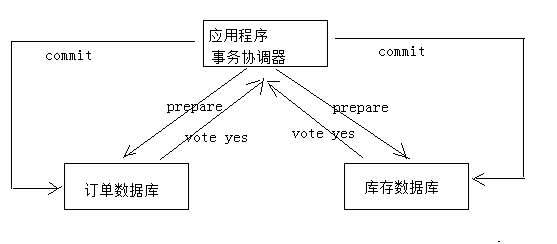

# 分布式事务

## 一、订单与选课需求分析

学成在线的课程分为免费和收费两种。对于收费课程，用户需提交订单并完成支付方可在线学习。
提交订单及支付流程如下：


1、用户提交订单需要先登录系统
2、提交订单，订单信息保存到订单数据库
3、订单支付，调用微信支付接口完成支付
4、完成支付，微信支付系统通知学成在线支付结果
5、学成在线接收到支付结果通知，更新支付结果
提交订单流程：
1、用户进入课程详情页面
2、点击“立即购买”，打开订单确认信息


自动选课需求:

支付成功即完成订单，订单完成之后系统需自动添加选课。
下图是微信支付、学成在线订单服务、学成在线学习服务交互图：


1、用户支付完成，微信支付系统会主动通知学成在线支付结果，学成在线也可主动请求微信支付查询订单的支付
结果。
最终得到支付结果后将订单支付结果保存到订单数据库中。
2、订单支付完成系统自动向选课表添加学生选课记录。
3、选课记录添加完成学习即可在线开始学习。


## 二、分布式事务-问题描述

根据上边的自动选课的需求，分析如下：
用户支付完成会将支付状态及订单状态保存在订单数据库中，由订单服务去维护订单数据库。而学生选课信息在学
习中心数据库，由学习服务去维护学习中心数据库的信息。下图是系统结构图：


如何实现两个分布式服务（订单服务、学习服务）共同完成一件事即订单支付成功自动添加学生选课的需求，这里
的关键是如何保证两个分布式服务的事务的一致性。
尝试解决上边的需求，在订单服务中远程调用选课接口，伪代码如下：

```java
订单支付结果通知方法｛
    更新支付表中支付状态为“成功”。
    远程调用选课接口添加选课记录。
｝
```

上边的逻辑说明：
1、更新支付表状态为本地数据库操作。
2、远程调用选课接口为网络远程调用请求。
3、为保存事务上边两步操作由spring控制事务，当遇到Exception异常则回滚本地数据库操作。
问题如下：
1、如果更新支付表失败则抛出异常，不再执行远程调用，此设想没有问题。
2、如果更新支付表成功，网络远程调用超时会拉长本地数据库事务时间，影响数据库性能。
3、如果更新支付表成功，远程调用添加选课成功（选课数据库commit成功），最后更新支付表commit失败，此
时出现操作不一致。
上边的问题涉及到分布式事务控制。

## 三、分布式事务-分布式事务及相关概念

1、什么是分布式系统？

部署在不同结点上的系统通过网络交互来完成协同工作的系统。

比如：充值加积分的业务，用户在充值系统向自己的账户充钱，在积分系统中自己积分相应的增加。充值系统和积分系统是两个不同的系统，一次充值加积分的业务就需要这两个系统协同工作来完成。

2、什么是事务？

事务是指由一组操作组成的一个工作单元，这个工作单元具有原子性（atomicity）、一致性（consistency）、隔离性（isolation）和持久性（durability）。

原子性：执行单元中的操作要么全部执行成功，要么全部失败。如果有一部分成功一部分失败那么成功的操作要全部回滚到执行前的状态。 

一致性：执行一次事务会使用数据从一个正确的状态转换到另一个正确的状态，执行前后数据都是完整的。

 隔离性：在该事务执行的过程中，任何数据的改变只存在于该事务之中，对外界没有影响，事务与事务之间是完全的隔离的。只有事务提交后其它事务才可以查询到最新的数据。 

持久性：事务完成后对数据的改变会永久性的存储起来，即使发生断电宕机数据依然在。

3、什么是本地事务？

本地事务就是用关系数据库来控制事务，关系数据库通常都具有ACID特性，传统的单体应用通常会将数据全部存储在一个数据库中，会借助关系数据库来完成事务控制。

4、什么是分布式事务？

​	在分布式系统中一次操作由多个系统协同完成，这种一次事务操作涉及多个系统通过网络协同完成的过程称为分布式事务。这里强调的是多个系统通过网络协同完成一个事务的过程，并不强调多个系统访问了不同的数据库，即使多个系统访问的是同一个数据库也是分布式事务，如下图：


另外一种分布式事务的表现是，一个应用程序使用了多个数据源连接了不同的数据库，当一次事务需要操作多个数据源，此时也属于分布式事务，当系统作了数据库拆分后会出现此种情况。


上面两种分布式事务表现形式以第一种据多。

5、分布式事务有哪些场景？

1)  电商系统中的下单扣库存

电商系统中，订单系统和库存系统是两个系统，一次下单的操作由两个系统协同完成

2）金融系统中的银行卡充值

在金融系统中通过银行卡向平台充值需要通过银行系统和金融系统协同完成。

3）教育系统中下单选课业务

在线教育系统中，用户购买课程，下单支付成功后学生选课成功，此事务由订单系统和选课系统协同完成。

4） SNS系统的消息发送

在社交系统中发送站内消息同时发送手机短信，一次消息发送由站内消息系统和手机通信系统协同完成。

## 四、分布式事务-CAP理论


CAP定理又称CAP原则，指的是在一个分布式系统中，Consistency（一致性）、 Availability（可用性）、Partition tolerance（分区容错性），最多只能同时三个特性中的两个，三者不可兼得。

### 1、Consistency (一致性)

​	“all nodes see the same data at the same time”,即更新操作成功并返回客户端后，所有节点在同一时间的数据完全一致，这就是分布式的一致性。一致性的问题在并发系统中不可避免，对于客户端来说，一致性指的是并发访问时更新过的数据如何获取的问题。从服务端来看，则是更新如何复制分布到整个系统，以保证数据最终一致。

### 2、Availability (可用性)

​	可用性指“Reads and writes always succeed”，即服务一直可用，而且是正常响应时间。好的可用性主要是指系统能够很好的为用户服务，不出现用户操作失败或者访问超时等用户体验不好的情况。

### 3、Partition Tolerance (分区容错性)

​	即分布式系统在遇到某节点或网络分区故障的时候，仍然能够对外提供满足一致性和可用性的服务。

​	分区容错性要求能够使应用虽然是一个分布式系统，而看上去却好像是在一个可以运转正常的整体。比如现在的分布式系统中有某一个或者几个机器宕掉了，其他剩下的机器还能够正常运转满足系统需求，对于用户而言并没有什么体验上的影响。


### 4、分布式系统能否兼顾C、A、P？

​	在保证分区容忍性的前提下一致性和可用性无法兼顾，如果要提高系统的可用性就要增加多个结点，如果要保证数据的一致性就要实现每个结点的数据一致，结点越多可用性越好，但是数据一致性越差。

​	所以，在进行分布式系统设计时，同时满足“一致性”、“可用性”和“分区容忍性”三者是几乎不可能的。


### 5、CAP有哪些组合方式？


1、CA：放弃分区容忍性，加强一致性和可用性，关系数据库按照CA进行设计。

2、AP：放弃一致性，加强可用性和分区容忍性，追求最终一致性，很多NoSQL数据库按照AP进行设计。

​	说明：这里放弃一致性是指放弃强一致性，强一致性就是写入成功立刻要查询出最新数据。追求最终一致性是指允许暂时的数据不一致，只要最终在用户接受的时间内数据 一致即可。

3、CP：放弃可用性，加强一致性和分区容忍性，一些强一致性要求的系统按CP进行设计，比如跨行转账，一次转账请求要等待双方银行系统都完成整个事务才算完成。

​	说明：由于网络问题的存在CP系统可能会出现待等待超时，如果没有处理超时问题则整理系统会出现阻塞。

总结：

​	在分布式系统设计中AP的应用较多，即保证分区容忍性和可用性，牺牲数据的强一致性（写操作后立刻读取到最新数据），保证数据最终一致性。比如：订单退款，今日退款成功，明日账户到账，只要在预定的用户可以接受的时间内退款事务走完即可。


### 6、BASE理论

在分布式系统中，我们往往追求的是可用性，它的重要程序比一致性要高，那么如何实现高可用性呢？ 前人已经给我们提出来了另外一个理论，就是BASE理论，它是用来对CAP定理进行进一步扩充的。BASE理论指的是：

- Basically Available（基本可用）
- Soft state（软状态）
- Eventually consistent（最终一致性）

BASE理论是对CAP中的一致性和可用性进行一个权衡的结果，理论的核心思想就是：**我们无法做到强一致，但每个应用都可以根据自身的业务特点，采用适当的方式来使系统达到最终一致性**（Eventual consistency）。


## 五、分布式事务-解决方案


### 1、2PC

在两阶段提交协议中，系统一般包含两类机器（或节点）：一类为协调者（coordinator），通常一个系统中只有一个；另一类为事务参与者（participants，cohorts或workers），一般包含多个，在数据存储系统中可以理解为数据副本的个数。协议中假设每个节点都会记录写前日志（write-ahead log）并持久性存储，即使节点发生故障日志也不会丢失。协议中同时假设节点不会发生永久性故障而且任意两个节点都可以互相通信。


**下单减库存的例子：**





1、应用程序连接两个数据源。

2、应用程序通过事务协调器向两个库发起prepare，两个数据库收到消息分别执行本地事务（记录日志），但不提交，如果执行成功则回复yes，否则回复no。

3、事务协调器收到回复，只要有一方回复no则分别向参与者发起回滚事务，参与者开始回滚事务。

4、事务协调器收到回复，全部回复yes，此时向参与者发起提交事务。如果参与者有一方提交事务失败则由事务协调器发起回滚事务。

 

2PC的优点：实现强一致性，部分关系数据库支持（Oracle、MySQL等）。

缺点：整个事务的执行需要由协调者在多个节点之间去协调，增加了事务的执行时间，性能低下。

3PC主要是解决协调者与参与者通信阻塞问题而产生的，它比2PC传递的消息还要多，性能不高。


### 2、事务补偿（TCC）


TCC事务补偿是基于2PC实现的业务层事务控制方案，它是Try、Confirm和Cancel三个单词的首字母，含义如下：

1、Try 检查及预留业务资源

​	完成提交事务前的检查，并预留好资源。

2、Confirm 确定执行业务操作

​	对try阶段预留的资源正式执行。

3、Cancel 取消执行业务操作

​	对try阶段预留的资源释放。


下边用一个下单减库存的业务为例来说明：


1、Try

下单业务由订单服务和库存服务协同完成，在try阶段订单服务和库存服务完成检查和预留资源。

订单服务检查当前是否满足提交订单的条件（比如：当前存在未完成订单的不允许提交新订单）。

库存服务检查当前是否有充足的库存，并锁定资源。

2、Confirm

订单服务和库存服务成功完成Try后开始正式执行资源操作。

订单服务向订单写一条订单信息。

库存服务减去库存。

3、Cancel

如果订单服务和库存服务有一方出现失败则全部取消操作。

订单服务需要删除新增的订单信息。

库存服务将减去的库存再还原。

 

优点：最终保证数据的一致性，在业务层实现事务控制，灵活性好。

缺点：开发成本高，每个事务操作每个参与者都需要实现try/confirm/cancel三个接口。

 

注意：TCC的try/confirm/cancel接口都要实现幂等性，在为在try、confirm、cancel失败后要不断重试。

什么是幂等性？

​	幂等性是指同一个操作无论请求多少次，其结果都相同。

幂等操作实现方式有：

1、操作之前在业务方法进行判断如果执行过了就不再执行。

2、缓存所有请求和处理的结果，已经处理的请求则直接返回结果。

3、在数据库表中加一个状态字段（未处理，已处理），数据操作时判断未处理时再处理。


### 3、消息队列实现最终一致

本方案是将分布式事务拆分成多个本地事务来完成，并且由消息队列异步协调完成，如下图：

下边以下单减少库存为例来说明：


1、订单服务和库存服务完成检查和预留资源。

2、订单服务在本地事务中完成添加订单表记录和添加“减少库存任务消息”。

3、由定时任务根据消息表的记录发送给MQ通知库存服务执行减库存操作。

4、库存服务执行减少库存，并且记录执行消息状态（为避免重复执行消息，在执行减库存之前查询是否执行过此消息）。

5、库存服务向MQ发送完成减少库存的消息。

6、订单服务接收到完成库存减少的消息后删除原来添加的“减少库存任务消息”。

实现最终事务一致要求：预留资源成功理论上要求正式执行成功，如果执行失败会进行重试，要求业务执行方法实现幂等。

 

优点 ：

由MQ按异步的方式协调完成事务，性能较高。

不用实现try/confirm/cancel接口，开发成本比TCC低。

缺点：

此方式基于关系数据库本地事务来实现，会出现频繁读写数据库记录，浪费数据库资源，另外对于高并发操作不是最佳方案。


### 4、路由模式


路由模式：

1、每个消费者监听自己的队列，并且设置routingkey。

2、生产者将消息发给交换机，由交换机根据routingkey来转发消息到指定的队列。


## 六、自动添加选课方案-搭建订单工程

### 1、导入订单工程


### 2、xc_order数据库

导入`xc_order.sql`文件。


### 3、xc_learning数据库


## 七、自动添加选课方案-解决方案分析


1、支付成功后，订单服务向本地数据库更新订单状态并向消息表(xc_task)写入“添加选课消息”，通过本地数据库保证订单状态和添加选课消息的事务。

2、定时任务(SpringTask)扫描消息表(xc_task)，取出“添加选课任务“并发向MQ。

3、学习服务接收到添加选课的消息，先查询本地数据库(xc_learning)的历史消息表(xc_task_his)是否存在消息，存在则说明已经添加选课，否则向本地数据库添加选课(xc_learning_course)，并向历史消息表(xc_task_his)添加选课消息。这里选课表和历史消息表在同一个数据库，通过本地事务保证。

4、学习服务接收到添加选课的消息，通过查询消息表判断如果已经添加选课也向MQ发送“完成添加选课任务的消息”，否则则添加选课，完成后向MQ发送“完成添加选课任务的消息”，

5、订单服务接收到完成选课的消息后删除订单数据库中消息表的“添加选课消息”，为保证后期对账将消息表的消息先添加到历史消息表再删除消息，表示此消息已经完成。


## 八、Spring Task定时任务-串行任务


根据分布式事务的研究结果，订单服务需要定时扫描任务表向MQ发送任务。本节研究定时任务处理的方案，并实现定时任务扫描任务表并向MQ发送消息。

实现定时任务的方案如下：

1、使用jdk的Timer和TimerTask实现

可以实现简单的间隔执行任务，无法实现按日历去调度执行任务。

2、使用Quartz实现

Quartz 是一个异步任务调度框架，功能丰富，可以实现按日历调度。

3、使用Spring Task实现

Spring 3.0后提供Spring Task实现任务调度，支持按日历调度，相比Quartz功能稍简单，但是在开发基本够用，支持注解编程方式。

 

本项目使用Spring Task实现任务调度。


```java
@Component
public class ChooseCourseTask {
    private static final Logger LOGGER = LoggerFactory.getLogger(ChooseCourseTask.class);
    
//    @Scheduled(fixedRate = 5000) //上次执行开始时间后5秒执行
//    @Scheduled(fixedDelay = 5000)  //上次执行完毕后5秒执行
//    @Scheduled(initialDelay=3000, fixedRate=5000) //第一次延迟3秒，以后每隔5秒执行一次
    @Scheduled(cron="0/3 * * * * *")//每隔3秒执行一次
    public void task1(){
        LOGGER.info("===============测试定时任务1开始===============");
        try {
            Thread.sleep(5000);
        } catch (InterruptedException e) {
            e.printStackTrace();
        }
        LOGGER.info("===============测试定时任务1结束===============");
    }
    
```


注意还要在启动类上面加上: `@EnableScheduling`注解

## 九、Spring Task定时任务-cron表达式


cron表达式包括6部分：

- 秒（0~59） 　　
- 分钟（0~59） 　　
- 小时（0~23） 　　
- 月中的天（1~31） 　　
- 月（1~12） 　　
- 周中的天（填写MON，TUE，WED，THU，FRI，SAT,SUN，或数字1~7 1表示MON，依次类推）


特殊字符介绍：

- “/”字符表示指定数值的增量
- “*”字符表示所有可能的值
- “-”字符表示区间范围
- "," 字符表示列举
- “？”字符仅被用于月中的天和周中的天两个子表达式，表示不指定值

 

例子：

- 0/3 * * * * *				每隔3秒执行
- 0 0/5 * * * *				每隔5分钟执行
- 0 0 0 * * *				表示每天0点执行
- 0 0 12 ? * WEN			每周三12点执行
- 0 15 10 ? * MON-FRI		每月的周一到周五10点 15分执行
- 0 15 10 ? * MON,FRI		每月的周一和周五10点 15分执行


在线表达式生成器

http://cron.qqe2.com/


## 十、Spring Task定时任务-并行任务

在项目通常是需要多个不同的任务并行去执行。

本节实现Spring Task并行执行任务的方法。

```java
@Configuration
@EnableScheduling
public class AsyncTaskConfig implements SchedulingConfigurer, AsyncConfigurer {
    //线程池线程数量
    private int corePoolSize = 5;

    @Bean
    public ThreadPoolTaskScheduler taskScheduler()
    {
        ThreadPoolTaskScheduler scheduler = new ThreadPoolTaskScheduler();
        scheduler.initialize();//初始化线程池
        scheduler.setPoolSize(corePoolSize);//线程池容量
        return scheduler;
    }

    @Override
    public Executor getAsyncExecutor() {
        Executor executor = taskScheduler();
        return executor;
    }

    @Override
    public AsyncUncaughtExceptionHandler getAsyncUncaughtExceptionHandler() {
        return null;
    }

    @Override
    public void configureTasks(ScheduledTaskRegistrar scheduledTaskRegistrar) {
        scheduledTaskRegistrar.setTaskScheduler(taskScheduler());
    }
}
```


## 十一、订单服务定时发送消息-需求分析

**定时任务发送消息流程如下**：


1、定时任务每隔1分钟扫描一次任务表`xc_task`，一次取出超过1分钟未处理的任务

2、考虑订单服务可能集群部署，为避免重复发送任务使用==乐观锁==的方式每次从任务列表取出要处理的任务

3、任务发送完毕更新任务发送时间


**关于任务表的添加：**

正常的流程是订单支付成功向更新订单支付状态并向任务表写入“添加选课任务”。

目前订单支付功能没有开发，采用手动向任务表添加任务。


**注意**:

任务要和订单进行关联, 我们可以采用订单ID作为任务的ID


```sql
INSERT INTO `xc_task` ( `id`, `create_time`, `update_time`, `delete_time`, `task_type`, `mq_exchange`, `mq_routingkey`, `request_body`, `version`, `status`, `errormsg` )
VALUES
	( '10', '2018-04-04 22:58:20', '2018-04-04 22:58:54', '2018-04-04 22:58:55', NULL, NULL, NULL, '{\"userId\":\"49\",\"courseId\":\"4028e581617f945f01617f9dabc40000\"}', 1, NULL, NULL );
```


```java
package com.xuecheng.order.config;

import org.springframework.amqp.core.*;
import org.springframework.beans.factory.annotation.Qualifier;
import org.springframework.context.annotation.Bean;
import org.springframework.context.annotation.Configuration;

@Configuration
public class RabbitMQConfig {

    //添加选课任务交换机
    public static final String EX_LEARNING_ADDCHOOSECOURSE = "ex_learning_addchoosecourse";

    //完成添加选课消息队列
    public static final String XC_LEARNING_FINISHADDCHOOSECOURSE = "xc_learning_finishaddchoosecourse";

    //添加选课消息队列
    public static final String XC_LEARNING_ADDCHOOSECOURSE = "xc_learning_addchoosecourse";

    //添加选课路由key
    public static final String XC_LEARNING_ADDCHOOSECOURSE_KEY = "addchoosecourse";

    //完成添加选课路由key
    public static final String XC_LEARNING_FINISHADDCHOOSECOURSE_KEY = "finishaddchoosecourse";

    /**
     * 交换机配置
     * @return the exchange
     */
    @Bean(EX_LEARNING_ADDCHOOSECOURSE)
    public Exchange EX_DECLARE() {
        return ExchangeBuilder.directExchange(EX_LEARNING_ADDCHOOSECOURSE).durable(true).build();
    }
    //声明队列 完成添加选课队列
    @Bean(XC_LEARNING_FINISHADDCHOOSECOURSE)
    public Queue QUEUE_DECLARE() {
        Queue queue = new Queue(XC_LEARNING_FINISHADDCHOOSECOURSE,true,false,true);
        return queue;
    }

    //声明队列 添加选课队列
    @Bean(XC_LEARNING_ADDCHOOSECOURSE)
    public Queue QUEUE_DECLARE_2() {
        Queue queue = new Queue(XC_LEARNING_ADDCHOOSECOURSE,true,false,true);
        return queue;
    }
    /**
     * 绑定 完成添加选课队列到交换机 .
     * @param queue    the queue
     * @param exchange the exchange
     * @return the binding
     */
    @Bean
    public Binding binding_finishaddchoose_processtask(@Qualifier("xc_learning_finishaddchoosecourse") Queue queue, @Qualifier(EX_LEARNING_ADDCHOOSECOURSE) Exchange exchange) {
        return BindingBuilder.bind(queue).to(exchange).with(XC_LEARNING_FINISHADDCHOOSECOURSE_KEY).noargs();
    }
    /**
     * 绑定 添加选课队列到交换机 .
     * @param queue    the queue
     * @param exchange the exchange
     * @return the binding
     */
    @Bean
    public Binding binding_addchoose_processtask(@Qualifier("xc_learning_addchoosecourse") Queue queue, @Qualifier(EX_LEARNING_ADDCHOOSECOURSE) Exchange exchange) {
        return BindingBuilder.bind(queue).to(exchange).with(XC_LEARNING_ADDCHOOSECOURSE_KEY).noargs();
    }

}

```


## 十二、订单服务定时发送消息-查询前N条任务


```java
public interface XcTaskRepository extends JpaRepository<XcTask, String> {

    /**
     * 查询某个时间之间的前n条任务
     * 建议每个任务最多发3-5次,过多发送会浪费资源.如果反复失败,考虑人工处理
     *
     * @param pageable   分页对象,只取时间最久的数据
     * @param updateTime 记录每次读取到任务的时间
     * @return
     */

    Page<XcTask> findByUpdateTimeBefore(Pageable pageable, Date updateTime);

    Page<XcTask> findByUpdateTimeBeforeOrderByUpdateTimeDesc(Pageable pageable, Date updateTime);

    Page<XcTask> findByUpdateTimeBeforeAndVersionIsLessThanEqual(Pageable pageable, Date updateTime, Integer version);

}
 
   
```


```java
@Service
public class TaskService {

    @Autowired
    XcTaskRepository xcTaskRepository;

    //查询前n条任务
    public List<XcTask> findXcTaskList(Date updateTime, int size) {

        // 按照时间降序排序
        Sort sort = new Sort(Sort.Direction.DESC, "updateTime");
        //设置分页参数
        Pageable pageable = PageRequest.of(0, size, sort);

        //查询前n条任务
        Page<XcTask> all = xcTaskRepository.findByUpdateTimeBefore(pageable, updateTime);

        List<XcTask> contentList = all.getContent();

        return contentList;
    }

}
 
```


## 十三、订单服务定时发送消息-查询前N条任务-测试

启动测试:


## 十四、订单服务定时发送消息-定时发送任务

这里主要是要更新`updateTime`:

DAO:

```java
// 更新updateTime
@Modifying
@Query("update XcTask t set t.updateTime = :updateTime where t.id = :id")
int updateTaskTime(@Param("id") String id, @Param("updateTime") Date updateTime);
```

Service:

```java

@Service
public class TaskService {

    @Autowired
    XcTaskRepository xcTaskRepository;

    @Autowired
    RabbitTemplate rabbitTemplate;

    //发布消息 (RabbitMQ)
    public void publish(XcTask xcTask, String ex, String routingKey){
        //更新时间
        Optional<XcTask> optionalXcTask = xcTaskRepository.findById(xcTask.getId());
        if(optionalXcTask.isPresent()){
            rabbitTemplate.convertAndSend(ex, routingKey, xcTask);
            XcTask one = optionalXcTask.get();
            one.setUpdateTime(new Date()); //更新时间
            xcTaskRepository.save(one);
        }
    }
}
```

在Task里面需要对查询到的tasks进行消息发送:

```java
@Component
public class ChooseCourseTask {

    private final Logger log = LoggerFactory.getLogger(this.getClass());

    @Autowired
    TaskService taskService;

    @Scheduled(cron = "0/3 * * * * *")
    //每隔一分钟扫描消息表，向MQ发送消息
    public void sendChoosecourseTask(){
        //取出当前时间一分钟之前的时间
        Calendar calendar = new GregorianCalendar();
        calendar.setTime(new Date());
        calendar.add(GregorianCalendar.MINUTE , -1); //当前时间一分钟之前(前面的)时间
        Date time = calendar.getTime();
        List<XcTask> xcTaskList = taskService.findXcTaskList(time, 100);//前100
//        System.out.println(xcTaskList);
        for(XcTask xcTask : xcTaskList ){
            String ex = xcTask.getMqExchange();
            String routingKey = xcTask.getMqRoutingkey();
            taskService.publish(xcTask, ex, routingKey); //发送消息
        }
    }
}

```


## 十五、订单服务定时发送消息-定时发送任务-测试


## 十六、订单服务定时发送消息-乐观锁取任务


考虑订单服务将来会集群部署，为了避免任务在1分钟内重复执行，这里使用乐观锁，实现思路如下：

1) 每次取任务时判断当前版本及任务id是否匹配，如果匹配则执行任务，如果不匹配则取消执行。

2) 如果当前版本和任务Id可以匹配到任务则更新当前版本加1.


1、在Dao中增加校验当前版本及任务id的匹配方法

```java
public interface XcTaskRepository extends JpaRepository<XcTask, String> {
    //使用乐观锁方式校验任务id和版本号是否匹配，匹配则版本号加1
    @Modifying
    @Query("update XcTask t set t.version = :version+1  where t.id = :id and t.version = :version")
    public int updateTaskVersion(@Param(value = "id") String id,@Param(value = "version") int version);
    ...
```


2、在service中增加方法，使用乐观锁方法校验任务

```java
@Transactional
public int getTask(String taskId,int version){
    int i = xcTaskRepository.updateTaskVersion(taskId, version);
    return i;
}
```


3、执行任务类中修改

```java
//每隔一分钟扫描消息表，向MQ发送消息
public void sendChoosecourseTask(){
    //取出当前时间一分钟之前的时间
    Calendar calendar = new GregorianCalendar();
    calendar.setTime(new Date());
    calendar.add(GregorianCalendar.MINUTE , -1); //当前时间一分钟之前(前面的)时间
    Date time = calendar.getTime();
    List<XcTask> xcTaskList = taskService.findXcTaskList(time, 100);//前100
    //        System.out.println(xcTaskList);
    for(XcTask xcTask : xcTaskList ){
        String ex = xcTask.getMqExchange();
        String routingKey = xcTask.getMqRoutingkey();

        //调用乐观锁方法校验任务是否可以执行 (版本号方式)
        if(taskService.getTask(xcTask.getId(), xcTask.getVersion()) > 0){
            //发送选课消息
            taskService.publish(xcTask, ex, routingKey);
            log.info("send choose course task id:{}", xcTask.getId());
        }
    }
}
```


### 1、MySQL中乐观锁和悲观锁 原理、区别

​	悲观锁(Pessimistic Lock), 顾名思义，就是很悲观，每次去拿数据的时候都认为别人会修改，所以每次在拿数据的时候都会上锁，这样别人想拿这个数据就会block直到它拿到锁。传统的关系型数据库里边就用到了很多这种锁机制，比如行锁，表锁等，读锁，写锁等，都是在做操作之前先上锁。 

​	乐观锁(Optimistic Lock), 顾名思义，就是很乐观，每次去拿数据的时候都认为别人不会修改，所以不会上锁，但是在更新的时候会判断一下在此期间别人有没有去更新这个数据，可以使用版本号等机制。乐观锁适用于多读的应用类型，这样可以提高吞吐量，像数据库如果提供类似于write_condition机制的其实都是提供的乐观锁。 

​	两种锁各有优缺点，不可认为一种好于另一种，像乐观锁适用于写比较少的情况下，即冲突真的很少发生的时候，这样可以省去了锁的开销，加大了系统的整个吞吐量。但如果经常产生冲突，上层应用会不断的进行retry，这样反倒是降低了性能，所以这种情况下用悲观锁就比较合适。　　


## 十七、自动添加选课开发-学习服务添加选课

学习服务接收MQ发送添加选课消息，执行添加 选 课操作。

添加选课成功向学生选课表插入记录、向历史任务表插入记录、并向MQ发送“完成选课”消息。

```java
/**
     * 添加选课
     *
     * 1. 首先判断任务是否已经在历史任务表中
     *
     * 2. 如果已经存在,那么直接发送mq消息即可
     *
     * 3. 如果不存在,那么进行选课,并且加入历史任务(控制本地事务)
     *
     */

@Transactional
public ResponseResult addcourse(String userId, String courseId, String valid, Date startTime, Date endTime, XcTask xcTask){
    if (StringUtils.isEmpty(courseId)) {
        ExceptionCast.cast(LearningCode.LEARNING_GETMEDIA_ERROR);
    }
    //        if (StringUtils.isEmpty(userId)) {
    //            ExceptionCast.cast(LearningCode.CHOOSECOURSE_USERISNULl);
    //        }
    //        if(xcTask == null || StringUtils.isEmpty(xcTask.getId())){
    //            ExceptionCast.cast(LearningCode.CHOOSECOURSE_TASKISNULL);
    //        }
    XcLearningCourse xcLearningCourse = xcLearningCourseRepository.findByUserIdAndCourseId(userId, courseId);

    if(xcLearningCourse!=null){
        //更新选课记录
        //课程的开始时间
        xcLearningCourse.setStartTime(startTime);
        xcLearningCourse.setEndTime(endTime);
        xcLearningCourse.setStatus("501001");
        xcLearningCourseRepository.save(xcLearningCourse);
    }else{
        //添加新的选课记录
        xcLearningCourse = new XcLearningCourse();
        xcLearningCourse.setUserId(userId);
        xcLearningCourse.setCourseId(courseId);
        xcLearningCourse.setStartTime(startTime);
        xcLearningCourse.setEndTime(endTime);
        xcLearningCourse.setStatus("501001");
        xcLearningCourseRepository.save(xcLearningCourse);

    }

    //向历史任务表播入记录
    Optional<XcTaskHis> optional = xcTaskHisRepository.findById(xcTask.getId());
    if(!optional.isPresent()){
        //添加历史任务
        XcTaskHis xcTaskHis = new XcTaskHis();
        BeanUtils.copyProperties(xcTask,xcTaskHis);
        xcTaskHisRepository.save(xcTaskHis);
    }
    return new ResponseResult(CommonCode.SUCCESS);
}
```


## 十八、自动添加选课开发-学习服务添加选课-接收添加选课消息 

向xc_learning_course添加记录，为保证不重复添加选课，先查询历史任务表，如果从历史任务表查询不到任务说明此任务还没有处理，此时则添加选课并添加历史任务。


## 十九、自动添加选课开发-学习服务添加选课-测试


## 二十、自动添加选课开发-订单服务结束任务

订单服务接收MQ完成选课的消息，将任务从当前任务表删除，将完成的任务添加到完成任务表。

1、删除`xc_task`

2、添加`xc_task_his`

## 二十一、自动添加选课开发-集成测试

测试流程如下：

1、手动向任务表添加一条任务。

2、启动rabbitMQ.

3、启动订单服务、选课服务。

4、观察日志是否添加选课成功

完成任务后将xc_task任务移动到`xc_task_his`表中

完成任务后在选课表中多了一条学生选课记录

 

测试消息重复消费：

1、手动向任务表添加一条任务。

2、启动rabbitMQ.

3、先启动订单表，等待消息队列是否积累了多个消息。

4、再启动选课服务，观察是否重复添加选课

 


亲测没毛病。