# Devops 项目总结

## 一、devops介绍 


​	DevOps（Development和Operations的组合词）是一组过程、方法与系统的统称，用于促进开发（应用程序/软件工程）、技术运营和质量保障（QA）部门之间的沟通、协作与整合。
​	它是一种重视“软件开发人员（Dev）”和“IT运维技术人员（Ops）”之间沟通合作的文化、运动或惯例。透过自动化“软件交付”和“架构变更”的流程，来使得构建、测试、发布软件能够更加地快捷、频繁和可靠。
​	它的出现是由于软件行业日益清晰地认识到：为了按时交付软件产品和服务，开发和运营工作必须紧密合作。


​	DevOps是一种方法或理念，它涵盖开发、测试、运维的整个过程。DevOps是提高软件开发、测试、运维、运营等各部门的沟通与协作质量的方法和过程，DevOps强调软件开发人员与软件测试、软件运维、质量保障（QA）部门之间有效的沟通与协作，强调通过自动化的方法去管理软件变更、软件集成，使软件从构建到测试、发布更加快捷、可靠，最终按时交付软件。

​	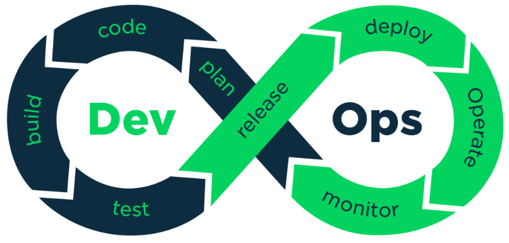


**DevOps工具链**

​	DevOps兴起于2009年，近年来由于云计算、互联网的发展，促进了DevOps的基础设施及工具链的发展，涌现了一大批优秀的工具，这些工具包括开发、测试、运维的各各领域，例如：GitHub、Git/SVN、Docker、Jenkins、Hudson、Ant/Maven/Gradle、Selenium、QUnit、JMeter等。下图是DevOps相关的工具集：


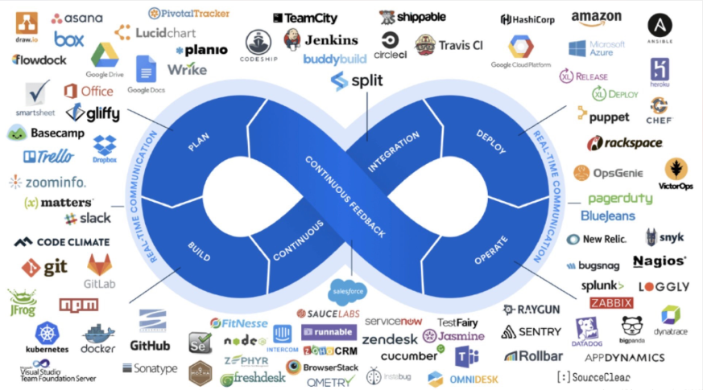


## 二、Git&GitLab-在GitLab创建项目

以下环境在我的虚拟机(`192.168.142.222`下进行)

安装Docker:

https://www.cnblogs.com/yufeng218/p/8370670.html

https://blog.csdn.net/jiang_shikui/article/details/85047293  (Good)

安装指定版本命令: `yum install docker-ce-18.06.1.ce -y`


启动docker:

`systemctl start docker`:


配置阿里的镜像:

先申请镜像加速器:

https://cr.console.aliyun.com/undefined/instances/mirrors

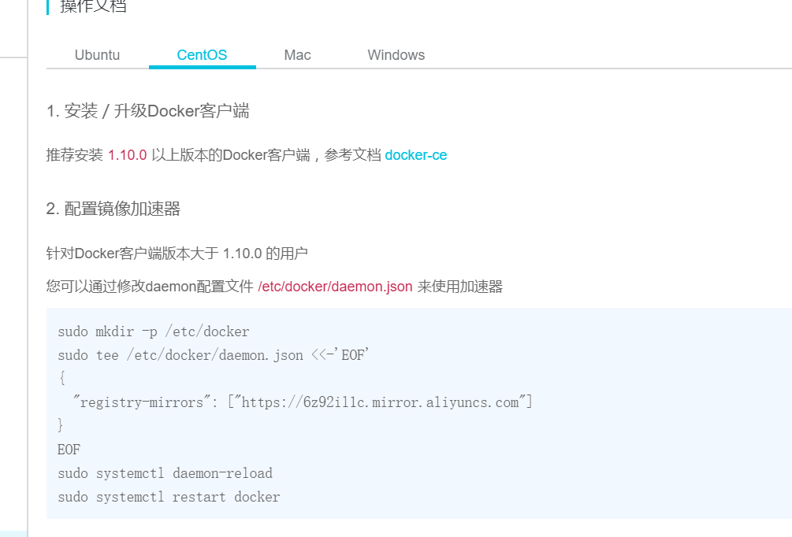

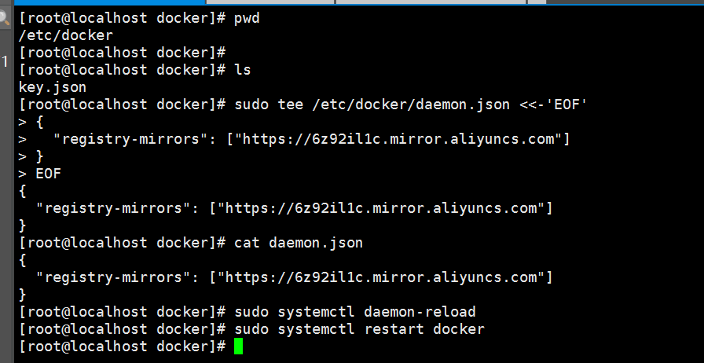


拉取`gitlab、redis、postgresql`，gitlab依赖redis和postgresql。

```	shell
docker pull sameersbn/redis
docker pull sameersbn/postgresql
docker pull gitlab/gitlab-ce:latest
```

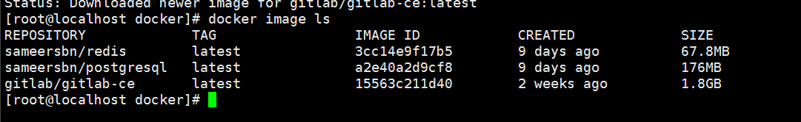


创建postgresql容器:

```dockerfile
docker run --name postgresql -d --privileged=true -e 'DB_NAME=gitlabhq_production' -e 'DB_USER=gitlab' -e 'DB_PASS=password' -e 'DB_EXTENSION=pg_trgm' -v /home/root/opt/postgresql/data:/var/lib/postgresql sameersbn/postgresql
```

创建redis容器:

```dockerfile
docker run --name redis -d --privileged=true -v /home/root/opt/redis/data:/var/lib/redis sameersbn/redis
```

创建gitlab容器:

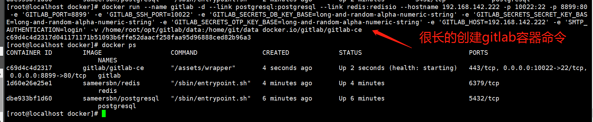

```dockerfile
docker run --name gitlab -d --link postgresql:postgresql --link redis:redisio --hostname 192.168.142.222 -p 10022:22 -p 8899:80 -e 'GITLAB_PORT=8899' -e 'GITLAB_SSH_PORT=10022' -e 'GITLAB_SECRETS_DB_KEY_BASE=long-and-random-alpha-numeric-string' -e 'GITLAB_SECRETS_SECRET_KEY_BASE=long-and-random-alpha-numeric-string' -e 'GITLAB_SECRETS_OTP_KEY_BASE=long-and-random-alpha-numeric-string' -e 'GITLAB_HOST=192.168.142.222' -e 'SMTP_AUTHENTICATION=login' -v /home/root/opt/gitlab/data:/home/git/data docker.io/gitlab/gitlab-ce
```


访问: http://192.168.142.222:8899/

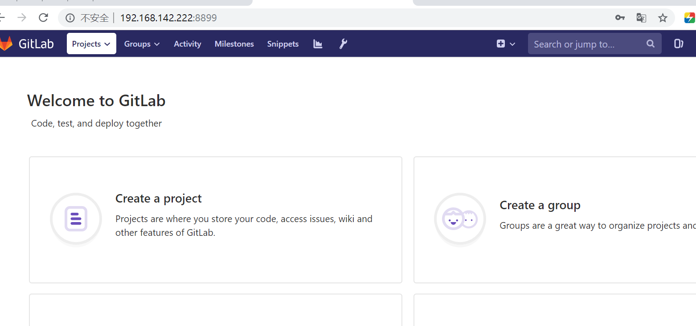


这里有个问题，就是之前启动过一次之前的容器(长的命令)，这次不能再用之前的命令启动了。而是直接使用`docker start ID`来启动即可。

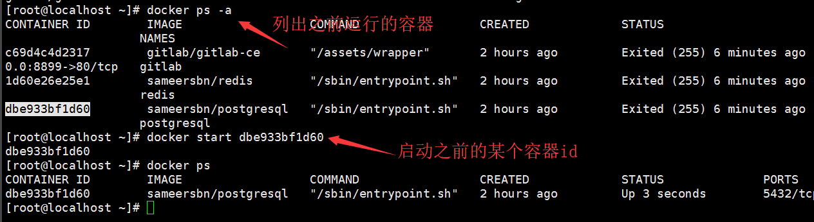


## 三、Git&GitLab-使用Git管理项目

给gitlab添加`.ssh`下的sshkey。

## 四、Docker-Docker介绍

## 五、Docker-部署微服务到Docker

## 六、Docker-部署微服务到Docker-maven构建镜像

1、使用maven的打包插件：
将下边的插件依赖拷贝到微服务工程中，本例子将学成在线的Eureka工程打包：

```xml
<build>
    <plugins>
        <plugin>
            <groupId>org.springframework.boot</groupId>
            <artifactId>spring-boot-maven-plugin</artifactId>
        </plugin>
    </plugins>
</build>
```

在工程目录运行：mvn clear package
或通过IDEA执行clear package打包命令。
打包成功，如下图：
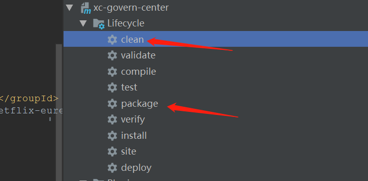

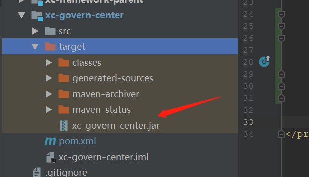


上传到安装有Docker的linux环境下:


编写DockerFile:

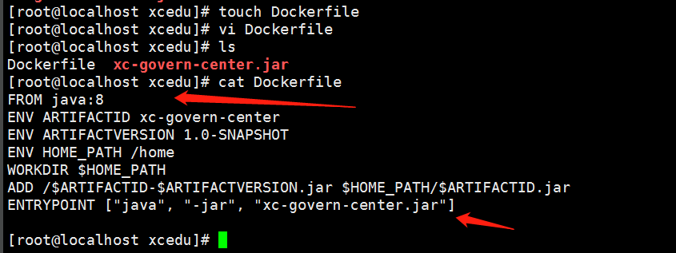


运行命令:

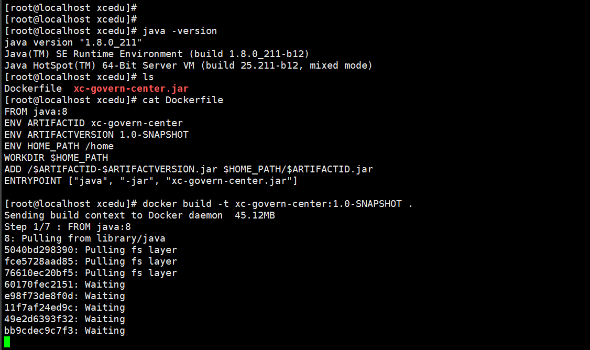


## 七、持续集成-持续集成介绍

## 八、持续集成-搭建环境

## 九、持续集成-持续集成任务测试

## 十、持续集成-自动构建

## 十一、项目总结-项目背景

## 十二、项目总结-项目功能模块

## 十三、项目总结-项目技术架构-整体架构图

## 十四、项目总结-项目技术架构-微服务技术栈


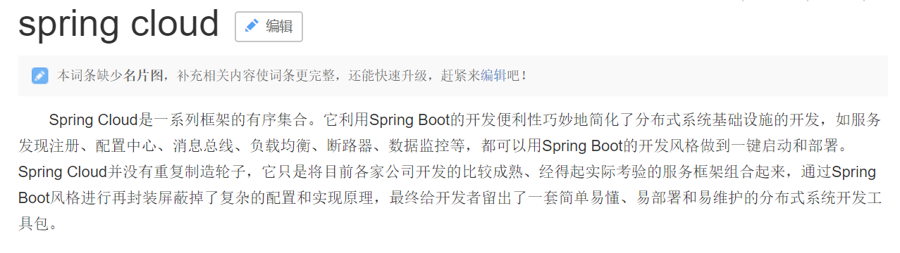


## 十五、项目总结-项目技术架构-接口定义规范

## 十六、项目总结-项目技术架构-注册中心和网关

## 十七、项目总结-项目技术架构-其它问题

## 十八、项目总结-前后端开发流程及前端技术栈 

## 十九、项目总结-CMS页面管理及相关技术点

## 二十、项目总结-课程管理及相关技术点

## 二十一、项目总结-媒资管理及相关技术点

## 二十二、项目总结-课程搜索流程

## 二十三、项目总结-图片服务器

## 二十四、项目总结-认证和授权流程

## 二十五、项目总结-异常处理流程

## 二十六、项目总结-事务及分布式事务控制


## 二十七、其他

### 1、熔断器Hystrix


### 2、为什么要使用熔断器


 在微服务架构中通常会有多个服务层调用，基础服务的故障可能会导致级联故障，进而造成整个系统不可用的情况，这种现象被称为服务雪崩效应。服务雪崩效应是一种因“服务提供者”的不可用导致“服务消费者”的不可用,并将不可用逐渐放大的过程。
​ 如果下图所示：A作为服务提供者，B为A的服务消费者，C和D是B的服务消费者。A不可用引起了B的不可用，并将不可用像滚雪球一样放大到C和D时，雪崩效应就形成了。

### 3、什么是Hystrix

 Hystrix 能使你的系统在出现依赖服务失效的时候，通过隔离系统所依赖的服务，防止服务级联失败，同时提供失败回退机制，更优雅地应对失效，并使你的系统能更快地从异常中恢复。


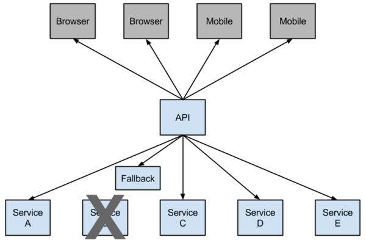