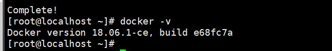

# Devops 项目总结

## 一、devops介绍 


​	DevOps（Development和Operations的组合词）是一组过程、方法与系统的统称，用于促进开发（应用程序/软件工程）、技术运营和质量保障（QA）部门之间的沟通、协作与整合。
​	它是一种重视“软件开发人员（Dev）”和“IT运维技术人员（Ops）”之间沟通合作的文化、运动或惯例。透过自动化“软件交付”和“架构变更”的流程，来使得构建、测试、发布软件能够更加地快捷、频繁和可靠。
​	它的出现是由于软件行业日益清晰地认识到：为了按时交付软件产品和服务，开发和运营工作必须紧密合作。


​	DevOps是一种方法或理念，它涵盖开发、测试、运维的整个过程。DevOps是提高软件开发、测试、运维、运营等各部门的沟通与协作质量的方法和过程，DevOps强调软件开发人员与软件测试、软件运维、质量保障（QA）部门之间有效的沟通与协作，强调通过自动化的方法去管理软件变更、软件集成，使软件从构建到测试、发布更加快捷、可靠，最终按时交付软件。

​	


**DevOps工具链**

​	DevOps兴起于2009年，近年来由于云计算、互联网的发展，促进了DevOps的基础设施及工具链的发展，涌现了一大批优秀的工具，这些工具包括开发、测试、运维的各各领域，例如：GitHub、Git/SVN、Docker、Jenkins、Hudson、Ant/Maven/Gradle、Selenium、QUnit、JMeter等。下图是DevOps相关的工具集：


## 二、Git&GitLab-在GitLab创建项目

以下环境在我的虚拟机(`192.168.142.222`下进行)

安装Docker:

https://www.cnblogs.com/yufeng218/p/8370670.html

https://blog.csdn.net/jiang_shikui/article/details/85047293  (Good)

安装指定版本命令: `yum install docker-ce-18.06.1.ce -y`



启动docker:

`systemctl start docker`:


配置阿里的镜像:

先申请镜像加速器:

https://cr.console.aliyun.com/undefined/instances/mirrors


拉取`gitlab、redis、postgresql`，gitlab依赖redis和postgresql。

```	shell
docker pull sameersbn/redis
docker pull sameersbn/postgresql
docker pull gitlab/gitlab-ce:latest
```


创建postgresql容器:

```dockerfile
docker run --name postgresql -d --privileged=true -e 'DB_NAME=gitlabhq_production' -e 'DB_USER=gitlab' -e 'DB_PASS=password' -e 'DB_EXTENSION=pg_trgm' -v /home/root/opt/postgresql/data:/var/lib/postgresql sameersbn/postgresql
```

创建redis容器:

```dockerfile
docker run --name redis -d --privileged=true -v /home/root/opt/redis/data:/var/lib/redis sameersbn/redis
```

创建gitlab容器:


```dockerfile
docker run --name gitlab -d --link postgresql:postgresql --link redis:redisio --hostname 192.168.142.222 -p 10022:22 -p 8899:80 -e 'GITLAB_PORT=8899' -e 'GITLAB_SSH_PORT=10022' -e 'GITLAB_SECRETS_DB_KEY_BASE=long-and-random-alpha-numeric-string' -e 'GITLAB_SECRETS_SECRET_KEY_BASE=long-and-random-alpha-numeric-string' -e 'GITLAB_SECRETS_OTP_KEY_BASE=long-and-random-alpha-numeric-string' -e 'GITLAB_HOST=192.168.142.222' -e 'SMTP_AUTHENTICATION=login' -v /home/root/opt/gitlab/data:/home/git/data docker.io/gitlab/gitlab-ce
```


访问: http://192.168.142.222:8899/


这里有个问题，就是之前启动过一次之前的容器(长的命令)，这次不能再用之前的命令启动了。而是直接使用`docker start ID`来启动即可。


## 三、Git&GitLab-使用Git管理项目

给gitlab添加`.ssh`下的sshkey。

## 四、Docker-Docker介绍

## 五、Docker-部署微服务到Docker

## 六、Docker-部署微服务到Docker-maven构建镜像

1、使用maven的打包插件：
将下边的插件依赖拷贝到微服务工程中，本例子将学成在线的Eureka工程打包：

```xml
<build>
    <plugins>
        <plugin>
            <groupId>org.springframework.boot</groupId>
            <artifactId>spring-boot-maven-plugin</artifactId>
        </plugin>
    </plugins>
</build>
```

在工程目录运行：mvn clear package
或通过IDEA执行clear package打包命令。
打包成功，如下图：


上传到安装有Docker的linux环境下:


编写DockerFile:


运行命令:


## 七、持续集成-持续集成介绍

## 八、持续集成-搭建环境

## 九、持续集成-持续集成任务测试

## 十、持续集成-自动构建

## 十一、项目总结-项目背景

## 十二、项目总结-项目功能模块

## 十三、项目总结-项目技术架构-整体架构图

## 十四、项目总结-项目技术架构-微服务技术栈

## 十五、项目总结-项目技术架构-接口定义规范

## 十六、项目总结-项目技术架构-注册中心和网关

网关的作用是负载均衡、路由转发、请求过虑等。
项目中网关与Nginx配合使用。


## 十七、项目总结-项目技术架构-其它问题

**雪崩**:

微服务的雪崩效应表现在服务与服务之间调用，当其中一个服务无法提供服务可能导致其它服务也死掉，比如：单
点登录服务调用用户信息服务查询用户信息，由于用户信息服务无法提供服务导致单点登录服务一直等待，从而导
致用户登录、用户退出功能无法使用，像这样由一个服务所引起的一连串的多个服务无法提供服务即是微服务的雪
崩效应。


Spring Cloud Hystrix 是基于Netflix的开源框架Hystrix的整合，它实现了断路保护、线程隔离、信号隔离等容错
功能。

 Hystrix 能使你的系统在出现依赖服务失效的时候，通过隔离系统所依赖的服务，防止服务级联失败，同时提供失败回退机制，更优雅地应对失效，并使你的系统能更快地从异常中恢复。


断路保护：

断路保护就类似家庭电路中的保险丝，当电路过载时保险丝会自动切断，保护整个电路的安全。微服务的断路保护
的工作原理是当请求微服务失败的数量达到一定比例时会切换为开路状态，当请求微服务时就直接返回结果不再请
求微服务，当保持开路状态一段时间后判断微服务是否可以正常请求，如果正常则切换到半开路状态，最后切换到
哪闭路状态。

具体的操作方法可以采用 Fallback，会每个FeignClient方法调用Fallback，当出现开路则调用Fallback方法返回错
误结果。
线程隔离：
调用微服务使用不同的线程池，线程池之间互不影响，即使某个服务不可用也不影响其它服务的调用，比如：对商
品服务的调用使用一个线程池，对用户服务的调用使用另一个线程池，即使用户服务不可用也不影响商品服务的调
用。

## 十八、项目总结-前后端开发流程及前端技术栈 


## 十九、项目总结-CMS页面管理及相关技术点

CMS （Content Management System）即内容管理系统，本项目对CMS系统的定位是对各各网站（子站点）页
面的管理，本项目的CMS系统不去管理每个子网站的全部资源，比如：图片、CSS、html页面等，主要管理由于运
营需要而经常变动的页面，从而满足根据运营需要快速开发、上线的需求。
功能包括：
1、站点管理，站点就是本项目各各子网站，站点信息包括：站点名称、站点域名、端口、服务器物理路径等。
2、模板管理，由于要对页面进行静态化，使用freemarker引擎技术，所以需要定义模板。
3、页面管理，包括：页面添加、页面修改、页面删除等操作。
4、页面预览，对页面静态化，在浏览器预览页面静态化内容。
5、页面发布，将页面静态化后发布到所属站点服务器。


GridFS是MongoDB提供的用于持久化存储文件的模块，它可以作为分布式文件系统使用，CMS子系统将页面文
件、模板文件存储到GridFS中，由于本项目使用MongoDB，选用GridFS可以快速集成开发。
它的工作原理是：
在GridFS存储文件是将文件分块存储，文件会按照256KB的大小分割成多个块进行存储，GridFS使用两个集合
（collection）存储文件，一个集合是chunks, 用于存储文件的二进制数据；一个集合是files，用于存储文件的元数
据信息（文件名称、块大小、上传时间等信息）。
从GridFS中读取文件要对文件的各各块进行组装、合并。

使用方法是：
使用Spring data mongodb包下提供的GridFsTemplate访问GirdFS。


1、平台包括多个站点，页面归属不同的站点，需求是发布一个页面应将该页面发布到所属站点的服务器上。
2、每个站点服务部署CMS Client程序，并与交换机绑定，绑定时指定站点Id为routingKey。指定站点id为routingKey就可以实现cms client只能接收到所属站点的页面发布消息。
3、页面发布程序向MQ发布消息时指定页面所属站点Id为routingKey，根据routingKey将消息发给指定的
CMS Client。

## 二十、项目总结-课程管理及相关技术点


为什么用多张表存储课程信息?

1、课程信息比较复杂，为了方便教学机构按步骤管理课程信息，并且也可以划分权限管理课程信息，将课程信息
管理功能分为课程基本信息管理、课程图片管理、课程营销信息管、课程计划管理等模块。
2、将课程信息分开也是为了系统扩展需要，如果将课程所有信息存储在一张表中将不利于系统扩展。

## 二十一、项目总结-媒资管理及相关技术点

每个教学机构都可以在媒资系统管理自己的教学资源，包括：**视频、教案**等文件。
媒资管理的主要管理对象是课程录播视频，包括：媒资文件的查询、视频上传、视频删除、视频处理等。

媒资查询：教学机构查询自己所拥有的媒体文件。
视频上传：将用户线下录制的教学视频上传到媒资系统。
视频处理：视频上传成功，系统自动对视频进行编码处理。
视频删除 ：如果该视频已不再使用，可以从媒资系统删除。


如何上传大文件?

分块上传，并且是**断点续传**的原理。


前端使用WebUploader将文件分块，调用服务端分块上传接口上传分块文件，分块上传完毕前端请求服务端进行
合并，当上传过程中断再次进行上传时服务端判断分块是否已经上传，已经上传的分块不再重新上传。

视频处理使用的是: `ffmpeg`。


## 二十二、项目总结-课程搜索流程

项目中课程搜索采用ElasticSearch来完成。
实现方法是：
１、使用 Logstash（logstash是ES下的一款开源软件，它能够同时 从多个来源采集数据、转换数据）将MySQL中
的课程信息读取到ES中创建索引，使用IK分词器进行分词。
2、使用` Java High Level REST Client`完成搜索。
3、生产环境使用ES部署为集群。


## 二十三、项目总结-图片服务器

本项目采用fastDFS分布式系统作为图片服务器。
FastDFS是用c语言编写的一款开源的分布式文件系统，适合小文件的存储。
FastDFS包括 Tracker server和Storageserver。客户端请求Tracker server进行文件上传、下载，通过Tracker
server调度向Storage server完成文件上传和下载。
使用FastDSF官方提供的Java API实现。
图片服务使用Nginx作为代理服务器，对Storage上部署的Nginx完成负载均衡请求。


图片上传流程:


1、管理员进入教学管理前端，点击上传图片
2、图片上传至文件系统服务，文件系统请求fastDFS上传文件
3、文件系统将文件入库，存储到文件系统服务数据库中。
4、文件系统服务向前端返回文件上传结果，如果成功则包括文件的Url路径。
5、课程管理前端请求课程管理进行保存课程图片信息到课程数据库。
6、课程管理服务将课程图片保存在课程数据库。

## 二十四、项目总结-认证和授权流程

本项目采用` Spring security + Oauth2`完成用户认证及用户授权。认证授权流程如下：

1、用户请求认证服务完成身份认证。
2、认证服务下发用户身份令牌和JWT令牌，拥有身份令牌表示身份合法，Jwt令牌用于完成授权。
3、用户携带jwt令牌请求资源服务。
4、网关校验用户身份令牌的合法，不合法表示用户没有登录，如果合法则放行继续访问。
5、资源服务获取jwt令牌，根据jwt令牌完成授权。


## 二十五、项目总结-异常处理流程

系统对异常的处理使用统一的异常处理流程。
1、自定义异常类型。
2、自定义错误代码及错误信息。
3、对于可预知的异常由程序员在代码中主动抛出自定义异常类型的异常，抛出异常时需要指定错误代码。
4、对于不可预知的异常（运行时异常）由SpringMVC统一捕获Exception类型的异常，由统一的异常捕获类来解析
处理，并转换为与自定义异常类型一致的信息格式（错误代码+错误信息）。
5、可预知的异常及不可预知的运行时异常最终会采用统一的信息格式（错误代码+错误信息）来表示，最终也会随
请求响应给客户端。


## 二十六、项目总结-事务及分布式事务控制

 1、在微服务中使用Spring声明式事务控制方式进行控制，在Service方法上添加`@Transctional`注解即可实现事务控制，他控制的是MYSQL的本地事务。

2、项目中存在大量分布式事务，比如下单支付、课程发布等都用了。本项目实现分布式事务控制实现最终一致性，做法是:

* a、将分布式事务拆分为多个本地事务。
* b、提交事务前每个参与者要通过数据校验，和资源预留。
* c、由消息队列去通知多个事务参与者完成本地事务的提交。
* d、提交失败的本地事务会重试。


分布式事务最主要的问题就是: **网络的不可靠性**。

## 二十七、其他

**在开发中遇到什么问题**?

回答此问题要从两个方面来回答：
1、问题的描述
2、问题的解决方案
例子：
在处理订单时要用到定时任务，当时采用的是Spring Task来完成，由于一个订单服务会部署多个，多个订单服务
同时去处理任务会造成任务被重复处理的情况，如何解决任务的重复处理。
解决：
采用乐观锁解决，在任务表中设置一个version字段记录版本号，取出任务记录同时拿到任务的版本号，执行前对
任务进行锁定，具体的做法是执行update根据当前版本号将版本号加1，update成功表示锁定任务成功，即可开始
执行任务。

**做过支付接口吗？你是如何做的？遇到什么问题吗**？

如果做过支付接口则要回答实现过程：
1、系统中收费的课程需要用户在线支付，支付接口采用微信的扫码支付。

2、拿到需求后，确定使用微信支付，首先去阅读微信的接口文档，这里重点阅读统一下单、支付结果通知、支付
结果查询三个接口。
3、下载官方提供的sdk编写单元测试用例测试每个接口。测试时没有使用微信的沙箱测试，直接使用正式接口，我
们将金额改的小一些进行测试。
4、单元测试通过后开发整个支付功能，最终集成测试通过。
根据自己的实际情况回答开发中遇到的问题：
例子：
接口参数的签名问题，当时是因为自己没有仔细看接口文档导致少写一个必填参数一直报签名失败，随后将所有必
填参数填写完成，最终解决问题。