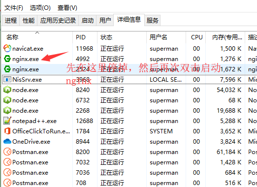
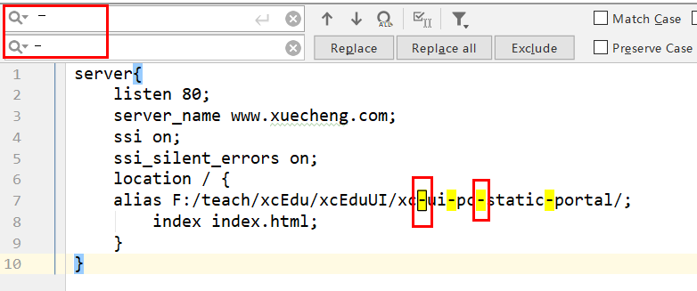
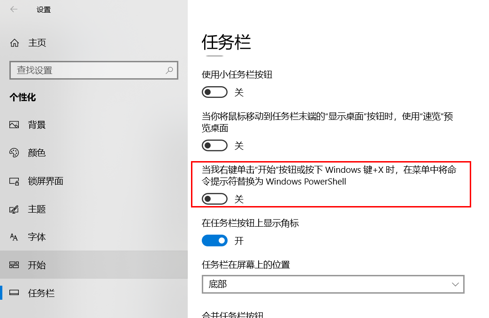

## Nginx重启不生效

不要用`nginx -s reload`，这样可能会不生效。




## 从页面拷贝的内容的横杠都要替换下



## Common工程feign的version报unkonwn

```xml
<dependency>
    <groupId>org.springframework.cloud</groupId>
    <artifactId>spring-cloud-starter-feign</artifactId>
</dependency>
```

改为下边的即可

```xml
<dependency>
	<groupId>org.springframework.cloud</groupId>
	<artifactId>spring-cloud-starter-feign</artifactId>
	<version>1.4.5.RELEASE</version>
</dependency>
```

或者改为：

```xml
<dependency>
	<groupId>org.springframework.cloud</groupId>
	<artifactId>spring-cloud-starter-openfeign</artifactId>
</dependency>
```

## Nginx闪退

首先浏览器中输入： localhost 看是否可以看到nginx的界面。

## Nginx不要反复双击启动

## 配置完nginx，一定要Nginx重启

可以手动进入任务管理器中，进行任务的结束，结束之后，再次双击nginx.exe启动即可。

## MongoDB不设置用户怎么连

```yml
spring:
  data:
    mongodb:
      uri:  mongodb://localhost:27017
      database: xc_cms
```



