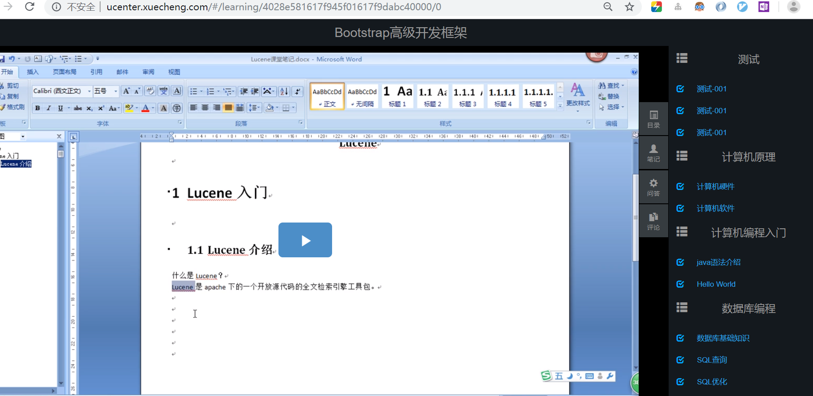
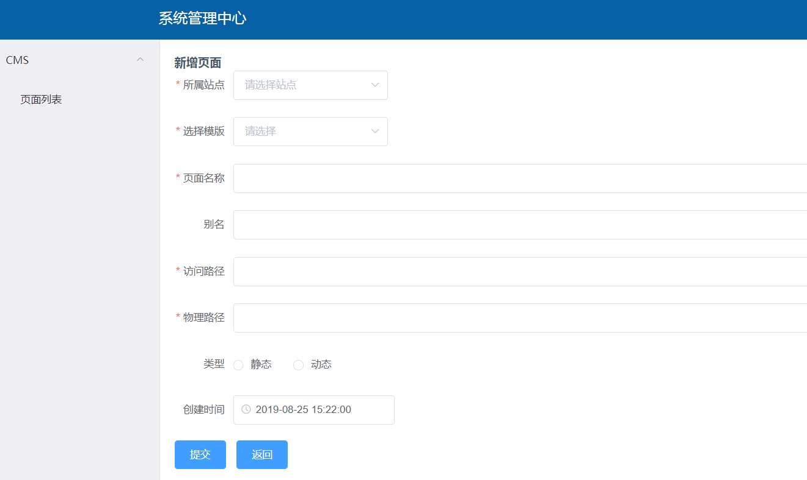

# 在线课堂微服务项目

### 一、使用技术

**SpringCloud、ElasticSearch、Redis、RabbitMQ、Mysql、MongoDB、Mybatis、JPA、Spring Security、Spring Task、GridFS、Nginx、Docker等**

### 二、功能模块

### 三、演示

用户登录(老师和学生)

课程搜索界面:

课程介绍页面:

课程学习:

个人中心:

老师课程管理中心:

管理视频:

页面管理:

